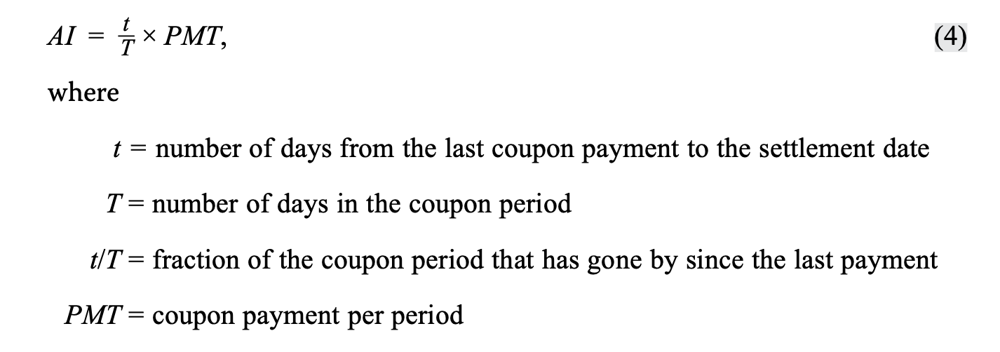
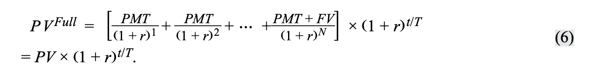
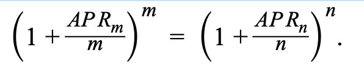
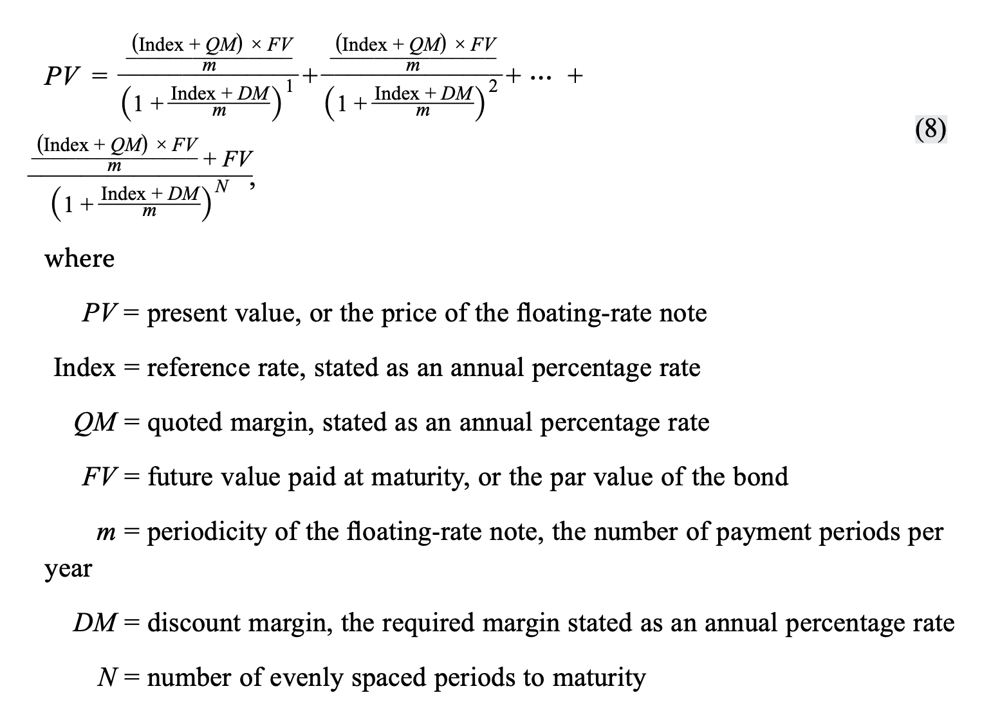
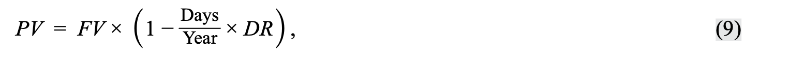
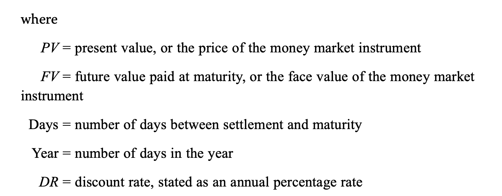
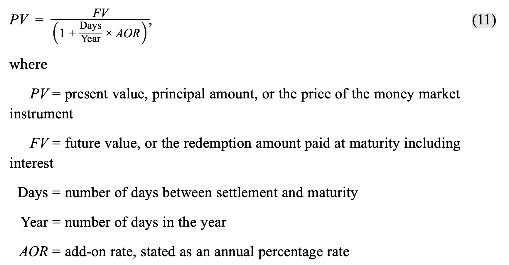
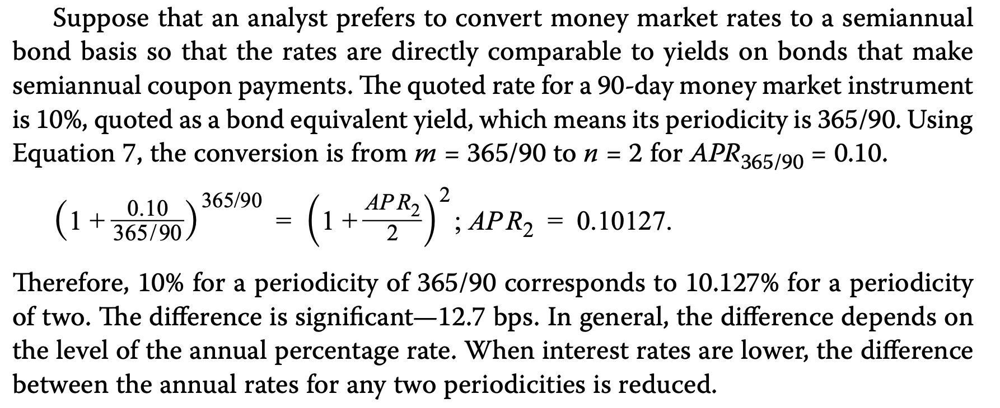

# M3 Valuation

some fixed income parlance

- market discount rate/required rate/required rate of return

  - 和coupon rate 对比，discount/premium/at par
- yield to maturity(YTM)

  - 已知market price，求出的rate
  - *implied* market discount rate
  - rate of return on bond能够达到YTM三个假设：
    - hold to maturity
    - no default. 所以，yield-to-maturity is the **promise** yield
    - reinvestment with YTM
- spot rate
- flat price, accrued interest(AI), full price

  - full = flat + AI
  - 
  - with market discount rate per period (*r*) :
  - 
- matrix pricing

  - get an estimate of the **required yield spread** over the **benchmark rate**
  - **spread over the benchmark**
  - the yield spreads reflect the **term structure of credit spreads**
- 大于1年的，annualized and compound; 小于一年的，annualized and not compound
- different compouding period(periodicity)

  - 对于大于1年的：number of periods in the year： which is called the <u>**periodicity** of the annual rate</u>
    - e.g. A bond that pays semiannual coupons has a **stated annual yield-to-maturity** for a periodicity of two—the rate per semiannual period times two
    - periodicity of the annual rate是一年内复利的period个数。比如，periodicity=4。那么$PV=\frac{FV}{(1+r)^4}$ 这里r是一个period内的market discount rate(the rate per quartly period). 这样的话，annual yield to maturity = 4 * r = the rate per quartly period times 4
  - **effective annual rate**. An effective annual rate has a periodicity of one because there is just one compounding period in the year.（也就是perodicity = 1）
  - **semiannual bond basis yield**, or **semiannual bond equivalent yield**
    - The most common periodicity for US dollar-denominated bond yields is <u>two</u> because most bonds in the US dollar market make semiannual coupon payments.
    - e.g. 注意下面的说法：For example, if a **bond yield is 2% per semiannual period**, its **annual yield is 4%** when stated on a semiannual bond basis.

  - 不同periodicity之间相互转换：A general formula to convert an annual percentage rate for *m* periods per year, denoted $APR_m$, to an annual percentage rate for *n* periods per year, $APR_n$

    - 

    - A general rule for these periodicity conversions is *compounding more frequently at a lower annual rate corresponds to compounding less frequently at a higher annual rate*. 也就是，rate of return(FV-PV/PV)相同的情况下，periodicity越大，APR越小。对于负利率同样适用，n越大，APR越小。
    - **对比两个债券的时候，要转化为同样periodicity才有可比性**
- for fixed-rate bond

  - Yield measures that neglect weekends and holidays are quoted on what is called **street convention**.
  - The **true yield-to-maturity(true yield)** is the internal rate of return on the cash flows using the actual calendar of weekends and bank holidays. 
    - true yield < street convention yield. 根据上上面的式子，n和annual rate反向相关
  - A **government equivalent yield** restates a yield-to-maturity based on a 30/360 day count to one based on actual/actual
    - The government equivalent yield on a corporate bond can be used to obtain the spread over the government yield. Doing so keeps the yields stated on the same day-count convention basis. 用来corporate bond为国债的天数计息，从而计算spread
  - **current yield**, also called the **income or running yield.**
    - The current yield is the sum of the coupon payments received over the year divided by the flat price.
    - current yield = $\frac{coupon}{flat\ price}$, 比如，a 10-year, 2% semiannual coupon payment bond is priced at 95 per 100 of par value. current yield = 2 / 95. 注意这里虽然是semiannual，但是2%是annual coupon rate，所以全年的coupon 还是2.

  - **simple yield** is the sum of the coupon payments plus the straight-line amortized share of the gain or loss, divided by the flat price. 
    - Simple yields are used mostly to quote Japanese government bonds, known as “JGBs.”
  - 如果进一步，bond含权
    - **yield-to-first-call, yield-to-second-call..., yield-to-maturity**
      - **yield-to-worst**(上面这么多yield的最小值)
    - 另一种计算方法The value of the embedded call option is added to the flat price of the bond to get the **option-adjusted price**. flat price减去value of call option得到option-adjusted price，从而计算option-adjusted yield
      - The option-adjusted price is used to calculate the **option-adjusted yield**. 
- for floating-rate notes浮息债券
  - 一般参考的是短期利率。short-term money market rate
  - The principal on the floater typically is non-amortizing and is redeemed in full at maturity.
  - The most common day-count conventions for calculating accrued interest on floaters are actual/360 and actual/365. 注意是arrear，用的是begin of period的reference rate
  - **quote margin**, 加在coupon上，补偿相对于reference rate的credit risk。可以为负数，比如 “sub-MRR” cost of borrowed funds，优质公司比市场参考利率更牛。
  - **required margin** is the yield spread over or under the reference rate such that the FRN is priced at par value on a **rate reset date.** 
    - 每个rate reset date，把PV设置为par value. reset date 之间，required margin + reference rate变化，而分上由于arrear模式，reference rate0 + quote margin不变。所以，价格在两个rate reset date之间波动，到了rate reset date，flat price  pull to par.
    - 但是如果发生信用risk，把未来少还或者多还的，discount算在flat price中，得到premium或者discount的flat price，所以require margin和quote margin 这时候出现差距。其中的差距，称为That **annuity** is 25 bps per period for the remaining life of the bond. It is the difference between the required and quoted margins.
    - Following market practice, the required margin is called the **discount margin**.年化后，变成discount margin
  - 

- money market(小于一年)
  - 上面讲了这么多，没有涉及到一年内如何计算
  - **discount rate**: commercial paper, T-bills, bankers’ acceptances. 未来折到现在
    - 
    - 
    - Therefore, by design, a money market discount rate ***understates*** the rate of return to the investor, and it ***understates*** the cost of borrowed funds to the issuer. 因为DR = (Years/Days)(FV-PV)/FV，分母FV包括了收到的interest(FV-PV)，所以**低估**了回报率，低估了成本。
  - **add-on rate**: CDs, repos, and such indexes as Libor and Euribor. 现在到未来
    - 
    - 但是，DR和AOR，计算的方式不一样，有时候天数也不一样。如果要对比两个货币市场工具，需要转化为同样的报价。这时候，一般是365天AOR，叫做**bond-equivalent yield**
      - PV和FV都是固定的。只是算的方式不一样。
    - 观察：$AOR=\frac{Years}{Days}\frac{FV-PV}{PV}$, 其中第一项是periodicity of the year。所以implicitly assume the investment can be replicate YEARs/DAys times over the year.
      - 如果要对比不同的periodicity，比如compound semi-annually，需要通过之前的有n.m的公式转换，比如
        - 

- step-up coupon bond has contractually mandated changes in its coupon rate over time

- AI计算和full price
  - 先芝士球衣求到前面一个coupon点的PV
  - 然后full price = PV(1+r)^(t/T)
    - r是period利率。比如market rate = 4, coupon semiannual,那r=2
    - t是settlement day距离上一个coupon点的距离，T是付息间隔
  - AI = PMT * (t/T)
  - flat = full - AI
- 对于含权债券，YTM就是持有至到期的收益
- six-month MRR，也是年化的报价

- The **spot curve**, also known as the strip, or zero, curve, is the yield curve constructed from a sequence of yields-to-maturity on zero-coupon bonds. 
- The **par curve** is a sequence of yields-to-maturity such that each bond is priced at par value. 
- The **forward curve** is constructed using a series of forward rates, each having the same time frame.

- The I-spread, or **interpolated spread**, is the yield spread of a specific bond over the **standard swap rate** in that currency of the same tenor. 
- The yield spread in basis points over an actual or interpolated government bond is known as the **G-spread**. 
- The Z-spread (zero-volatility spread) is the constant spread that is added to each **spot rate** such that the present value of the cash flows matches the price of the bond.
- The option value in basis points per year is subtracted from the Z-spread to calculate the OAS. The Z-spread is the constant yield spread over the benchmark spot curve. The I-spread is the yield spread of a specific bond over the standard swap rate in that currency of the same tenor.
  - OAS = Z-spread - option value in bps
- Treasury bond 一年付息两次
  - 一般给的MRR，或者spot rate都是年化，一定要注意periodicity
- spot rate 和 zero coupon rate对应
  - A spot rate is defined as the yield to maturity on a zero-coupon bond maturing at the date of that cash flow.
- The steeper the spot rate curve, the greater the difference between Z-spread and nominal spread.
  - for a bullet maturity security the nominal spread and Z-spread will be approximately the same, but it will be greater for an amortizing security.
- government bond
  - on-the-run最新一期
  - off-the-run
  - on-the-run的YTM会更低，因为抢手一点。