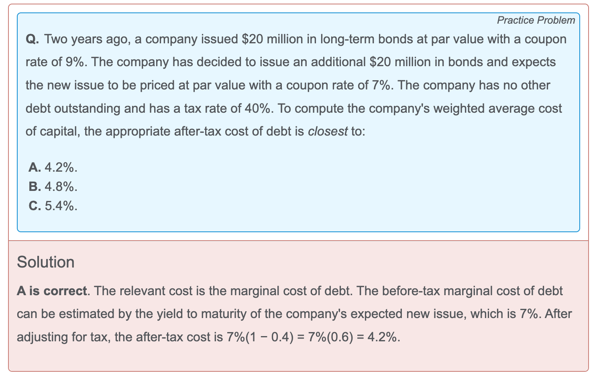
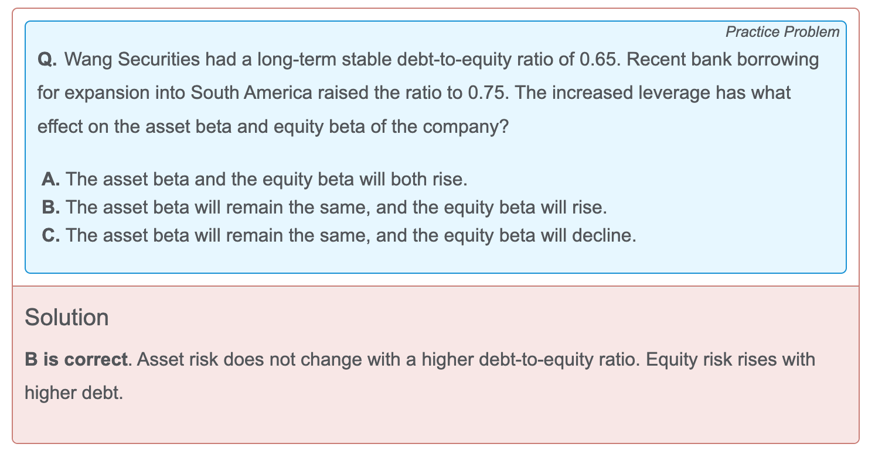

- 使用marginal cost of debt
- CAPM如果算出来比debt的成本低，说明The fact that the NEM's cost of debt is higher than the calculated required return on equity is another indicator that the return estimated using CAPM is not useful for valuing the company's equity.
- 

- an original issue discount provision is a tax provision relating to bonds issued at a discount to par value. The original issue discount tax provision typically requires the bondholders to include a prorated portion of the original issue discount (i.e., the difference between the par value and the original issue price) in their taxable income every tax year until the bond’s maturity date.
- Relative to a one-time put bond that incorporates a single sellback opportunity, **a multiple put bond** offers more frequent sellback opportunities, thus providing the most benefit to bondholders.
- conversion provision就是 (convertible bond) 