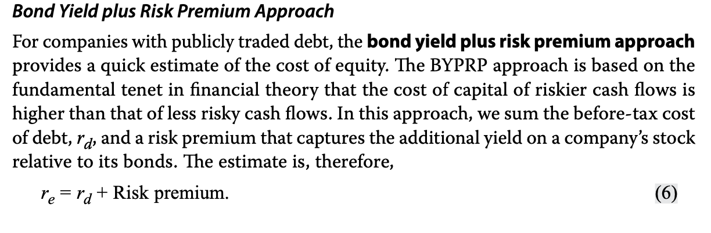
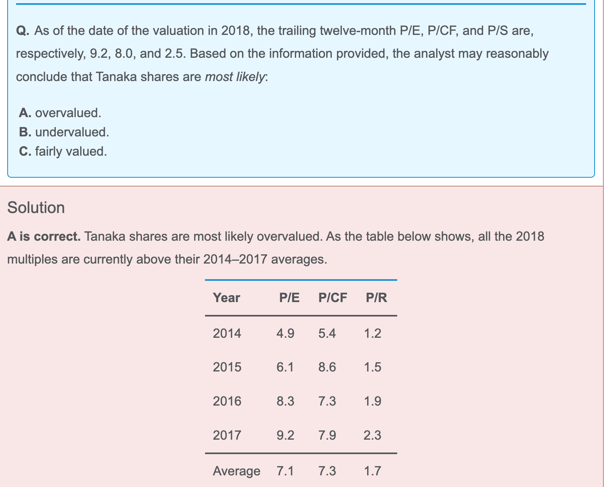

- The **EV/EBITDA** (enterprise value/earnings before interest, taxes, depreciation, and amortization) approach is most useful when comparing companies **with significant differences in capital structure**. EBITDA is computed prior to payment to any of the company’s financial stakeholders and is not affected by the amount of debt leverage.
- **defensive industry:** stable earning, non-cyclical.注意是稳定盈利，不断增长的盈利也不算。
- The process of constructing peer group consists of initially examining **commercial** classification systems and then **refining** it to the companies operating in the chosen industry.
- Companies with large amounts of undervalued assets (which can be sold to reduce debt) that generate high levels of cash flow (which are used to make interest and principal payments on the debt) are likely candidates for MBO transactions.
- Investing in DRs could provide arbitrage opportunities and entail currency risk.

Participating preference shares **do not** entitle the shareholders to participate in corporate decisions through voting rights. But they do entitle them to 

- (1) an additional dividend if the company’s profits exceed a prespecified level and

-  (2) additional distribution of the company’s assets upon **liquidation**, above the par.

Dark pools are *best* described as trading venues地点 that exercise little regulatory authority over their subscribers.

ETF 有税收优势，费用比直接买一篮子股票低

write a put option，意思是short put!

> A trader has purchased 200 shares of a non-dividend-paying firm on margin at a price of $50 per share. The leverage ratio is 2.5. Six months later, the trader sells these shares at $60 per share. Ignoring the interest paid on the borrowed amount and the transaction costs, what was the return to the trader during the six-month period?

这题，直接算(60-50)/50=0.2，带杠杆，0.2*2.5 = 0.5收益率

- The stock was bought on 75 percent margin. 意思是75%是本金

- 注意，pure-play中，用的是**business risk**相同的公司

- WACC里的都是marginal term

- leverage越高，breakeven的Q越大

- The more unit sales are from the operating breakeven point for high-levrage companies, the greater the magnifiying effect of leverage. 买的越多，赚的越多，杠杆越有用。

- 注意这种方法rd是税前
- 推荐把floatation cost 放到NPV 里当作发行成本。因为发行成本只在初始的时候产生。
- 
- 用之前的平均值，和今天的P/E对比
- 在算EV值作为multiple multiplier时，
  - **Operating income** may be used in place of EBITDA when calculating the enterprise value multiple. 
  - EBITDA may be used when company earnings are **negative** because EBITDA is usually **positive**. 
  - The book value of debt **cannot** be used in place of market value of debt.
  - Enterprise value, sometimes known as the **cost of a takeover**, is the cost of the purchase of the company, which would include the assumption of the company’s debts at market value.
- Asset base valuation 用的是market value, A - L

- gambler's fallacy: 赌徒谬论，之前输了很多次，以为接下来不太可能输了，殊不知每次输赢之间是独立事件
- diposition effect：卖掉贵的，持有亏的