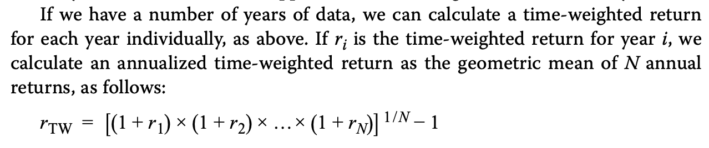
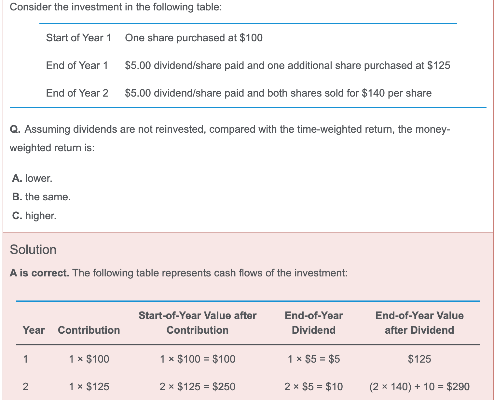
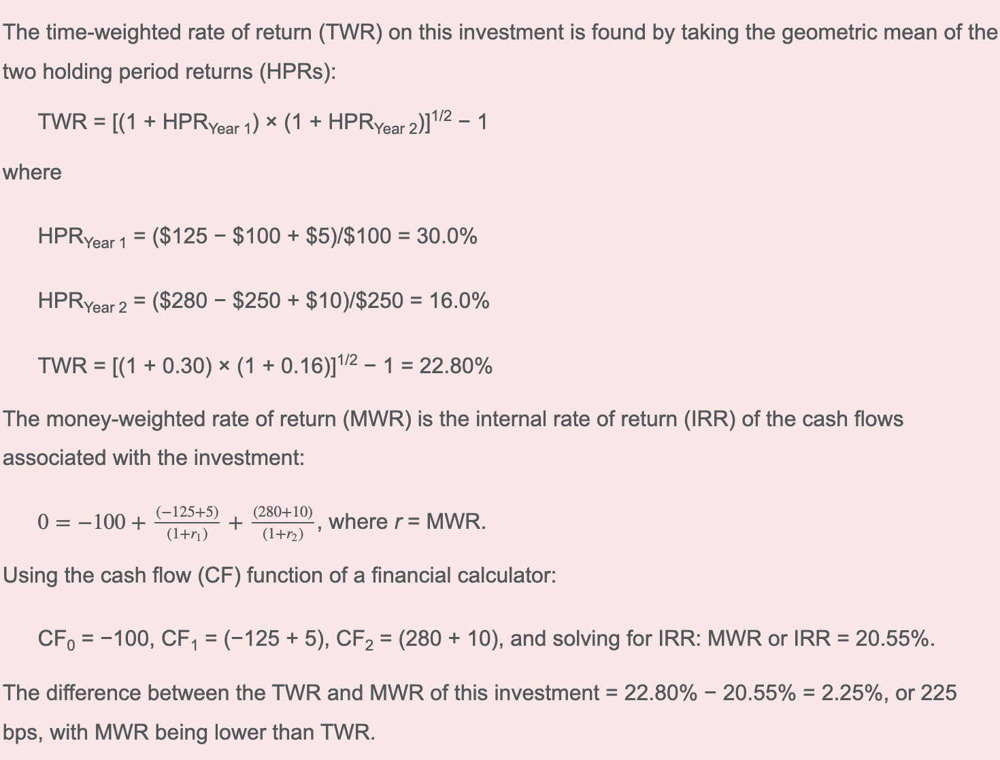
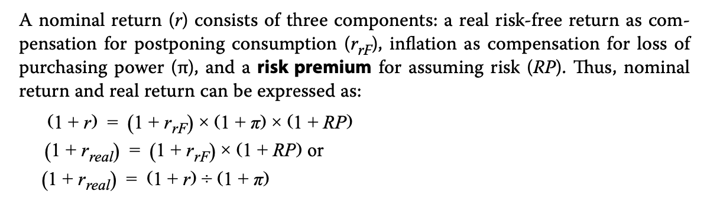

- 注意收益率是不是annual，如果是holding period return，指的是期间收益率，不用年化

- 计算annualized return的时候，如果给定的是时间和holding period return
  - 年华利率为r
  - $(1+r)^{Day/365}=1+HPR$

- real rate of return for equities不能直接减法, (1+r)=(1+rf)(1+$\pi$)
- 算portfolio标准差，看清楚给的是covariance还是coefficient of correlation
- 计算time weighted rate of return，从period return求出后，需要年化
  - 注意下面这题每个季度的HPR为r1, r2, r3, r4，那么最后的TWR = (1+r1)(1+r2)(1+r3)(1+r4)-1
  - 不需要开1/N根号，因为r是季度的HPR。观察下面r的定义，r1时year HPR时，才需要1/N根号

- 

- 注意上题中的细节。dividends are not reinvested，意思就是第二年初，计算HPR的时候，(P2-P1+D2)/P1中的P1不包括第一年的dividend，但是需要
- 另外，上面这题，MWR的cash flow还是按照正常的cash flow，和dividend reinvest没有关系
- optimal investor portfolio是indifference curve爽线和有效前沿相切的点
- optimal risky portfolio时CAL和markoviz effective frontier相切的点

- 

- real return 等于去除通胀，riske premium等于除去无风险利率和通胀，注意上面的rF是**real** risk-free return.
- 爽函数中，risk aversion coefficient, *A*

- 构建SAA 时，
  - One principle is that a portfolio’s **systematic** risk accounts for **most** of its change in value over the long run
  - the returns to groups of like assets… predictably reflect exposures to certain sets of systematic factors
  - returns on asset classes primarily reflect the systematic risks of the classes.
- Tactical asset allocation（TAA） attempts to take advantage of temporary dislocations from the market conditions and assumptions that drove the policy portfolio decision.
- 在IPS中，Information related to strategic asset allocation and portfolio rebalancing policy would be placed in the appendices of an investment policy statement.
  - SAA和rebalancing policy放在附录里。
- Belief Perservance Bias: RICCH， 更新概率
- Processing Error: FAMA 接受信息
  - Framing bias：Focus on **short-term** price fluctuations, which may result in long-run considerations being ignored in the decision-making process.

- The VaR measure indicates the probability of a loss of at least a certain level in a time period.
  - VaR = 概率，atleast
- An organization with a **strong competitive position** can recover from losses more easily than one with a weaker competitive position. Therefore an organization’s risk tolerance should reflect its competitive position. 
  - 大公司更加能承担风险。
- an insurance policy with a deductible.具有免赔额度的保险单 是risk transfer
  -  A deductible in an insurance policy means the insured is bearing some of the risk of loss and thereby (partially) self-insuring. 免赔额度，意思是一部分损失自己承担。也是self-insured.
- risk transfer: 买保险
- self-insurance: 存钱应对风险
- risk shifting: 用衍生品对冲
- Nonsystematic risk is specific to a firm, whereas systematic risk affects the entire economy.
  - Only systematic risk is priced. Investors do not receive any return for accepting nonsystematic or diversifiable risk.
- In the market model, *Ri* = α*i* + β*iRm* + *ei*, the slope coefficient, β*i*, is an estimate of the asset’s systematic or market risk.
- The average beta of all assets in the market, by definition, is equal to 1.0.
- In the CAPM, the market risk premium is the difference between the return on the market and the risk-free rate, which is the same as the return in **excess of the market return.**
- The homogeneity assumption refers to all investors having the same economic expectation of future cash flows. If all investors have the same expectations, then all investors should invest in the same optimal risky portfolio, therefore implying the existence of only one optimal portfolio (i.e., the market portfolio). 同质化预期，只有一个market portfolio
  - CAPM的assumption
    - ***Investors are risk-averse, utility-maximizing, rational individuals.\***
    - ***Markets are frictionless, including no transaction costs and no taxes.\***
    - ***Investors plan for the same single holding period.\***
      - The CAPM is a single-period model, 
    - ***Investors have homogeneous expectations or beliefs.\***
    - ***All investments are infinitely divisible.\***
    - ***Investors are price takers.\***
- *M*2 adjusts for risk using standard deviation (i.e., total risk). beta是系统性风险，$\sigma$ 是总风险
- The security characteristic line（**SCL**） is a plot of the excess return of the security on the excess return of the market. In such a graph, Jensen’s alpha is the intercept and the beta is the slope.
- return-generating model 
  - market model: the factor is the market return.
  - macroeconomic factor model, appropriate factors would be economic factors such as the interest rate and the inflation rate.
  - fundamental factor model.: earnings growth and cash flow generation
- $M^2=sharpe\ ratio \times \sigma_m+r_f$
- 
- 当以$r_b>r_f$的利率borrow money 的时候，会遇到kinked CML线。斜率比原来的线小。
- $\beta_p=w_1\beta_{r_f}+w_2\beta_2$，用市值平均beta.
  - The weight in the market portfolio is 15,000/10,000 = 1.5 and the weight in the risk-free asset is –5,000/10,000 = –0.5. Because the beta of the risk-free asset is 0 and the market portfolio’s beta is 1, the portfolio’s beta is β*p* = 0(–0.5) + 1(1.5) = 1.5.
- 