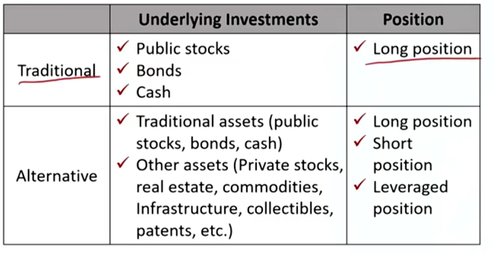
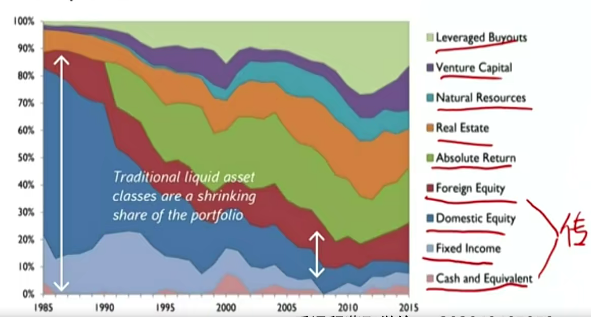
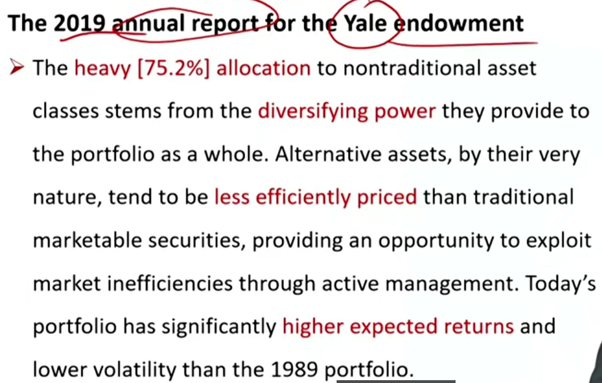
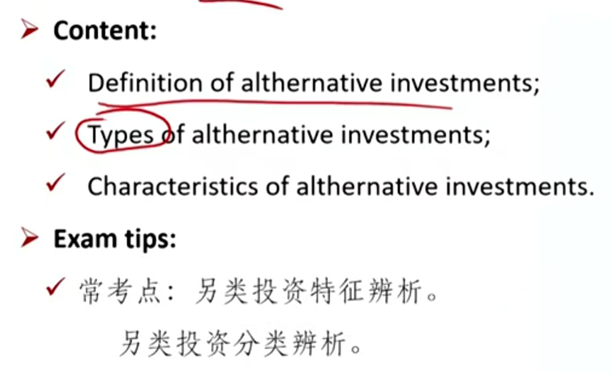

# M1 Categories and Characteristic

**Describe** types and categories of alternative investments

#### Definition of alternative investment

- collectible收藏品
- 做空，放杠杆传统资产也是另类投资

##### Three major categories of alternative investments（三个类别）

- Private Capital 私募资本 
- Real Assets 实物资产
- Hedge Funds 对冲基金（和mutual fund对比）

上面三大类占另类投资领域99%。投另类投资都是风险承受能力较强的机构。

#### Private capital

- Both equity and debt that are not publicly traded.
  - Private equity(PE)
    - Leverage Buyouts 杠杆收购。借贷收购成熟的公司。
    - Venture capital funds(VC)风险投资
  - Private debt
    - Direct lending
    - mezzanine(夹层) loans
      - mezzanine loan夹层债券，介于股票和债券之间
    - venture debt 风险债务，投资一些初创小型企业
    - distressed debt 危机债券，投资处于财务危机的企业

#### Real Assets实物资产

- Investment in which the underlying assets involve **ownership of non-financial assets**. 非金融资产。
  - Real estate
  - Natural resources
    - Commodities
    - Farmland and timberland
  - Infrastructure(e.g., toll roads 收费路)
  - Other(e.g., art, wine, automobiles, digital assets, etc.)

#### Hedge fund

- A privately organized investment vehicle that uses its **less regulated** nature to generate investment opportunities that are substantially distinct from those offered by traditional investment vehicle.
  - 最大的特点：受到的监管较少。（因为门槛较高）
  - May involve long and short positions and may be highly leveraged.
    - 对冲基金可以做多也可以做空。传统基金只能做多。
  - Are differentiated primarily by the investment strategy.
    - 有特别的投资策略

#### Characteristics of alternative

- **Diversifying power**: returns that are uncorrelated with or only slightly correlated with traditional investments. 和传统资产相关性较低。可以分散化投资，降低整体风险。
  - Can be correlated in periods of financial crisis.
- **Higher expected returns** 收益高
- **Illiquidity**: the investment trades infrequently.
  - 流动性较差（流动性差本身也能带来高收益）
- **Inefficiency**: market prices cannot reflect all available information due to relatively low degree of competition
  - 因为流动性差，参与交易的人少，市场无效，价格无法反映真正价值。
  - Opportunities of arbitrage and superior risk-adjusted return.

#### Market Participants

- Endowments（捐赠基金）, pension funds, sovereign wealth funds, and family offices.
- 最具代表性：耶鲁模式，耶鲁大学的endowment

- Absolute return就是对冲基金。因为普通的mutual fund一般是和大盘对比，追求相对收益。但是对冲基金不管涨跌，都要求一定回报，也就是absolute return.

#### Other characteristics of alternative

- Narrow specialization of the investment managers
  - 另类投资基金经理的专业面会更专一
- Less regulation and less transparency than traditional investments
  - 对冲基金一般注册在：百慕大群岛、开满群岛、英属维尔镇群岛。免税
- Limited reliable historical risk and return data
  - 历史盈利数据不可靠
- Unique legal and tax considerations
  - 特殊的法律和税收要求
- Higher fees, often including performance or incentive fees
  - 另类投资有业绩激励费，赚的钱有一部分给基金经理
- Concentrated portfolios
  - 另类投资的标的较为集中
- Restrictions on redemptions(i.e., "lockups" and "gates")
  - 流动性较大。lockup锁定期，gate赎回窗口期

### Summary

importance \*\*\*

