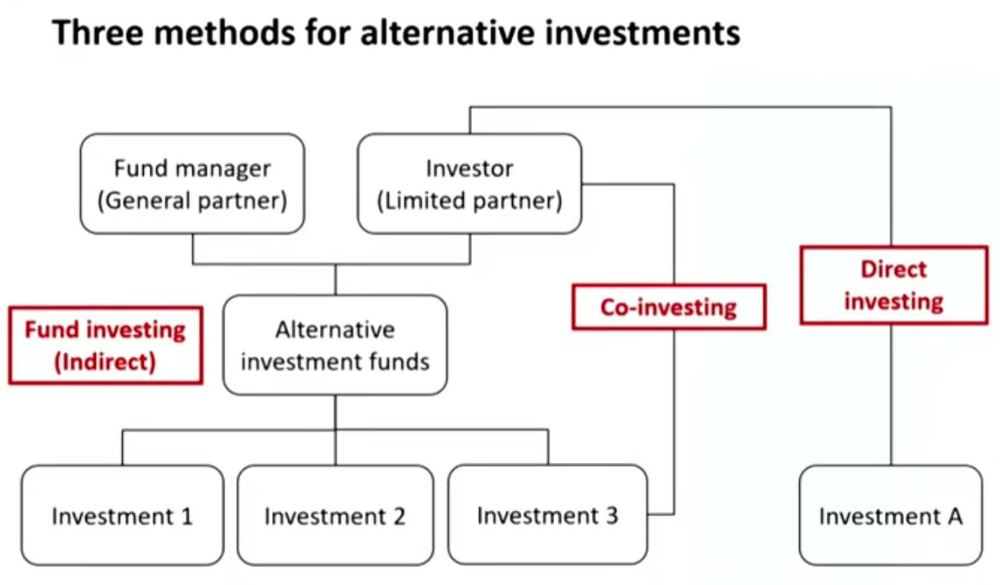
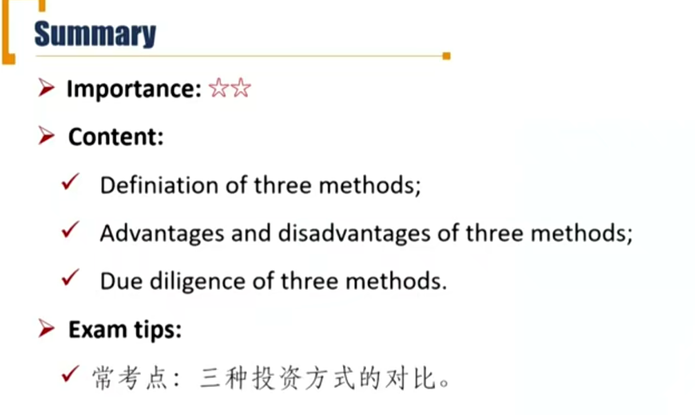

# M2 Investment Method

Describe characteristics of direct investment, co-investment, and fund investment methods for alternative investments

#### Three methods for alternative investments

##### Fund investing

- **Indirect method**: Investor contributes capital to a fund, and the fund identifies, selects, and makes investments on the investor's behalf. 就是投给另类投资基金经理
  - Investment decisions are limited to either investing in the fund or not.
  - Fund investors are typically **unable to affect** the fund's underlying investments.

##### Co-investing

- The investor invests in assets indirectly through the fund but also **possesses rights**(known as co-investment rights) to invest directly in the same assets.
  - fund manager决定投哪些项目后，investor再自己跟投。

##### Direct investing

- An investor makes a direct investment in an asset without the use of an intermediary
  - **Great flexibility and control** when it comes to choosing their investments, selecting their preferred methods of financing, and planning their approach.
  - Typically reserved for larger and more sophisticated investors. 投资门槛高，金额高，一般不要大机构，并且通常自己有分析团队等。

#### Pros and Cons of three methods

- Fund investing

| Advantages                                     | Disadvantages                                                |
| ---------------------------------------------- | ------------------------------------------------------------ |
| Professional services offered by fund managers | Costly to pay management and performance fees                |
| Less participation from investors              | Investors must conduct due diligence on managers 对基金经理的尽职调查 |
| Expand investment universe                     | Less able to exit the investment due to lock-ups             |
| Diversification benefits                       |                                                              |
| Lower capital requirement                      |                                                              |

- Co-investing

| Advantages                                     | Disadvantages                                                |
| ---------------------------------------------- | ------------------------------------------------------------ |
| Investors can learn from the fund's process    | Reduced control compared with direct investing               |
| Reduced management fees                        | May be subject to adverse selection bias逆向选择偏差。意思是基金经理（gp）看好的项目通常gp已经投资了比较多金额，剩下的还有投资机会的大都是基金经理没那么看好的项目。 |
| Allows more active management of the portfolio | Requires more active involvement compared with fund investing |
| Deeper relationship with the manager           |                                                              |

- Direct investing

| Advantages                                             | Disadvantages                                                |
| ------------------------------------------------------ | ------------------------------------------------------------ |
| Avoids paying ongoing management fees.省基金管理费用   | Higher internal costs. 内部分析团队的成本                    |
| Greatest amount of flexibility for the investor        | Less diversification benefits or manager's sourcing network. 自己投资的资金更少，分散化效果更差。并且缺少了基金经理的业内资源 |
| Highest level of control over how the asset is managed | More complex due diligence. 对投资标的的尽职调查。           |
|                                                        | Higher minimum capital requirements. 对资金要求比较高        |

#### Due diligence of three methods

- **Fund investing**: the investor is responsible for conducting due diligence on the fund manager. 对基金经理尽职调查
- **Co-investing**: the investor will conduct direct due diligence on the portfolio company with the support of the manager.对基金经理尽调，并且在基金经理指导下对投资标的进行尽职调查。
- **Direct investing**: the focus of the due diligence is the company itself, at a very detailed level.需要对投资标的尽职调查

