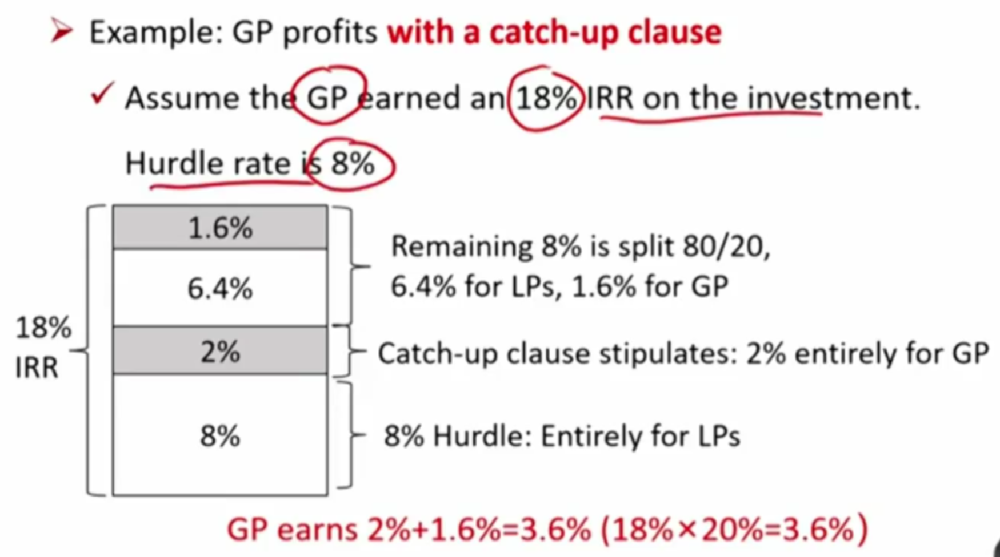
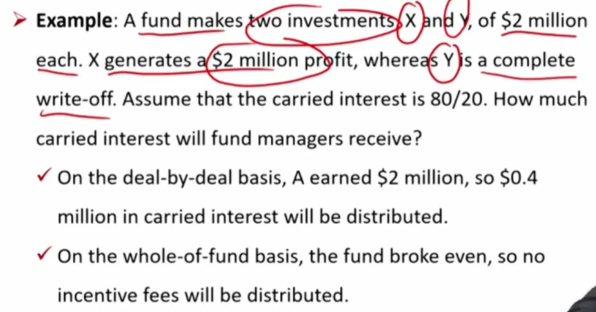
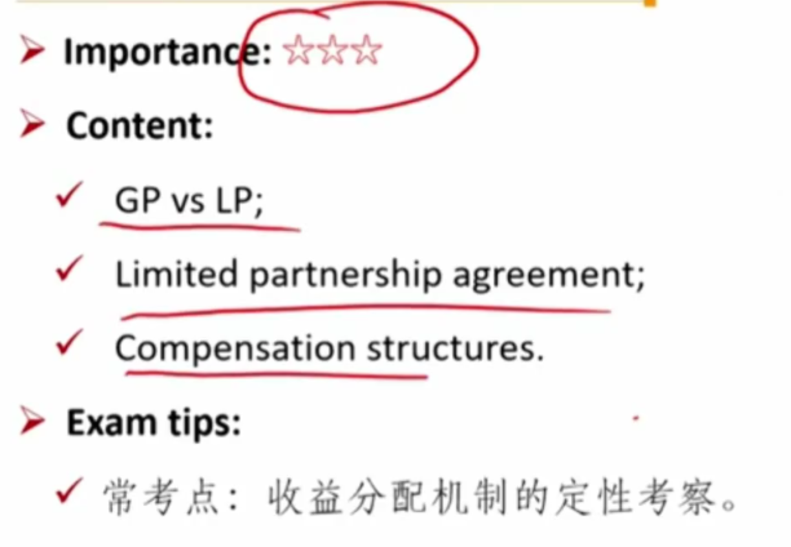

# M3 Investment and Compensation Structures

**Describe ** investment and compensation structures commonly used in alternative investments

激励机制，投资机制

#### Fund investment structure

- **General partner**(GP, manager): runs the fund and bears **unlimited liability** for anything that might go wrong.
  - 注意：GP是承担债务的无限责任

- **Limited partners**(LP, investors): are outside investors who own a fractional interest in the partnership based on the amount of their initial investment.
  - Play passive roles and are not involved with the management of the fund.
- There exists a **principal/agent problem** between GP and LPs.
  - 为了避免agent problem，需要制定一些条款LPA和side letters

##### Key partnership documents

- **Limited partnership agreements(LPAs)**合伙协议
  - A legal document that outlines the rules of the partnership and establishes the framework that ultimately guides the fund's operations.
  - May be dense with provisions and clauses.
    - 确定一些条款，让LP和GP利益一致，避免principal/agent problem
- **Side letters** 补充条款
  - Exist outside the LPA
  - e.g., notice requirements in the event of litigation

#### Compensation structures 利益分配机制

- **Management fee** 管理费
  - Also known as base fee.
  - Typically ranging from 1% to 2% of AUM（asset under management资产管理规模，一般hedge fund采用) or committed capital(承诺资本，表示lp承诺可以投资的金额，PE fund).
    - PE fund中使用承诺资本而不是AUM，用意是避免gp为了多拿管理费，用容易赔钱的项目滥竽充数。
- **Performance fee** 
  - Also known as incentive fee（Hedge fund） or carried interest（PE fund）.
  - Typically 20% of excess returns.
  - 通过业绩激励把LP和GP的利益绑定，但gp带来的所有收益都会计算业绩激励，其中一种限制就是hurdle rate
- **Hurdle rate** : a return level that LPs must receive before GP begin to receive incentive fees.
  - **Hard hurdle rate**: the GP earns fees on annual returns in **excess of the hurdle rate**.
    - 超出hurdle部分才给提成，hurdle要求800万，赚了1200万，计算提成部分是400万
  - **Soft hurdle rate**: the fee is calculated on the **entire annual gross return** as long as the set hurdle is exceeded.
    - 所有收益分配提成，1200万都按照比率分配提成。但是soft hurdle rate存在问题，LP的收益在分配业绩激励后反而比分配前更低了。比如hurdle rate = 10%，performance fee20%
      - 假设gp赚了9%，不进行分配，lp拿9%。
      - 假设gp赚了11%，进行分配，gp拿2.2%, lp拿8.8%。反而比9%更低，并且比10%hurdle rate更低。
    - Usually has a **catch-up provision**. 为了解决上面的问题，通常设置catch-up provision.
- **Catch-up clause**: allows fund managers to earn incentive fee on all profits, given hurdle rate has been achieved.
  - Profits are distributed only to the limited partners until the hurdle rate is reached.
  - Additional profits are split, with 100% going to the fund manager until the fund manager receives an incentive fee on all of the profits.
  - 三个步骤：1）先保证LP拿到hurdle rate; 2）再通过hurdle rate / (1- incentive rate) \* incentive rate分配给gp，保证gp拿到对应比例的incentive; 3)最后剩下的，按照incentive比例分别分配给LP和GP
  - 比如下面的例子，GP赚了18%， hurdle rate=8%
    - 先给LP分配8%
    - 8% / (20%/80%) = 2%分配给GP，保证GP的incentive
    - 剩余18-10=8%的利润，按照2:8的比例进行分配，LP再拿到6.4%，GP再拿到1.6%

- 上面的例子：如果GP只赚了9%，那就是LP拿8%，GP拿剩下的1%。
- 如果没有catch-up 条款，结果会导致GP少拿钱。

- **Higher water mark**: reflects the highest value used to calculate an incentive fee.
  - The incentive fees are only paid when assets under management are above the highest value(net of fees) previously recorded.
    - 大于历史最大值才给奖励，避免奖励两次。
  - **Protects clients** from paying twice for the same performance.

- **Waterfall**: a provision that specifies how distributions from a fund will be split and how the payouts will be prioritized.
  - **Deal-by-deal(or American) waterfalls**: performance fees are collected on a per-deal basis. GPs get paid before LPs receive their initial investment on the entire fund.
    - 根据每个项目进行计算业绩提成。这种情况有可能造成总体来说LP亏钱，但是前几个项目是赚钱的，却给GP发放了业绩激励。比如投了10个公司，前三个赚钱，给GP激励，后7个亏钱，总体来说亏钱。
  - **Whole-of-fund(or European) waterfalls**: GP does not participate in any profits until the LPs receive their initial investment and the hurdle rate has been met.
    - LP的收回本金以及达到了hurdle rate才给GP发放激励。

- 两种waterfall模式各有缺点

  - deal by deal项目下，基金经理投资决策会变得激进，追求单个项目上的高收益，导致和LP的利益冲突
  - whole-of-fund模式下，对基金经理的吸引力不足，更难吸引能力强的基金经理。

  - 如何平衡? 使用clawback provision

- **Clawback provision**: right of LPs to relaim overdistributed performance fee. 在deal-by-deal的模式下，LP有权利按照整体盈亏，收回之前多发放的激励。

  - Are usually activated when a GP exits successful deals early on but incurs losses on deals later in the fund's life。这样又不会导致LP损失，也不会导致GP的不能及时拿到激励。
  - Is only as good as the creditworthiness of the GP. GP的信用比较重要。

