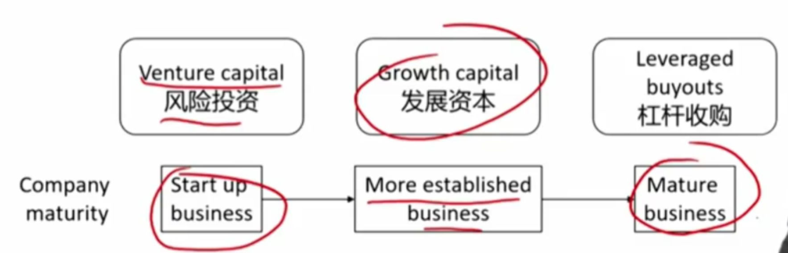
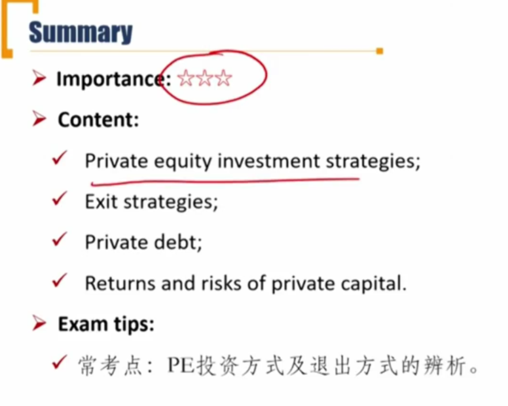

# M4 Private Capital

**Explain** investment characterisitics of private equity

**Explain** investment characterisitics of private debt

#### Overview of private capital私募资本

- **Private capital** is the broad term for funding provided to companies that is sourced neither from the public markets, nor from traditional instituational providers. (broad term广泛的定义)
  - Comprising private equity and private debt.
- **Private equity**: investment in privately owned companies or in public companies with the intent to take them private. （私有化一个上市公司也算）
  - **Portfolio companies**: the companies owned by private equity funds.
    - 一堆私募股权基金持有的公司

#### Primary private equity strategies

- Certainty around valuation increases as the portfolio company matures and moves into later-stage financing.

### Private Equity 重要

#### Venture Capital(VC)

- **Venture capital**(VC) entails investing in or providing financing to provide companies with high growth potential.
  - Typically start-ups or young companies.
  - Higher expected returns with higher risks.
- **Venture capitalists** are **active** investors directly involved with their portfolio companies.
  - May also provide financing in the form of debt(commonly, convertible debt).
  - VC有可能参与到公司运营。

##### VC的不同阶段 常考

- **Formative stage** 成型期
  - **Pre-seed capital**, or **angel investing**, is capital provided at the idea stage. The amount of financing at this stage is typically small and sourced from friends and family.
  - **Seed stage** generally supports product development and marketing efforts. **The first stage at which VC funds invest.** VC在这里开始投资。
  - **Early stage**, or **start-up stage** financing goes to companies moving toward operation but before commerical production and sales.
- **Later stage financing**(**Expansion VC**) is provided after commerical production and sales have begun but before an IPO takes place.
  - Supoort initial growth, <u>a major expansion</u>, product imporovements, or a major marketing campaign.
  - Management selling control of the company to VC. VC开始控制公司
- **Mezzanie stage financing** is provided to prepare to go public. 夹层融资
  - It represents the bridge financing（过桥贷款）.这时候风险较低，回报较低。

#### Growth Capital

- **Growth capital** : the firm takes a <u>less-than-controlling interest</u> in more mature comanies looking for capital to expand or restructure operations, enter new markets, or finance major acquisitions.	
  - 和later stage的区别：
    - growth capital中投资人不会获得控制权。
    - later stage financing是VC，同时会投资一些初创企业。
  - A.k.a, growth equity or minority equity investing.

#### Leverage Buyouts \*

- **Leverage buyouts** arise when private equity firms establish buyout funds to acquire public companies or established private companies, with a significant percentage of the purchase price financed through debt. private equity公司建立buyout funds，通过debt，获取上市公司或者private companies大部分股票。
  - e.g. KKR；格雷泽收购曼联
  - The target company's assets typically serve as collateral for the debt, and the target company's cash flows are expected to be sufficient to service the debt. 目标公司本身就是抵押物。
  - A highly leveraged transaction. 高杠杆。
- **Types of LBO**
  - **Management buyouts(管理层收购)**：the current management team is involved in the acquisition.
  - **Management buy-ins(管理层换购)**：an external management team acquires a company and replaces the existing management team.
- The returns of LBO depend greatly on the use of leverage.
  - return 取决于杠杆成本，cost of debt
- LBO investments enjoy more certainty than VC investments
  - 风险较小

#### Exit Strategies 重要

- **Trade sale**: the sale of a company to a strategic buyer, such as a competitor. 卖给竞争对手
  - Pros: immediate cash, higher price(synergies协同效应，复习公司金融), fast and simple, lower costs and trasparency than IPO
  - Cons: possible management opposition（现有管理团队的阻挠）, limited potential buyers, lower attractiveness to employees.
- **Initial Public offering(IPO)**: the portfolio company sells its shares to public investors
  - Pros: highest price, management approval, publicity（提升知名度）, future upside potential(未来股价有可能上涨)
  - Cons: higher cost, long lead times, market risk, disclosure requirements, a potential lockup period, IPO threshold(IPO门槛).
- **Special purpose acquisition company(SPAC)**特殊目的收购公司: a **shell company** via an IPO through which sponsors raise a blind pool of cash aimed for merger or acquisition with private firms.
  - 和一般的借壳上市（收购一个快退市的，再并购private firm）也不一样，这里的SPAC的目标并购公司是未知的，有点像开盲盒。
  - Pros: extended time for disclosure（延迟披露）, lower volatility of share pricing（收购价格较稳定）, flexibility（灵活性，绕开上市标准等，适合增长较快的中小企业）, high-profile and seasoned sponsors（发起人专业，有很多资源）.
  - Cons: capital risk due to potential redemptions（收购失败的资金退回）, stockholder overhang after merger股东关系复杂, spread between the announced and true equity value because of the dilution（股权稀释后宣称的价值和真正价值产生差异）.
- **Recapitalization**: a company issues debt to fund a dividend distribution to equity holders.
  - 利用公司借钱，然后分红。杀鸡取卵。
  - Not a true exit strategy. 
- **Secondary sales**: sale to another PE or other investors
- **Write-off/Liquidation**清盘: liquidates the portfolio company before moving on to other projects.
  - 最差的结果，清理掉公司的资产。

### Private Debt

#### **Direct lending**

- providing capital directly to borrowers. 直接借钱给对方（不经过银行）
- smaller number of investors than traditional debt. 
- usually higher interest rates to mid-market companies. (借给中等规模公司)

#### Venture debt 风险债务投资

- provided to **start-up or early-stage** companies that may be generating little or negative cash flow.
- Lack of substantial assets for pledging as debt collateral..

#### Mezzanine debt夹层债券

优先级夹在优先债券和股票之间

- Private debt that is subordinated to senior secured debt but is senior to equity in the borrower's capital structure
- Investors commonly demand higher interest rates and may require options for equity participation(比如可转债)

#### Distressed debt危机债务

- Buying the debt of mature companies with financial difficulty, expecting companies may restructure and revive.
  - 风险比较大，一般投资人会参与其中，帮助公司走出困境。

#### Collateralized loan obliations(CLO)

- It pools serveral loans and then divides that pool into various tranches.
- SPV把资产池中的债务分层

#### Unitranche debt

- consists of a hybrid or blended loan structure combining different tranches of secured and unsecured debt into a single loan with **a single**, blended interest rate. 资产池合并成一个债券

#### Real estate debt or infrastructure debt

- 基建、不动产

#### Specialty loans

- 特殊目的贷款，比如借钱打官司

### Risk and Return

#### Risk and return of private Capital

#### Risk and return of private Equity

- Investors require a higher return for accepting the higher risk, including illiquidity and leverage risks.
- Private equity return indexes rely on self-reporting and are subject to survivorship, backfill, and other biases. This typically leads to an overstatement of returns.
  - 私募股权回报的相关指数通常会高估。surviorship bias: 意思是存货的private capital才会编入指数，导致高估；backfill指表现较好的private capital才把历史业绩纳入指数，导致高估。
- Failure to mark to market will understate measures of volatility and correlations with other investments.
  - 因为没有实时的市场价格，所以会低估价值波动率，以及和其他资产的相关性（影响portfolio分散化效果）

#### Risk and return of private debt

- Investors in private debt could realize higher returns from the illiquidity premium. 流动性差，收益更高
- Overall, investing in private debt is riskier than investing in traditional bonds.

#### Diverisification benefits of private capital 分散化效果

- Investments in private capital funds can add a moderate diversification benefit to a portfolio of publicly traded stocks and bonds
  - Correlations with public market indexes vary from 0.47 to 0.75
- Private equity investments may offer vintage diversification
  - vintage diversification投资年份分散化。
  - 如果投资年份不分散，可能投资的项目，退出的事件都差不多，无法达到分散风险的效果。
- Private debt investments, which offer more options than bonds can also serve diversification goals.

