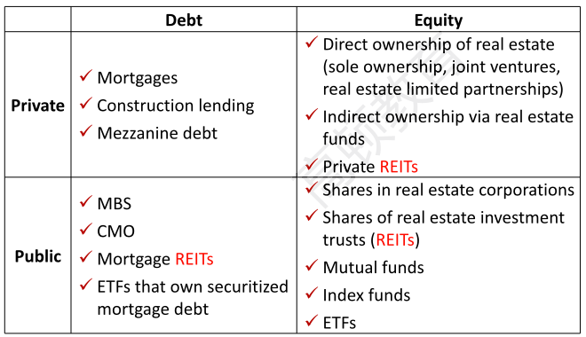
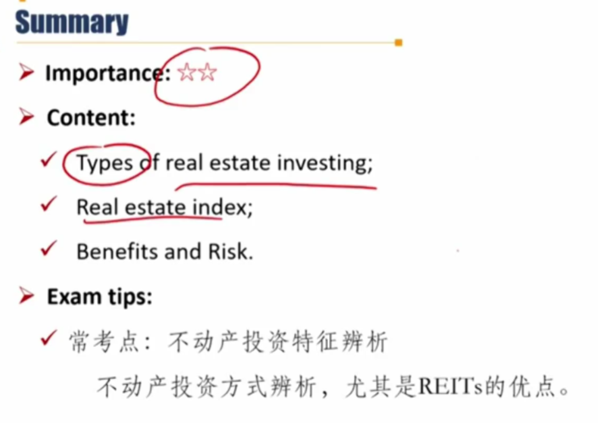
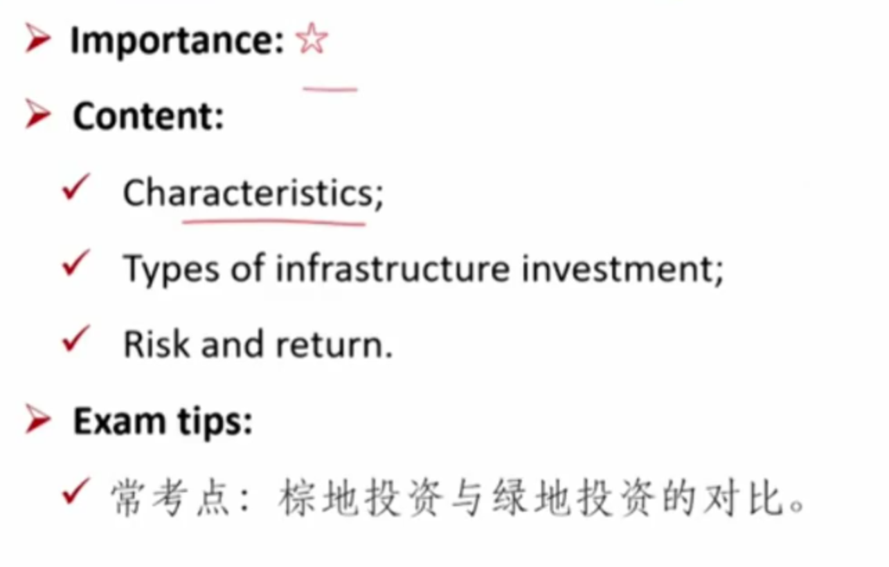
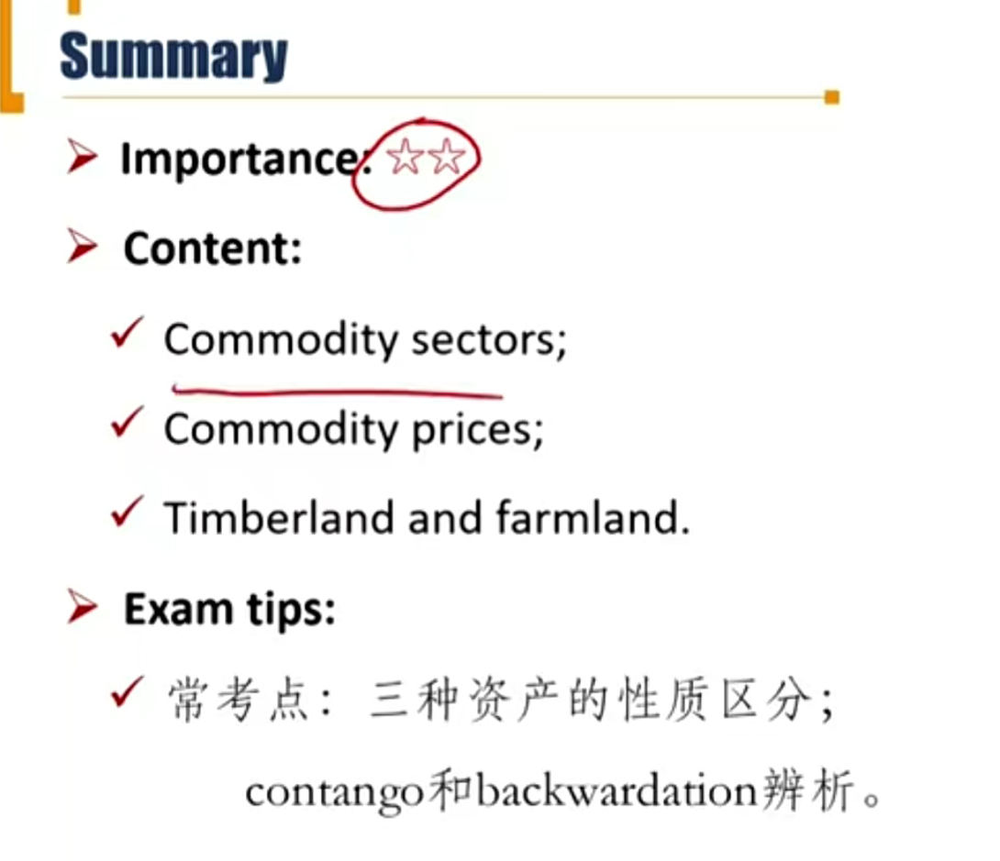

# M5 Real Asset

## R1 Real Estate

**Explain** investment characteristics of real estate

#### Categories

- **Owner-occupied market**

  - Residential: single-family homes and multi-family units.
    - 数量多，规模大
  - Commercial: office buildings, retail shopping centers, and warehouses.
    - 如果是居民自住房，但是用来出租、商业用途，也算做commercial

- **Rental properties**

  - Lease contract: landlord/lessor（房东） and tenant/lessee（租客）

  - Title/deed（地契，所有权） represents real estate property ownership covering building and land-use rights.

#### Key reasons for investing in real estate

- Competitive long-term total returns
  - return包括income和capital gain
- Stable income over many economic cycles
- Historically low correlations with other asset classes
- Inflation hedge if leases provide regular contractual rent step-ups or can be frequently marked to market
  - 抗通胀。房租根据通胀水平进行周期性调整。

#### Differences with other asset classes

- Large required capital investment: difficult to diversified
- Transaction costs are high: illiquidity
- Diversity, as no two properties are identical
  - 资产差异化。不同的房子的标价不一样。
- Necessarily fixed location
- Price discovery in the private market is opaque
  - 价格不透明
- Transaction activity may be limited in certain markets
  - 政策限制，限购
- No investable index
  - 没有可投资的指数
- Typically requires professional operational management
  - 需要运营团队管理，物业

#### Direct real estate investing

- Direct private investing involves purchasing a property and originating debt for one's own account.
  - Advantages: control, taxes.
  - Disadvantage: extensive time requried to manage, need for local market expertise（需要本地市场经验）, large capital requirements, concentrated position.
- Many investors prefer to hire advisers or managers to manage the their direct real estate investment in a **separate account**.

#### Indirect real estate investing

- Indrect investing provides access to the underlying real estate assets through a variety of pooled investment vehicles.
  - Intermediaries facilitate the raising and pooling of capital and the creation of investable structures.
- Types of indirect real estate investing
  - Mortgages: whole loans or MBS
  - Private fund investing
  - REITs

##### Private fund investing

- Most private real estate funds are structured as **infinite-life** **open-end** funds. 开放式的投资风险较低。
  - **Core real estate strategies**: characterized by well-leased(出租价值高), high-quality institutional real estate in the best markets. 核心优质房产
  - **Core-plus strategies** will also accept slightly higher risks derived from non-core markets. 次优房产
- Finite-life closed-end funds are more commonly used to seek higher returns。封闭式方便基金经理进行高风险投资。
  - **Value-add investments** may require modest redevelopment or upgrades, the leasing of vacant space, or repositioning the underlying properties to earn a higher return. 重新装修，对资产增值。
  - **Opportunistic investing** （机会主义投资）accepts the much higher risks of development, major redevelopment, repurposing of assets, taking on large vacancies, and speculating on significant improvement in market conditions. 大幅度改造房产。

##### REITs（Real estate investment trusts）

- REITs are tax-advantaged entities that own, operate, and develop <u>income-producing</u>（重要在于产生income 现金流） real estate property.
  - 两个优点：1）分配利润足够多，公司层面不用交税；2）公开市场交易
  - Are not taxed at the corporate level
    - Above 90% of taxable net rental income are distributed. 把90%收益分配出去时，具有税收优势。
  - Most REITs are listed on stock exchanges.
    - Greater liquidity, lower trading costs, and better transparency
- Mortgage REITs v.s. Equity REITs
  - Mortgage指投资房贷，REITs借钱给人买房
  - Equity指直接以股权方式投资不动产，买下不动产股权

#### Forms of real estate investment

#### Real estate index 房地产指数

- Appraisal index 评估的指数
  - **Subjective**, understate volatility
    - 比较主观，低估了波动率
- Repeat sales(transaction-based) index 基于交易的指数
  - **Sample selection bias**
    - 指数偏向房价高的城市
- REIT index
  - Use the prices of publicly traded shares of REITs to construct the indices
  - More frequently traded, more **reliable** is the index
  - 也有缺点：部分引入了股票市场的market risk

#### Benefits

- Income generation and capital appreciation
- Fixed rents may lessen cash flow impact(房租比较稳定)
- Diversification benefits便于分散化投资
- Inflation hedge if rents can be adjusted quickly for inflation

#### Risks

- Property value risk
- Management risk
- Development risk
- Leverage risk

## R2 Infrastructure基建投资

Explain investment characteristics of infrastructure

#### Overview

- The assets are capital intensive and long lived for **public use**.
  - 三个特点，资本密集、长期使用、公共使用
- Increasing use of **public-private partnerships(PPPs)**: long-term contractual relationship between the public sector and the private sector. 公私合营。
- Investors may lease the assets back to the government, sell newly constructed assets to the government, or hold and operate the assets.

#### Characteristics

- Strategically important 战略决策很重要，一旦建好很难更改
- Monopolistic and regulated 垄断、受到监管
- Stable long-term cash flows
- Significant capital investment
- Long operational lives
- Defined risks 风险可控、确定
- Highly leveraged financial structure 高杠杆
  - 一般是non-recourse无追索权。清算时不涉及到其他资产。

#### Categories by underlying assets

- **Economic infrastructure** assets support economic activity.
  - Transportation assets
  - Information and communication technology(ICT) assets
  - Utility and energy assets
- **Social infrastructure** assets are directed toward human activities:
  - Educational, health care, social housing, and correctional facilities（造监狱）

#### Categories by stage of development

- **Brownfield investment**: investing in **existing** infrastructure assets
  - Privatize or lease out government assets, sell and lease back
    - 私有化政府资产
    - 租政府资产，自己运营
    - 买政府资产，然后租给政府
  - Less risky with lower expected return
- **Greenfield investment**: investing in infrastructure assets that are **to be constructed**.
  - Lease or sell to the government or to hold and operate.
  - More risky with higher expected return.

#### Forms of Infrastructure Investments基建投资方式

- **Direct investment**
  - Provides control and the opportunity to capture full value.
  - Large investment, concentration and liquidity risks.
- **Indirect investment**
  - Funds, ETFs, company shares
  - **Master Limited Partnerships(MLPs)** trade on exchanges and similar to REITs
    - Generally distribute most free cash flow to their investors(这点和REITs类似)

#### Risk of Infrastructure

| 具体风险                      | 风险管理办法                                                 |
| ----------------------------- | ------------------------------------------------------------ |
| Demand Risk                   | task-or-pay arrangements(提供多少收费多少，而不是用多少收费多少) |
| Operational risk              | Reputable and experienced operators                          |
| Construction risk             | fixed-price date-certain contracts 和建筑公司签订固定价格固定日期完工合同 |
| Financial RIsk                | derivatives 衍生品管理利率swap等                             |
| Regulatory risk监管成本       | clear PPP agreement or due diligence 尽职调查                |
| Political risk                | political risk insurance                                     |
| currency risk                 | adjustment mechanisms 比如收入和汇率挂钩                     |
| tax/profit repatriation risks | adjustment mechanisms                                        |

#### Return of infrastructure

- Returns depend on investment type

|          | Higher-Risk profile                              | Medium-risk Profile                                 | Lower-Risk profile                     |
| -------- | ------------------------------------------------ | --------------------------------------------------- | -------------------------------------- |
| 具体项目 | Greenfield projects without guarantees of demand | Mostly brownfield assets and some greenfield assets | Brownfield assets with mitigated risks |
| 盈利来源 | maily capital appreciastion                      | Mix                                                 | Mainly current yield                   |
| 预期收益 | Target return of 14%+                            | Target return of 10%-12%                            | Target return of 6%-8%                 |

## R3 Natural Resources

**Explain** investment characteristics of natural resources

#### Natural resources

- **Commodities**: traditionally physical products that can be **standardized** on quality, location, and delivery for the purpose of investing.
  - 质量、位置、交付标准标准化。标准化产品才是大宗商品。
- **Timberland and farmland**: land owned or leased for the returns it generates from crops and timber.

#### Characteristics of commodities

- Investment returns are based on **changes in price** rather than income stream such as interest, dividends or rent.
  - 没有income，只有价格变化带来的回报
- Holding physical commodities incurs transportation and storage costs. 涉及到运输和存储成本
  - Trading in physical commodities is primarily <u>limited</u> to a smaller group of entities in the physical supply chain.
    - 大宗商品交易比较少，一般是供应链上下游企业。
  - Most commodity investors do not trade actual physical commodities but, rather, trade **commodity derivatives**.

#### Sectors of commodites

- The relative importance, amount, and price of individual commodities evolve with society's preferences and needs. 不同板块的大宗商品价格走势受到社会发展阶段、需求影响

| Sector          | Sample Commodities                        |
| --------------- | ----------------------------------------- |
| Energy          | Oil, natural gas, electricity, coal       |
| Base metal      | Copper, aluminum, zinc, lead, tin, nickel |
| Precious metals | Gold, silver, platinum                    |
| Agriculture     | Grains, livestock, coffee                 |
| Digital         | Crytocurrency                             |
| Other           | Carbon credits, freight, forest products  |

#### Commodity Index

- To be transparent, investable, and replicable, commodity indexes typically set their prices based on futures contracts rather than underlying commodities.
  - 为了保证透明、可投资、可复制，一般用期货计算大宗商品指数，而不是现货价格。（所以存在偏差）
- Different commodity indexes are composed of different commodities and index weights
- Overall, low correlation with other asset classes.
  - Effective for portfolio diversification

#### Commodity futures pricing

- **Futures price $\approx$ Spot price(1+r) + storage costs - convenience yield**
  - 复习derivatives无套利定价：加成本、减收益
  - 上面的storage costs和convenience yield是终值，不用乘以利率
  - convenence yield便利收益：比如持有石油，突然停电了，可以用来发电。

|          | Real Assets实物资产                     | Financial Assets                        |
| -------- | --------------------------------------- | --------------------------------------- |
| Benefits | Convenience                             | Dividends + Coupons                     |
| Costs    | Interest + storage（资金成本+储存成本） | Interest + Custody（资金成本+托管成本） |

- Commodity futures price often **do not adhere to a strict cost-of-carry relationship**.
  - 不是严格按照无套利定价(复习derivatives cost of carry)，因为大宗商品和成本和收益不固定，和金融资产不一样。

- Futures prices may be differenct from spot prices
  - **Contango**升水: futures prices are higher than the spot price, the commodity forward curve is upward sloping（期货价格-时间曲线，时间越长，期货价格越高，因为加的costs越多）
    - Occurs when there is **little or no convenience yield**
  - **Backwardation**贴水: futures prices are lower than the spot price, the commodity forward curve is downward sloping（同理，期货价格-时间曲线，向下倾斜曲线，时间越长，期货价格越低，因为减去的yield越多）
    - Occurs when the **convenience yield is high**

#### Forms of commodity Investments 大宗商品投资形式

- Direct investment
- Derivatives
- Exchange-traded products(ETPs, either funds or notes)
  - 黄金ETF等
- Commodity Trading Advisors(CTAs)
  - 指的是对冲基金中的策略
- Funds specializing in specific commodity sectors
  - 这里特指private funds

#### Benefits of commodity investment

- Real hedge against **inflation risk** 可以对冲通胀风险，重要！
  - inflation beta 为正，可以抗通胀。比如TIPS债券

- Effective for **portfolio diversification** because of low correlation with other investment returns

#### Risk of commodity investment

- Commodity spot prices are a function of **supply and demand**
- Demand levels are influenced by global manufacturing dynamics and economic growth
- Producers cannot alter commodity supply quickly because extended lead times are needed to affect production levels
- 大宗商品没法根据需求曲线变动快速调整supply，生产周期比较长。会导致短期供需不匹配，导致价格会大幅波动。

#### Characteristics of timberland and farmland

- Value comes not just from the harvest but also from the offset to human activity.
  - offset to human activity指的是环保，吸收二氧化碳
- Timberland林地
  - Typically trading in **larger units** of land.
  - **Flexibility**: harvesting more trees when timber prices are up and delaying harvests when prices are down. 储存成本较低，可以灵活决定什么时候砍伐树木。这种特性可以一定程度对抗经济周期。
  - **Return driver:** biological growth; changes in spot prices and futures prices of cut wood; changes in the price of the underlying land.
    - Return driver意思是回报和哪些因素有关。树木生长速度和树木的价格决定了timberland的income，underlying land决定了timberland 的capital gain.

- Farmland农地
  - Typically trading in **much smaller sizes**
  - Provide a **hedge against inflation**
    - 农作物和通胀关系较大
  - **Little flexibility**: farm products must be harvested when ripe.
    - harvest上不具备灵活度
  - **Return driver**: harvest quantities; commodity price(e.g., the price of corn); and land price changes.

#### Risk of farmland investment

- Low liquidity商业化规模较小，交易量少
- High risk of negative cash flow because **fixed costs are relatively high**(the land must be cared for and crops need fertilizer, seed, and so on)
  - 固定成本太高
- Revenue is highly variable based on the **weather**
  - 气候大幅影响收成
- World trade and growing foreign agricultural **competition** result in declines of crop prices.

- 大宗商品和林地的区别：林地可以产生有income
- 林地和farmland的区别：林地在harvest上更加有flexibility
