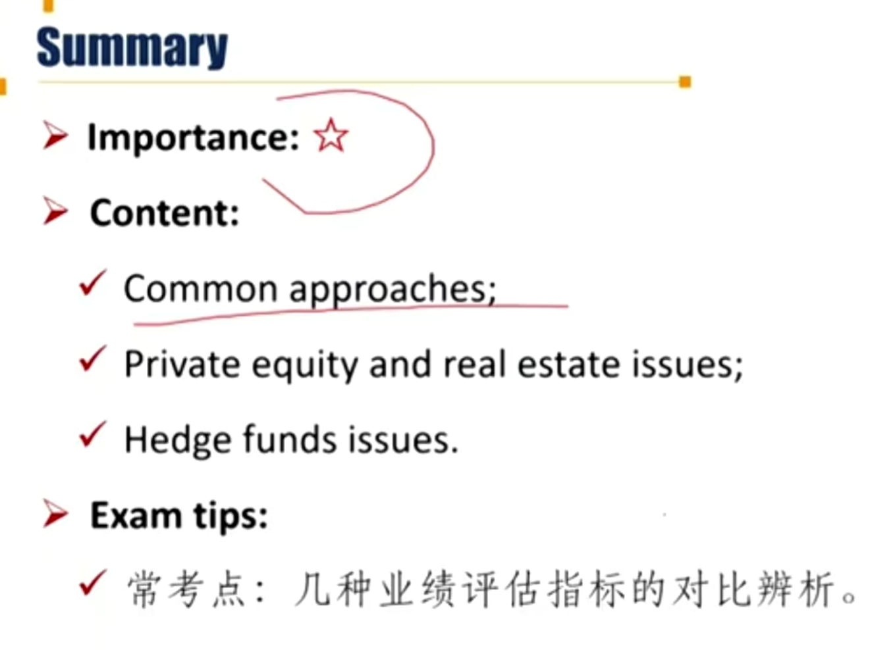

# M7 Issues in Performance Appraisal

Describe issues in performance appraisal of alternative investments. 考察概率不大

#### Challenges of performance appraisal

- Limited transparency
- Low portfolio liquidity
- High leverage and use of derivatives
- High product complexity
- Mark-to-market issues, especially for specialized products
  - 缺少市场参考
- Limited redemption availability
- Difficulty in manager selection and diversification
- High fees, which can have a non-trivial impact on performance.

#### Common approaches to performance appraisal \*

| Ratio       | Formula                     | Pros                 | Cons                                                         |
| ----------- | --------------------------- | -------------------- | ------------------------------------------------------------ |
| **Sharpe**  | $\frac{R_p-R_f}{\sigma_p}$  | Easy                 | Penalized upside and downside volatility equally没有体现上行风险和下行风险差异 |
| **Sortino** | $\frac{R_p-R_f}{TSSD}$      | Focus downside       | Difficult to calculated                                      |
| **MAR**     | $\frac{R_p}{Max\ Drawdown}$ | Entire history       | Recent data might be more relevant                           |
| **Calmar**  | $\frac{R_p}{Max\ Drawdown}$ | Recent data(3 years) | Might hide past issues                                       |

- TSSD: target semi-standard deviation目标半标准差，$R_T$是目标收益率
  - $TSSD=\sqrt{E_{R_i<R_T}(R_i-R_T)^2}$
  - 小于目标收益率的所有收益率样本的标准差，用来衡量下行风险

- Max Draw-down：最大回撤

#### PE and real estate performance evaluation

- Private equity and real estate involve large initial capital outlays with capital inflows occurring much later in the investment cycle. 房地产和私募股权投资前期投入较大，回报现金流较晚。
  - Net cash position shows **J-curve effect**. 总头寸曲线像J形状。
  - Shorter-term risk metrics are highly inappropriate. 短期表现不应该关注。
- As a general rule, the best way to evaluate such investments is the **IRR**(Internal rate of return) of the respective cash flows.

- **Multiple of invested capital (MOIC) / money multiple**
  - MOIC = (Realized value of investment  + Unrealized value of investment) / (Total amount of invested capital)
  - 分母invested capital需要扣减费用。由于分子中实现收益和未实现收益现金流发生时间不一样，MOIC存在缺点是忽略了货币时间价值。
  - 另外，复习会计中的谨慎性原则，unrealized value一般是按最小值去估计，比如historical cost等，这个计量往往有可能滞后于市场，并不准确。
- **Quartile ranking** depicts manager's performance against a cohort of peer investment vehicles constructed with similar investment attributes and vintage year. 风格、成立年份相同的同行中对比。
- **Cap rate**: the net operating income divided by the market value of the property. 一般用于不动产投资，比如租售比。

#### Hedge fund performance evaluation

评估对冲基金时需要考虑杠杆、流动性、投资者赎回

- **Leverage** has the effect of magnifying gains and losses.
  - Hedge funds leverage their portfolios by using derivatives or borrowing capital from **prime brokers**. 向主经纪商借钱、使用衍生品。
  - The hedge fund deposits cash or other collateral into a margin account with the prime broker. 保证金
  - An inability to meet margin calls can force the hedge fund to liquidate the losing position（平调亏损头寸）, leading to further losses.由于保证金不够，需要强行平仓，所以需要购买股票平掉空头头寸，购买股票又进一步推高股价，从而导致进一步损失，恶性循环。
    - e.g. 游戏驿站

- **Illiquidity(Mark to market problem)**

  - Little chance of liquidating all the shares at quoted price.
    - 持有的股票数量较多，没法按照市场报价一次卖出（卖盘不够）
  - Funds may differ in which price or quote they use
    - A more conservative and accurate approach is to use bid prices for long positions and ask prices for short positions。多头用买价，空头用卖价
  - Highly illiquid or even non-traded investments may have no reliable market values, it becomes necessary to <u>estimate</u> values. (<u>Mark to model</u> valuation)（没法mark to market，只能用model估计）

  - Level1: 公开报价；Level2: 中介报价；Level 3：流动性最差
  - Level3需要更多投资者的尽职调查

- **Investor redemptions** may require the hedge fund manager to liquidate some positions at disadvantageous prices, while also incurring transaction costs. 这里和margin call 一样效果，基金表现差->投资者赎回->基金需要平仓->表现更差->
  更多人赎回，恶性循环。
  - Ability to demand a long lockup depends on reputation基金经理的声誉.
  - Ideally, redemption terms should be designed to match the expected liquidity of the assets being invested in.
    - 流动性好的投资标的，可以放宽锁定期
  - Funds of hedge funds may offer more redemption flexibility. 
    - FoF更灵活。

