# M8 Fees and Returns \*\*\*

要求计算，重要

**Calculate** and **interpret** returns of alternative investments both before and after fees.

#### Custom fee arragements

- "2 and 20" and "1 and 10" are common, but variations exist.
- Fees based on liquidity terms and asset size.
  - Longer lockups are generally associated with lower fees.
  - Discount fees for larger investors or for placement agents.
    - placement agent转推荐客户
- **Founders' shares** entitle investors to a lower fee structure.
  - 创始人份额。新出炉的基金经理没有历史表现参考，用创始人份额吸引客户购买。
- **Either/or fees**: managers agree either to charge a 1% management fee or to receive a 30% incentive fee above the hurdle, whichever is greater. 管理费和激励二选一。

#### Example 1

- year-end AUM：意思是按照年末的规模计算管理费用。（对比year-begin按照年初）

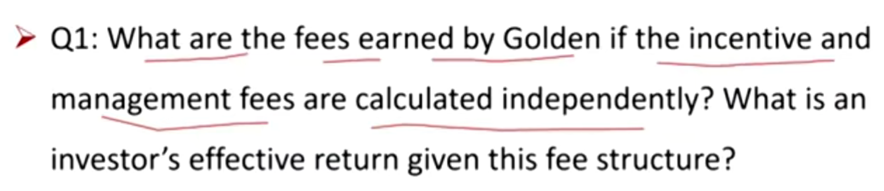

2

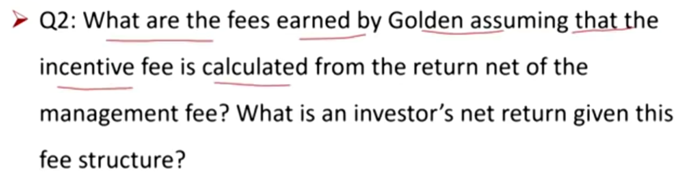

- net of management fee扣除管理费再计算incentive fee.

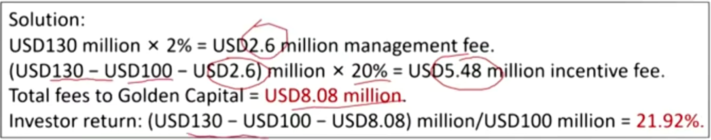

3

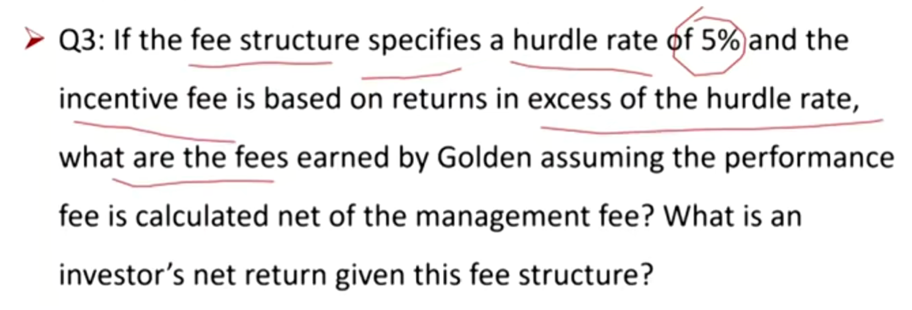

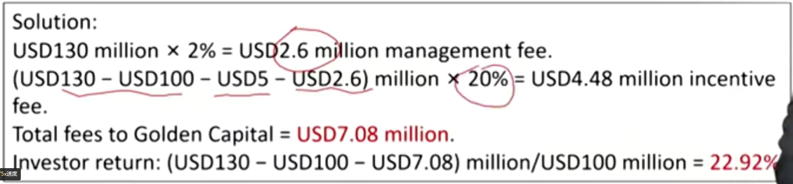

- 注意hurdle rate是乘以期初本金

4

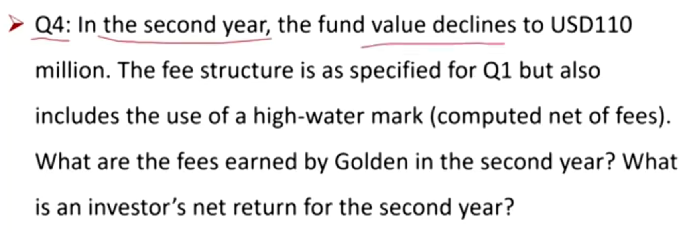

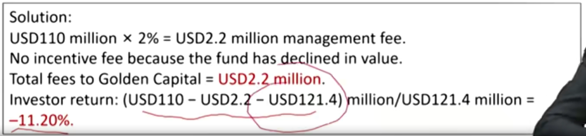

- 注意，高水位按照分配利润后的金额计算。第二年的收益率也按照第一年分配后的121.4计算。

5

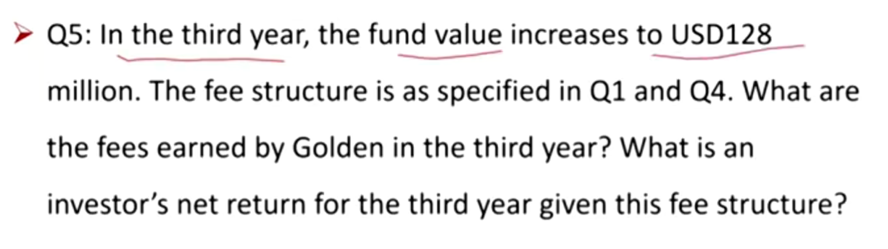

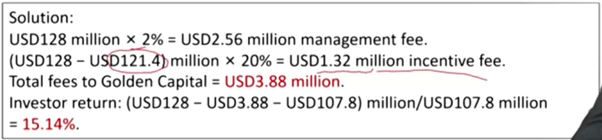

高水位体现，需要高于Q4中的121.4的部分才是计算激励的部分

#### Example 2

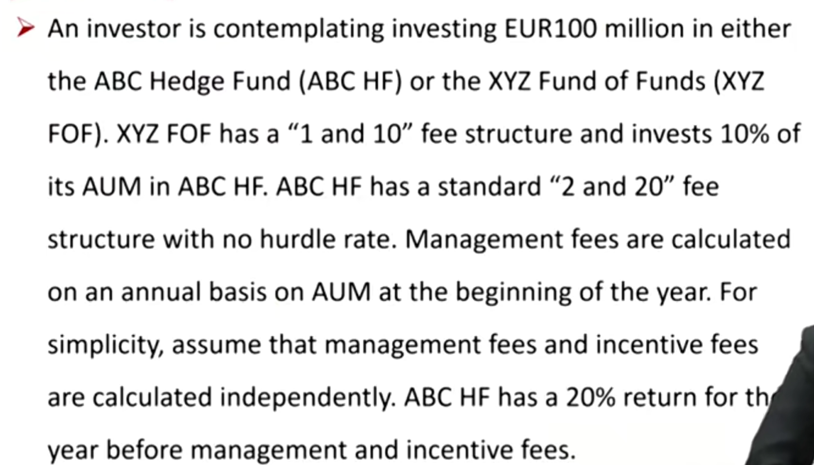

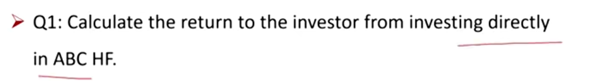

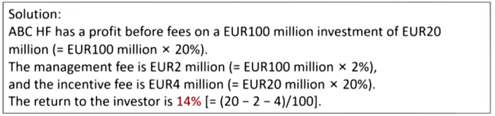

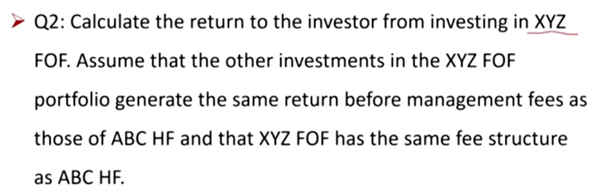

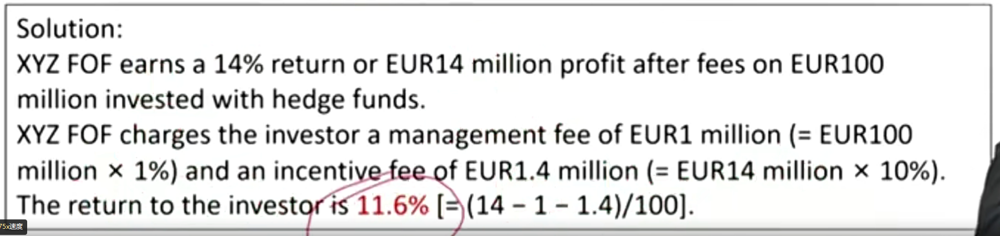

- 管理费是按照AUM，激励按照return计算

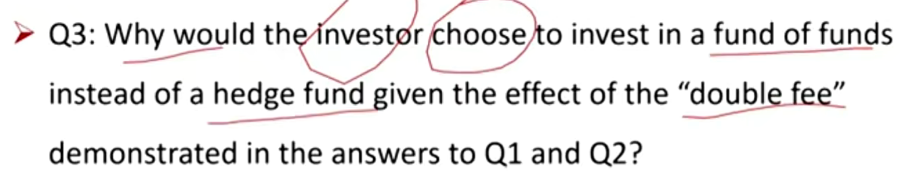

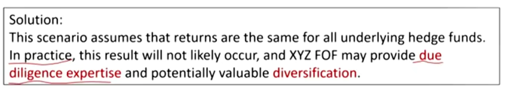

#### Example 3

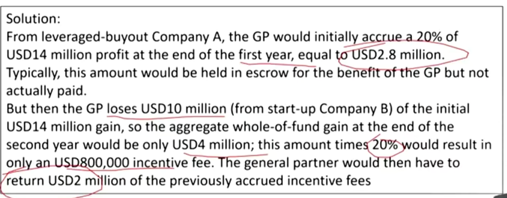

- escrow，incentive的特殊账户，避免GP跑路

#### Example 4

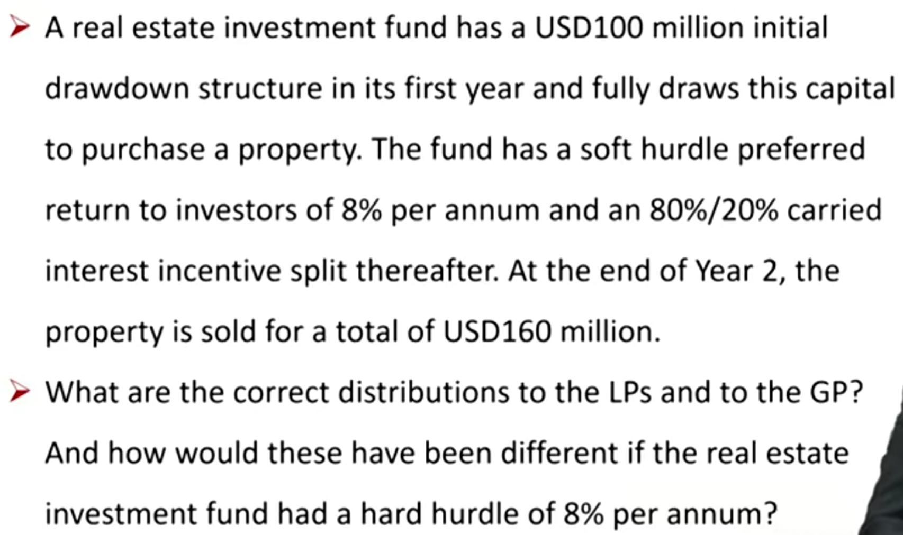

- hurdle用单利计算
- soft hurdle rate 计算中，分为4个步骤：1）本金100million先给LP；2）分hurdle rate部分给LP，优先保障LP的要求回报率：60\*8%\*2y=16million;3) 按照80/20比例，将已经分了hurdle的部分，对应分给GP：16/4=4million; 4）按照80/20分掉剩下的40million的收益。

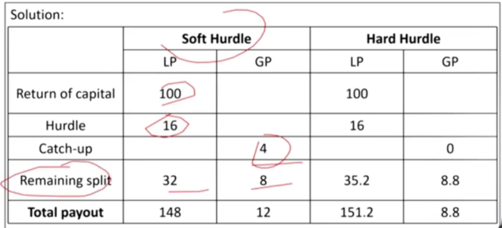

5

#### Example 5

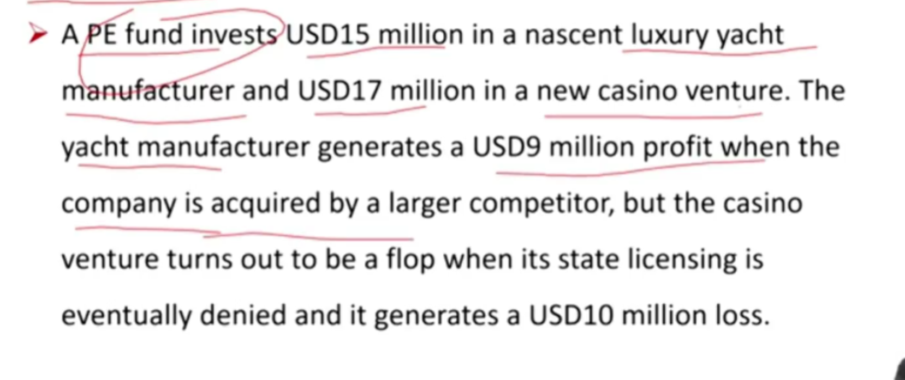

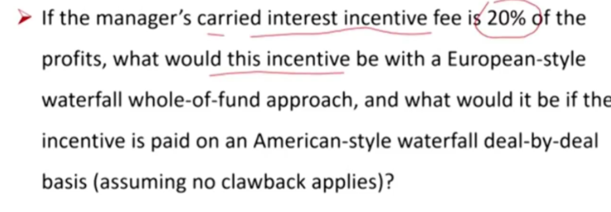

#### Summary

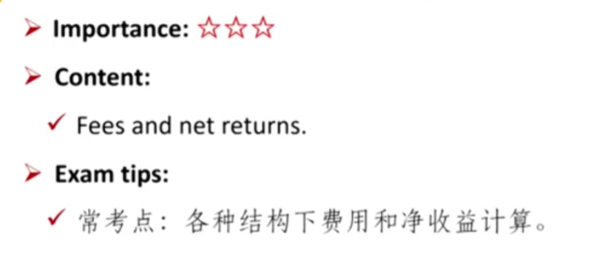

