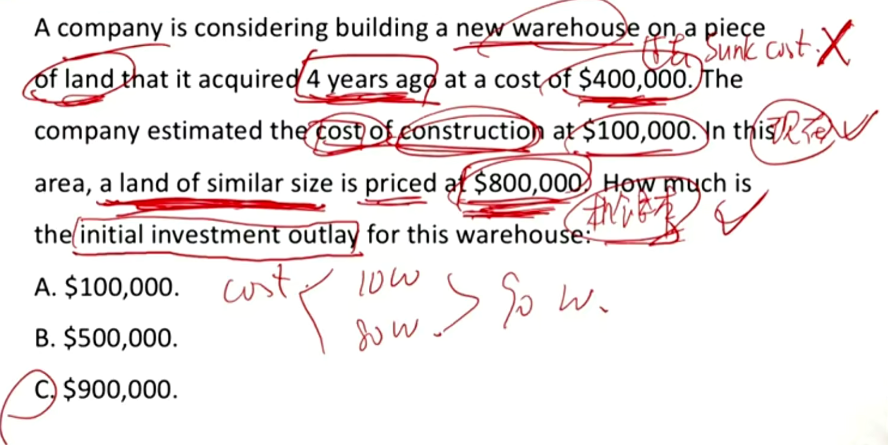
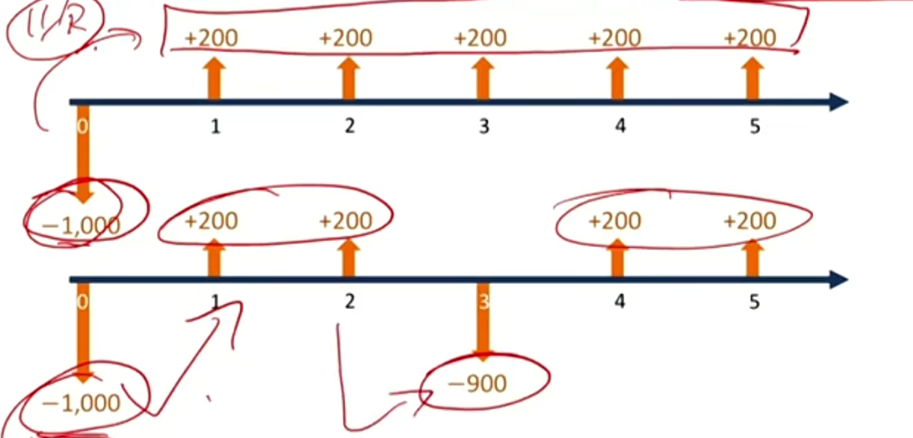
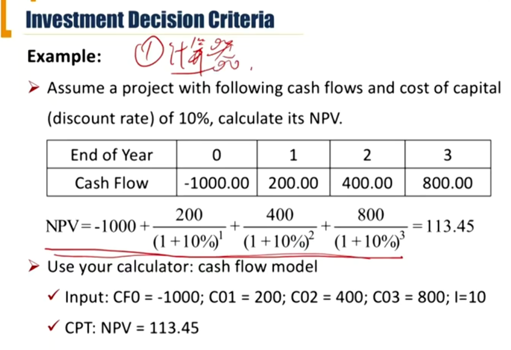
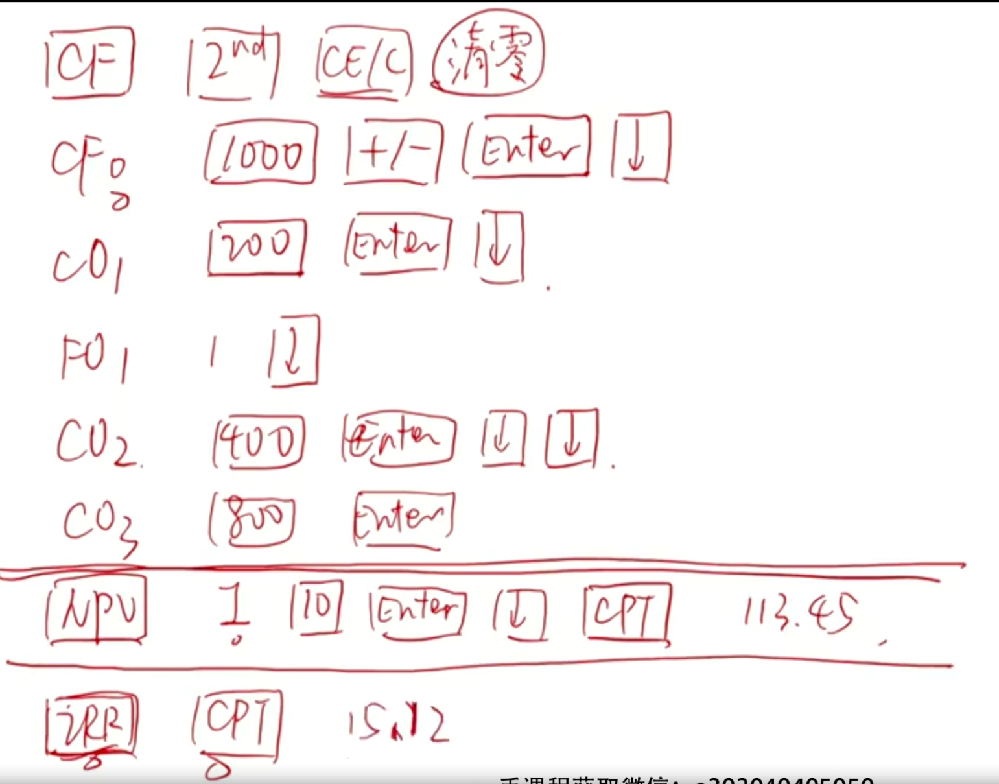
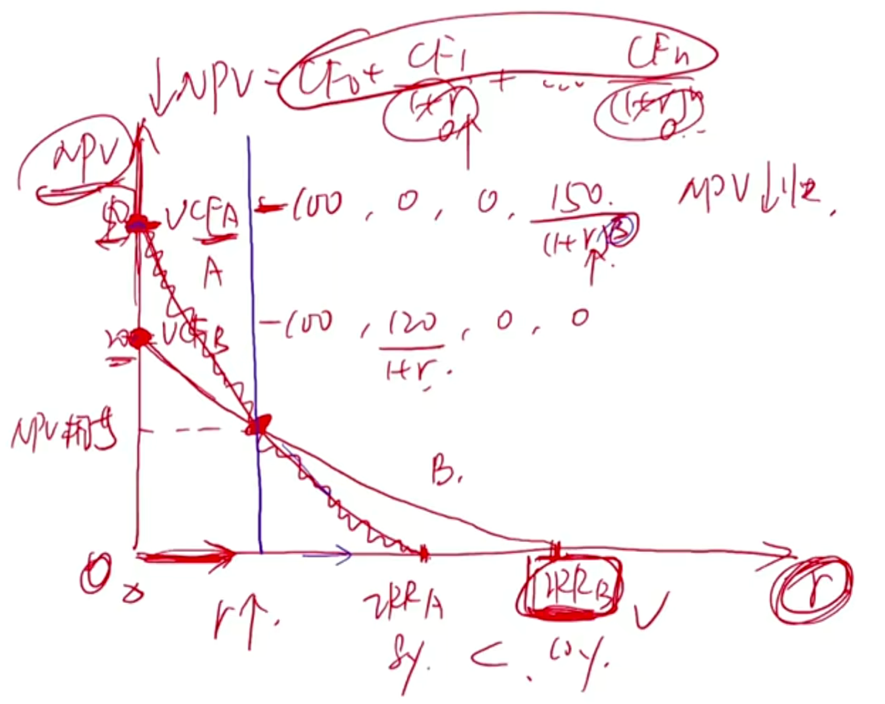
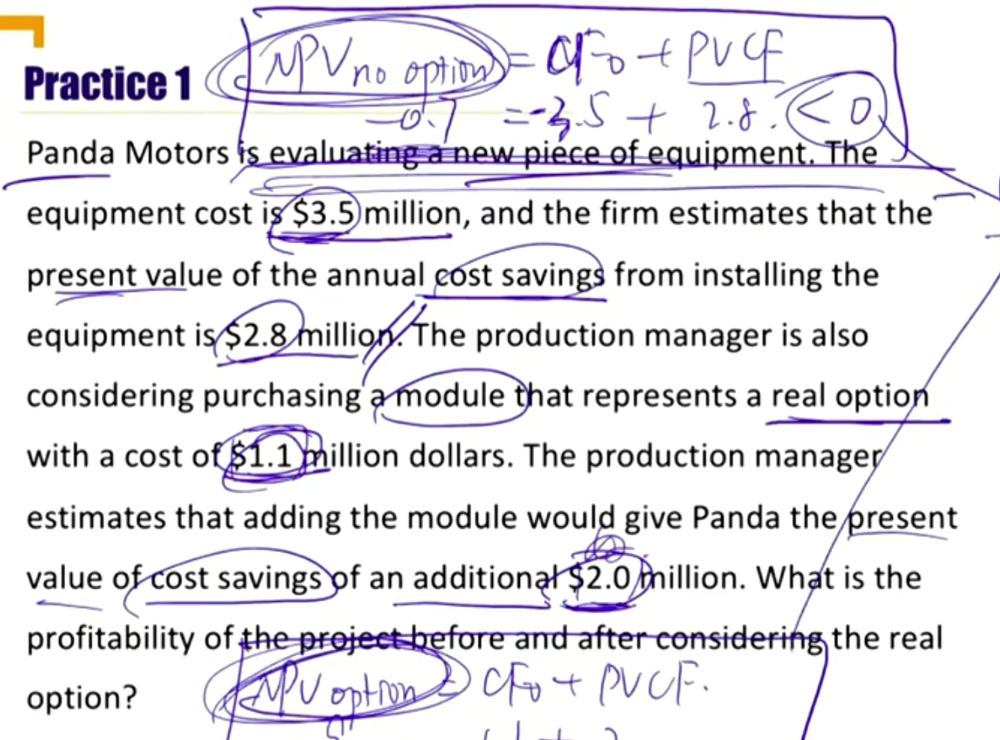
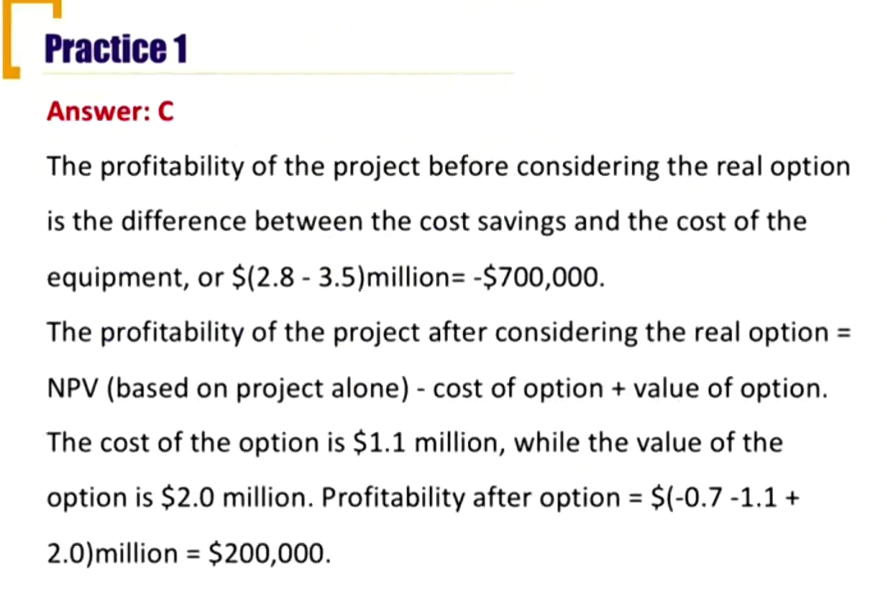

# V4-M1 Capital Investment

### 1）Capital Allocation

#### Capital allocation process

##### Capital investments/projects

- With a life of one year or more made by corporate issuers

##### Types of capital investments

- Business maintenance 维持业务
  - Going concern projects 持续经营项目，保持现有规模的投资
    - 替代型的项目，比如替代旧设备，替代低效设备
  - Regulatory projects 法律

- Business growth 业务增长
  - Expansion projects 原有业务扩张
  - Other projects 新业务扩张

##### Capital allocation process

- The process used by a company's management to make capital inestment decisions

##### Typical steps in the capital allocation process

- Step1: generating ideas
- Step2: investment analysis
- Step 3: capital allocation planning 讲故事
- Step 4: Monitoring and post-audit

##### Principles of capital allocation 重点必考

三要两不要，时间价值比较重要：要考虑**税后增量现金流**、**机会成本**、**外部性**，不要考虑**沉没成本**、**时间价值比较重要**。

- The **after-tax incremental cash flows** provide a sound basis for capital budgeting. It involves basic principles as follows(税后增量现金流) 

- Include
  - Opportunity costs: the forgone return of the resource invests in the next-best project（机会成本）
  - Externalities外部性
    - Synergy(positive effect)协同作用，互补
      - 同个公司两个项目互补，比如iphone和iwatch
    - Cannibalization (negative effect)吞噬作用，互斥
      - 同个公司的两个项目之间存在互斥。比如两个同类产品，鸡腿和鸡翅。

- Exclude: 两不要

  - Sunk costs: the cost has already been incurred 沉没成本

  - Financing costs: they are considerred in discount rate(avoiding double counting problem) 融资成本
    - 不在现金流里考虑融资成本，因为折现率中已经考虑。比如同时考虑利息并且折现，未来收到100，减去利息5块，再折现变成90，导致double counting. 正确应该直接100折现到今天，进行分析。也就是不应该包括interest expense.

- Timing value of cash flows is crucial。时间价值比较重要

Example

sunk cost不考虑，当前成本和机会成本都要考虑。

##### Cash FLow Patterns 现金流分类

- Conventional CF传统现金流：cash flows change signs once 只变动一次方向
- Nonconventional CF非传统现金流：cash flows change signs more than once，变动多次方向

上面传统，下面不传统。

### 2）Investment Decision Criteria

#### Valuation methods for single project 必考

考察方式：1）计算，2）decison应不应该投；3）分析优缺点

- Net present value (NPV)
- Internal rate of return (IRR)

#### Net present Value 净现值

- The sum of the present value of the future after tax cash flows

$$
NPV = CF_0+\frac{CF_1}{(1+r)}+\frac{CF_2}{(1+r)^2}+...+\frac{CF_n}{(1+r)^n}
$$

$$
NPV = -|CF_0|+PVCF
$$

CF0: initial outlay，初始投入（负值）

r = **required rate of return** for capital supplieres 投资方要求回报率

=**cost of capital** for capital receivers融资方资金**成本**

- NPV indicates the expected wealth changing for the firm

Example: 计算器使用现金流

- Investment decision criteria(for single/independent project): 判断准则
  - if NPV > 0, then accept/invest
  - if NPV< 0, then reject/ not invest
  - NPV = -|CF0| + PVCF > 0判断赚不赚钱
  - 如果是独立项目（independent project）,通过NPV判断是否要投资
  - 如果是互斥项目，mutually exclusive，选一个NPV最高的进行投资
- Advantages:
  - Directly reflects the expected wealth changing for the firm and its shareholders
  - NPV的优点：
    - 计算的是绝对的货币金额
    - 如果NPV>0，则代表给股东创造价值（不能说给债权人创造价值，债券是固定收益）
    - 反映了realistic回报率，真实回报率
- Disadvantages:
  - Ignore the size of the project，NPV的缺点，忽略了项目规模

#### Internal rate of return IRR, 内部报酬率

- The discount rate that makes the total present value of all cash flows, the **NPV equals to zero**

$$
NPV = 0 = CF_0+\frac{CF_1}{(1+IRR)}+\frac{CF_2}{(1+IRR)^2}+...+\frac{CF_n}{(1+IRR)^n}
$$

- IRR is the **annualized expected return** on the project IRR是年化的预期的回报率，把收益转化到了分母的利率上，预期return.
- When applying the IRR approach, required rate of return is referred as **hurdle rate**.
  - 当IRR > hurdle rate(required rate)的时候，可以投资

可以用计算器按一下之前的例子。

如果利率比IRR更大，NPV计算就是负数，也就是IRR是能投资的最大回报率

- Investment decision criteria(for single/independent project):
  - if IRR > cost of capital, then accept./invest
  - If IRR < cost of capital, then reject/not invest
  - 独立项目，通过IRR和融资成本对比
  - 如果是互斥项目，选一个**最大**的IRR.
- Advantages
  - It reflects the profitability。IRR反应了项目的盈利能力，不同规模的项目也可以通过IRR比较，比如100万和一个亿的项目，通过IRR对比回报率。（和NPV的disadvantage对应）
- Disadvantages
  - No IRR or multiple IRR(nonconventional cash flow) 当没有IRR或者多个IRR的情况
    - 如果NPV不可能等于0，那就算不出IRR（如regulatory，强行规定NPV）
    - 有些情况会有多个IRR，现金流CF变动n次，IRR最多有n解（unconventional CF）
  - Impractical implicit assumption of reinvestment rate(IRR)
    - 不现实的再投资回报率。比如投资到第3年，已经没有这么高的IRR。
    - 注意NPV是现实的，IRR在这个意义上是unrealistic

#### Project interaction

- **Independent projects**: projects are unrelated to each other 独立项目

  - The firm can raise the funds it wants for all profitable projects, requiring **little** management effort
  - 假设：无限资金
  - Accept all projects with NPV > 0 (IRR > cost of capital)
  - 其实，NPV>0=> NPV= 0 时，IRR > r(能够互相推出)

- **Mutually exclsive projects**: projects compete directly with each other 互斥项目

  - Resource scarce: firm has limited ability to take on additional projects(e.g., limited funds/skilled IT personnel)

  - 资源有限，只能挑选一个投资

  - NPV method: choose the one with highest NPV

  - IRR method: choose the one with hightest IRR

  - NPV and IRR project rankings may conflict due to: NPV法和IRR法选择互斥项目时有可能导致不一样结果，因为：

    - Different sizes of CFS: 投资规模不一样

    - Different timing of CFs：不同r，对应不同NPV

      

    - Different reinvestment rate assumptions:

      - IRR assumes CFs can reinvest at projects' IRR 能够以IRR再投资
      - NPV assumes CFs can reinvest at the cost of capital(more conserveative/realistic)以融资成本再投资，比较保守接近现实

  - **choose to projects with higher NPV**互斥项目时，选NPV的结果

- Project sequencing: projects should be taken in time order

  - 投资按照顺序

Practice: 需要按照NPV选择互斥项目，如果题目给了我们IRR，我们还是要算出NPV，计算选出的项目

### 3）Corporate use of capital allocation 投资结果评判是好是坏

#### Return on invested capital(ROIC)

- Measure of the profitability of a company relative to the amount of capital invested by the equity and debtholders

$$
ROIC = \frac{After\ Tax\ Operating\ Profit}{Average\ Book\ Value\ Of\ Invested\ Capital} = \frac{EBIT(1-t)}{Capital}
$$

- Capital包括Debt和Equity，债权人和股东的资本. EBIT扣除税，Interest属于债权人，其余属于股东。
- 注意EBIT是I/S中的时间段数，Capital是B/S时间点数，所以要Average Capital
- If ROIC > cost of capital, firm's value for shareholders increases
- If ROIC < cost of capital, firm's value for shareholders decreases.	

- IRR是投资前计算判断，ROIC是投资后的结果判断，都和cost of capital对比

#### NPV and stock prices NPV对股票影响

- Value of the company's shares will increase by the new investment's positive NPV
- When an analyst learned news of a project 要把NPV的预期考虑进去
  - If the project's profitability is less than expected, the stock price might drop. 
  - If the project's profitability is more than expected, the stock price might increase.

### 4）Real Options 含权项目（real option实物期权）

#### Real Options

- Types of real options
  - Timing options(delay investment 推迟投资，项目开始之后再投资)
  - Sizing options(abandonment  & growth option) 
    - abandonment放弃期权，项目做到中间就放弃
    - growth option 扩张期权，可以中途追加投资，扩大投资规模
  - Flexibility options(price setting & production-flexibility)
    - 改变参数
  - Fundamental options(gold mine & oil well)
    - 买卖标的资产，实物期权
- Evaluate approaches 
  - NPV(with option) = NPV(no option) + Value of options - cost of option
  - 含权项目NPV = 不含权项目NPV + 期权NPV（value - cost)

### 5）Common capital allocation pitfalls 投资会犯的错误

- Inertia 惯性 in capital investments through years
- Source of capital bias by management 偏见
  - Internal funds as "free" 内部资金觉得很便宜
  - External funds as "expensive"  外部借的钱就觉得很贵
- Failure to consider investment alternatives
  - 没有考虑其他选项
- Pushing "pet" projects
  - 自己喜欢的，别人不一定喜欢的项目
- Basing investment decisions on EPS, net Income, or ROE
  - 不应该基于EPS, NI, ROW去考虑，应该考虑Cash flow

- Internal forcasting erros
  - Incorrect overhead costs
  - incorrect discount rate
  - incorrect treatment of opprotutnity costs and sunk costs
  - failure to incorportate market responses没有考虑外界的反应