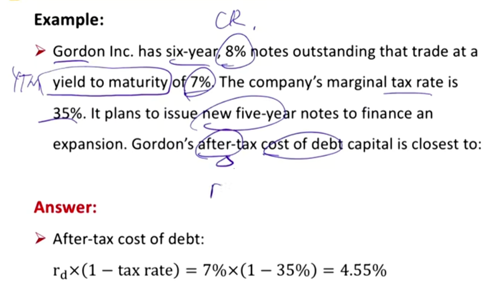
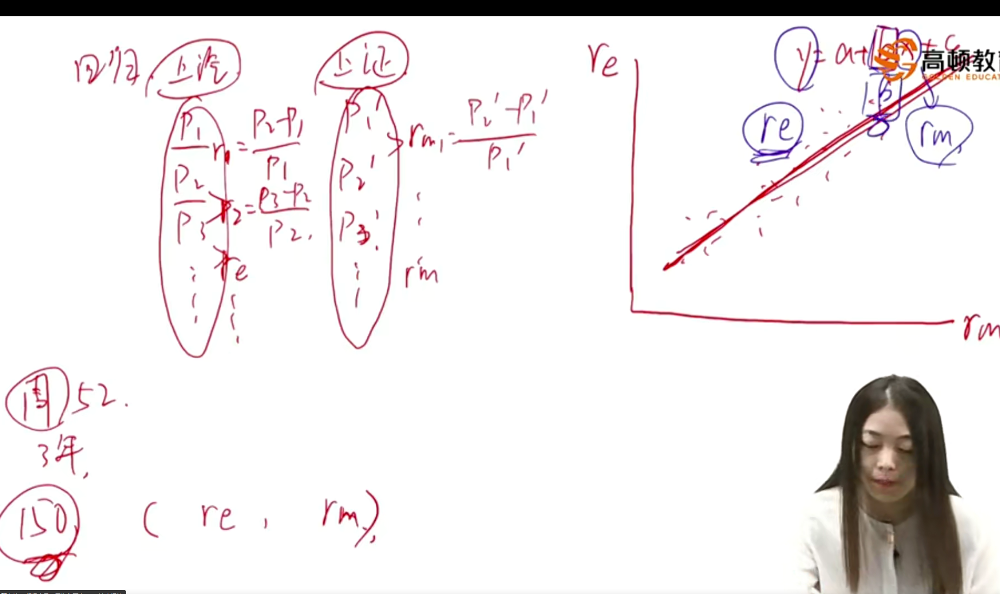
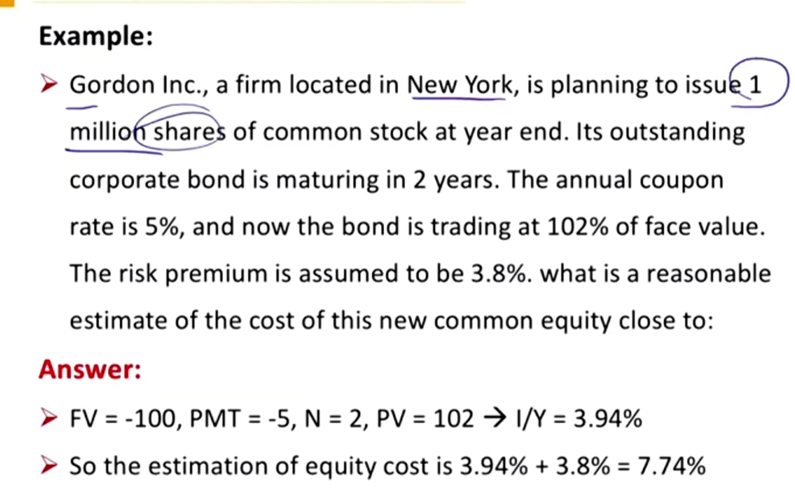
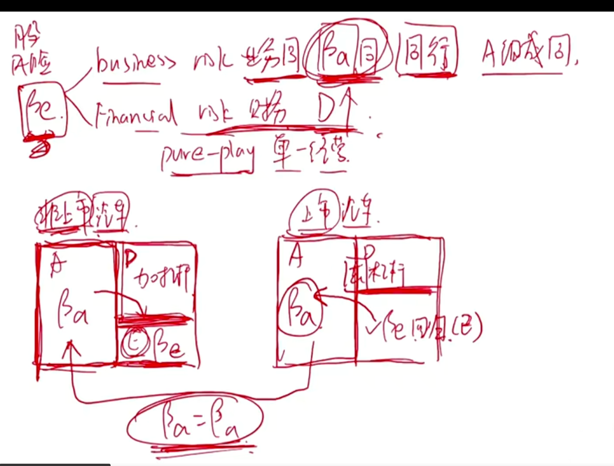
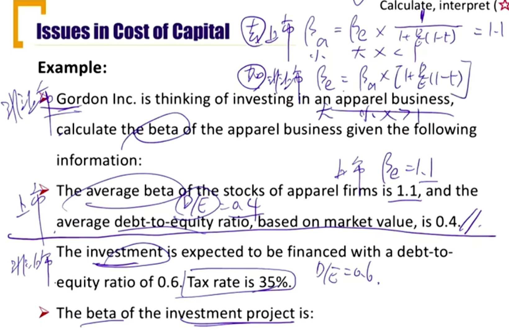
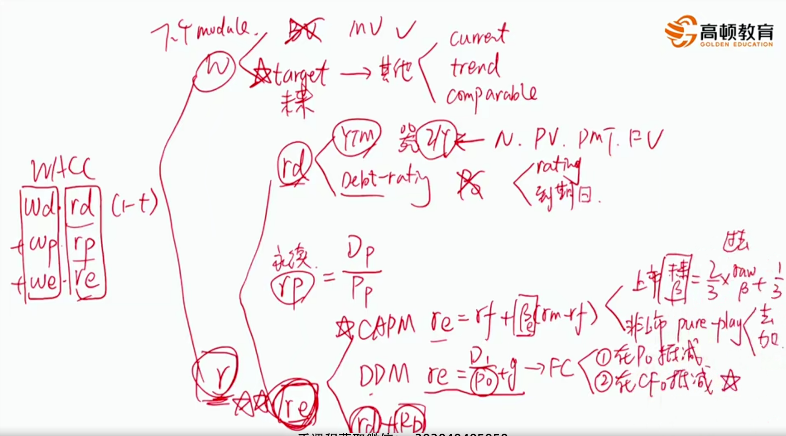

# V4-M3 Cost of capital foundational topics 

重要，钱从哪里来

### 1）Weighted Average cost of capital(WACC)

#### Cost of capital 资本成本

指的是

- The required rate of return for capital suppliers 资金提供方的要求回报率。
- The opportunity cost of funds for capital suppliers 资金提供方的机会成本。

#### Alternative to raise capital

- A company can raise capital from: 这里研究的是边际成本margin cost
  - Debt 
  - Preferred stock
  - Common equity

#### The cost of capital of a company

- The required rate of return that investors demand for the average-risk investment of a company
- The most common way to estimate the cost of capital of a company is **weighted average cost of capital(WACC)**, which is to calculate the **margin costs** of each sources of capital and then calculate a weigted average of these costs.
- WACC also refers to **marginal cost of capital(MCC)**边际成本

#### Weighted average cost of capital (WACC)

$$
WACC = w_d\times r_d \times (1-t)+w_p \times r_p + w_e\times r_e
$$

d:债务debt, p: 优先股：preferred stock, e: equity

w: the proportion of each resource for the company to raises new funds, and should be based on the market value

r_d: the before-tax marginal cost of debt

r_p=the marginal cost of preferred stock

r_e=the marginal cost of common equity

t=the company's marginal tax rate

- 债务w_d要扣税，因为T在利息I之后扣减。所以最后的NI，少付了$r_d w_dt$的税，所以成本只有$w_dr_d(1-t)$
- 注意这里的cost，就是上面cost of capital中提到的回报率的意思The required rate of return for capital suppliers=The opportunity cost of funds for capital suppliers
- WACC算出来是一个回报率，一般用于公司的free cash flow FCFF折现到今天，衡量公司的价值。
- 权重w
  - 如果用金额算，需要用market value求出市值占比
  - 如果用capital structure计算，优先用target structure目标资本结构（D:E=1:2)

#### Weights in WACC 权重w怎么算

- Use this target capital structure if it is available反映的是未来成本
- If target capital structure is not available, estimate weights using one of the serveral approaches:
  - The company's current capital structure
  - Infer the target capital structure by trends in the company's capital structure or statments by managment
  - Use averages of comparable companies' capital structure

Practice:

which of the following is most accurate regarding the component costs and component weights in a firm's weighted average cost of capital(WACC)? answer:A.

**A. Taxes reduce the cost of debt for firms**

B. The appropriate pre-tax cost of a firm's new debt is the coupon rate of the firm's existing debt. couponrate 只是决定每期的payment，r_d是折现债券到今天时下面的分母.

C. The weights in the WACC shoudl be based on the book values of the individual capital components. 应该是market value

### 2) Cost of Various Sources of Capital 计算r

#### Cost of debt YTM approach

- Yield to maturity(TYM, r_d) is the annual return that an investor earns on a bond if the investor purcahses the bond today and holds it until maturity

$$
P_0=\frac{PMT}{(1+YTM)}+...+\frac{PMT+FV}{(1+YTM)^n}
$$

- After tax cost is the true effective cost of debt to the company since interest payments are generally tax-deductible，税后YTM
  - After tax cost of debt = YTM \* (1-tax rate)

Practice, semi-annual paid 5year bond, price 1030, par value 1000, coupon rate 10%, tax rate 30%. what is the after tax bond cost?

PV = -1030, PMT = 100/2 = 50, N = 5*2 = 10, FV = 1000，计算得到是半年的r_d

after tax bond cost = r_d \* 2 \* (1-t) = 6.47%

#### Cost of debt Debt-rating approach 债券评级法

- When a reliable current market price for a company's debt is not available, the debt-rating approach can be used to estimate the before-tax cost of debt 如果债券没有活跃报价，就用债券评级法
- Using the yield(r_d) on **comparably rated bonds** for maturities that closely match taht of the company's existing debt
  - 参考满足两个条件（评级一样、到期日差不多）的其他债券的r_d
  - **After tax cost of debt = r_d \* (1 - tax rate)**

#### Cost of common equity: CAPM approach资本资产定价模型

- Capital Asset Pricing Model(CAPM)

$$
r_e=R_f+\beta[E(R_m)-R_f]
$$

其中：

$R_f$：Risk-free rate，无风险收益率一般是国债收益率近似，用（T-bond，10年期）

$\beta$: beta(systematic risk) of firm's stock

$E(R_m)$: expected market return 市场收益率

$E(R_m)-R_f$=expected market risk premium 市场风险溢价

- In general, the appropriate risk-free rate should **match the duration of projected cash flows**.

- 在无风险基础上，加上个股的风险溢价
- $\beta$指的是个股是市场风险的几倍，使用线性回归的方法计算出，个股，市场收益率进行方程拟合

- 注意market return 和 market risk premium的区别，看清题目

#### Cost of common equity: DDM approach

- Dividend discount model(DDM) approach

$$
P_0=\frac{D_1}{r_e-g}
$$

$$
r_e=\frac{D_1}{P_0}+g
$$

$D_1=D_0\times (1+g)$=the expected dividends next period, $D_0$指的是已知的已经发放的当前时间点的红利

$P_0$=current stock price

$g$=firm's expected constant growth rate

假设股利$D_n$以g永续增长

- 这个g，就是财报里的Sustainable Growth Rate = ROE \* retention rate = ROE \* (1 - Dividend / Net Income)

那么每期的股利是$D_1$, $D_1(1+g)$.....

那么
$$
P_0=\frac{D_0(1+g)}{1+r_e}+\frac{D_0(1+g)^2}{(1+r_e)^2}...
$$

$$
P_0\frac{1+r_e}{1+g}=D_0+\frac{D_0(1+g)}{1+r_e}+...=D_0+P_0
$$

所以，求出$P_0$得出DDM模型的解。

#### Cost of common equity: Bond yield plus risk premium

- Bond yield pulus risk premium approach:

$$
r_e=r_d+RiskPremium
$$

$r_d$=before-tax cost of debt, 这里的debt是长期债

risk premium=historical spread between stock return and debt return. It is the compensation return for the additional risk of equity compared with debt

- In developted contry, risk premium ranges from 3% to 5%. 发达国家一般3%~5%

#### Cost of preferred stock $r_p$

永续年金

- For **nonconvertible**, non-callable preferred stock that has a **fixed** divdend rate and **no maturity date**, we can use the formula for the cost fo a preferred stock:

$$
P_p=\frac{D_p}{r_p} \implies r_p=\frac{D_p}{P_p}
$$

$D_p$=the preferred stock dividend per share 每股发放的红利

$P_p$=the current preferred stock price per share 当前的优先股股价

回顾DDM，P0 = D1 / (r - g)，优先股中，g=0不增长，所以P = D/r

### 3） Issues in Cost of Capital

#### Cost of capital for a public company 怎么算beta

- When estimating the cost of equity with CAPM approach, equity beta must be estimated
- For publicly traded company, an **unadjusted** or **"raw" historial beta** can be estimated by an ordinary least square regression 最小二乘法线性回归，基于历史数据，反映的是过去的beta。
  - 我们算出$r_e$是为了算WACC，WACC是为了反应未来的cost，所以过去的beta要调整为未来的beta
  - A fture beta tends to regress to the mean value of 1。在上面求得的beta利用下式，算出未来的beta。
    - Adjusted beta = 2/3 \* unadjusted beta + 1/3 \* 1.0
    - 分了一部分权重给1， beta drift, beta漂移。公司规模不断变大，最终贴近于市场，所以漂移向1.

- For a thinly traded or non-publicly traded company, estimation of the quity beta is challenging.
-  using a publicly traded comparable company's equity beta($\beta_E$) and adjusting it for financial leverage differences
  - Comparable company: an company with similar business risk
- pure-play 单一经营法

个股分线分为business risk业务风险和financial risk财务风险。业务风险由资产asset的组成决定，假定同行业asset组成相同，通过求得的同业的beta，去杠杆，加杠杆，得到目标公司的beta。

- Pure-play method: unlever & re-lever

推导：
$$
\beta_A=w_D\beta_D+w_E\beta_E
$$
由于D是债券，E是equity，A是Asset，由于债券是固定收益，其对于市场的风险倍数为0，所以，考虑税的因素：
$$
\beta_A=\frac{E}{D+E}\beta_E=\beta_E\times [\frac{1}{1+(1-t)\frac{D}{E}}]
$$

- Unlever: 去杠杆

$$
\beta_A=\beta_E\times [\frac{1}{1+(1-t)\frac{D}{E}}]
$$

- Re-lever: 对于公司’：

$$
\beta'_E=\beta_A\times [1+((1-t')\times \frac{D'}{E'})]
$$

D/E: debt-to-equity ratio = total debt / total shareholder's equity

#### Flotation cost 发行成本

- Flotation cost is relatively high in stock issuance
  - 承销，保荐，法律，审计等费用
- There are two ways to incorporate the flotation cos
  - Incorporate into the cost of capital(DDM) 发行成本作为发行价抵减
  - Incorporate in to the cash flows in NPV computations(**Preferred**) 发行成本作为期初一次性现金流出
    - CFA更认可NPV方法

- Incorporate into the cost of capital(DDM)

$$
r_e=\frac{D_1}{P_0-F}+g
$$

or
$$
r_e=\frac{D_1}{P_0(1-f)}+g
$$
f=flotation cost in percentage amount

F=flotation cost in monetary amount

- Incorporate into the cash flows in NPV computation 

NPV(without flotation cost) - F = NPV(with floation cost)

F = flotation cost in monetary amount

更推荐NPV方法，因为发行成本只体现在了期初的现金流

