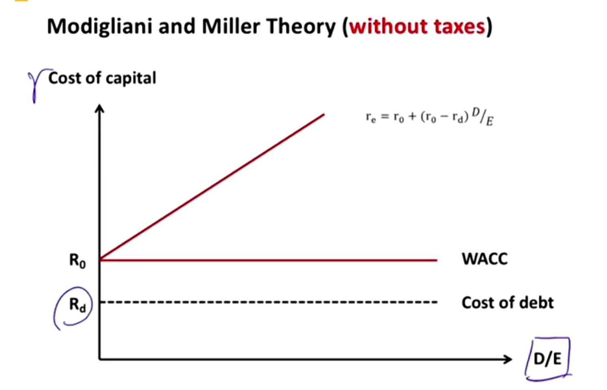
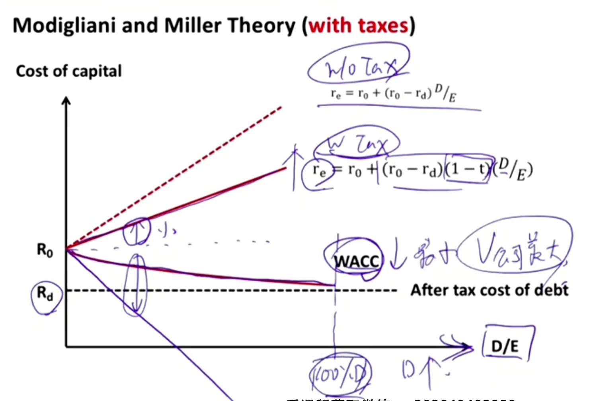
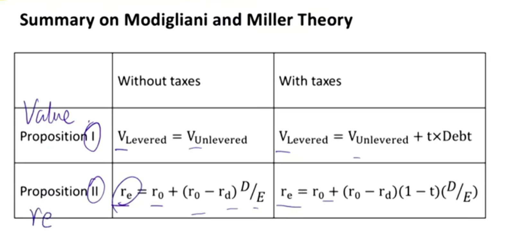
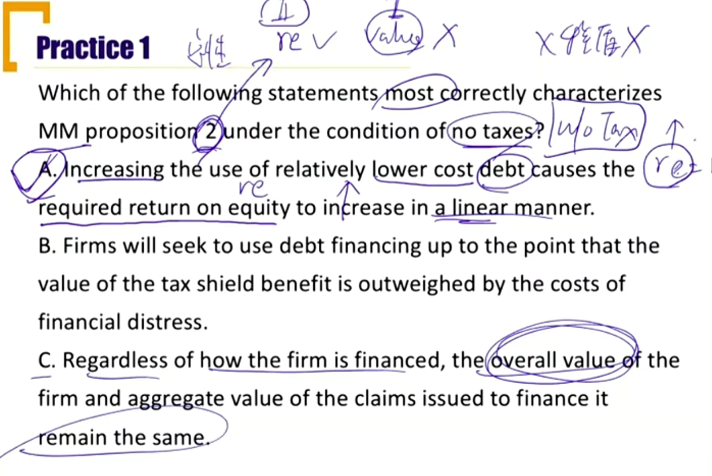
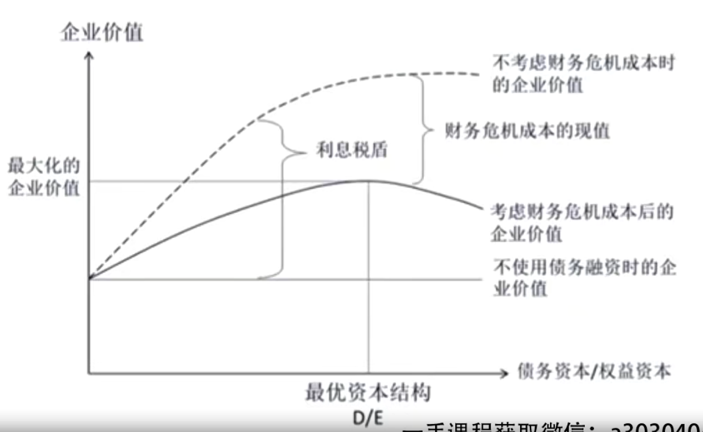
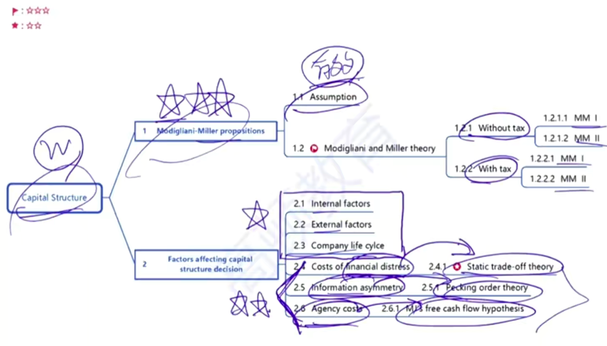

# V4-M4 Capital Structure

这里主要关注WACC中求权重w

### 1）Factors Affecting Capital Structure Decision

#### Internal factors

- Business model characteristics 商业模式
  - Revenue, earnings, and cash flow sensitivity受宏观经济影响性（比如周期性行业等）
    - subscription model, pay-per-use model
  - asset type, 有形资产，无形资产
  - asset ownership 资产的所有权（比如外包资产，减少资产折旧费用）
  - 一般轻资产的公司债务更低；
  - 非周期，有形资产的公司，可以举大量债务。比如：电信，矿产，软件三者，电信的债务可以最高。
- Existing leverage 已有的杠杆，影响再融资
- Corporate tax rate 税率
- Capital structure policies, guidelines 资本结构政策
- **Third-party debt rating 第三方债务评级**

#### External Factors

- Market conditions/business cycle 宏观因素，影响无风险利率，信用利差（rd - risk_free）等
- regulatory constraints 监管，如对银行的资本充足率要求
- industry/peer firm leverage 同行业的杠杆

### 2）Capital Structure and company life cycle

| Stage                          | Start up         | Growth                | Mature   |
| ------------------------------ | ---------------- | --------------------- | -------- |
| Revenue growth                 | beginning        | rising                | slowing  |
| cash flow                      | negative         | improving             | positive |
| operating risk                 | high             | medium                | low      |
| **Debt availability 融资能力** | **very limited** | **limited/improving** | **high** |

影响生命周期的因素：

- unique situations 外部因素
  - capital intensive business with marketable assets 有可流通资产的资本密集型企业
    - real estate, utilities, shipping, and airlines
    - tend to have higher leverage
    - 债务水平一直很高
  - Capital-light businesses 轻资本的企业
    - software-based technology businesses
    - tend to have lower leverage
    - 债务比较低

### 3）Modigliani-Miller Propositions （1958 ）重要

最优的资本结构，能够使得WACC最小化，是的公司价值最大化。所以目的就是找到最优的资本结构，最小化WACC。

#### Modigliani-Miller Assumption 市场有效假设

- Homogeneous expeted cash flow 同质化现金流预期，大家对现金流预期一致
- Perfect capital markets
  - no transactions costs, no taxes, no bankruptcy costs, and symmetric information 信息对称
- Investors can borrow and lend at the risk-free rate （rd = rf）
- No agency costs 没有代理人成本，高管和股东没有利益冲突
- Independent financing decision & investment decision 独立的投资和融资决策

#### Modigliani and Miller Theory(without taxes) 不考虑税的情况下

- MM Proposition I
  - **Capital structure irrelevance**
  - 不考虑税时，公司债务水平不影响到公司的价值
  - 债务上升时，$WACC = w_dr_d+w_er_e$，中债务$r_d$成本下降，另外债务变多使得股东风险成本变高，$r_e$上升，所以两者相互抵消，WACC不变，未来的经济利益折现不变，所以公司价值不变。

$$
V_{levered}=V_{unlevered}
$$

- MM Proposition II:
  - $r_0$ = cost of capital for **all-equity company**
  - 由于公司债务不影响公司价值，所以WACC=r0=(D/(D+E))rd+(E/(D+E))re，求出re得到公式（记忆）：

$$
r_e=r_0+(r_0-r_d)\times D/E
$$

- The cost of equity is a linear function of the company's debt/equity ratio
- 下图中，随着D/E增加，re不断增加，rd不断减小，所以WACC不变

另外：
$$
\beta_e=\beta_a+(\beta_a-\beta_d)(D/E)
$$
$\beta_e$=beta of equity, $\beta_d$=beta of debt, $\beta_a$= beta of asset

#### Modigliani and Miller Theory(with taxes) 考虑税的情况下

- MM proposition I:
  $$
  V_{levered}=V_{unlevered}+t\times Debt
  $$

  - t=marginal tax rate, t \* Debt = debt tax shield 税盾

  - 每期交的税为Debt * interest rate \* t，假设永续经营，折现到今天，税盾的价值为Debt \* r \* t / r = t \* Debt.

  - A firm's optimal capital structure is all debt(100%负债)

- MM proposition II:
  $$
  r_e=r_0+(r_0-r_d)(1-t)D/E
  $$
  $r_{WACC} < r_0$

  - 推导方法，实际上就是用(1-t)D代替上面第一MM定律里的D。

  - WACC for the company with debt must be lower than that for the all-equity company

#### Summary

### 4) Other Factors Affecting Capital structure decision

#### Costs of financial distress-static trade off theory 财务困境成本

随着债务水平增加，出现一些其他成本。

- Direct costs: acutal cash expenses （可量化的成本，现金）associated with the bankruptcy process
  - Legal and administrative fees 债务过多，涉及到法律、管理费用
- Indirect costs （不可量化的成本）
  - Forgone investment opportunities失去投资机会,  impaired ability to conduct business和上下游企业关系变差, etc
  - Leverage increases->probability of bankruptcy increases

#### Optimal capital structure

- **Static trade-off theory** of capital structure 静态平衡理论

$$
V_L = V_U+t\times Debt-PV(costsOfFinancialDistress)
$$

随着债务水平增加，税盾带来的价值增加，财务困境的成本也增加。

如果边际税盾收益等于边际财务困境成本，就到了图中的最优资本结构。这里是企业价值，对应的WACC，就是下凹的曲线。如果增加债务，WACC也增加，就表明已经过了最优资本结构。

#### Information asymmetry 

- The higher information asymmetric, the higher returns demanded by both debt and equity capital suppliers. 公司的信息越不对称，股东和债权人要求的回报率就越高。
- **Pecking order theory**(signaling model) 优序融资理论(信号模型)
  - 管理层会选择使得信息披露最少的资本结构，站在管理层的角度，融资顺序为：
  - Internal capital > Debt > External Equity
  - 首选内部，然后是债，最后是发股

#### Agency costs 代理人成本

- Agency theory predicts that an increase in use of debt results in a reduction in agency costs
  - 股东：principle，董事会/高管: agent代理人
  - 代理人成本包括
    - 监督成本
    - 绑定成本：给高管股权激励等
- Michael Jensen's free cash flow hypothesis
  - Higher debt levels discipline managers by reducing the company's free cash flow and thus management's opportunities to misuse cash
  - 债务水平上升，造成代理人成本**下降**。更高债务，减少公司自由现金流，高管更少机会把钱投向错误项目。

### 总结

