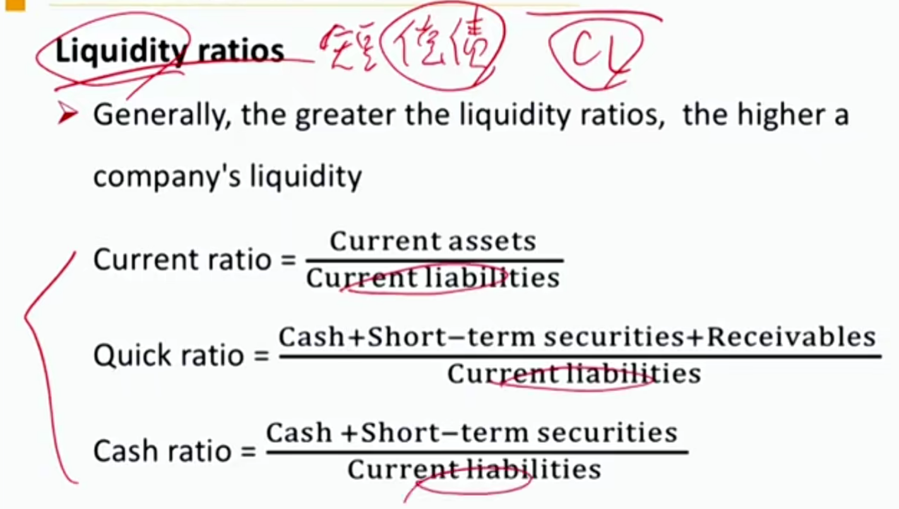
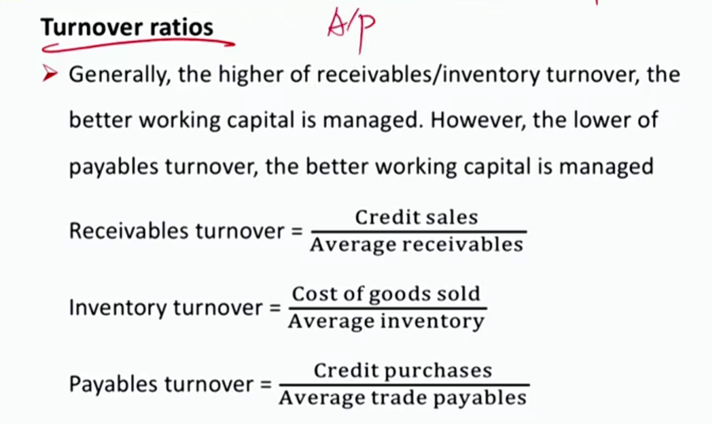
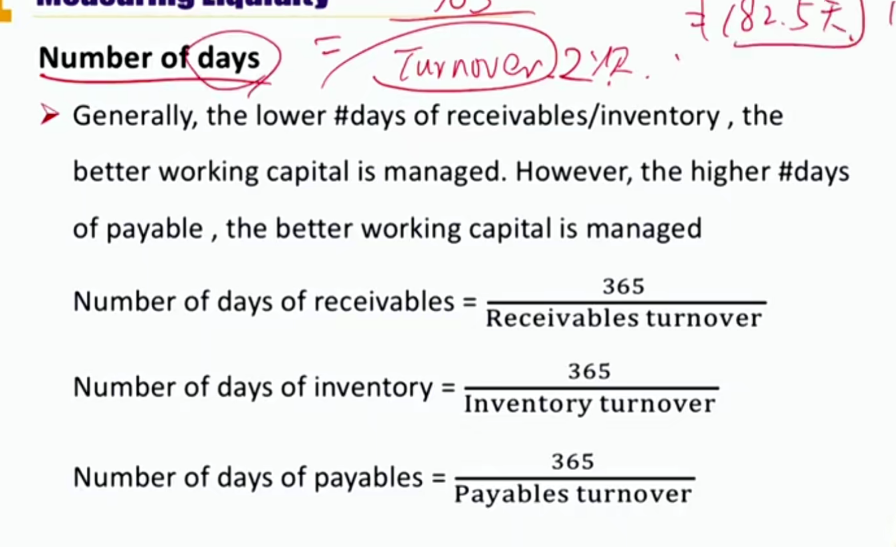
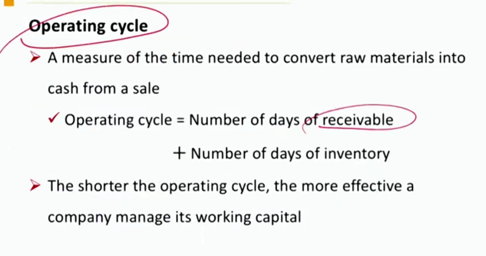
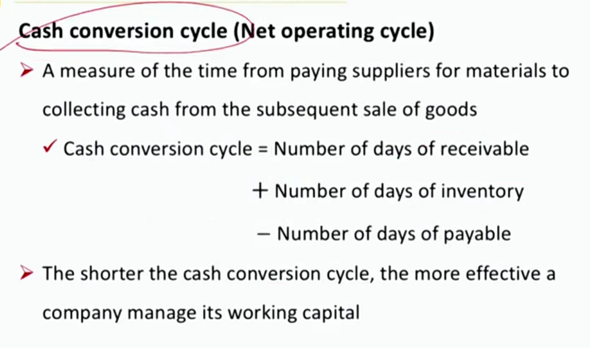
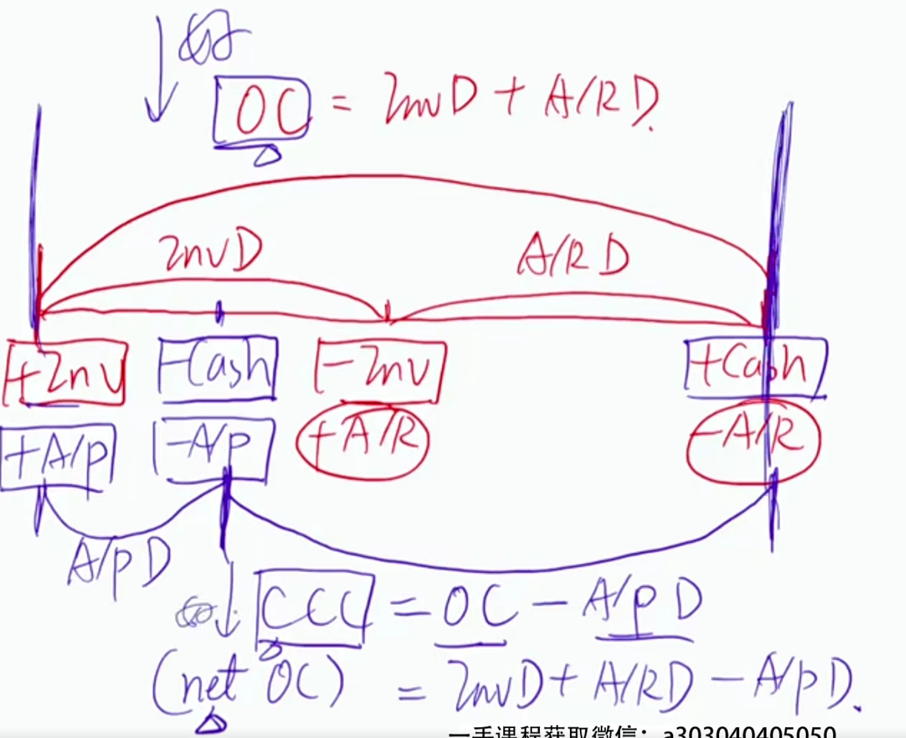
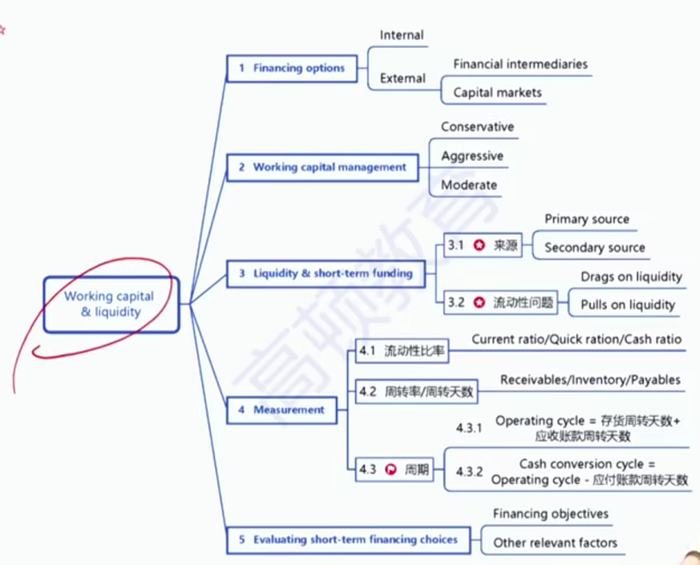

# V4-M5 Working Capital and Liquidity

WC = CA - CL

### 1) Financing Options

#### Internal Sources 内部营运资本

- After tax operating cash flows (**CFO**)
- Working capital efficiency 营运资本效率
  - account payable AP，越慢给钱越好
  - account receivable AR，越快收到越好
  - inventory，太多太少都不好
  - marketable securities，流动性有价证券
    - 上市股票，短期债券，货币基金（CA, <1 year)

#### External sources 外部融资

- Financial intermediaries 金融机构一对一借钱
  - Lines of credit信贷(uncommitted未承诺的银行授信, committed承诺的银行授信, revolving循环授信（还钱后额度自动更新）) （一般是大公司采用，没有抵押品）
  - Secured loans 抵押贷款(e.g., assignment of accounts receivable用应收账款抵押去借钱)（小公司适合）
  - Factoring 保理，卖掉应收账款，打折销售
  - Web-based lenders & non-bank lenders 网贷公司，小贷公司
- Capital markets 资本市场融资
  - Short-term commercial paper 商业票据，向公众发行的短期融资券（一般是大公司，没有抵押品）
  - long-term debt & equity

### 2) Working capital 管理方法

#### Working capital management style

- Conservative: holding larger amount of cash, receivables and inventories for more financial flexibility
  - 保守方法，现金、AR、Inv.比较多。这些资产的收益一般比较小。
- Aggressive: holding less amount of cash, receivables and inventories for **higher equity returns**
  - 激进的策略：流动资产很少。
- Moderate: between the two approaches above
  - Liability-matching approach 负债匹配法
    - CA分为两类：
    - variable current assets<- short-term financing
      - 可变的CA，数量会变动
    - permanent current assets<- long-term financing
      - 每年都会更新的，比如办公用品
    - 做法：用短期负债为可变CA融资，用长期负债为Permanent CA融资
    - 短期融资成本低

#### Liquidity management

- Liquidity: company's ability to meet its short-term obligations using cash or assets can be converted into cash **quickly**.
- Liquidity management: company's ability to generate cash when needed, **at the lowest possible cost**.

还短期债务时，要迅速产生现金，并且成本小（保值）

#### Sources of liquidity

- Primary source of liquidity 主要的流动性来源（健康的流动性来源）cash from day-to-day 
  - Free cash flow
  - Ready cash balances
  - short-term funds短期融资：trade credit赊购，bank lines of credit信贷， short-term investment portfolio短期投资组合
  - cash management
- Secondary source of liquidity 次要的流动性来源（不健康的流动性来源）using a secondary source may deteriorate the company's financial and operating positions
  - Negotiating debt contract 债务重组（宽限几天还钱）
  - Liquidating assets 变卖资产，变卖家产（一般实物资产，不包括金融资产）
  - Filing for bankruptcy protection and reorganization申请破产保护，破产重组

答案：C。债务重组，secondary source 

#### Drags and pulls on liquidity 流动性不足原因

- **Drags** on liquidity:**收钱慢** delay, reduce cash inflows, or increase borrowing cost
  - uncollected receivables应收账款没收到 
  - obsolete inventory; 存货滞销，积压
  - tight credit 市场上资金稀缺，借钱速度变慢
- **Pulls** on liquidity:**付钱快** accelerate cash outflows
  - Making payment early; 付钱太快
  - reduced trade credit limits or short-term lines of credit 银行收钱

### 3）Measuring Liquidity

#### Measurement of liquidity

- Liquidity ratio

  

current ratio->减去存货(近似，其实还有prepaid expense)->quick ratio-减去应收->cash ratio

- Turnover ratios

注意是credit sales, credit purchases.和财报不一样。因为公司金融，站在公司内部可以获得的credit sales的数据。A/R T和Inv T是资产类周转率，越大周转率越大，越好。A/P T是负债类周转率，越低越好。

Number of days 周转一次用多少天。

注意cash conversion cycle也叫Net Operating Cycle。注意Net！

Day sales outstanding，也是Number of days of receivable

### 4) Evaluating Short-term financing choices

#### Major objectives of short-term borrowing

目标：足够低的成本筹集到足够多的资金

钱足够多：

- Ensure sufficient capacity exists to handle peak cash needs
- Maintain sufficient sources of credit to be able to fund ongoing cash needs

成本足够低：

- Ensure that rates obtained are cost-effective and do not substantially exceed market averages 不能大大超过市场平均
- Ensure both implicit（隐形成本，比如可转债行权，稀释股东利益） and explicit（显性成本：利息） financing costs are considered
  - A/P 没有显性成本，但是有隐形成本（比如机会成本，提前还钱有折扣）

#### Factors influence short-term borrowing strategy 影响短期融资策略的因素

- Company size and creditworthiness 规模和信誉
  - 大公司：unsecured 
  - 小公司：secured loans 抵押贷款
- Asset nature for secured loans 
  - 抵押资产性质
- Legal and regulatory constraints
  - 对借贷金额的法律监管
- Flexibility of financing options
  - 融资选择的灵活性

