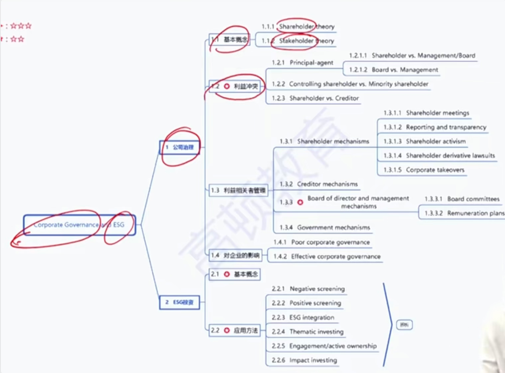

# Corporate Governance and Other ESG considerations

ESG: Environmental, Social, Governance

### 1) Stakeholder Groups

#### Definition of corporate governance

- Corporate governance is the system of checks, balances, and incentives 制约、平衡、激励that exists to minimize and manage conflicting interests among a company's **stakeholders**. 减少利益冲突

#### Stakeholder groups

- **Shareholders** 股东大会，决策权
- **Board of directors** 董事会 监督权
  - Some companies have staggered boards交错选举董事会（比如10个名额，第1年只可以改选3个，第2年3个，第3年4个。每年选举名额不一样）
    - 好处：应对hostile takeover 恶意收购，被收购后，第一年无法改选掉所有的董事
    - 好处：战略的稳定性/持续性更好
    - 坏处：任期未满的董事的不尽责
- **Managers and employees** 管理层（CFO, CEO, COO)->执行权
- Creditors
- Suppliers
- Customers
- Government

####  Corporate governance theories 公司治理理论

- **shareholder theory**保障股东利益: the most important responsibility of a company's managers to maximize shareholder value. 
- **Stakeholder theory**保障利益相关者的利益: consider the interests of not only its shareholders, but also its customers, suppliers, employees, and others who have an interest in the company. 共同点，都保障股东利益

### 2）relationships between stakeholders

#### Principal-agent relationship

- Shareholders vs. management/Board of directors
  - conflicts of interest
    - entrenchment 极度保守（高管为了保护高薪，选择保守投资）
    - excessive risk taking 极度激进
      - (if giving management too many stock grants and options) 高管很多期权
    - empire building 帝国建筑，盲目扩张公司规模
  - Agency costs 代理人成本

#### Other relationships

- Controling vs. minority shareholder 控股股东和少数股东的利益冲突
  - Voting rights投票权不同，大股东侵害小股东利益
    - (e.g., takeover transactions收购交易) 
    - related-party transaction 关联方交易，大股东向自己的公司输送利益
- Manager vs. board 管理层和董事会
  - Information asymmetries 信息不对称
- Shareholders vs. Creditor(Debtholder) 股东和债权人
  - Different structure of risks and returns，风险喜好不一样

### 3）Stakeholder management

#### Stakeholder management

- Involes identifying, understanding, and prioritizing the interests of stakeholder groups, then managing the company's relationships with these groups
  - Need to reflect **legal**法律, **contractual**合同, **organizational**组织, and **governmental** 政府infrastructure that defines the rights, reponsibilities, and powers of each group.
  - 公司可以控制的是contractual, organizational 建设

#### Mechanisms of stakeholder management

- **Shareholder mechanisms** 股东机制
  - Sharehodler meetings
    - Annual general meeting(AGM年度股东大会)
      - simple majority(>50% 通过)
    - Extraodinary general meeting（EGM，临时股东大会）
      - amendment‘s to the company bylaw修正公司章程
      - M&A 兼并🥞
      - Sales of significant asset/business 变卖重大资产
      - super majority vote(>2/3 通过)
    - **Proxy voting**: authorize another to vote代理投票
    - Voting process
      - Straight voting 直线投票（1股投1票）
      - Cumulative voting累积投票（选举n个席位，则1股投n票）（更好保护中小股东）
    - Unequal voting rights: dual-share classes同股不同权
      - 比如部分股票1股1票，部分股票1股10票。保护创始人的投票权不被稀释
    - Corporate reporting and transparency 要求披露财报和信息透明
    - Shareholder activism（e.g., hedge funds）积极的股东主义
      - 只关注股东的利益，不关注公司利益
      - Karb Icahn 1985 收购TWA
    - Shareholder derivative lawsuits 股东派生诉讼
      - 2019年，tesla股东起诉CEO，保护股东利益
    - Corporate takeovers 企业收购
      - Tender offers 要约收购，公开收购
      - Proxy fight 代理权争夺战，说服原股东利用投票权换掉管理层，支持收购
      - hostile takeover & anti-takover measures 恶意收购，反收购策略
        - shareholder rights plan, poison pill（毒丸计划），增发股票，稀释股权
        - staggered board 限定每年的改选名额，马上收购完董事会改选需要时间
- **Board of director and manangement mechanisms** 董事会管理层机制
- employee mechanisms
- creditor mechanisms
- sustomer and supplier mechanisms
- government mechanisms

#### **Shareholder mechanisms** 股东机制

#### Board of director mechanisms -committees委员会

- **Audit committee**审计委员会：oversee the audit and control systems at the company and ensure their effectiveness. Supervising the internal audit function, recommending external auditors.
  - Composed of **independent directors** **only**。仅仅由独立董事担任（只在董事会，不在管理层）
  - 财报是管理层制定，不可以管理层自己来审，所以只能独立董事
- **Remuneration/compensation committee**薪酬委员会：develops and proposes remuneration policies for the directors and key executives, with shareholders' **say on pay**（股东对高管的薪酬有话语权，say:有话语权，pay: 薪酬）.
  - **Majority** of members should be **independent**。绝大多数是独董。

注：executive执行董事（既是董事会，管理层）

- Governance committee治理委员会：ensure that the company adopts good corporate governance practices.
- Nomination commitee提名委员会: nominate candidates as directors and senior executives, for election by shareholders.
- Risk committee风险委员会: assists the board in determinging the **risk policy, profile, and appetite** of the company.
- Investment committee投资委员会: reviews material investment opportunitites and considers their viability

#### Creditor mechanism

- bond indenture债权合同（covenants约束(affirmative, negative), collateral抵押)
- Corporate reporting and transparency
- creditor commitees 债权人委员会

#### Governament mechanisms

- Laws & regulations 
  - Common law (**better protection** for equity & debtholders) 普通法系（更能保护股东和债权人）（法官有指定法律的权力）
  - Civil law大陆法系（法官不能制定法律）
- Corporate governance codes as guiding principles 公司治理准则

Practice

Based on best practices in corporate governance procedures, it is most appropriate for a company's compensation committee to:

答案：A

A. Exclude a recently retired executive

B. Link compensation with short-term objectives.

C. include the firm's external auditor.

committee是insiders，所以C不能包括外部的auditor

### 4) Corportate governance risks & benefits

| RIsks of poor governance                                     | Effective governance benefits              |
| ------------------------------------------------------------ | ------------------------------------------ |
| Weak control systems                                         | Improved control systems                   |
| Legal, regulatory, and reputational risks                    | Better operating and financial performance |
| Default and bankruptcy risks                                 | Lower default risk and cost of debt        |
| Poor decision making, improperly avoiding investments that create shareholder value | Enhanced valuation & stock performance     |

Which of the following is not a benefit of an effective corporate governance structure?

答案：C

A. Operating performance can be improved

B. A corporation's cost of debt can be reduced 更好的治理，债务管理的好，融资成本更低

C. Corporate decisions and activities require less control（应该是更充分的控制）

### 5) Other ESG consideration

#### ESGIntergration/ESG investing

- The practice of consiedering **e**nvironmental, **s**ocial, **g**overnance（公司治理，不是指的政府） factors in the investment process,
- Also referred to as：
  - Sustainable investing(SI)
  - Responsible Investing (RI)
  - Social Responsible Investing(SRI)

#### ESG implementation methods

- 负面清单Negative screening: exclude certain sectors companies that violate accepted standards in ESG concerns
- 正面清单Positive screening/best-in-class（每个层级挑最好的） approaches: focus on inestments with favorable ESG aspects, aims to identify companies that embrace solid ESG-related principles in their operations and strategies.

- ESG integration into individual stock valuation is the explicit inclusion of ESG factors into traditional financial analysisi of individual stocks(e.g. as inputs into cash flow forecasts and/or cost-of-capital estimates) 个股估值的时候把ESG因素融入。
- **Thematic investing:** is investment in themes or assets sepecifically related to ESG factors, such as clean energy, green technology, or sustainable agriculture.主题投资，挑选环保主题等
- **Enagement/active ownership:**
  - Uses shareholder power to influence corporate behavior 利用股权购票权对公司产生影响
- **Impact investing** 影响力投资
  - Seeks to achieve targeted social or environmental objectives along with measurable financial returns 主动对社会产生积极影响

Practice

Golden **avoided** investing in a lucrative business of copper mining because the mineral company had been reported to employ child labor. Which of the following strategy did Golden adopt?

A. Best-in-class

B. Thematic Investing

**C. Negative screening**

