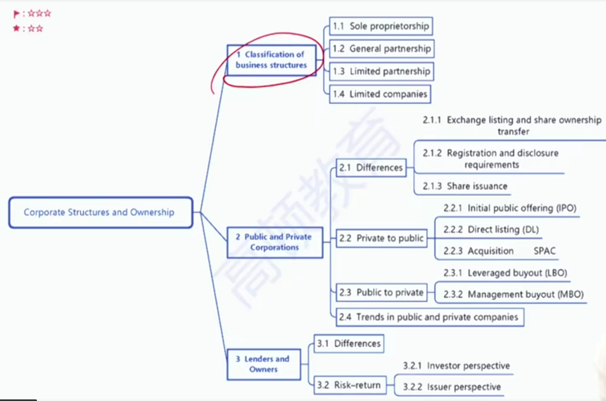

# V4-M7 Corporate Structures and Ownership

### 1) Corporate Structures

|                                      | Sole Proprietors 独资企业       | General Partnership 普通合伙企业（GP） | Limited Partnership有限合伙企业                              | Corporations(Limited Corp)公司制                    |
| ------------------------------------ | ------------------------------- | -------------------------------------- | ------------------------------------------------------------ | --------------------------------------------------- |
| Independent legal entity             | No                              | No                                     | No                                                           | **Yes**法人资格                                     |
| Owners and operators of the business | Owned and operated by the owner | Owned and operated by all partners     | Owned by **general and limited partners**（GP LP）, operated by **general partner** | Owned by **shareholders**, operated by **managers** |
| Owner's liability                    | Unlimited 无限责任              | Unlimited无线责任                      | **Unlimited** for GP; **Limited** for LP                     | **Limited** for Shareholders                        |
| Taxation                             | Personal tax                    | Personal tax                           | Personal Tax只交个税                                         | Corporation tax; personal tax                       |

- limited partners 只承担有限责任。历史：12世纪欧洲，一些公司为了吸引更多资金进行资本粘合，允许有限合伙人加入
- general partner 承担无限责任，并且经营公司
- hedge fund对冲基金：合伙制。因为只需要交个人所得税。
- 19世纪，随着工业革命，公司对资金要求更高，股份公司制度产生。

#### Classification of corporation 公司制

以目的分类：是否以盈利为**目的**

- Nonprofits: **might generate profits**, but profits cannot be paid out as dividends
  - 没有股东，不是以盈利为目的。但是最终也是有可能产生利润。
  - 比如Yale endowment
  - 非营利性公司产生的盈利免税
- For-profits: profit seeking business entity 以盈利为目的的公司
  - Private 非上市公司
  - Public 上市公司: exchange listed company, **or** the number of tis shareholder is greater than certain amount 如何判断是上市公司：交易所上市，或者股东数量满足特定标准

#### Difference between private and public company

- Exchange listing and share ownership transfer
  - Private: not trade on exchange, **difficult** to transfer shares 
  - Public: trade on exchange, **easy** to transfer shares
- Registration and disclosure requirements
  - Private: meets registration requirements 收到较弱的监管
  - Public: meets registration, mandated disclosure and exchange listing requirements 监管严格，要求披露数据，交易所上市要求等
- Share issuance  发行新股
  - Private: issue shares through **private placement**私下配售 with a legal document "**private placement Memorandum**(PPM)"私下投资备忘录 to **accredited investors**合格投资者
    - 需要披露PPM（揭露投资风险等），向合格投资者私下配售
  - Public: issue shares in the capital market with much larger size capital raised

#### Public and private company conversion

- Private to Public
  - Initial Public Offering(IPO) 首次公开发行股份
  - Direct Listing(DL) 直接上市，原股票在交易所交易：
    - No investment bank involved 没有投行参与
    - No new capital is raised 没有新股发行，没有融资
    - 速度快，成本低
  - Acquisition 并购上市
    - Acquired by a public company被上市公司收购
    - Special purpose acquisition company(SPAC) 特殊目的收购公司
      - SPAC实际上是空壳公司，为了收购而诞生
      - 传统意义上的借壳上市不一样，比如苏宁借ST吉纸，这个壳本身有业务
- Public to Private私有化
  - Leveraged Buyout(**LBO**) 杠杆收购
    - 借钱收购，在价格低，利率低的时候找时机收购
    - 没有管理层参与
  - Management Buyout(**MBO**) 管理层收购
    - 有管理层参与，也是借钱收购
- Trends in public and private companies
  - Emerging markets: number of public companies increases 
  - Developed markets: number of public companies declines
    - 发达国家上市公司减少，原因：
    - Mergers and acquisitions 
    - LBOs and MBOs被投资者私有化
    - Private companies remain private
      - Easy to access capital in private markets
      - Avoid the regulatory burdens
      - Avoid public investors' short-term focus
      - greater decision-making flexibility

### 2）Lenders and Owners债权人和股东

#### Differences between lenders and owners

- Lenders(debtholders) have
  - Priority claims over principal and interest求偿顺序在股东前，优先求偿权
    - principal and interest 是contractual obligation，dividend不是
  - No voting power
  - Legal standing to force bankruptcy and liquidation 债权人有权强制公司破产清算
    - 公司为了避免破产可以：
      - renegotiate debt contract
      - bankruptcy protection
- Owners(shareholders) have
  - Residual claims over net asset and dividend 剩余求偿权
  - Voting power

#### Risk-return profiles 风险回报

- Investor perspective 投资人视角

|                       | Debt                         | Equity                       |
| --------------------- | ---------------------------- | ---------------------------- |
| Return Potential      | Capped 固定收益              | Unlimited 股东潜在收益更大   |
| Maximum Loss 最大亏损 | Initial Investment初始投资额 | Initial Investment初始投资额 |
| Investment Risk       | Lower                        | Higher                       |

- Issuer perspective 发行人视角（公司）

|                       | Debt                                 | Equity                                   |
| --------------------- | ------------------------------------ | ---------------------------------------- |
| Capital Cost 融资成本 | Lower（$r_d$)                        | Higher($r_e$)                            |
| Attractive when       | If future performance is predictable | If future performance is not predictable |
| Investment Risk       | **Higher**                           | **Lower**                                |

- 只有公司现金流、经营情况足够稳定，才可以债权融资，才可以以较低成本借的到钱。

- 注意，债权融资对于公司的风险更高，因为还钱是义务。

- 发行人的角度：investment risk意思是指用筹集的资金进行投资需要承担的风险。

