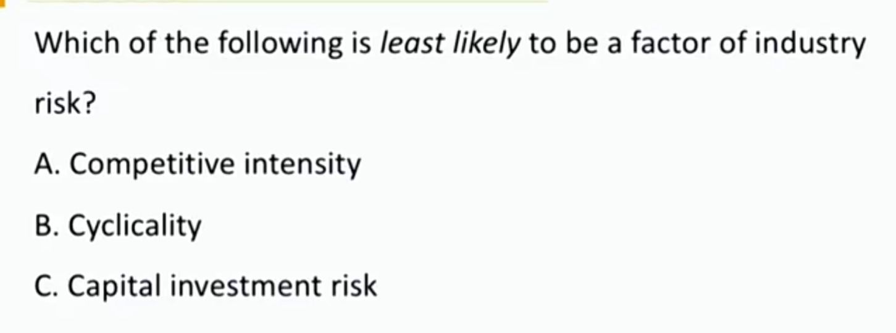
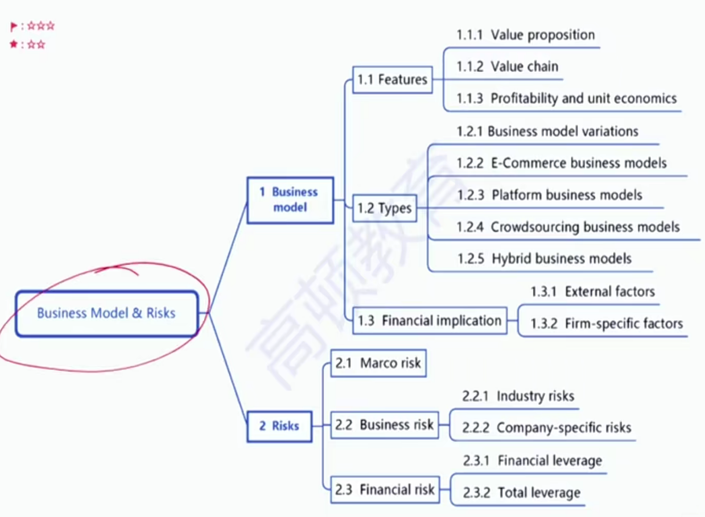

# V4-M8 Business Models & Risks

### 1) Business Model Features 

商业模式：公司向客户交付价值的过程

#### Value proposition 价值主张（商业定位）

- Customers(who) 目标客户

  - 区域、客户类型（企业、个人、年龄）

- Firm offering(what) 提供什么服务、商品

- Channels(where) 销售渠道（包括selling营销，delivering交付）

  - Traditional channel strategy 制造商->批发商->零售商->客户
  - Direct sales strategy 直销: **disintermediate**, **cost-effective**
    - 制造商->客户
    - 更经济实惠
  - Agency中介: **drop shipping**制造商->中介->客户
    - 中介不会参与商品购买，只赚取commission
  - Omnichannel全渠道 strategy 
    - 线上+线下全渠道

- Pricing(how much) 定价

  - Premium, parity, discount 溢价、平价、折价
  - Price setter, price taker
    - A company with **little differentiation** in products and **high price sensitivity** is a price taker and it's not appropriate to take premium pricing. 缺少产品区分度、受价格影响大的公司不适合溢价销售
  - 五个模型：
  - Pricing and revenue models
    - Value-based pricing 基于价值定价（茅台奢侈品，情感价值等）
    - cost-based pricing成本定价
  - Price discrimination 价格歧视
    - Auction/reverse auction models
      - 一级价格歧视，拍卖，反向拍卖（卖东西）一对一定价，**竞价**
    - Tiered pricing分级定价
      - 二级价格歧视，按照**数量**决定价格，买的多打折
    - Dynamic pricing 动态定价
      - 三级价格歧视，按照**时间不同**定制不同的价格（旅游旺季酒店贵）

  - Pricing for multiple products 多种产品定价
    - Bundling 捆绑销售
    - Razors-and-blades pricing 互补商品定价
      - 剃须刀便宜，刀片就很贵
      - 打印机，打印墨水
      - 净水器，滤芯
    - Optional product pricing 可选产品定价
      - 主要商品+可选商品
      - 比如餐厅的饭菜+酒水
      - 电影票+爆米花饮料（贵）
  - Pricing for rapid growth 为高速增长采用的定价
    - Penetration pricing 渗透定价
      - 用亏损换增长，价格低抢占市场
      - 美团，饿了么；滴滴，快滴
    - Freemium pricing免费增值定价
      - 免费提供基础版本，然后进一步收费提供付费版本
    - Hidden revenue business models 隐形收入模式
      - 主要产品免费，有一些隐形收费
      - 比如微信免费，广告收费
  - Alternatives to ownership 替代所有权定价
    - Recurring revenue/subscription pricing 重复收入/订阅 定价
      - 比如视频网站，定价；手机话费，流量
      - 边际成本较低。
    - Fractionalization 分馏定价
      - 按照时间/物理的更小的单位进行销售
      - 比如酒店按照不同时间卖给不同的人
      - 房东把房间切割开
    - Leasing 租赁
    - Licensing 无形资产提供客户版权费用等
      - 比如授权华为摄像头技术
    - Franchising 特许经营，更进一步的授权，授权区域营销等。
      - 比如授权某个区域销售华为手机

#### 	Value chain （how) 价值链

- The systems and processes which create value for customers are performed by a **single** company.
  - Value chain vs supply chain
  - 供应链是原材料到产品到客户路径上的所有公司，是一个外部的概念
  - 价值链是公司**内部**，给客户提供价值的链条

#### Profitability and unit economics

- Operating profit/margin
  - OP / Revenue
- Unit economics 
  - Revenues and costs in **per-unit basis** 一单位的商品会产生多少收入和成本
- Break-even point
  - 总$Q_{BE} = (F+I)/(P - V)$
  - 经营性$Q_{OBE} = F / (P -V)$

### 2) Business Model types

#### Types of business model

- Business model variations 商业模式的变形

  - Private label or "contract" manufacturers 贴标或合同生产商
    - 富士康，替苹果生产，并贴标苹果
  - Licensing arrangements
    - 无形资产授权，不具备排他性
  - Franchise models
    - 特许经营权，具有排他性
  - Value added resellers 增值经销商
    - 不仅销售商品，也提供其他服务
    - 比如4s店
  - E-Commerce business models电子商务模式
    - Affiliate marketing 联署营销: **performance marketing**
      - 微信，通过用户点击广告数，曝光度，向商家收取费用
    - Marketplace businesses 平台销售: without ownership of products
      - 淘宝
    - Aggregators聚合器: **re-markets** products and services
      - 京东自营

  - **Platform** business models 平台模式
    - **Network effects** 网络效应（正反馈）：increasing value of a network to its users as more users join. 越来越多人加入，网络的价值越大
      - **One-sided** network effects 单边网络效应
        - 用户都是同质的，在这个网络内都是使用同一功能。比如google，微信
      - **Two-sided** or multi-sided network effects 双边网络效应
        - 多种用户互相吸引，比如淘宝：商家+消费者；网约车：司机+打车客户
  - Crowdsourcing business models 众包商业模式
    - 让用户向公司产品做出贡献
    - 抖音、微博、大众点评、B站等，用户创造内容
  - Hybrid business models 混合商业模式
    - 将传统的线性（分销）的商业模式和互联网的平台结合起来
    - 比如amazon和tesla

### 3）Financial implication 

外部和内部特征如何影响融资

#### External factors

- Economic conditions 宏观经济情况
- Demographic trends 人口趋势
- sector demand characteristics vary by industry 行业需求特征
  - 刚需型：食品
  - 可选型
- Industry cost characteristic 成本特征
  - 资本密集型：酒店、房地产
  - 轻资产
- Political, legal, and regulatory environment
  - 政府限制、支持、壁垒（牌照）等
- Social and political trends 社会和政治趋势

#### Firm-specific factors

- Stage of development of the business 
- Competitive position 竞争地位
  - 品牌大、护城河深->风险低->更容易融资
- Business model 商业模式
  - Asset-light business models 轻资产
  - Lean startups 精益创业
    - 外包一切，只有公司的业务idea
  - Pay-in-advance 预收款模式
    - 对下游客户，卖商品，用预售方式 ，先收钱后发货
    - 对上游供应商，买商品，用赊购方式，先收货再给钱

### 4）Risks

#### Marco risk

- Impact all businesses
- Industries that are more sensitive to economic activities have a higher level of macro risk
- 非周期型行业受宏观影响小，周期性行业受到宏观影响大

#### Business risk业务风险

- Industry risk行业风险
  - Cyclicality 周期性越显著，风险越大
  - Industry structure 行业结构
    - 行业集中程度越高，竞争程度越低
    - 行业集中度越低，竞争程度越高
  - Competitive intensity 竞争程度
  - Competitive dynamics within the value chain竞争动态
    - 波特五力，外部竞争力等
  - Long-term growth and demand outlook 行业的长期增长
- Company-specific risks
  - Competitive risk 竞争风险，怎么才有竞争力
    - Cost advantages 成本优势，（规模效应）
    - Product or service differentiation 产品差异化
    - Network effects 网络效应
    - Switching barriers 转换杠杆，客户转化使用产品的成本（违约金等）
  - Product market risk 产品市场风险
    - 对初创企业影响大，不知道市场对产品的反应
  - Execution risk: management
    - 初创企业要关心管理层的执行风险
  - Capital investment risk: sub-optimal investment
    - 次优投资，投向业务外的领域
  - ESG risk: government risk
  - Operating leverage 经营杠杆
    - OFC上升->DOL上升-> O Risk上升

#### Financial risk 财务风险

- Financial leverage
  - Interest上升->DFL上升->Financial Risk上升
- Total leverage
  - DTL=DOL \* DFL
  - 

答案C

