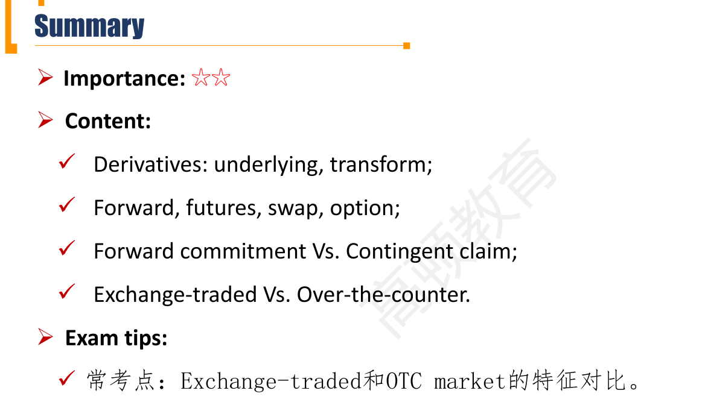

# M1 Derivative Instrument and Derivative Market Features

#### Derivative Instrument

##### Definition of derivative

- A derivative is a financial instrument that derives its performance from the performance of an **underlying** asset.
  - Financial asset: equity, fixed-income security, currency;
  - Physical asset: soft commodity（棉花等农产品类）, hard commodity(能源类、金属类）
  - Other: interest rate, credit信用市场, weather天气, longevity长寿风险, other derivatives（embedded derivative，内嵌衍生品，标的是衍生品的衍生品）, etc.
- Derivative usually transform(not simply pass through) the performance of the underlying asset before paying it out in the derivatives transaction.
  - 衍生品会transform标的资产的表现
  - 另一个角度，基金(fund)不是transform所投资股票的表现，而是pass through，所以基金不是derivative.

- A derivative contract is a legal agreement between **counter-parties** with a specific maturity.
  - 合法的赌约
  - The long: buyer, holder
  - The short: seller, writer
  - 对于long和short的理解，不应该局限在价格上。对于信用质量、利率等其他指标，也可以long和short。比如买入债券，就是long bond, short interest, long credit.

##### Forward commitment 远期协议/双务合约

- Contracts entered into at one point in time that require both parties to engage in a transaction at a later point in time(the expiration) on terms agreed upon at the start.
  - Forward, futures, and swap
  - 双方面义务

##### Contingent claim 或有索求权

- Derivatives in which the outcome or payoff is dependent on the outcome or payoff of an underlying asset. 交易是否发生取决于标的资产。
  - Option
  - 单方权利，单方义务

#### Derivative Market Features

##### Exchange-traded derivative(ETD) markets 场内

- Standardized 标准化合约
- Regulated 监管严格
- Transparent 信息透明
- No default risk-guaranteed by clearinghouse 清算所
  - 清算所是中央对手方CCP，承担中间交易的角色，通过保证金制度等消除违约风险。
- 包括： Futures、some options

##### Over-the-counter(OTC) markets 场外

- Customized 定制化交易
- Less regulated 更少监管（但还是有监管）
- Less transparent
- Default risk/counterparty risk 场外存在违约风险
- 包括：Forward, swap, some options

##### Derivative market 的好处

- Derivative markets expand the set of opportunities available to market participants
  - Benefit from a decline in the value of the underlying. 做空的工具
  - Portfolio diversification. 分散化投资
  - Offset the financial market exposure. (Hedge) 对冲风险
  - Create large exposures with a relatively small cash outlay. 杠杆
  - Derivatives typically have lower transaction costs and are often more liquid.

