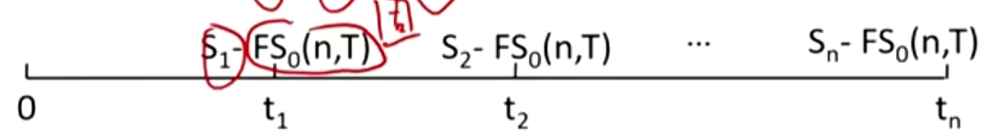

# M10 Pricing and Valuation of Swaps

- **Describe** how swap contracts are similar to but different from a series of forward contracts
- **Contrast** the value and price of swaps.

#### Pricing and Valuation of Swap

- As with forward contract, the price of a swap is the fixed price specified in the swap contract(the contract price) and the value depends on how expected future price change over time
  - At initiation, a swap has zero value; 
    - 意思是，要在fixed price端定一个合理的价格，使得期初价值为0。
  - An increase in expected future price will produce a positive value for the fixed-price payer, and a decrease in expected future price will produce a negative value. 
- A swap is a series of forwards, each created at swap price.
  - A swap: make n payments of $FS_0(n,T)$ at time $t_1$, $t_2$, ..., $t_n$ and receive $S_1$, $S_2$, ..., $S_n$.
- 
  - The value of a swap equals the present value(PV) of all remaining future swap settlements. （每期轧差netting后的现值）
    - 注意，V0=0。期初价值0. 通过上面折现式子，求出FS0(n, T)

#### Swap vs. forward

- At initiation, the value of each one of the series forwards is not zero.
  - Off-market forward: forward contract created with a contract price that gives it a non-zero value at initiation.
  - A swap consist of some off-market forwards with positive present value and some off-market forwards with negative present values, so that the sum of their present values equals zero.

#### Interest rate swap

- In a simple (plain vanilla) interest rate swap, one party pays a floating rate and the other pays a fixed rate on a notional principal amount.
  - An increase in expected future rate will increase the value for the fixed-rate payer, and vise versa.
- At each payment date, a net payment is made from one party to the other. 净额结算。
  - $Net\ Payment_t=(MRR_{t-1}-Swap\ Rate) \times NP \times Period$
    - For fixed rate payer
    - 注意t时刻用的是t-1时刻的MRR。
- An interest rate swap is equivalent to a series of (off-market) FRA, each with a forward rate equal to the swap fixed rate
- The fixed-rate payer is equivalent to being long a floating-rate bond and short a fixed-rate bond. 现金流相当于一个FRN加上固定利率债券。（因为最后一期，假设存在债券本金，那就轧差掉相当于不存在）
  - For fixed-rate payer(floating-rate receiver):
    - $V_t=PV_{Floating-rate\ bond}-PV_{Fixed-rate\ bond}$
  - For fixed-rate receiver(floating-rate payer):
    - $V_t=PV_{Fixed-rate\ bond}-PV_{Floating-rate\ bond}$
  - 这里把swap拆成了Floating Rate Notes和Fixed rate Bond.
  - 由于$V_0=0 \implies PV_{FRN}=PV_{Fixed\ Rate\ Bond}$. 从FRN的性质可以得知，每一期的票息coupon rate是和浮动利率相等。另一方面每一期的spot rate又都是浮动利率，所以FRN肯定是平价发行，所以$PV_{FRN}=Par\ Value$.
  - 所以，我们要找fixed swap rate，也就是要找在spot rate curve下，使得固定利率债券的现值等于面值的coupon rate，而这个coupon rate 恰恰就是固收中求的par rate（使得债券平价发行的coupon rate）.（神奇)
  - 根据这个拆分成两个债券的思路，进一步考虑利率关系：
    - 如果利率r上升，FRN价值不变，Fixed Rate bond价格下降，所以:
      - 对于fixed rate payer来说，Vt >0，Swap价值上升。
      - 对于fixed rate receiver来说, Vt < 0，Swap 价值下降。

- Due to better liquidity, active fixed-income portfolio managers often use swaps rather than underlying securities to adjust their interest rate exposure.
  - 根据上面的结论:
    - 当利率下降的时候:
      - long bond和fixed rate receiver都赚钱
    - 当利率上升的时候
      - short bond和fixed rate payer 都赚钱
    - 所以，利率上升和下降，都分别可以用swap的不同方向，达到和买或者卖bond相同的效果。一般，swap的流动性更高，所以一般固收基金经理都会更喜欢采用swap来管理利率头寸。
      - 比如，预期利率上升，不通过卖债券赚钱，而是通过成为fixed rate payer赚钱。

### Summary

importance:\*\*

### 拓展内容

#### Interest Rate Swap

- An interest rate swap is equivalent to a series of(off-market) FRA, each with a forward rate equal to the swap fixed rate.
- Different FRA fixed rates usually exist for different times to maturity.
- Recall: $(1+Z_B)^B=(1+Z_A)^A(1+IFR_{A,B-A})^{B-A}$
- In contrast, a standard interest rate swap has a constant fixed rate over its life.

- The swap rate should equates the present value of all future expected floating cash flows to the present value of fixed cash flows.
  - 把所有implied forward rate折现，求得与之相等的fixed rate。
  - $\sum\frac{IFR}{(1+Z_i)^i}=\sum\frac{S_i}{(1+Z_i)^i}$
- 另一种方法：

- The fixed-rate payer is equivalent to being long a floating-rate bond and short a fixed-rate bond.
  - $PV_{FLoating-rate\ bond}=PV_{Fixed-rate\ bond}=Par$
  - $\sum \frac{S_i}{(1+Z_i)^i}+\frac{1}{(1+Z_i)^i}=1$
