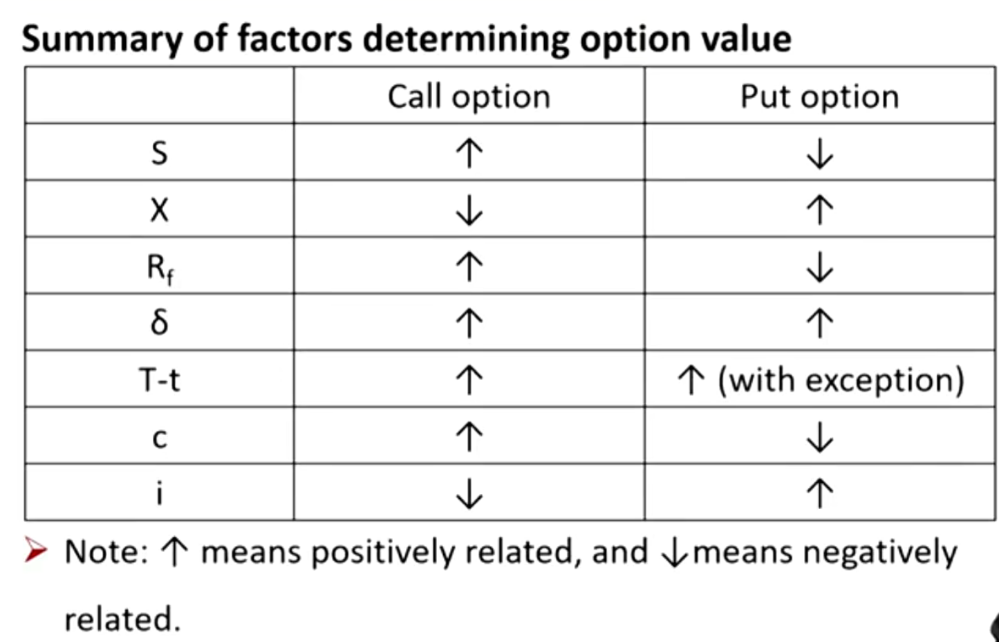

# M10 Pricing and Valuation of Option 

Option更重要

**Explain** the exercise value, moneyness, and time value of an option;

**Contrast** the use of arbitrage and replication concepts in pricing forward commitments and contingent claims;

**Identify** the factors that determine the value of an option and **describe** how each factor affects the value of an option. \*\*\*\*这点必考

#### Moneyness

- Moneyness refers to whether an option is in the money or out of the money:
  - If immediate exercise would generate a positive payoff, the option is **in the money(ITM)**
  - If immediate exercise would result in a loss(negative payoff), the option is **out of the money(OTM)**
  - If immediate exercise will generate neither a gain nor loss, the option is **at the money(ATM)**

- X: exercise price, S: spot price
  - Call option
    - In the money: S>X
    - Out of the money: S < X
    - At the money: S=X
  - Put option
    - In the money: S < X
    - Out of the money: S>X;
    - At the money: S = X

#### Exercise value(intrinsic value) 行权价值

- The option contract's value if the option were exercisable at time t.
- The exercise value at time t incorporating the time value of money is the difference between the spot price(St) and the present value of the exercise price(PV(X)).
  - Call option: $\max(0, S_t-X(1+r)^{-(T-t)})$
  - Put option: $\max(0,X(1+r)^{-(T-t)}-S_t)$

- 注意上面的公式和别的教材定义不一样，考试按照CFA要求来。
- 上面的公式还有一层含义，代表期权价值的下限。也就是c > max(0,...)，注意不能等于。证明
  - 考虑构造投资组合：long call option，空asset（借asset卖出）
  - t=0时刻，long call支出+$c_0$，空asset获得$S_0$，剩余资金按照无风险收益率$r_f$投资
  - t=T时刻，无风险收益部分$(S_0-c_0)(1+r)^T$, 另外买回asset还asset，由于期权存在，买asset花的钱小于等于$X$ 
  - 所以，t=T时刻，账面上资金$\ge (S_0-c_0)(1+r)^T-X$
  - 所以，如果上面的式子>=0，则有可能存在套利机会，所以必须：
    - $(S_0-c_0)(1+r)^T-X<0 \iff c_0 > S_0-X(1+r)^{-T}$
    - 又由于期权费用大于0，得证。
  - 上面表明，如果最后的收益>=0，也还是存在盈利的可能，还是会有人入场套利。只有当可能存在亏损的情况，套利操作才会减少。价格逐渐稳定。

- 套利时，一般构建多头，然后进行对冲构造一组对应的空头。

#### Time value 时间价值(Speculative value投机价值) 

- The amount by which the current option premium(price) exceeds the intrinsic value.
  - **Option premium = Intrinsic value + Time value**
  - 注意，这只是定义式子，一般要求Time value，是通过option premium减去intrinsic value得到。这里只要求定性掌握。
- A longer time until expiration usually means a higher potential dispersion of the future underlying price. 时间越长，未来的价格可能波动性越大，时间价值越大。
- Is always positive but declines to zero at maturity, a process referred to as **time value decay**.

#### Arbitrage

- Conditional nature of option payoff profiles leads us to establish upper and lower no-arbitrage price **bounds** at any time t. 选出上限下限
- For call option:
  - $\max(0, S_t-X(1+r)^{-(T-t)}) < C_t\le S_t$
- For put option:
  - $\max(0, X(1+r)^{-(T-t)}-S_t)<P_t\le X$

- 这里的资产不考虑持有期间的成本和收益。

#### Replication

- Recall: **Asset - Risk-free asset = Derivative**
  - Long forward = long underlying + short risk free asset
  - Short forward = long risk free asset  + short underlying
- For option, exercise are uncertain
- Option replicating transaction should be adjusted for probability of exercise.
  - 对于long forward的拆解，long underlying相当于收浮动收益，short risk-free asset相当于未来收固定收益。
  - 对于long call 来说，未来行权与否存在概率，所以，call的replication需要考虑行权的概率。同样也是拆解为long underlying和short risk-free asset，那么就需要对这个概率进行调整（BS公式，CFA二级）

### Factors that determine option value \*\*\*

七个影响期权价值的因子。option value = intrinsic value + time value.

##### Price of the underlying asset($S_t$)

- For call option, a higher $S_t$ will increase its value.
- For put option, a higher $S_t$ will decrease its value.

##### The exercise price(X)

- For call option, a higher X will decrease its value.
- For put option, a higher X will increase its value.

##### The risk-free rate of interest($R_f$)

- For call option, a higher $R_f$ will increase its value.
  - 行权时给出的金额，现值更低，所以call价值更高
- For put option, a higher $R_f$ will decrease its value.
  - 未来行权时，花更多钱去买（PV更高），所以put 更不值钱

##### Volatility of the underlying price($\delta$)

- A higher $\delta$ will **increase** the value of both call and both options.
- 波动更大未来盈利空间更多。 
- 波动率不会影响futures和forward。
- long期权，本质上就是在long 波动率

#### Time to expiration(T-t)

- For call option and **most** put option（所有call和大部分put）, a longer(T-t) will increase the time value and then increase its value;
- For **some European put options**, a longer(T-t) are more likely to **decrease** its value when:
  - The deeper a put option is in the money
  - The higher the risk-free rate
  - The longer the current time to expiration.
  - 如何理解上面三个因素？
    - call option到期行权的话付出行权价，给出的钱越少越好；put option到期行权收到行权价，收到的钱越多越好。
    - 对于到期时间增加(T-t)，影响两个方面：
      - 1）标的资产的不确定性增加，期权价值增加
      - 2）到期的行权价（现金流）折现$X/(1+r_f)^{T-t}$减少
    - 对于call来说，时间越长，也就是到期现金流出的现值越少，所以call总是时间越长越值钱
    - 但是对于put来说，时间越长，到期现金流流入的折现越少，当折现值减少的影响超过了不确定的影响的时候，put的价值就会下跌。
    - 另外：对于深度实质的期权，由于行权价大幅超过标的资产价格，所以标的资产价格上涨，也会导致利润回吐，所以价值会下跌。也就是到期时间越长，标的资产的不确定性越高，就更加不确定会盈利，也就是价值下降。
      - 最后，为什么深度实质的call没有这种情况？？
        - option value = 内在价值 + 时间价值
        - 时间越长，call的内在价值越高，时间价值越高。
        - 但是时间越长，put的内在价值越低，时间价值越高。
        - 所以时间越长，对于深度call，也是越高的，没有存在内在和时间价值相互抵消的情况。但是对于深度put，时间越长，内在价值的下降超过了时间价值的提升（由于上面说到的利润回吐现象），所以这时候deep ITM put价值下降。。

#### Costs(c) and benefits(i) of holding the asset

- For call option, a higher cost(c) will increase its value and a higher benefit(i) will decrease its value;
- For put option, a higher cost(c) will decrease its value and a higher benefit(i) will increase its value.
  - Reason: cost will generally increase the price of the underlying asset, and benefit will generally decrease the price of the underlying asset.
- 对于价值来说，加成本，减收益。
  - 对于call，不用持有asset，那么asset成本在别人，越高对call越有利
  - 对于put，需要持有asset未来卖出，那么asset成本在自己，成本越高对put越不利

### Summary

importance \*\*\*

