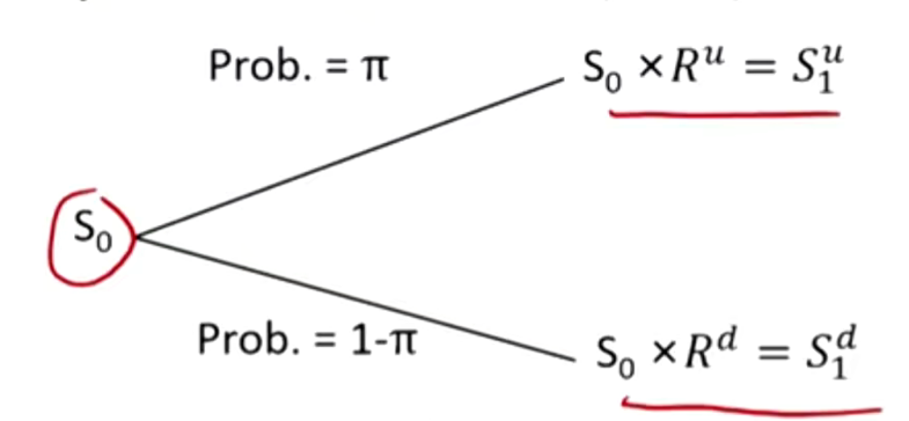
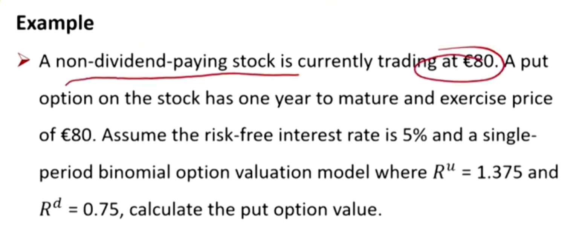
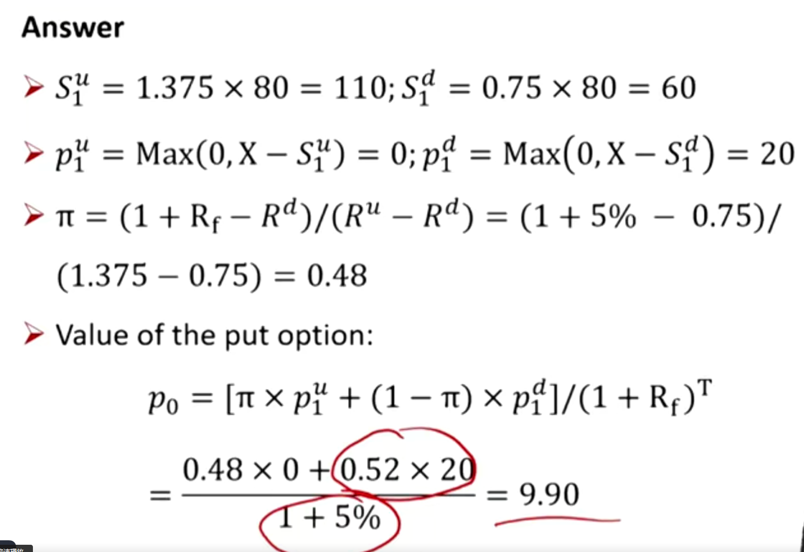
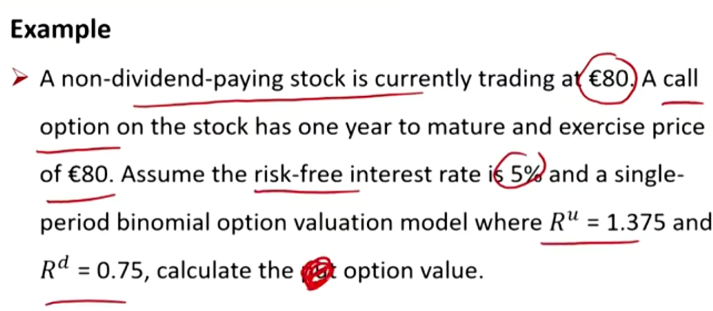
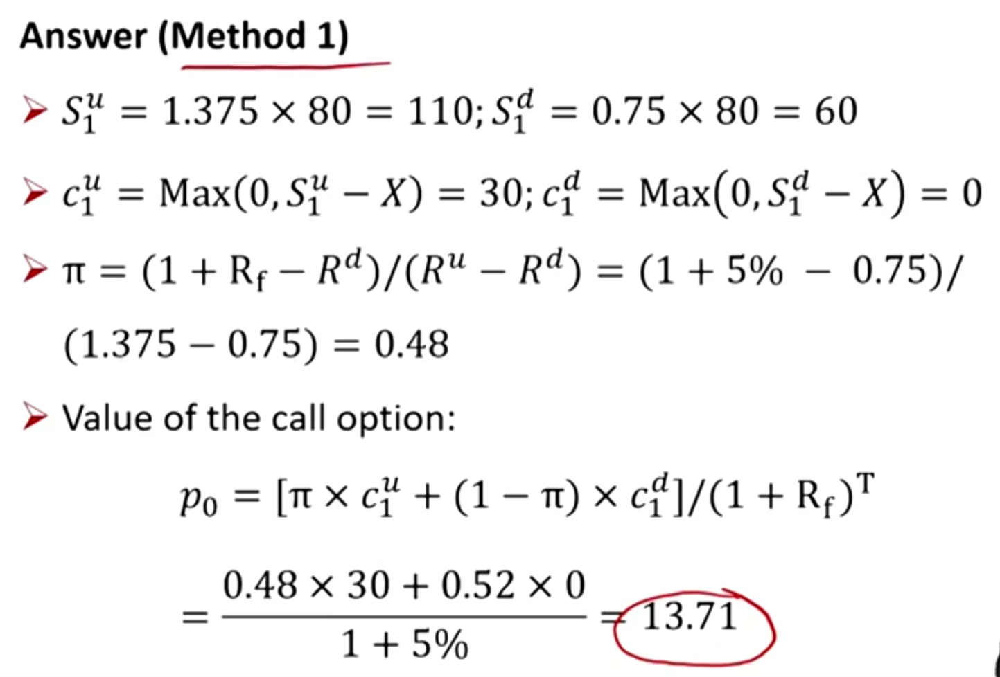
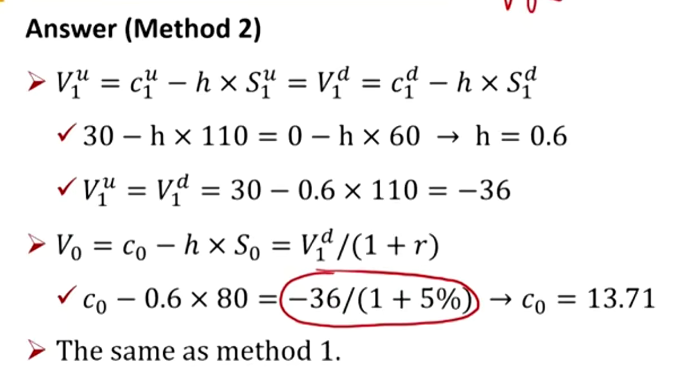

# M13 Valuing a derivative using binomial models

#### Binomial Model

##### One-period binomial model

- Binomial model is based on the idea that, over the next period, some value will change to one of two possible values. 未来只有两种可能性。
- To construct a binomial model, we need to know the beginning asset value(S0), the size of the two possible changes($R^u$, $R^d$)向上和向下的变化, and the probabilities of each of these changes occurring($\pi$, $1-\pi$)
  - $R^u=S_1^u/S_0 > 1$
  - $R^d=S_1^d/S_0 < 1$

- $\pi=(1+R_f-R^d)/(R^u-R^d)$, **risk-neutral probability** of an up-move.
- $1-\pi$, **risk-neutral probability** of an down-move.风险中性概率。

- Risk-neutral probability意思是未来的期望收益率等于无风险收益率，也就是通过下面的式子求出$\pi$。

$$
S_0R^u\pi +S_0R^d(1-\pi)=S_0(1+R_f)
$$

利用上面的二叉树模型，可以对期权定价：

- With one-period binomial model, the value of an option on stock can be calculated as:
  - Step 1: Calculated the payoff of the option at maturity in both the up-move and down-move states; 计算向上和向下时的两种payoff
  - Step 2: Calculate the expected value of the option in one period as the probability-weighted average of the payoffs in each state; 利用风险中性概率对payoff进行加权平均
  - Steps 3: Discount this expected value back to today at the risk-free rate. 折现到现值

##### Risk neutrality

- An option's value is not affected by actual(real-world) probabilities of underlying price increases or decreases.
  - The risk-neutral probabilities are determined solely by the up and down gross returns.
  - 期权的价值不会收到真实世界的概率影响，完全由风险中性概率决定。
- This no-arbitrage derivative value established separately from investor views on risk is referred to as risk-neutral pricing. 
  - 无套利定价原则，使得投资者对风险的偏好不影响到衍生品的定价
  - 这个概念不等于所有投资者都是无风险偏好，需要注意。

##### option hedge ratio

- The proportion of the underlying that will offset the risk associated with an option. 调整underlying和option头寸，使得标的资产的变动幅度和option的变化幅度相同。（delta希腊值）
- For call option
  - $h_c=(c_1^u-c_1^d)/(S_1^u-S_1^d)$ short$h_c$ underlying to hedge a call
- For put option
  - $h_p=(p_1^u-p_1^d)/(S_1^u-S_1^d)$ short$h_p$ underlying to hedge a put

### Summary

importance \*\*\*

one-period binomial model重要

risk neutrality

hedge ratio

### 拓展内容

##### one-period binomial model

- Hedge portfolio: long an option + short h underlying
  - $V_0=c_0-h\times S_0$
- The hedged portfolio should have the same value in up-move scenario and down-move scenario
  - $V_1^u=c_1^u-h\times S_1^u$
  - $V_1^d=c_1^d-h\times S_1^d$
- The expected return is risk-free rate
  - $V_1^d=V_1^u=V_0(1+r_f)$
  - 因为对冲后的portfolio无风险，收益率应该是无风险收益率

- 通过上面的四个灯等式，解出$c_0$

- 按照之前的构建标的资产二叉树的方法

- 按照构建Hedge portfilio的思路：

