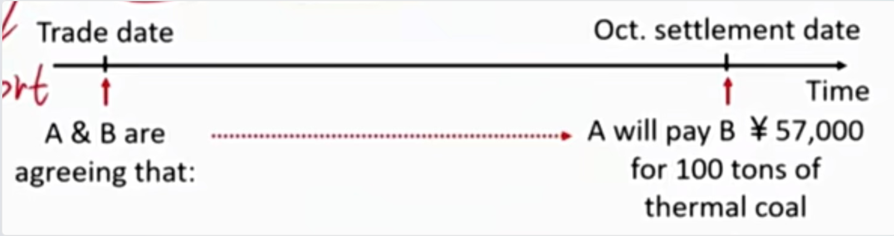

# M2 Forward

#### Forward

- An **over-the-counter** derivative contract in which two parties agree that one party, the buyer, will purchase an underlying asset from the other party, the seller, at a later date at a fixed price they agree on when the contract is signed.场外交易的合约。
- In addition to the (forward) price, the two parties also agree on several other matters, such as the identity and the quantity of the underlying.
- 注意签署的时候没有签署条件，签署的时候不需要费用。签署的合约价格是双方协商，双方满意。

##### Example

- Suppose that A contracts to buy 100 tons of thermal coal from B on 15th Oct at \$570 per ton.

- A, who has agreed to buy, has the long forward position and is referred to as the long
- B has the short forward position, and is called the short.

- 注意，这里的long 和 short是针对forward market而言。对于spot market来说，可能long short方向不一样。

|      | spot market | foward market |
| ---- | ----------- | ------------- |
| A    | short       | long          |
| B    | long        | short         |

- 在现货市场（煤炭市场），A是购买方，希望价格越低越好，所以是short。A在forward market构建long 头寸，使得forward market的long和spot market的short 可以对冲（也就是无论煤炭价格涨跌，收益得到保证），达到套期保值的作用（hedge）.同理，对于B也是如此。

- The long hopes the price of the underlying will rise above the forward price($F_0(T)$, 表示在t=0时刻签订，在t=T交割的远期协议的远期交割价格) whereas the short hopes the underlying will fall below the forward price.

- Hints:
  - 这种线性的衍生品收益曲线，称为linear derivatives, 包括futures, forward, swap. 另外，non-linear derivates就是options.
  - 另外，一般空头和多头的收益payoff-spot price曲线都是关于x轴对称。(zero-sum game)

- Forward Contracts can be settled in two ways:
  - Delivery of the underlying asset 实物交割
  - Exchange of cash: non-deliverable forward(NDFs), cash-settled forwards, or contracts for differences. 现金交割，现货价格和远期价格的差价进行现金交割。只需要short方给long方钱就可以。
  - 一般大宗商品是实物交割，金融产品是现金交割。
- Forward contracts can be substruced to create a perfect hedge（对冲的是市场风险）, providing an assurance that the underlying can be sold or bought at a price known when the contract is initiated.
- forward market的参与者：
  - Dealer: a dealer creates a derivative contract and will quote a price to take a long or short position 做市商
    - aka market marker or finaincial intermediary，赚取ask/bid价差
  - End user最终使用者: an end user is typically a corporation or instatiution seeking to transfer an existing risk.  

##### Equity Index forward

- An equity index contract payoff is the **notional amount**（名义本金） times the percentage difference between the forward index and the actual index value at settlement. 

  - 注意交割时需要指数乘以指数代表的实际金额（合约乘数）
  - notional price: 协议中确定的合约规模。

- Example：

  - 90-day S&P 100 forward contract 
  - Forward contract price = 500; in 90 days index is at 550
  - Notional amount = \$10 million 本金
  - What is the payment at settlement and which party receives it?

- Answer:

  - Long receives (550 - 500) / 500 \* \$10million = \$1 million at settlement, paid by the short.

  - 上面这种解法绕过了实际的合约乘数。还有另一种理解，假设multiplier是m
    - 则期初买入了10million / (500 \* m) 份contract
    - 交割的时候，一份合约赚了(550-500)m元，则一共赚了10million/(500\*m)\*(550-500)\*m，结果是一样的。
