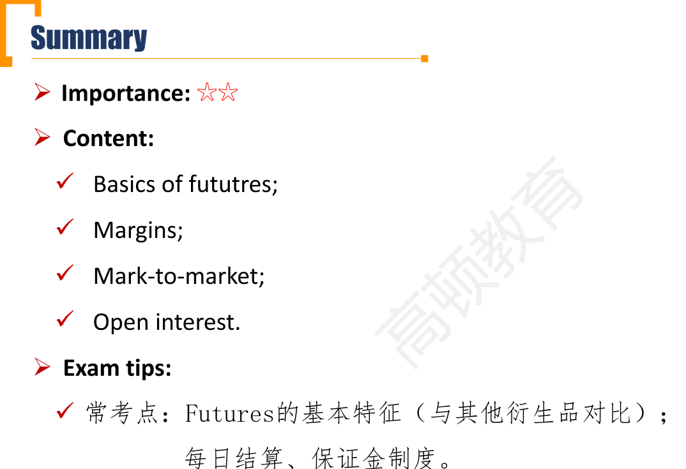

# M3 Futures

#### Futures

- Futures contracts are specialized forward contracts that have been **standardized** and trade on a **futures exchange**. 标准化合约，在交易所交易。
  - Futures contracts have specific underlying assets, times to expiration, delivery and settlement conditions, and quantities.
  - The exchange offers a facility in the form of a physical location and/or an electronic system as well as liquidity provided by authorized market makers.

- **Future price**: the agree-upon price, like forward price
- **Price limit**: a provision limiting price changes, establish a band relative to the preivous day's settlement price, within which all trades must occur.
  - **Limit up/limit down**: trading stops if trading price is above/below the upper/lower band.
  - **Locked limit**:when market hits limits and trading stops.

- Mark-to-market:盯市制度 **daily settlement** of gains and losses to margin account according to the **settlement price**。期货采取盯市制度，每日结算，按照结算价计算保证金。
  - **Settlement price**: an average of the final futures trades of the day.
    - 结算价通常采用平均价，而不采用收盘价。原因是避免收盘时刻多空双方的激烈博弈造成市场动荡。参考：92年327国债事件
  - 期货每日结算，每天把盈亏结算；远期合约是到期一次性结算。
- **Initial margin**: Both parties deposit a requred minimum sum of money when the contract is initiated
- **Maintenance margin**: the amount of money that must maintain in the margin account after the trade is initiated.
  - Always significantly lower than the initial margin
- **Margin call**: a request to deposit enough funds to bring the margin account balance **up to the initial margin**注意是补交到初始保证金
  - The amount required is referred to as **variation margin**. 补交到初始保证金所需的金额
  - 复习：Equity融资做多股票中，margin call price = P0 \*(1 - Initial Margin) / (1 - Maintainence Margin)
- There are significant differences between futures margin accounts and equity margin accounts: 和股票融资的保证金区别，看有没有借贷关系。
  - A futures margin is simply an amount of money put in to an account that **covers possible future losses**, and there is **no formal loan** created as in equity markets.
  - For equity margin account, an investor deposits part of the cost of the stock and **borrows** the remainder at a rate of interest(call money rate保证金贷款利率).

- **Offset/close-out**平仓: a party re-enters the market at a later date but before expiration and engages in the opposite transaction.
- **Open interest**市场上的持仓量: the number of outstanding contracts at any given time
  - Each contract counted in the open interest has a long and a corresponding short.
  - 多开+空开，Open Interest+1
  - 多开+多平，open interest不变
  - 多平+空平，open interest-1

##### Forward vs Futures

- Forward contracts realize the full gain or loss at expiration, whereas futures contracts realize the gain or loss in parts on a day-to-day basis.(settlement price)
  - The time value of money makes these not equivalent, but the differences tend to be small.
    - reinvestment
  - In forward contract, with the entire payoff made at expiration, a loss by one party can be large enough to trigger a default.
    - 因为futures是场内，forward是场外。
    - trigger default因为损失比自身信用的价值大。

