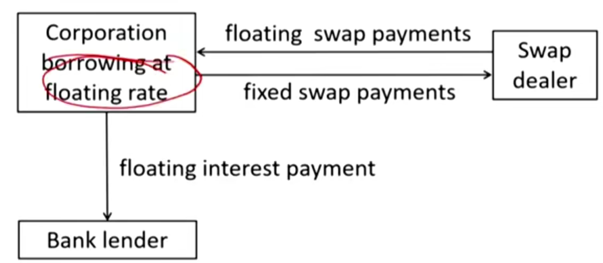
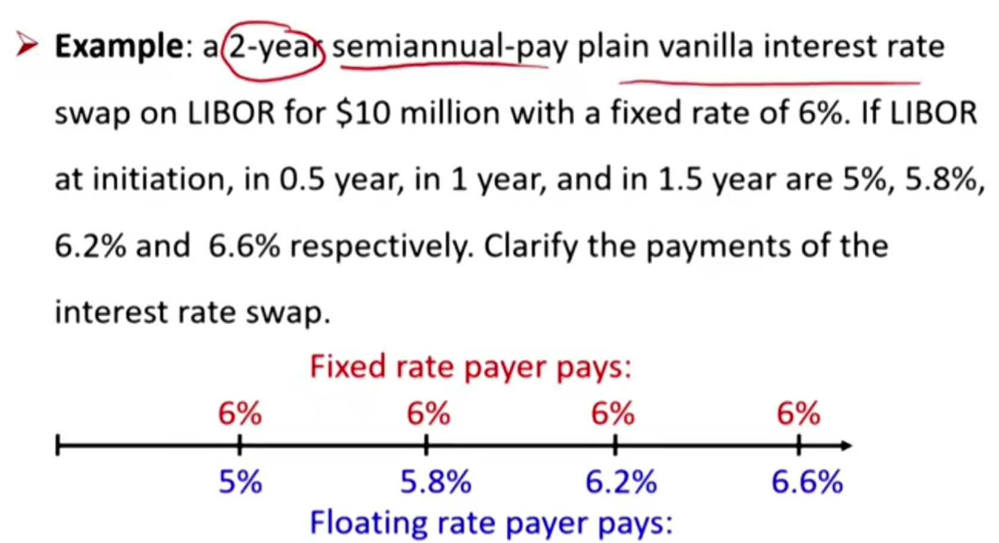
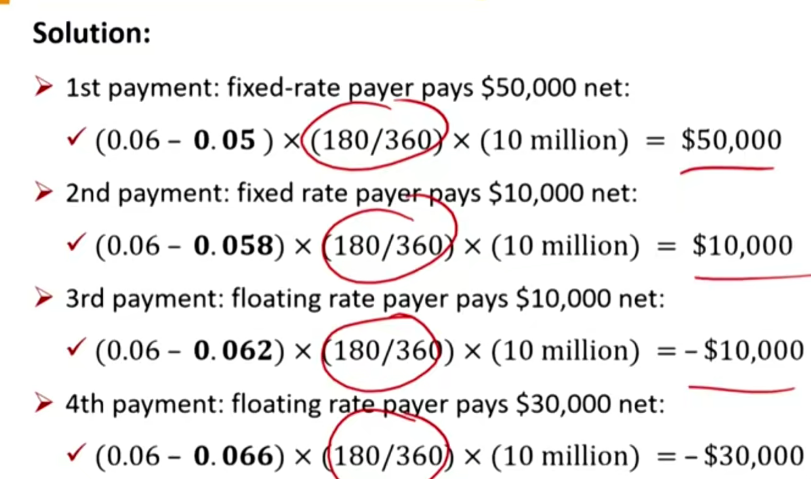
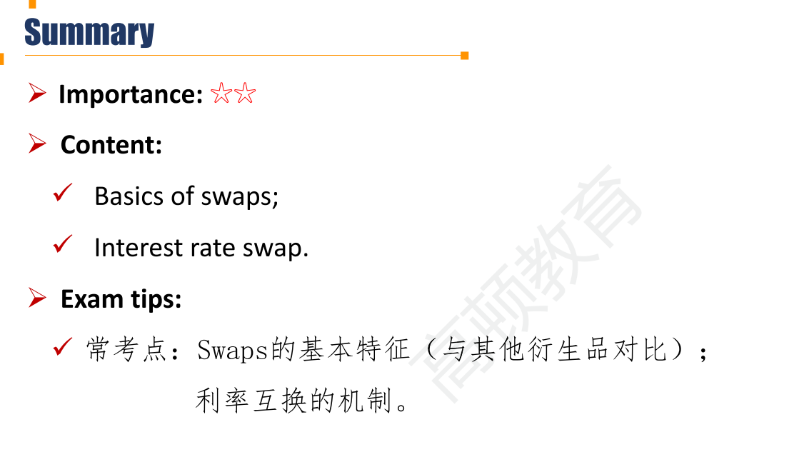

# M4 Swap

#### Swap

- An **over-the-counter** derivative contract in which two parties agree to exchange **a series of cash flows** whereby one party pays a variable series that will be determined by an underlying asset or rate and the other party pays either:

  1. a variable series determined by a different underlying asset or rate

  2. or a fixed series

  - 可以用浮动现金流换固定现金流；也可以用浮动现金流换其他的浮动现金流。

- A swap is a series of (off-market) forwards. swap可以看成是一系列的远期合约，交换很多次现金。
  - off-market forward：An off-market forward contract is a special case of forward contract and the initial contract price is not zero, i.e., the price is not set equal to the no-arbitrage price. 也就是说，由于浮动换固定现金流，存在某一时刻的现金流互换，是存在盈亏的。

#### Swap Characteristic

- Custom instruments 定制化
- Not traded in any organized secondary market
- Largely unregulated
- Default risk is a concern
- Most participants are large institutions
- Private agreements
- Difficult to alter or terminate

#### Types of Swap

- Interest Rate swap
  - **Fixed for floating (plain vanilla)**
  - Floating for floating
- Equity swap
  - 基于某个股票的收益率进行互换。比如茅台换3%
- Currency swap
  - 两种不同的货币

#### Plain Vanilla Interest Rate swap

- **Notional Amount** is **not exchanged** at the beginning or end of the swap(both loans are in same currency and amount) 名义本金不用交换
- On settlement dates, interest payments are **netted**;
  - Only the difference is paid by the party owing the greater amount
  - 轧差支付即可
- Floating rate payments are typically made in **arrears**
  - Payment is made at end of period based on beginning-of-period market reference rate.
- Vanilla interest rate swap三大特征:
  - 名义本金不用互相交换
  - 每期（interest payment）轧差支付
  - 每期的interest采用前一期确定的利率（参考Fixed Income中的arrears，产生的利息是上一期的利率所产生）。比如，3月31日4.65%，6月30日是4.85%，那么6月30日交换现金流的时候，就要按4.65%支付。
- **Example**: using an interest swap to convert a floating rate loan to a fixed rate loan

- swap的两方：
  - fixed rate payer/floating rate receiver，做多利率的一方，long interest
  - fixed rate receiver/floating rate payer , 做空利率的一方 ,short interest

- 复习：债券中的I-spread就是利率-swap rate，就是互换中的固定利率一方，就是上面例题中的fixed rate 6%.
- 注意注意**去年化利率**BEY。
- 注意interest is based in arrears。第0年（initiation）的利率决定第0.5年内支付的利息。

