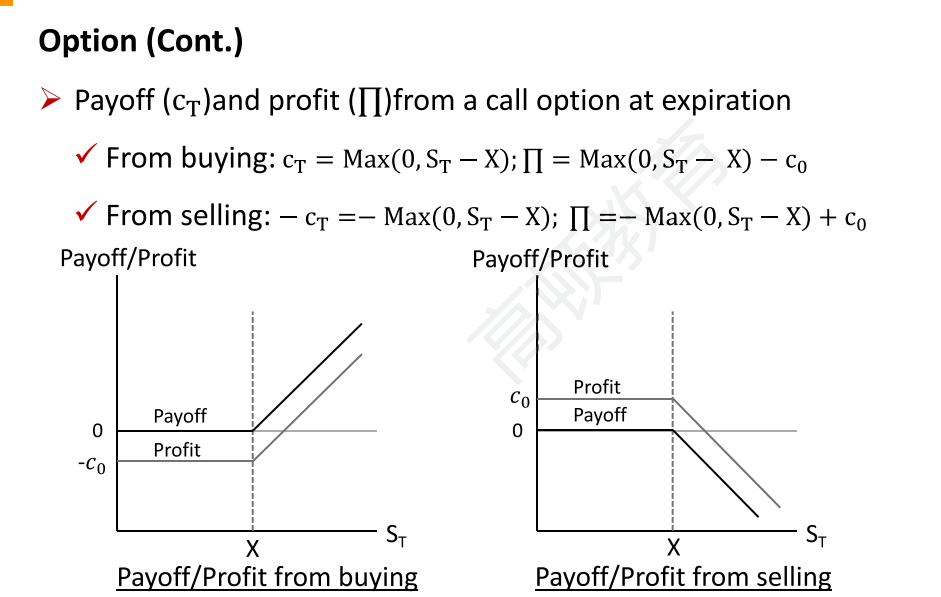
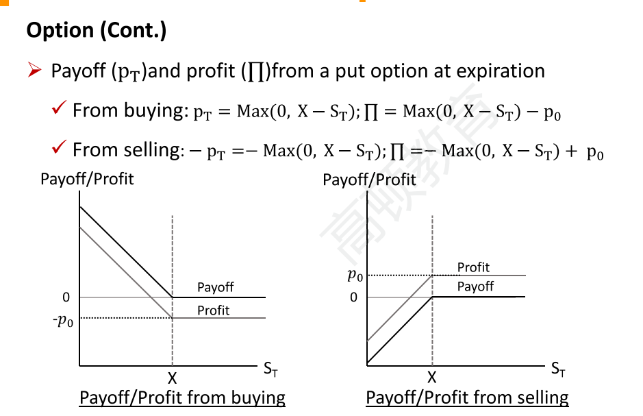
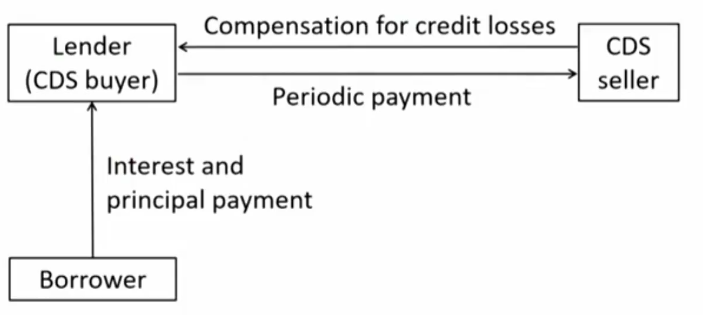

# M5 Option and Credit Derivatives

#### Option

- A derivative contract in which one party, the buyer, **pays a sum of money** to the other party, the seller or writer, and receives the right to either **buy or sell** an underlying asset at a fixed price either **on a specific expiration date or at any time prior to the expiration date**.
  - An option is a right, but not an obligation
  - Default in options is possible only from the short to the long. 注意，这里的short和long是相对期权来说的。也就是卖开仓/义务仓。

- **Option premium**期权费$c_0$, $p_0$: payment to seller from buyer
- **Call option**: right to buy
- **Put option**: right to sell
- **Exercise price/strike price(X)**: the fixed price at which the underlying asset can be purchased
- **American option**: exercisable at or prior to expiration
- **European option**: exercisable only at expiration.

##### Moneyness 期权的货币性

X: strike price; St: spot price at time t

- In the money ITM
  - Call: St > X
  - Put: St < X
- At the money ATM
  - St = X
- Out of the money OTM
  - Call: St < X
  - Put: St > X
- 这里不考虑option premium，只对比现货价格和strike price

- 步骤
  - 判断call还是put
  - 判断是否行权
  - 判断payoff还是profit

- 通过图像可以知道，

|              | long call | short call | long put                | short put |
| ------------ | --------- | ---------- | ----------------------- | --------- |
| max gain     | $\infin$  | $c_0$      | $X-p_0$ (资产价格跌到0) | $p_0$     |
| max **loss** | $c_0$     | $\infin $  | $p_0$                   | $X-p_0$   |

short call，卖出看涨期权的亏损是无限的。james cordior, 天燃气看涨期权爆仓

- 这里的option的profit-st曲线不是直线，所以option是non-linear derivative.

#### Credit Derivatives 信用衍生品

##### Credit default swap

- Derivative contracts between two parties, a credit protection buyer and a credit protection seller, in which the latter provides protection to the former agains a specific credit loss.
  - Credit default swap(CDS): the buyer **makes a series of cash payments** to the seller and receives a promise of **compensation** for credit losses resulting from the default of a third party. CDS买方定期给卖方交保护费，卖方给买方保护承诺。
  - CDS is essentially an **insurance** contract against default. 实际上就是保险合约

- Example：using an CDS to hedge the credit risk of a loan:

- 例子：次贷危机中的美国AIG公司，卖CDS
- CDS和保险的区别
  - 保险中的被保护的资产需要属于购买人
  - 买CDS不需要拥有资产，单纯是一种投资品，一种做空产品。

##### Other credit derivatives

- Total return swap

  - 某个资产的总收益，换固定利率现金流

- Credit-linked note(CLN)

  - 买入一个CLN等于买入bond +卖出 CDS，有更高的coupon. 参考固收：structure financial instrument

- Credit spread option

  - 以信用利差为标的的option。
  - 如果买了一个公司债，想把信用风险转移出去，也就是说信用风险增大，利差增大的时候，要赚钱。所以买入一个call credit spread option.

  - 了解：一个credit spread option买卖两个同方向，不同行权价的期权。[参考链接](https://www.schwab.com/learn/story/reducing-risk-with-credit-spread-options-strategy)
    - 比如credit call spread: 看涨spread，也就是看跌债券价格。也就是债券价格跌，就赚钱。那就买入一个行权价格X1的call1, 卖出一个行权价格X2的call2，其中X1 > X2。这样，当价格暴涨（spread下跌时），call1保护掉call2的无限亏损，当价格暴跌小于X1的时候，X2保护掉X1的payoff。然后由于看涨期权行权价越低越贵，所以当spread下跌的时候，赚一个call2 - call1的option premium。当spread上涨的时候，亏损不会超过X2-X1+premium gain.