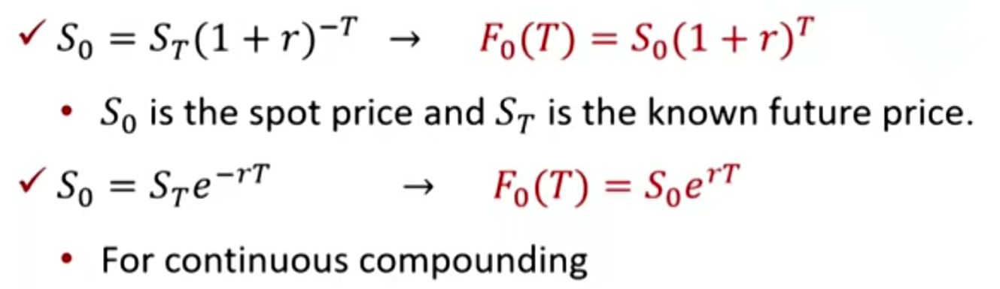
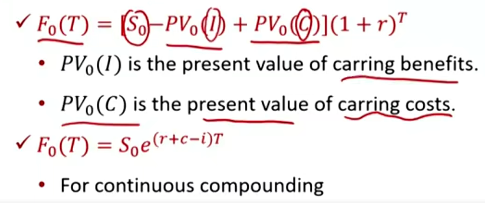

# M7 Arbitrage, Replication, and the Cost of Carry in Pricing Derivatives

#### Arbitrage

- Law of one price: assets that produce identical future cash flows regardless of future events should have the same price.

- Arbitrage is a type of transaction undertaken when two assets or portfolios produce identical results but sell for different prices.

  - Risk-less with zero investment. 无风险+零成本
  - Trader will exploit the arbitrage opportunity quickly (buy low and sell high), then make the prices converge.
    - 套利存在使得相同资产的不同价格趋近。

- A derivative-related arbitrage opportunity arises when an asset with a known future price does not trade at the present value(PV) of its future price.

  - 如果价格不等于现值，则存在套利
  - The appropriate discount rate is the **risk-free rate**

- No arbitrage pricing 无套利空间的定价，通过现在的价格，确定远期价格

   

  - 复习：EAR=(1+r/m)^m - 1

- cash and carry
  - 现值S0 < PV。当前借钱买资产，同时short forward，未来卖资产还钱。
- reverse cash and carry
  - 现值s0>pv。当前借资产卖钱，并且long forward，未来买资产还资产

#### Replication 复制

- A asset's cash flow stream may be recreated using a combination of other asset.
- An asset(有风险的资产) and **a hedging position of derivative** on the asset can be combined to produce a position equivalent to a risk-free asset.
  - 下面，正好代表long，减号代表short
  - Asset - Derivative = Risk-free asset
    - 比如long一只股票，并且short forward。则股票肯定在未来能够在某个价格卖出。
  - <u>**Asset - Risk-free asset = Derivative**</u>
    - 比如long asset, short bond，则未来收益和long forward一样。
  - Derivative + Risk-free asset = asset

#### Cost of Carry 持有成本影响 \*\*\*

- Many assets have **additional costs** or **benefits of ownership** that must be reflected in the forward commitment price in order to prevent risk-less arbitrage opportunities. 考虑持有成本和持有收益。
- No arbitrage pricing
  - 加成本，减收益。

##### Carrying costs and carrying benefits

- Opportunity cost (r) 加上机会成本
  - Risk-free interest rate
  - $e^{rT}$, (1+r)^T
- Other Costs of ownership(C, c)
  - Storage, transportation, insurance, and spoilage costs.
- Benefits of ownership(I, i) 减去持有收益
  - Dividend, interest, rent, convenience yield, etc.
    - Convenience yield: non-monetary advantage of holding the asset.
      - 比如：持有原材料，可以马上用来生产等

#### Forward vs. Spot price

根据指数性质 e^{(r+c-i)T}

- Opportunity and other cost = benefit
  - F0(T) = S0
- Opportunity and other cost > Benefit
  - F0(T) > S0 （Contango 远期升水）
- Opportunity and Other cost  < benefit
  - F0(T) < S0 (Backwardation) 远期贴水

