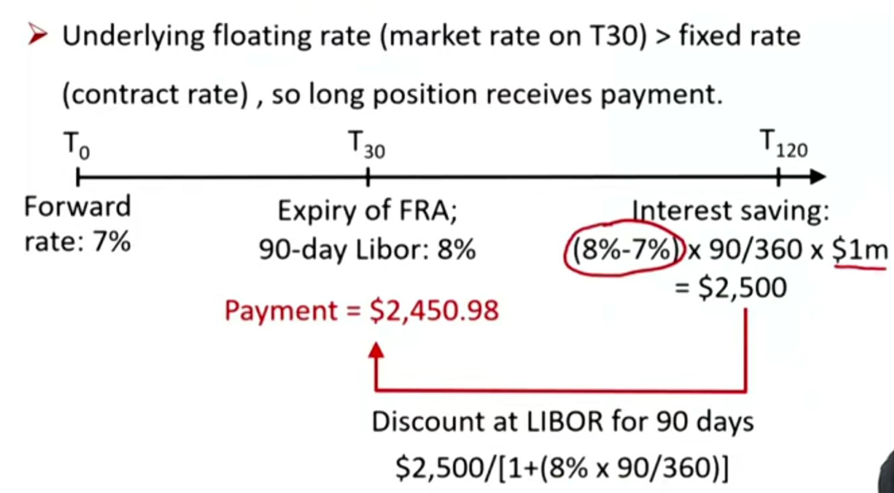
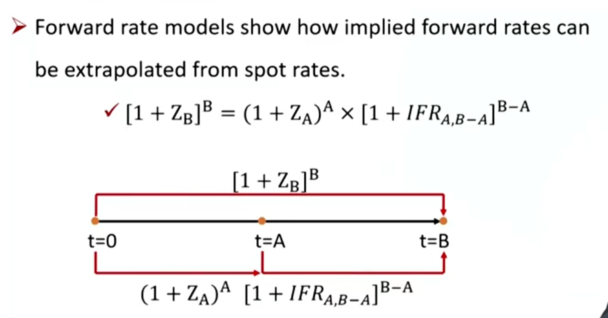
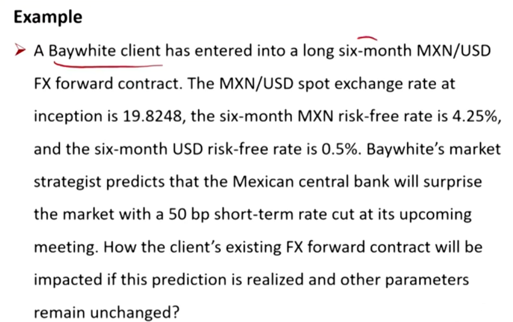
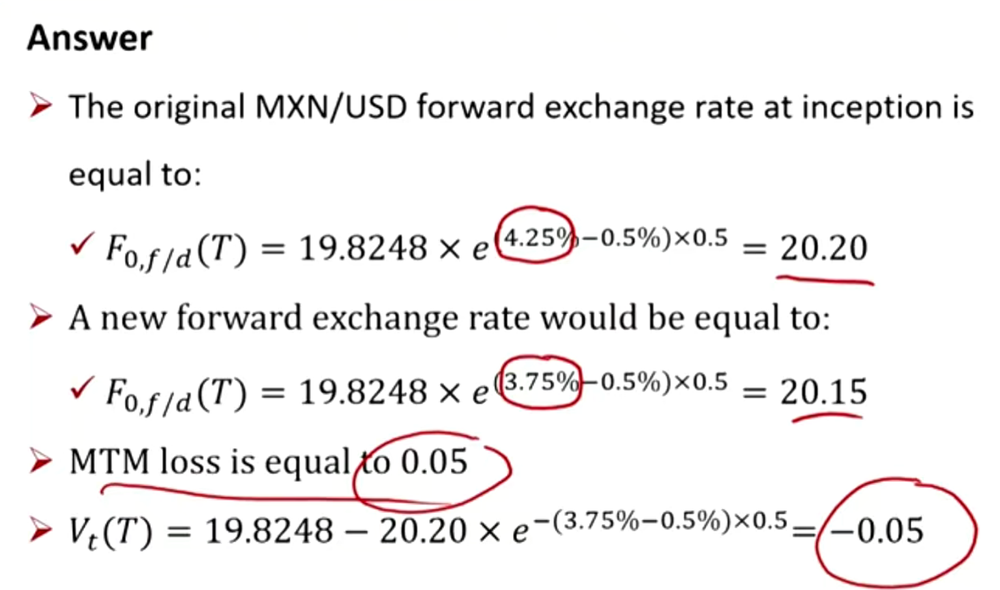

# M8 Pricing and Valuation of Forward

- Explain how the value and price of a forward contract are determined at initiation, during the life of the contract, and at expiration;
- Explain how forward rates are determined for an underlying with a term structure and describe their uses.

#### Price和Value的区别

##### Price of forward, futures, and swap

衍生品本身确定的远期的价格. 

- The fixed price or rate at which the underlying will be purchases at a later date.
  - Generally **may not change** as the (expected) price of the underlying asset changes.

##### Value of forward, futures, and swap

衍生品帮你省了多少钱

- The difference of "with the position" from "without the position".
  - **May increase or decrease** as the (expected) price of the underlying asset changes.

#### Valuation 定价，估值

##### At initiation

- The forward contract at initiation has zero **value**. 初始的时候，**价值**为0，谁也不占谁便宜。
  - **Neither** party to a forward transaction pays to enter the contact at initiation.
    - $V_0(T)=0$
  - 复习：如果一开始期初价值不为零为off-market，swap的off-market性质
- The forward price must be set so its value at initiation is zero. 远期价格确定后不会轻易改变。

$$
F_0(T)=[S_0-PV_0(I)+PV_0(C)](1+r)^T
$$

- If no cash flows:

$$
F_0(T)=S_0(1+r)^T
$$

##### During it life

- In the financial world, we generally define value as the value to the **long position**.
  - 按照Long方的角度确定价值。价值为正，long赚钱，short亏钱（zero-sum game）
- At time t < T, the value of a forward contract is the spot price of the asset minus the present value of the forward price, and minus the net cost of carry.

$$
V_t(T)=[S_t-PV_t(I)+PV_t(C)]-F_0(T)(1+r)^{-(T-t)}
$$

- 在时刻t的价值，等于在时刻t持有现货至T的carrying cost成本，减去按照远期合约买入资产的现值。
  - 可以理解为：没有远期的总成本，减去有forward时需要准备的资金。
  - If no cash flows:

$$
V_t(T)=S_t-F_0(T)(1+r)^{-(T-t)}
$$

##### At expiration

- The value of a forward contract is the spot price of the underlying minus the forward price

$$
V_T(T)=S_T-F_0(T)
$$

|      | Price                          | Value                                        |
| ---- | ------------------------------ | -------------------------------------------- |
| t=0  | $[S_0-PV_0(I)+PV_0(C)](1+r)^T$ | 0                                            |
| t=t  | 不变                           | $[S_t-PV_t(I)+PV_t(C)]-F_0(T)(1+r)^{-(T-t)}$ |
| t=T  | 不变                           | $S_T-F_0(T)$                                 |

#### Benefits and costs of holding the underlying 

\*\*更多要求定性的判断

- Benefits will **decrease** forward price at initiation, and **decrease** the value of forward contract during its life.
  - Including dividend, interest, rent, convenience yield, etc.
- Costs will **increase** forward price at initiation, and **increase** the value of forward contract during its life.
  - Including storage cost, maintenance cost, etc.
- 加成本，减收益

#### Definition of FRA （Forward Rate Agreements）

- Forward contracts in which the underlying is an interest rate(E.g. MRR,market reference rate，复习：Floating rate notes浮动票息参考MRR) are called **forward rate agreements**, or FRAs.
  - **Long** position can be viewed as the obligation to take a (hypothetical) loan at the contract rate(i.e., **borrow** at the fixed rate); gains when reference rate **increase**. 
    - long，多利率，利率越高越赚钱
    - hypothetical borrow，意思是不一定借，可以按照现金结算。
  - **Short** position can be viewed as the obligation to make a (hypothetical) loan at the contract rate(i.e., **lend** at the contract rate); gains when reference rate **decrease**.
    - short, 空利率，利率越低越赚钱。

##### The use of FRA

- Lock the interest rate or hedge the risk of borrowing or lending at some future date. 
  - 如果未来要borrow money，可以long一个FRA，long interest
  - 如果未来要lend money, 可以short一个FRA，short interest
  - One party will pay the other party the difference (based on notional value) between the interest rate specified in the FRA and the market interest rate at contract settlement.

- Example:
  - Specification of $1 \times 4$ FRA(1代表开始时间一个月后，4代表结束时间4个月后):（复习固收报价3y2y，表示开始时间是3年后，持续2年）
    - 所以这里的FRA意思是1个月后开始借钱，借3个月（4个月后还钱）
    - Term = 30 days
    - Notional amount = \$1 million
    - Underlying rate = 90-day LIBOR
    - Forward rate = 7%
  - At t = 30 days, 90-day LIBOR = 8%, clarify the payment of this FRA.

- 注意，一年以内的货币市场工具使用单利折现。
- 所以，FRA的提前cash settlement：
  - 计算在标的资产到期日时候，省下的利息. 这里注意利率要去年化。
  - 把省下的利息按照单例和实际利率折现到FRA到期日（注意，FRA到期日和标的资产的到期日不一样。标的资产开始的时候，市场利率LIBOR已经知道，FRA的赌约已经结束）

##### Spot rates and forward rates 如何约定远期利率？

- **Spot rate**: the rate of interest on a security that makes a single payment at a future point in time(a.k.a or zero rate).
  - **Discount factor**: the present value of a currency unit on a future date。
    - 就是未来的一块钱，现在是多少钱
    - $DF_i=\frac{1}{(1+Z_i)^i}$

- **Forward rate**: rate of interest set today for a single-payment security to be issued at a future date
  - **Implied forward rate**: obtained form spot rates.
    - 复习固收：通过Za, Zb，求出FA,(B-A)的远期利率（无套利）

#### 下面是拓展内容

#### FX(foreign exchange) forward contract

- Spot foreign exchange rate($S_{0,f/d}$) 
  - f is the foreign (price) currency
  - d is the domestic (base) currency
  - 即期汇率，如果S0,f/d=1.2，那么1.2个f币，换1个d。
  - 复习经济学：直接报价法

- FX forward contract: sale of one currency and purchase of the other on a future date at a forward exchange rate($F_{0,f/d}$).
  - Long(short ) position means purchasing(selling) the domestic currency and selling(purchasing) the foreign currency
    - long 意思是 买本币，卖外币。

##### No arbitrage pricing

- 对于两种投资方式：
  - 1）现在持有本币，未来换外币；
  - 2）现在换外币，持有外币至未来。
  - 这两种投资方法应该是一样的价值。所以，根据无套利原则，在未来两个投资方式价值相等：1）=F0,f/d(1+rd)^T=2) S0,f/d(1+r_f)^T. 换成连续复利形式，则得到下面公式。
  - 注意，$F_{0,f/d}(T)$意思是站在当前，看t=T时刻，1个本币可以换$F_{0,f/d}(T)$个外币。

$$
F_{0,f/d}(T)=S_{0,f/d}\times e^{(r_f-r_d)T}
$$

- $r_f$is the risk-free rate of the foreign currency
- $r_d$ is the risk-free rate of the domestic currency.
- The spot versus forward FX price relationship is determined by the risk-free interest rate differential.

| Interest rate differential | Forward vs. Spot           |
| -------------------------- | -------------------------- |
| $r_f - r_d > 0$            | $F_{0,f/d}(T) > S_{0,f/d}$ |
| $r_f - r_d < 0$            | $F_{0,f/d}(T) < S_{0,f/d}$ |
| $r_f - r_d = 0$            | $F_{0,f/d}(T) = S_{0,f/d}$ |

- 另一种理解方法：用外币买本币，在Forward定价公式中，rf相当于就是持有本币的机会成本，rd相当于持有本币的收益。

- 当rf > rd时，F > S，代表一个本币，未来可以换更多外币，表示本币升值，外币贬值。复习：利率越高，货币会越贬值。这里外币利率高，外币贬值。

##### Valuation of FX forward 估值

刚刚时定价，现在时valuation

- At any given time t, the MTM value of the FX forward is the difference betwen the current spot FX price($S_{t, f/d}$) and the present value of the forward price discounted by the current difference in risk-free rates($r_f-r_d$) for the remaining period through maturity

$$
V_t(T)=S_{t,f/d}-F_{0,f/d}(T)e^{-(r_f-r_d)(T-t)}
$$

- long 一个forward意思时未来可以用远期汇率以外币换本币。
- 假设未来t=T时刻需要获得1个本币。在t时刻衡量FX forward的价值，就用
  - 没有持有forward时的t时刻，需要持有的外币，减去：
  - 持有forward时候的t时刻，需要持有的外币。
- 这里用$r_f-r_d$作为原有的无风险收益率（relative opportunity cost)。如果不轧差，那么公式就是：

$$
V_t(T)=S_{t,f/d}e^{-r_d(T-t)}-F_{0,f/d}(T)e^{-r_f(T-t)}
$$

两种方式结果相似，CFA只是计算逻辑不一样。

- 亏了0.05个MXN

