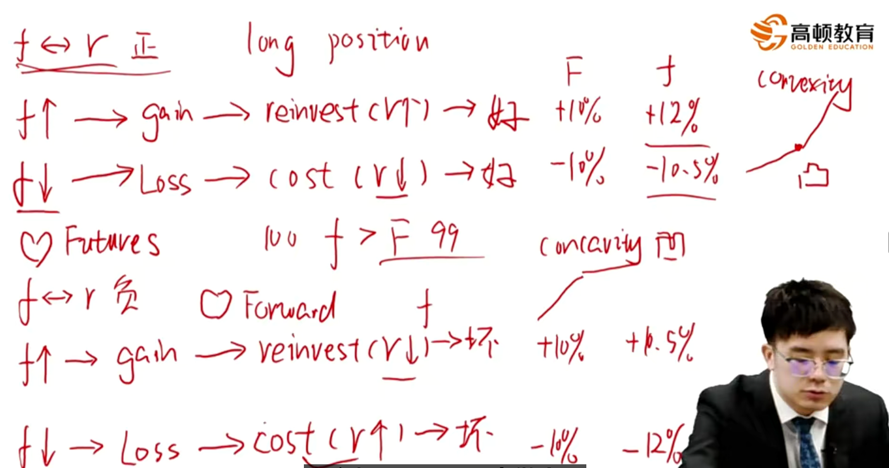

# M9 Pricing and Valuation of Futures

#### Pricing of Futures

- Many of the pricing and valuation principles associated with forward commitments are common to both forward and futures contracts

$$
V_0(T)=0\\
f_0(T)=[S_0-PV_0(I)+PV_0(C)](1+r)^T
$$

- 加成本、减收益
- if  no cash flows:

$$
f_0(T) = S_0(1+r)^T
$$

#### Futures vs. Forward

- Futures realize the gain or loss in parts on a **day-to-day basis**, while forwards realize the full gain or loss at expiration. （期货每日结算制度）
  - The forward contract price remains **fixed** until the contract matures.
  - Futures contract prices **fluctuate** daily based upon market changes.
  - The cumulative realized gain or loss is similar
    - The **time value of money** makes these not equivalent.
      - 拿到收益的货币时间价值导致两者不相等。
- Futures price will be **higher** than forward price when interest rate and futures price are **positively correlated**, and will be **lower** when they are **negatively correlated**. **重要！**
  - A positive correlation between interest rate and futures price means that(for a long position) daily settlement provides funds(excess margin) when rates are high and they can earn more interest, and daily settlement requires funds(margin call) when rates are low and they only ask for less interest.
  - This is so called **convexity bias**.

- 比如，如果futures price和interest rates正相关，站在long position的角度，

  - 如果futures price上升，获得收益，结算的时候再投资收益更高（由于r也上升）
  - 如果futures price下降，获得损失，损失导致补交保证金，保证金成本下降（由于r也下降）
  - 所以，如果Forward涨10%，由于futures的daily settlement带来的再投资收益上升，会导致futures涨的幅度更高，比如12%
  - 如果Forward跌10%，由于daily settlement需要补交保证金，又由于此时利率也下跌补交的保证金成本会下降，所以跌幅没有涨幅大，比如-10.5%
  - 所以，这里意思是涨得多，跌得慢，呈现出凸性（convexity）
  - 也就是这种情况下，由于凸性存在，futures比forward更**优**，也就是投资者更prefer futures。
  - 同理在future price和interest rates负相关，也能得到类似得相反结论。

  - 注意，如果future price和interest rate时uncorrelated不相关，那么期货价格=远期价格(f=F)，比如使用无风险收益率。

#### Interest rate futures(对比FRA)

- Interest rate futures trade on a price basis. 特殊的报价方式
  - $f_{A,B-A}=100-(100\times MRR_{A,B-A})$
  - 这里意思是时间A开始，持续B-A时间
  - $f_{A,B-A}$is the futures price for a market reference rate.
  - e.g. $f_{3m,3m}=98$ means $MRR_{3m,3m}=2%$，意思是三个月后借钱借3个月，利率2%。
- This (100 - yield) price convention results in an inverse price/yield relationship
  - A long futures position gains when reference rate decrease.
  - A short futures position gains when reference rate increase.
  - 这里呈现反向报价得关系，报价越高，利率越低。
  - 所以，long Interest rates futures得时候，是看涨报价，也就是看跌利率。
  - 和FRA（Forward Rate Agreement）相反：long FRA得时候，看涨利率。

- Futures contract basis point value(BPV) 也就是一个bp代表多少价值
  - BPV = Notional Principal \* 0.01% \* Period
- Example: A futures contract for 3 month MRR with a \$1,000,000 notional principal
  - BPV = \$1,000,000 \* 0.01% \* 90/360 = \$25
  - 注意：结合反向报价关系：
    - 利率市场上升一个基点，对于short来说赚25块钱。
    - 利率市场下降一个基点，对于long来说赚25块钱。

### Summary

Importance: \*\*

常考点，Forward和Futures价格对比（凸性）