# M1 Topics in Demand and Supply Analysis	

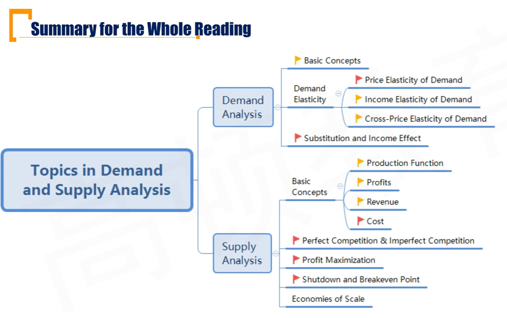

## R1 Demand Analysis

### R1.1 Basic Concepts and Demand Theory

**Interpret** demand function and demand curve.

#### Demand

- Demand describes the **willingness** and **ability** of consumers to purchase a given amount of a good or service at **a given price**.
  - 意愿、能力。给定p决定q。

- **Law of Demand**
  - As price of a good rises, buyers buy less of it, and as its price falls, they buy more.
  - There are exceptions who do not follow Law of Demand. (gifen good)

#### Demand Function and Demand Curve

- **Demand function ** is the relationship between quantity of demand and variables that have influence on demand.

$$
Q_x^d=f(P_x,I,P_y,...)
$$

- **Demand curve** is the graph of the **inverse demand function**. 假定出了$P_x$，其他变量都不变

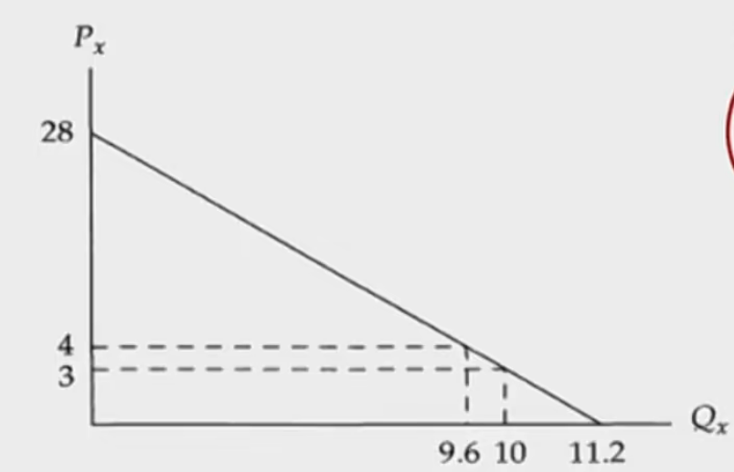

- 假定为线性函数，由P决定Q。

#### Movements vs. shifts

- **Movements along demand curves**
  - A change in the market price that simply increases or decreases the quantity supplied or demanded is represented by a movement along the curve
- **shifts in demand curves**
  - A change in one of the independent variables(income、其他商品价格等) other than price will result in a shift of the curve itself.

#### Consumer Surplus消费者剩余

- The **difference** between the highest price consumers are **willing** to pay for each additional unit and the actual price they pay.  愿意支付的价格减去实际交易的价格
- The area **beneath the demand curve and above price.**

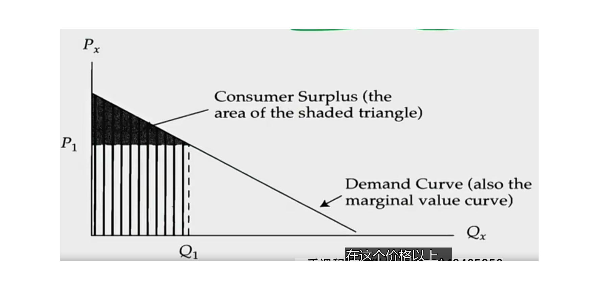

### R1.2 Demand Elasticity

#### Price Elasticity of Demand

- **Price Elasticity of Demand:** the responsiveness of the quantity demanded to a change in price

$$
E_{p_x}^d=\frac{\%\Delta Q_x^d}{\% \Delta P_x}=\frac{\Delta Q_x^d/Q_x^d}{\Delta P_x/P_x}=\\
\frac{\Delta Q_x^d}{\Delta P_x}\frac{P_x}{Q_x^d}
$$

- 价格弹性，实际上是Q=f(P)斜率乘以P/Q。斜率一般是常数，所以弹性就随着P/Q变化而变化
- Arc method: Use average quantity and average price as the base for calculating the percentage changes

$$
E=\frac{\Delta Q}{Q_{avg}}/\frac{\Delta P}{P_{avg}}
$$

- 价格需求弹性一般小于0.

- **Elastic:** $|E_{p_x}^d| > 1$
  - 不会轻易涨价，有可能采取薄利多销的策略
- **Unit Elastic:** $|E_{p_x}^d| = 1$

- **Inelastic:** $|E_{p_x}^d| < 1$
  - 生活必需品

- Total revenue is **maximized** when demand is unit elastic
  - When demand is **elastic**, price and total expenditure move in opposite direction
  - When demand is **inelastic**, price and expenditure move in the same direction

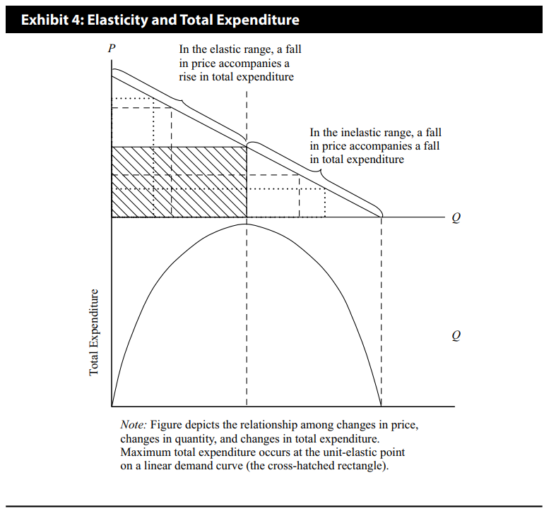

- 单位弹性有且只有一个。
- 单位弹性上的点，总收入P \* Q最大。可以求导证明
- 总收入的变动百分比有一个公式

$$
\frac{\Delta R}{R}=\frac{(P+\Delta P)(Q+\Delta Q)-PQ}{PQ}=\frac{\Delta Q}{Q}+\frac{\Delta P}{P}
$$

- 收益曲线是抛物线（parabolic）
- **Perfectly elastic**: Demand curve is horizontal, elasticity is infinite
  - 完全竞争市场

- **Perfectly inelastic**: Demand curve is vertical, elasticity is zer

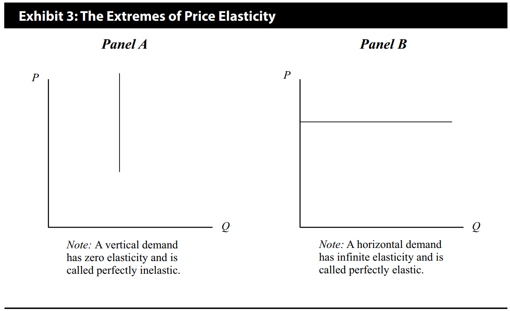

##### Factors that influence Price Elasticity of Demand

- **Portion of income spent on a good**
  - The larger the proportion of income spent on a good, the more elastic the demand for that good
- **Availability and closeness of substitutes**
  - If good substitutes are available, elasticity of demand tends to be greater.
- **Time**
  - Elasticity of demand tends to be greater the longer the time period since the price change.
- The extent to which the good is seen as **necessary or optional**.
  - elasticity其实就是跑路的可能性。
  - necessary弹性低
  - optional弹性高

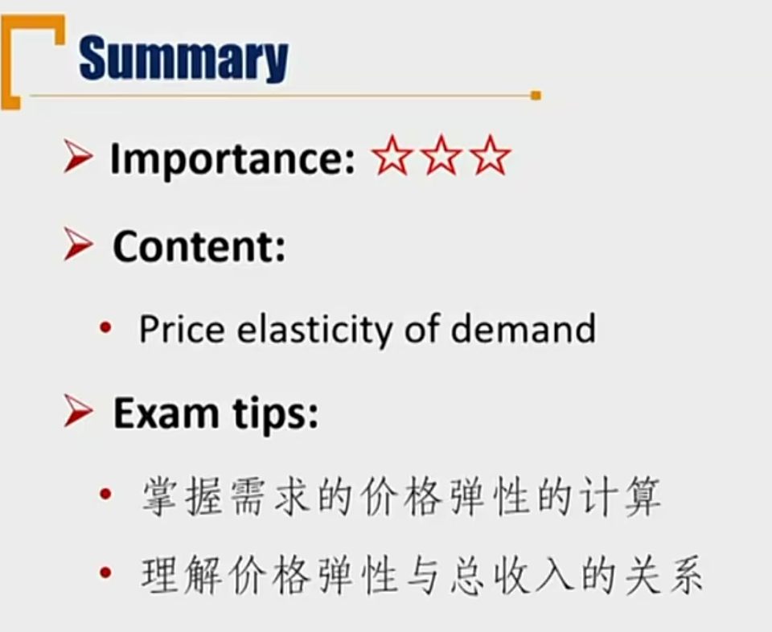

#### Income Elasticity of Demand and Cross-Price Elasticity of Demand

**calculate** and **interpret** income, and cross-price elasticity of demand

##### Income elasticity of Demand

- Income elasticity of Demand: the responsiveness of the quantity demanded to a change in income

$$
E_{I}^d=\frac{\%\Delta Q_x^d}{\% \Delta I}=\frac{\Delta Q_x^d/Q_x^d}{\Delta I/I}=\\
\frac{\Delta Q_x^d}{\Delta I}\frac{I}{Q_x^d}
$$

- Key points of income elasticity
  - **Normal goods**: ***positive income elasticity***
    - Normal luxuries goods: **high** positive elasticity
    - Necessities: **low** positive elasticity
  - **Inferior goods**: ***negative income elasticity***
    - 低档商品（不是劣质品）
  - 好东西，有钱了买的多；有钱了就不买拼多多了。

##### Cross-Price Elasticity of Demand

- **Cross-Price Elasticity of Demand**: the responsiveness of the quantity demanded to a change in price of substitutes or complements

$$
E_{p_x}^d=\frac{\%\Delta Q_x^d}{\% \Delta P_y}=\frac{\Delta Q_x^d/Q_x^d}{\Delta P_y/P_y}=\\
\frac{\Delta Q_x^d}{\Delta P_y}\frac{P_y}{Q_x^d}
$$

- Key points of cross-price elasticity
  - **Substitutes:** positive cross-price elasticity
  - **Complements:** negative cross-price elasticity

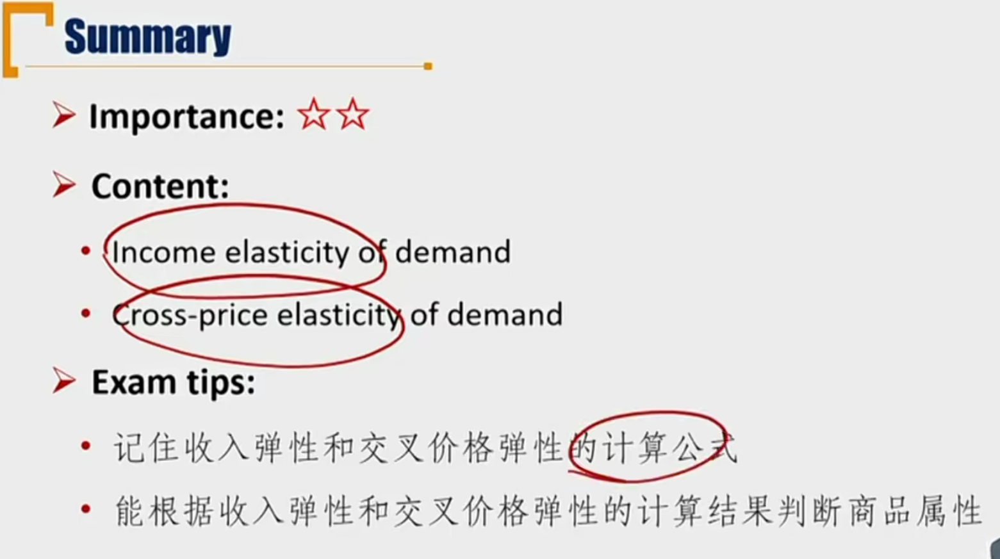

### R1.3 Substitution and Income effect

Compare substitution and income effects

distinguish between normal goods and inferior goods

#### Substitution effect and income effect

不管是替代效应还是收入效应，都是假设收入和其他商品的价格不变的情况下，本商品价格变动对需求量产生的影响。

- **Substitution effect**
  - When the price of A decreases, the **relative price** of A against B will decrease, which results in an increase in the demand of A

- **Income effect**
  - Nominal income is constant, when the price of A decreases, consumer's **real purchasing power** will increase, which results in a change in the demand of A.

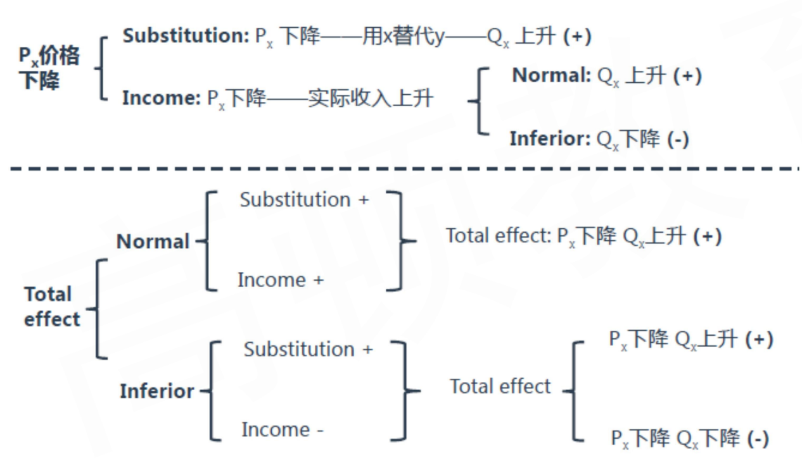

#### Classification

| If Price Down(-)              | Substitution effect | Income effect | total effect | Demand curve |
| ----------------------------- | ------------------- | ------------- | ------------ | ------------ |
| Normal good（奢侈品、必需品） | quantity+           | quantity+     | quantity+    | Downward     |
| Inferior good(not giffen)     | quantity+           | quantity-     | quantity+    | Downward     |
| Inferior good(giffen)         | quantity+           | quantity-     | quantity-    | Upward       |
| Veblen goods                  | quantity+           | quantity-     | quantity-    | Upward       |

- giffen商品，Income effect的下降超过了substitution effect的上升，所以价格下降，需求下降。所以需求曲线向上。（爱尔兰饥荒）
- **Veblen goods**
  - Demand for Veblen goods increases when price is higher
  - It is seen as conspicuous consumption 用来炫富的商品
  - 替代效应还是存在，但是收入效应没有那么明显，价格下降的话，炫富功能下降，导致需求量急剧下跌。所以，考虑两个效应，价格下跌、需求量下跌。
  - 和Giffen goods对比：
    - 1）曲线方向相同
    - 2）Veblen商品是炫富品，Giffen商品是一个低档品
  - 和普通的奢侈品对比
    - 1）曲线方向不一样。Veblen upward，一般奢侈品是斜向下。

#### Goods Summary

- **Normal good**
  - Normal luxuries: downward
  - Necessities: downward
- **Inferior goods**
  - Giffen goods: upward
  - Non-giffen goods: downward
- **Veblen goods**: upward

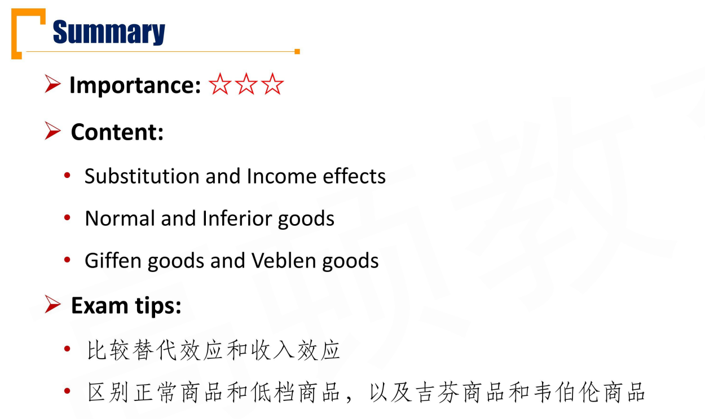

## R2 Supply Analysis

### R2.1 Basic Concepts

#### Production Function

- **Factors of production**
  - The inputs to the production of goods and services
  - Land, <u>labor, capital</u>, materials
  - labor（L） 和 capital(K)最重要
- **Production function**
  - Assume only consider capital and labor
  - $Q = f(K, L)$
  - **In the short-run**: Capital is fixed, only consider labor
    - $Q = f(L)$

#### Product

- **Total product(TP)**
  - Sum of the output from all inputs during a time period
- **Average product(AP)**
  - Total product divided by the quantity of a given input
  - per capita人均
  - AP = TP/ L
- **Marginal product(MP)** 边际产出
  - The amount of additional output resulting from using one more unit of input assuming other inputs are fixed.
  - 多增加一单位输入，增加多少产出

##### Law of Diminishing returns

- **Diminishing Marginal return** 边际回报递减
  - as more and more resources(such as labor) are devoted to a production process, **they increase output but at a decreasing rate**. 二阶导小于零

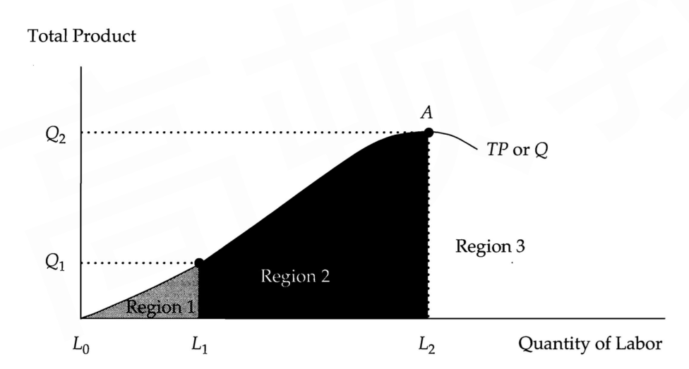

- Region1的二阶导大于零，边际效益还在增加
- Region2开始边际效益递减
- Region3边际效益为负数

##### AP、TP、MP三条曲线关系

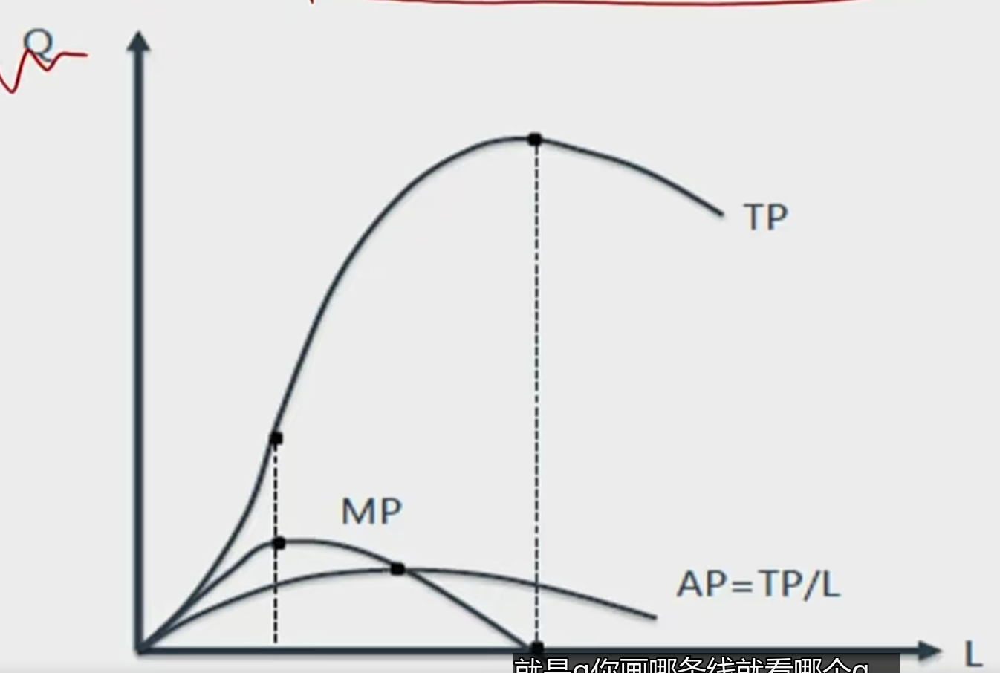

- MP从上往下穿过AP最高点
  - MP>AP时，再增加一单位L，提高了平均产出AP;
  - MP<AP时，再增加一单位L，减少了平均产出AP;
  - 所以穿过最高点
  - 也可以用导数证明
- TP的最高点的横坐标，等于MP穿过x轴的横坐标

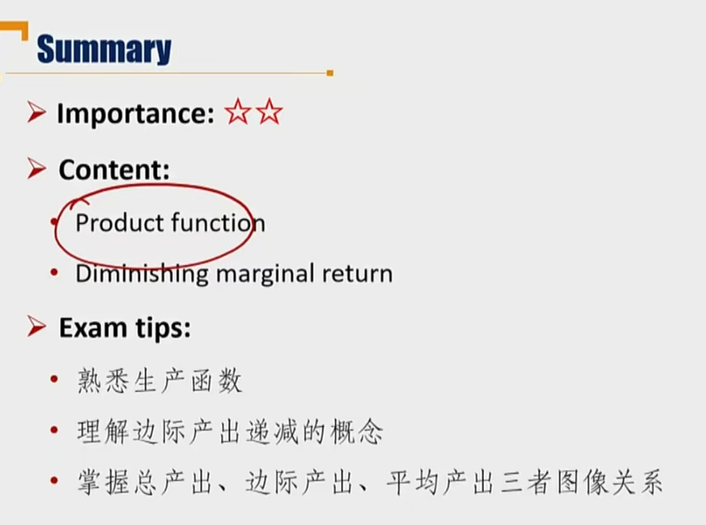

#### Profits and Revenue

##### Explicit Costs and Implicit costs

- **Explicit costs (Accounting costs)** 显性成本
  - Payments to non-owner parties for goods and services that they supply to the firm
- **Implicit costs** 隐性成本
  - Opportunity costs of resources supplied to the firm by its owners
- **Total economic costs = explicit costs + implicit costs**
- 注意，explicit cost是站在非股东的角度看成本，比如向供应商支付的货款等；implicit cost是站在股东的角度看成本（机会成本），比如股东本来可以把钱存银行，赚取无风险收益。如果说机会成本等于implicit cost就属于混淆了概念。implicit cost是股东的机会成本。同样，explicit cost也可以是供应商的机会成本。

##### Economic Profit and Accounting Profit

- **Accounting profit** = total revenue - accounting costs(explicit costs)

- **Economic profit** = total revenue - total economic costs

  ​                               = total revenue - explicit costs - implicit cost

  ​                               = accounting profit - implicit costs

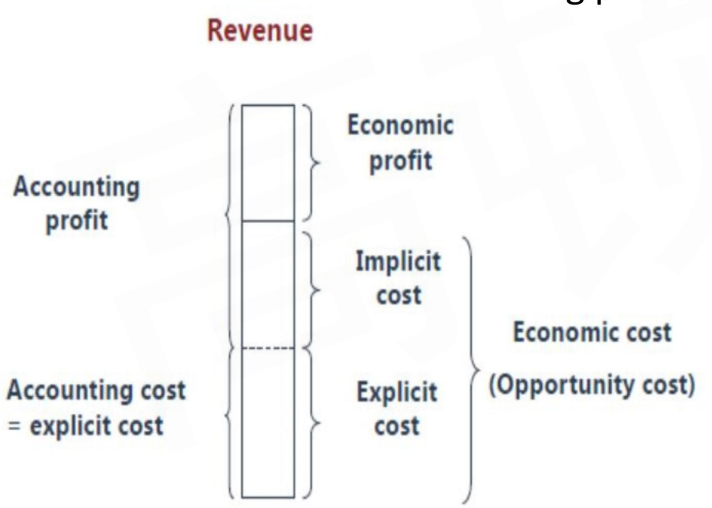

##### Normal Profit正常利润

- Normal profit is the accounting profit that **makes economic profit zero**

- 赚的钱正好覆盖了隐性成本，也就是会计准则里赚了钱，但是扣除了隐性成本后不赚钱。
- 数学上，Normal profits = Implicit cost

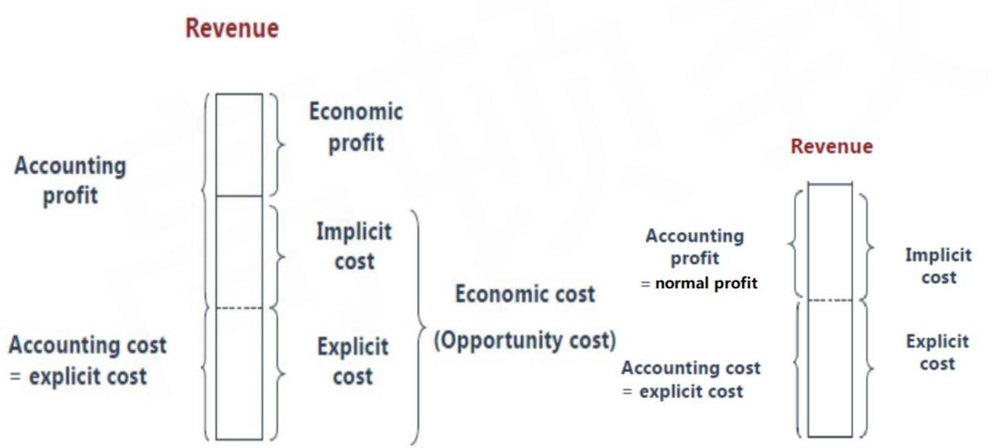

##### Revenue

- **Total Revenue**
  - sum of individual units sold times their respective prices

$$
TR = P\times Q
$$

- **Average Revenue**
  - Total revenue divided by quantity

$$
AR=\frac{TR}{Q}=\frac{PQ}{Q}=P
$$

- **Marginal Revenue**
  - Change in total revenue divided by change in quantity

$$
MR=\frac{\Delta TR}{\Delta Q}
$$

- The relationship between MR and price elasticity

$$
MR=P(1-\frac{1}{|\epsilon_P|})
$$

证明

$$
MR=\frac{\Delta TR}{\Delta Q}=\frac{(P+\Delta P)(Q+\Delta Q)-PQ}{\Delta Q}=P(1-\frac{1}{\epsilon_P})
$$

- 注意$MP = \Delta TP / \Delta L=\Delta Q/ \Delta L$

#### Cost \*\*\*

Q是cost的变量

- Total fixed cost (TFC)
- Total variable cost(TVC)

- Total costs(TC) = TFC + TVC
  - 注意，这里的固定成本、可变成本是站在short-run角度分析的。如果是站在long-run的角度进行分析，所有成本都应该认为可变。

- Average fixed cost(AFC) = TFC / Q
  - 分摊到每个产品的固定成本
- Average variable cost(AVC) = TVC / Q
- Average total cost(ATC) = TC / Q = AFC +  AVC
- Marginal cost(MC)
  - Change in total cost divided by change in quantity

##### Short-run cost curve

- 对于TVC的曲线，先增长趋势变平缓（一阶导大于零，二阶导小于0），然后再增长速度增加（一阶导大于0，二阶导大于0）

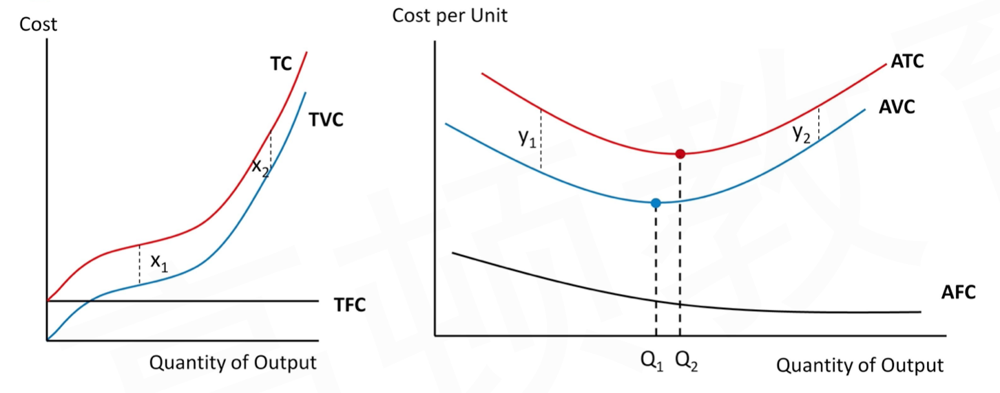

- TC由TVC向上平移TFC得到。所以$x_1=x_2$

- AVC图像是U型的图像，由于$AVC=TVC/Q$，对于每一个Q，其对应的AVC为TVC曲线上和原点连线的斜率。通过图像观察可知，斜率先减小，然后到和TVC相切时达到最小值，然后增大。
- 对于AVC的最低点$Q_1$和ATC的最低点$Q_2$，一定有$Q_1<Q_2$。同上面逻辑，通过观察图像斜率可以证明。也可以考虑在Q1点左侧的时候，AVC(Q1-x)>AVC(Q1), AFC(Q1-x)>AFC(Q1)，所以必然有ATC(Q1-x)>ATC(Q1)，所以。如果ATC的最小值在AVC最小值左边的话，显然矛盾。

##### MC curve important

$MC=\Delta TC / \Delta Q$

- 两个规律：
  - MC呈现U型曲线，并且最小值小于AVC的最小值，并且MC的最小值等于TVC拐点。
  - MC从下往上穿过AVC和ATC的最低点
    - MC其实等于MFC+MVC，但由于MFC=0(TFC是常数)，所以MC和AVC的关系等价于MVC和AVC的关系
    - 穿过最低点的逻辑和AP曲线和MP曲线类似。当MC<ATC的时候，再增加一单位的产量，拉低平均成本，MC>ATC的时候，增加一单位产量，拉高平均成本.

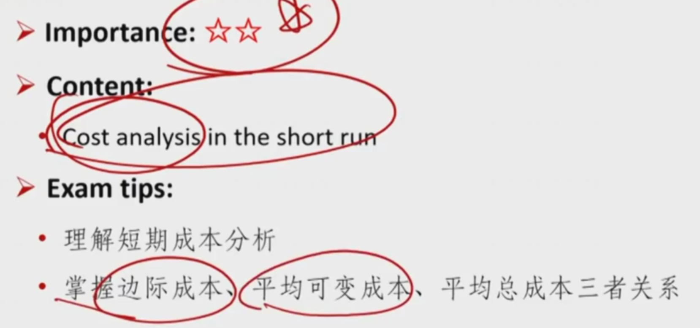

### R2.2 Perfect Competition and Imperfect Competition \*\*\*

这里是站在供给方，厂商的角度进行分类

#### Perfect Competition

- The individual firm has virtually no impact on market price(**price taker**)
- It is assumed to be a very small seller among a very large number of firms selling essentially **identical** products 无穷多的厂商都提供同质化产品
- The individual firm faces a **horizontal demand curve**

- AR = P是所有市场都成立
- MR = P只有完全竞争市场才成立（elasticity无穷大）

- 完全竞争市场$\iff$四线合一：Demand = P = AR = MR

#### Imperfect Competition

- The individual firm has enough share of the market and is able to exert some influence over price(**price maker**) 有限厂商，提供差异化产品
- A smaller number of firms in the market and in the extreme case only one firm
- Firms face **downward-sloping demand curve**

- 仍然有AR = P
- MR的斜率是demand curve的两倍。（通过求导可证明）

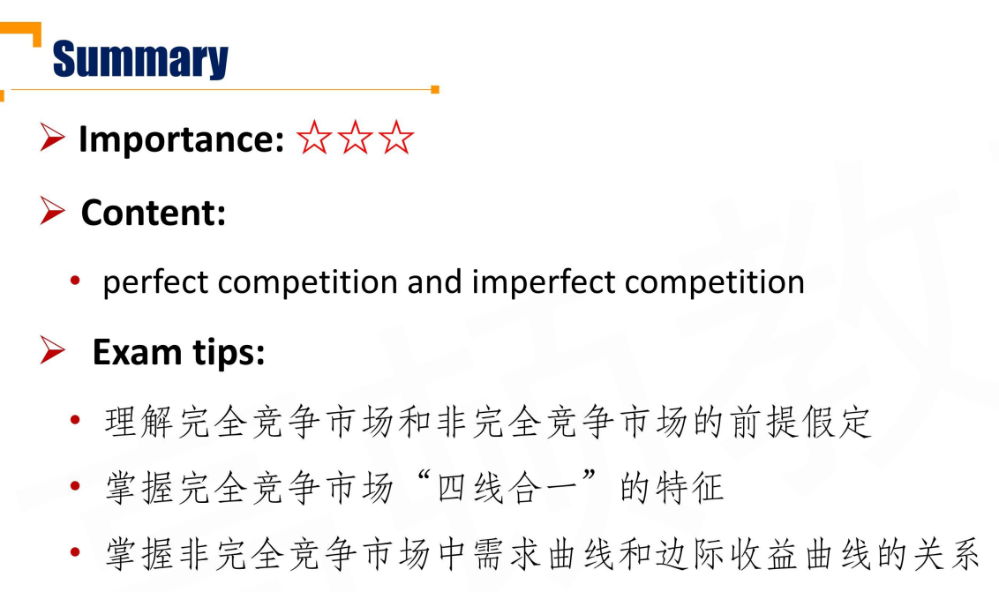

### R2.3 Profit Maximization

Describe approach to determining the profit-maximizing level of output

Distinguish between short-run and long-run profit maximization

#### Profit maximization

- There are two ways to find the point where profit maximizes
  - The difference between total revenue(TR) and total cost(TC) is the greatest
  - **Marginal revenue(MR) equals marginal cost(MC)**

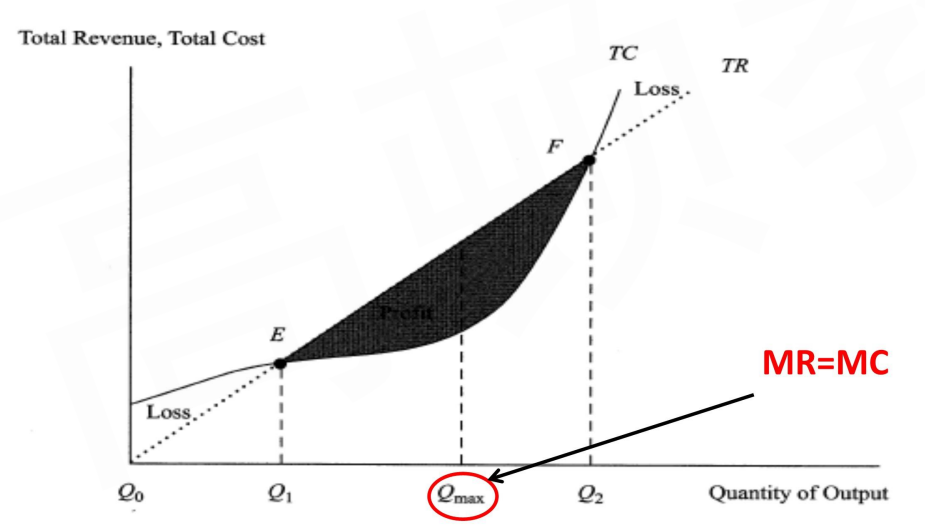

- 上面的$Q_{max}$，恰好有MC=MR。
- 由于给定P的时候，TR = PQ，MR = P。就是TR线的斜率。MC为TC线的斜率。所以相当于在TC线上找和TR线斜率相同的一点，及平移TR后，和TC相切的点。

#### Short-Run Equilibrium for Perfect competition

- P = MR = MC
  - 完全竞争市场：P = MR，equilibrium: MR = MC
  - 厂商都是price taker

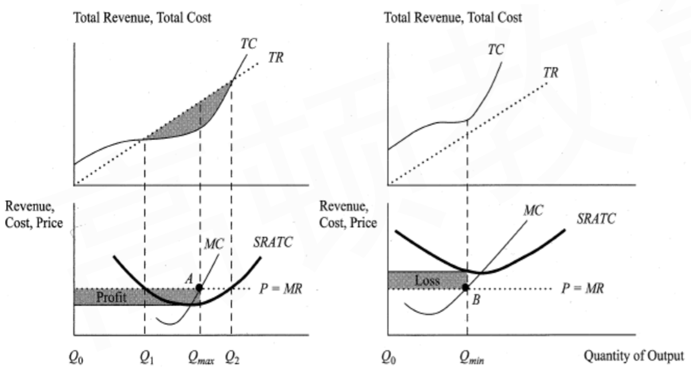

- 左边是短期赚取超额收益时的价格。先通过P = MR = MC，找到A点，是在当前市场价格下，企业最大化利润的产量$Q_{max}$，Revenue = P \* Q_max，Cost = ATC \* Q_max，所以阴影部分面积，就是赚取的超额收益（经济利润economic profit）.这里的ATC包括了implict cost and explicit cost
- 同理，右边是市场价格亏损的时候，厂商最小化亏损的产量。
- 厂商都是price taker，根据目前的价格，决定当前的产量
- 注意上面两个图和下面两个图的纵坐标尺度不一样。

#### Long-Run equilibrium for perfect competition 

- P = MR = MC **= ATC**
- 长期来看，firms earn **zero economic profits** in perfect competition

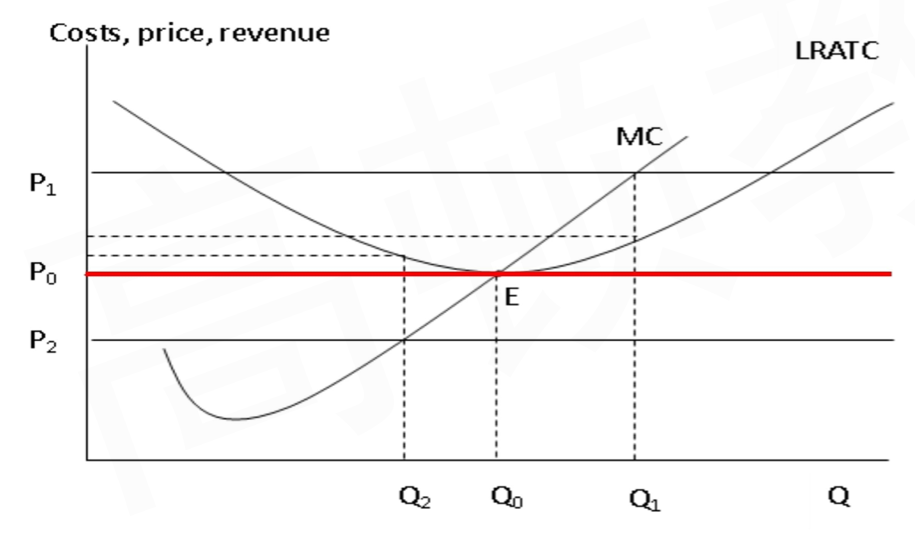

- 这里还有AC = AR = P
- 短期时，价格如果大于长期均衡价格（P1 > P0），会吸引更多竞争者进入行业，导致价格下跌到P0. 

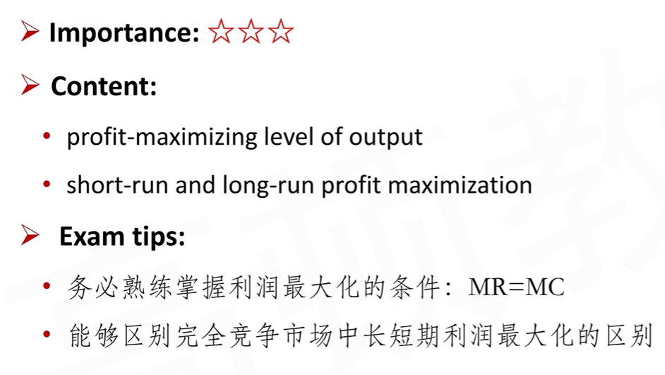

### R2.4 Breakeven Points and Shutdown points \*\*\*

Determine and describe breakeven and shutdown points of production

breakeven 是根据市场价格找Q使得盈亏平衡, shutdown points是根据P决定是否停业

#### Breakeven Points

- The breakeven point occurs when 

  - TR = TC
    - PQ = Q\* ATC => AR = P = ATC
  - the output quantity at which average total cost(ATC) equals price(P）
    - P = ATC

  - TC包括implicit and explicit cost
  - 短期存在两个盈亏平衡点，长期只有一个盈亏平衡点，并且等于利益最大化点

#### Shutdown points

- Short-run shudown point
  - average revenue(AR) equals average variable cost(AVC)
- Long-run shutdown point
  - average revenue(AR) equals average total cost(ATC)
- AR = P，

##### Summary:

- AR >= ATC, firm stay in the market
- ATC > AR >= AVC, firm stay in  market in the short run, but will exit the market in the long run.
  - 此时继续生产，AFC分摊到每个产品的成本减小，亏损不断减少
- AVC > AR, firm shut down in the short run and exit the market in the long run.

- 注意，AR = P。另外，这里考虑的AVC都是考虑的短期，因为长期long-run，所有成本都是Variable Cost，认为长期来看，AVC向ATC靠拢，合二为一。

所以，P在P1时，是长期的均衡点+盈亏平衡点+长期shutdown点

P在P1和P2之间，短期内坚持营业，但是长期亏麻了就停业了。

P在P2的时候，短期也停业不干了

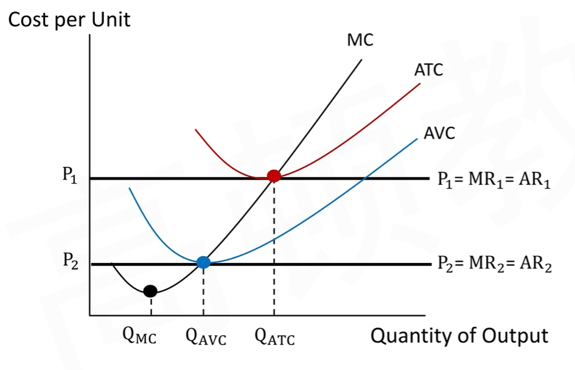

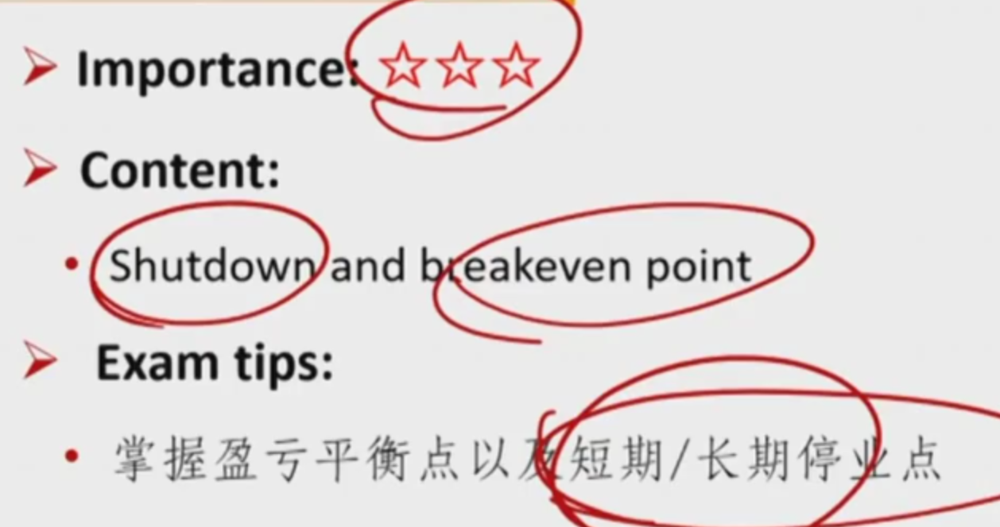

### R2.5 Economies of Scale 

- 长期来看，AVC向ATC靠拢，长期没有AFC
- 长期来看ATC会移动

#### Long-Run Average Cost Curve

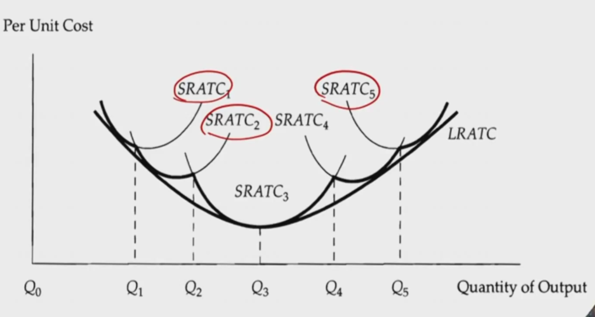

- 不同规模，导致的短期ATC不一样，选取长期来看能使得成本最低的企业规模。

#### Minimum Efficient Scale

- Minimum efficient scale is the scale the firm can product at lowest average cost.
  - The minimum point on the LRATC(long run average total cost)

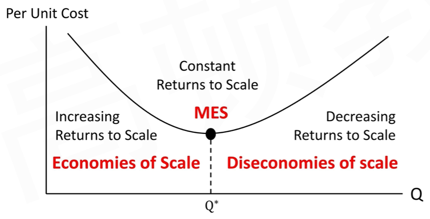

- 规模经济：产量增加，成本下降
  - 规模报酬递增（increasing returns to scale）. 当企业规模增加a倍，赚取的回报大于a倍增加。
- 规模不经济：产量增加，成本上升
  - 规模报酬递减（decreasing returns to scale）:规模增加a倍，回报增加小于a倍
- 规模最优（MES）

#### Economies of scale

- A firm moves to lower cost structures when it grows in size.
- Reasons:
  - **Increasing returns to scale**
  - Division of labor
  - Being able to afford more-expensive, but more-efficient equipment
  - Effectively reducing waste and lowering costs
  - Making better use of makret information and knowledge
  - Discouted price on resources when buying larger quantities

#### Disconomies of Scale

- A firm becomes less efficient with size
- Reasons:
  - **Decreasing returns to scale**
  - Management inefficiency
  - Overlap and duplication of business fucntions
  - Higher resource prices due to supply constraints

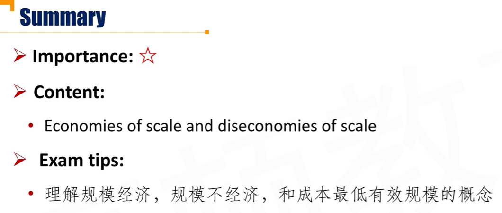
