# M2 The firm and Market Structures

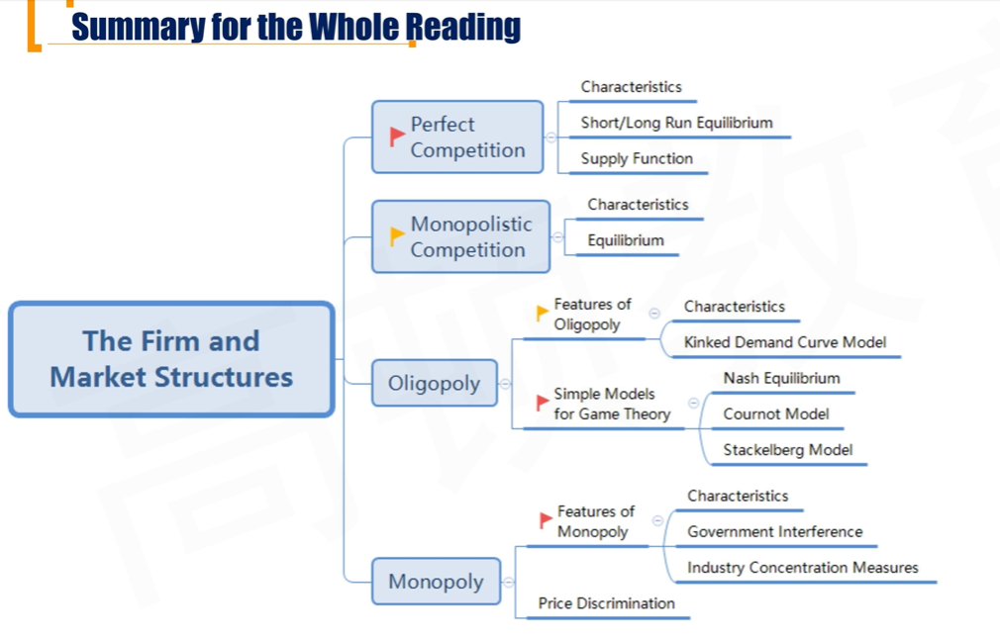

## R1 Perfect Competition

#### Different Types of Market Structure(站在卖方角度)

1. **Perfect competition**
2. **Monopoly**
3. **Monopolistic competition**
4. **Oligopoly**

- Five factors determine market structure
  - The number and relative size of firms supplying the product
  - The degree of product differentiation
  - The power of the seller over pricing decisions 定价能力
  - The relative strength of the barriers to market entry and exit 考虑进入和推出的壁垒
  - The degree of non-price competition 非价格竞争（广告）

#### Characteristics of Perfect competition

- There are a large number of potential buyers and sellers
- The products offered by the sellers are **identical**
- There are **no barriers** to entry and exit
- Sellers have no market-pricing power (**price taker** )
- Non-price competition is absent. 不用打广告

#### Short-run Equilibrium for perfect competition

- Profit maximization: **MC = MR**
- 所以：**MC = MR** = D = AR = P

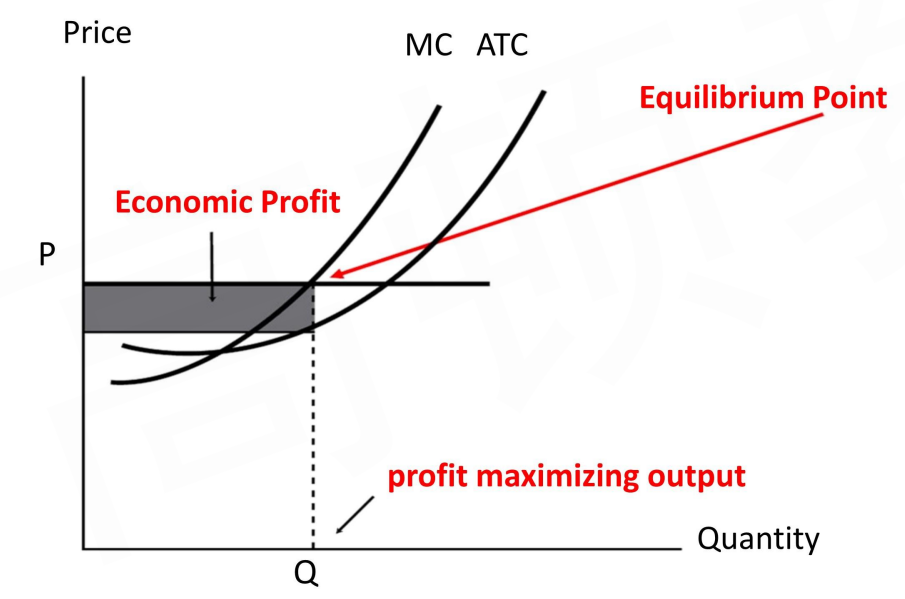

- 上图的时候能够产生经济利润，所以吸引更多商家进入。拉低价格，导致均衡点沿着MC线向下移动。直到下面的长期盈亏平衡点。

#### Long-run equilibrium for perfect competition

- **No firms earns economic profits**
  - 经济利润为0$\iff$ 会计利润覆盖隐性成本$\iff$ 赚取正常利润

- 所以，MC = MR = D = AR = **P = ATC**

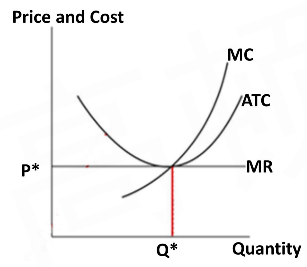

#### Short-run supply function

- **Firm's short-run supply curve is MC line above AVC**
  - 市场供给曲线就是MC线。因为盈亏平衡点沿着MC移动。
- **All individual** short-run supply curves are **horizontally added** to arrive at the short-run **market** supply curve.

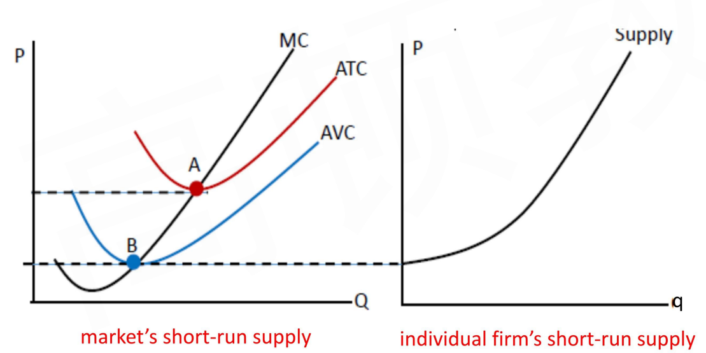

右边是单个公司的供给曲线。在short-run完全竞争市场中，B是shutdown point。所以对于单个公司供给曲线，B点处price产量为0.对于市场上所有公司的供给曲线进行 **水平加总**，得到左边MC从B开始的总的市场供给曲线

 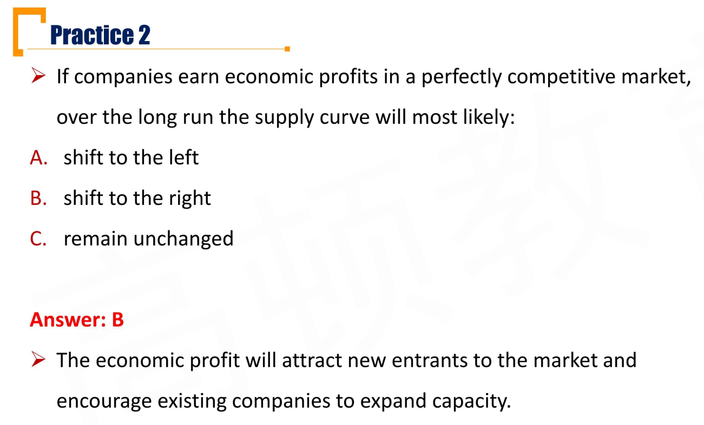

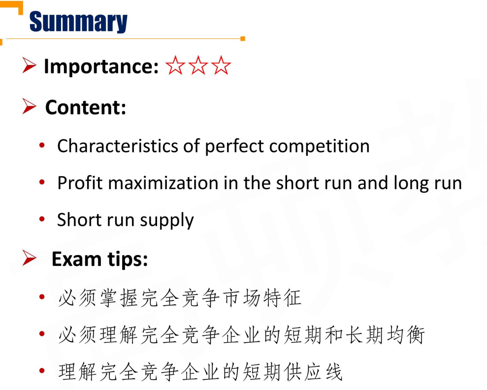

### R2 Monopolistic Competition 垄断竞争

#### Characteristics of Monopolistic Competition

- A large number of buyers and sellers
  - 大量的，也是有限个。区别于完全竞争市场的无限个。
- Differentiated products
  - 差异化产品
- Firms are free to enter and exit
  - 也是没有壁垒
- Some pricing power 
  - 一定的定价能力
- Suppliers differentiate their products through advertising and other non-price strategies

#### Equilibrium for Monopolistic Competition

- **Profit maximization input: MC = MR**
- Long-run equilibrium
  - P = ATC (**No firms earns economic profits**)

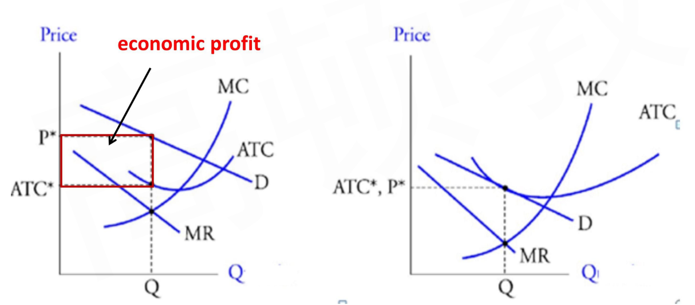       

- 长期来看，Demand和ATC相切，没有经济利润。
- 先画AC，再画MC从下往上穿过AC最低点，然后D线，然后MR线（斜率是D的一半）

#### Monopolistic Competition vs Perfect Competition

1. Monopolistic competition firms face downward-sloping, highly elastic demand curves(P-Q斜率较小); Perfect competition firms face horizontal demand curve
2. Product differentiation has costs, it has positive value to consumers.
   - 产品差异化有成本，ATC更高，垄断竞争的长期$P^*$比右边的更高；从而垄断竞争的产量更少
3. Because firms are free to enter and exit. Long-run equilibrium, both monopolistic competition firms and perfect competition firms earn no economic profits. 长期，都是经济利益为0.
4. Long-run equilibrium quantity of monopolistic competition industry is less than optimal (perfect competition industry) 
   - 寡头垄断，定价比完全竞争高，产量比完全竞争少。

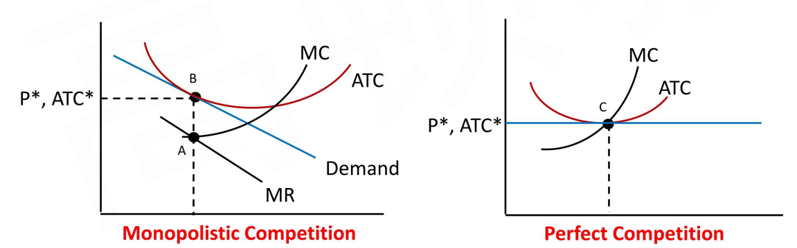

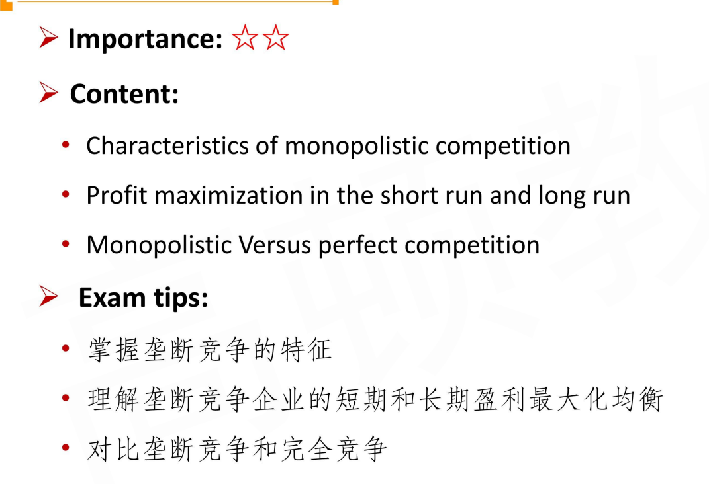

### R3 Oligopoly 寡头垄断市场

#### Characteristics of Oligopoly

- A small number of potential sellers
- Products can be close or differentiated
  - 产品可以同质化或者差异化，通过广告等手段突出差异化
- Entry in to the market is difficult
  - 壁垒高比较难进入
- Substantial pricing power
  - 定价权
- Products are highly differentiated through marketing, features, and other non-price strategies.

#### Kinked Demand Curve Model 拐折需求曲线模型

- **Assumption**: an increase in a firm's product price will not be followed by its competitors, but a decrease in price will. 这个模型的一个假设：跟跌不跟涨。
- Elasticity of demand is greater when price increases than decreases
- **Sticky price**: Price could be irresponsive to cost shift
  - 边际收益MR中间有一条竖线。
  - 对于规模经济，选取不同的规模，TC不一样，MC也不一样。当选择不同规模的时候，MC移动的时候，有一段时间提高价格无法提高销量。

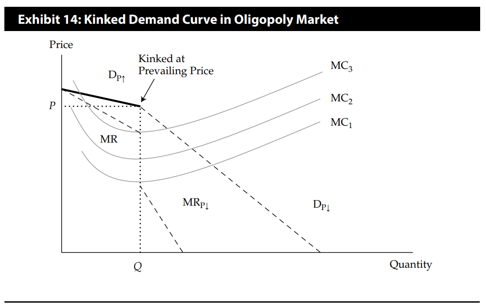

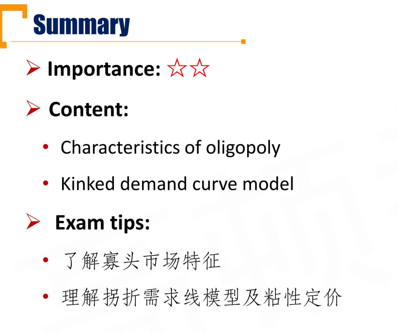

#### Simple Models for Game Theory 博弈论

##### Nash Equilibrium

- **Nash equilibrium**: Participants in a **non-cooperative game** have no incentive to deviate from their respective strategies after they have considered and anticipated their opponent's rational choices or strategies. 非合作博弈，无论对方采取什么策略，自己都会采取支配性策略。

- **Collousion串谋**：Firms make an agreement among themselves to avoid various competitive practices.
  - 比如：OPEC石油输出国组织
  - Reason for collusion: Increased profits, reduced cash flow uncertainty, and construct barriers to entry
- Factors that affect the chances of successful collusion 串谋的破裂
  - The number and size distribution of sellers 人越多越难合谋
  - The similarity of the products 产品同质性
    - 差异化越小，串谋越稳定
  - Cost structure 每个成员的成本结构相似性
    - 成本结构越相似，串谋越稳定
  - Order size and frequency
    - 订单频次越小，串谋越稳定。（背叛成本高）
  - The strength and severity of retaliation惩罚措施

##### Cournot Model

- A two-firm duopoly market
- **Assumption:** each firm determines its profit-maximizing production level by **assuming** that the other firms' output will not change. 基于产量（Q）的策略假设。基于对方的产量，决定自己的产量。
- In long-run equilibrium, output and price are stable
  - There is no change in price or output that will increase profits for either firm
  - Cournot solution(price and quantity) falls between the competitive equilibrium and monopoly solution
    - P完全竞争 < Pcournot < P垄断
    - Q完全竞争 > Qcournot > Q 垄断

##### Stackelberg Model

- **Dominant firm(DF)** has a large market share with scale effect, determining the market price **as a monopoly company**, when **MR = MC**
- **Other competitive firms(CF)** take market price as given
- 主导企业根据自己的MC和MR确定最优点P和Q，小企业（CF）接受P（小企业看作完全竞争市场（P = AR = MR））。小企业的需求曲线和大企业的需求曲线进行水平加总，获得Market Demand

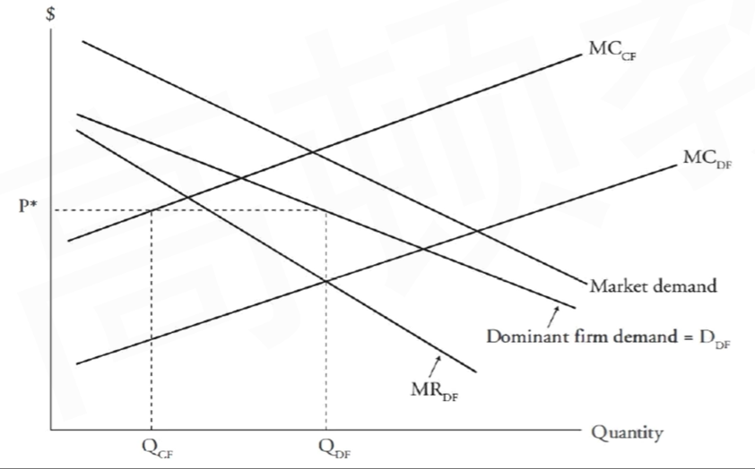

- If **the other companies** in the market attempts to gain market share by undercutting the price set by the dominant firm, the market share of the **dominant firm** will **increase ultimately**
  - 小公司降价，不会影响主导公司的决策。影响的是各个小公司（CF）的定价策略，其他小公司跟着降价，导致经济利益下降，有可能导致部分小公司退出市场，释放新的市场份额。这时候DF就会重新定价，抢占释放出来的部分市场。
- **Over time**, the **dominant company's market share** tends to decrease as profit attract entry by other companies. 如果更多小公司进入行业，DF的份额下降。

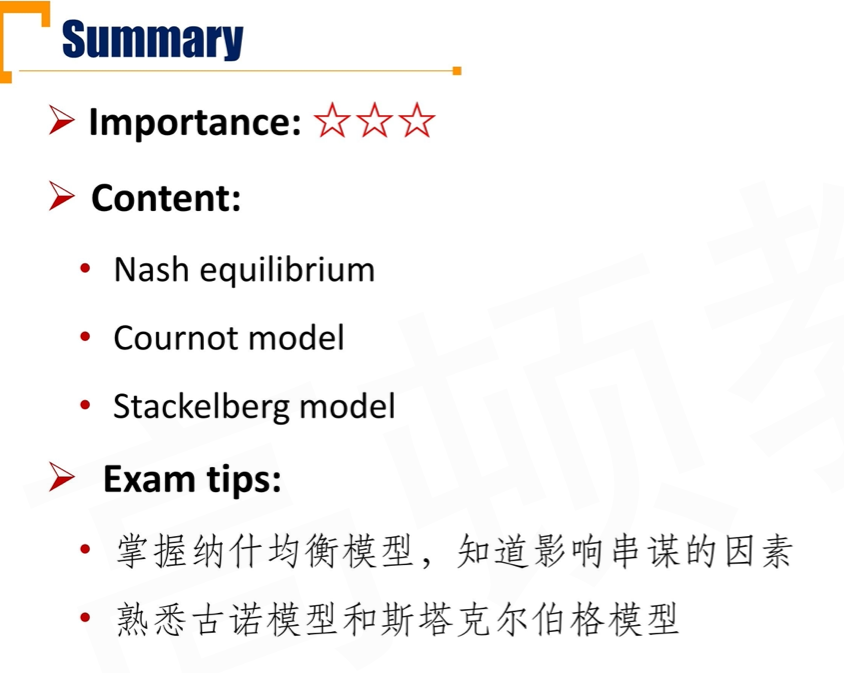

### R4 Monopoly 完全垄断

#### Features of Monopoly \*\*\*

##### Characteristics of Monopoly

- There is a single seller
- The product offered by the seller has no close substitute
- Entry into the market is very difficult, with high costs and significant barriers to competition
- The firm has considerable pricing power
- Non-price strategies such as advertising do work

##### Type of Barriers to Entry\*\*

- Government licensing and legal barriers
- Resource control 资源控制（包括技术，专利）
- **Natural monopoly**: Production is based on significant economies of scale and declining cost structure in the market. \* 自然垄断：由于规模经济效用，一家厂商提供服务对于社会的成本最低。（注意不是对某个资源的垄断）
  - Examples: electric power generation, natural gas distribution, and the water and sewer industries.

##### Monoploy

- Firm faces downward-sloping, inelastic demand curve
  - Profit maximization input: **MC = MR**
  - 对比：完全竞争（横线，弹性无穷大）、垄断竞争（向下倾斜，弹性较大）、完全垄断（向下倾斜，但是弹性较小）
- **Economic profits can exits** in the short/long run due to high entry barriers
  - 长期也存在经济利益，这里和之前的完全竞争/垄断竞争不一样
- Monopoly firm produce less total output and charge a higher price than perfect competitive firm to maximize profits，价格高，产量低

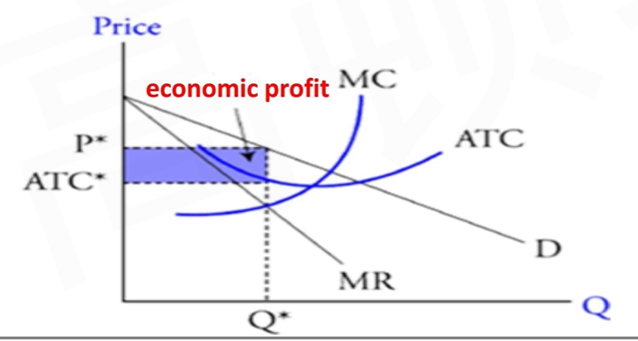

##### Government Interference \*\*\*

- Government interference imporeoves resource allocation by regulating the prices monopolies. 两种限价措施，针对P进行干预。
  - **Arverge cost pricing**: P = ATC, no economic profit
    - 下图蓝色的点
  - **Marginal cost pricing:** P = MC, government subsidy亏损，需要政府补助
    - 下图绿色的点

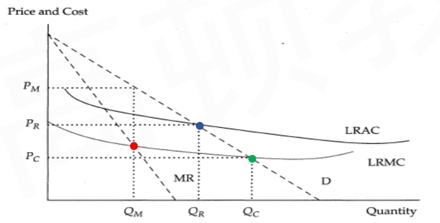

##### Industry Concentration Measures

- N firms concentration ratio($CR_N$)
  - Sum of the market shares of the largest N firms in a market
    - It doesn't show the potential entry threat
      - 没有考虑潜在进入的竞争对手
    - It is less affected by mergers
    - It doesn't consider the elasticity of demand
- **Herfindahl-Hirschman Index(HHI)**
  - Sum of the squared market share of each firm
    - It doesn't show the potential entry threat
    - It doesn't consider the elasticity of demand
    - 通过平方放大差距，可以更好体现merge的发生，收到merge的影响更大

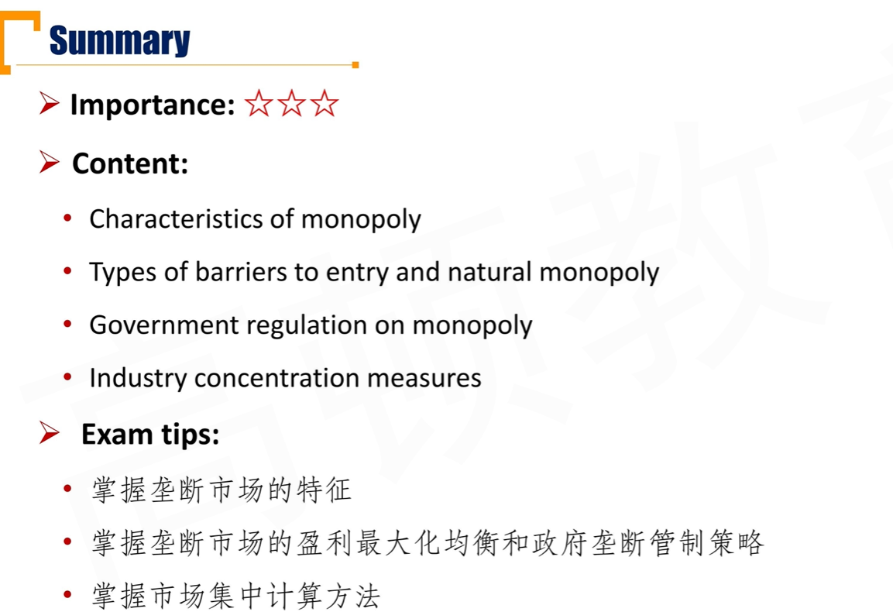

#### Price Descrimination

##### Consumer surplus and producer surplus

- **Consumer surplus** is the difference between the total value to consumers of the units of a good that they buy and the total amount they must pay for those units
- **Producer surplus** is the difference between the total revenue sellers receive fro selling a given amount of a good and the total variable cost of producing that amount.

##### Price Discrimination

- **Price distrimination:** charging different consumers different prices for same product or service
- **Assumptions:**
  - customers with different price elasticities of demand for same product. 不同的顾客对同样的产品有不同的需求弹性。
  - Prevent one who bought the product with the low price from reselling it to another who is willing to pay the higher price.假定没有黄牛，没有人进行套利。

##### Types of Price Discrimination \*\*\*

- **First-degree price distrimination**: Charge each customer the highest price the customer is willing to pay
  - Consumer surplus equals zero。厂商已经知道每个消费者的最高出价。
- **Second-degree price distrimination**: Monopolist offers a menu of quantity based pricing options designed to induce customers to self-select based on how highly they value the product.
  - 出发点：需求量不同。多买一点就便宜。
- **Third-degree price distrimination**: Customers are segregated by demographic or other traits.
  - 出发点：根据人群分类

##### Price discrimination

- Compared with monopoly industry:
  - price discrimination reduces allocation inefficiency by increasing output
  - Consumer surplus: decrease
  - producer surplus: increase
  - Company's profits can be increased by price discrimination

- 下面的B和C选项：在上图的完全垄断商家。在单一定价法时，定的价格时P\*，如果采用完全价格歧视，则需要通过区别定价，吃掉黄色部分的consumer surplus。另外，要区分清楚上面的MR线是统一定价法确定的MR. 对于价格歧视的方法，每生产一个产品，销售收入P，P=MR。所以，实际的MR是和Demand曲线一致的，所以在最优价格歧视法定价得到的最优产出是$Q_2^*$.
  - 虽然P=MR，但是这里和完全竞争市场的P=MR有着本质区别，这里的P是不断变动的。

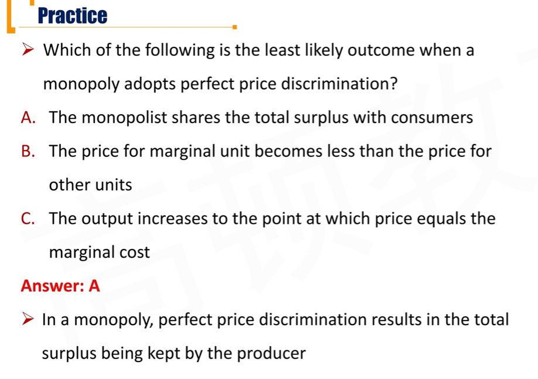

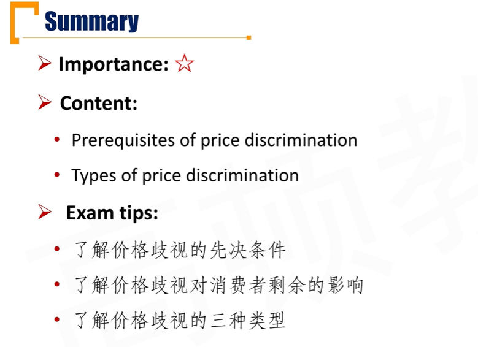

