# M3 Aggregate Output, Prices, and Economic Growth

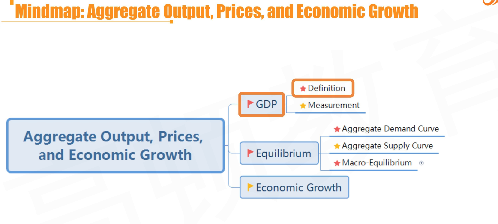

## R1 GDP\*\*\*

#### Gross Domestic Product(GDP)

- Gross domestic product(GDP) is the total market value of the goods and services produced in a country within a certain time period.
  - 国内生产总值是指**一个国家**在**一段时间内***新生产出*的**最终**商品或服务的总市场价值。

- **Key points of GDP**
  - In a country
    - GDP是属地的概念。A国人在B国生产，算做B国GDP。
    - 对比：GNP是属人概念。A国人在B国生产，算A国GNP
  - In a given period of time
    - 流量的概念，时间段概念。
  - newly goods and services produced
    - 不管当年有没有卖出，新生产的都算作当年GDP
    - 当年没有卖出的产品，次年卖出不在次年确认GDP
  
  - final goods and services
    - 核算最终产品，不能重复核算（比如零部件）
  - market value
    - 核算的是市场价值
  - Exceptions: rent of own house, government services
    - 涉及到政府服务，算作GDP，但是用成本核算（不是market value）
    - 新的自用住宅，以租金形式确认进入GDP（不是整个房子的价值）
  
- The following factors are **excluded** from GDP:

  - The sale or resale of goods produce in precious period
    - 之前生产的不算
  - Transfer payment（转移支付）made by the government
    - (e.g.) unemployment, retirement, and welfare benefits
    - 只是货币挪个地方，没有产生新的产品
  - In-process goods
  - The value of labor not sold 没有交易的劳动力
    - e.g. homeowner's repairs to his own home，家庭主妇
  - Underground economy 非法经济, breaking bad

- **Value of final output** and **sum of value added** method

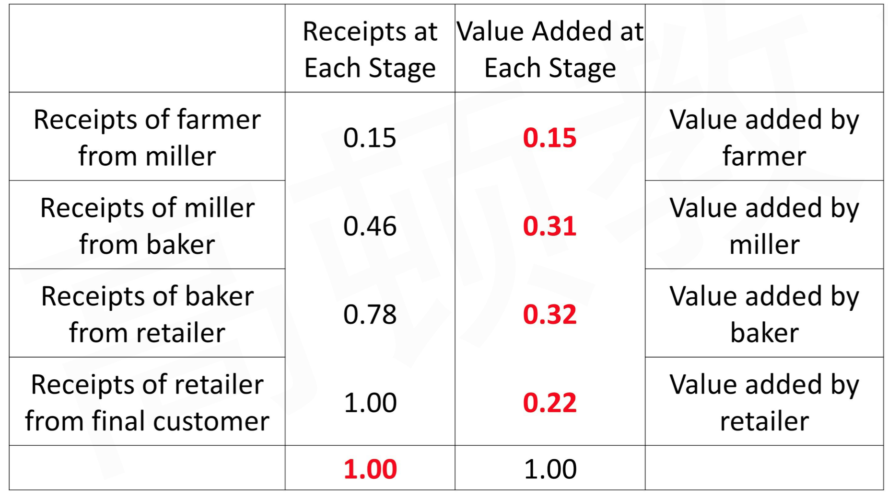

##### Nominal GDP and Real GDP

- Nominal GDP is measured by **current prices**

$$
Nominal\ GDP_t=\sum_{i=1}^{N}P_{i, current\ year}\times Q_{i, current\ year}
$$

- Real GDP is measured by **constant prices**

$$
Real\ GDP_t=\sum_{i=1}^{N}P_{i, base\ year}\times Q_{i, current\ year}
$$

##### GDP deflator**平减指數**\*\*\*

$$
GDP\ deflator=\frac{Nominal\ GDP}{Real\ GDP} \times 100
$$

- 反映了通过通货膨胀率：
  - GDP deflator > 100 -> current price > constant price -> inflation
  - GDP deflator < 100 -> current price < constant price ->deflation

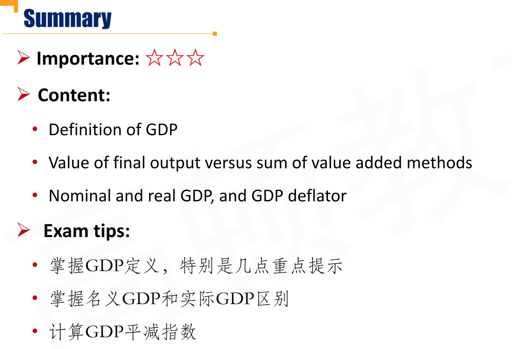

#### Measurement of GDP

##### Aggregate Output/ Aggregate Income /Aggregate Expenditure

- **Aggregate Output(AO)**: The value of all the goods and services produced in a specified period of times
- **Aggregate Income(AI):** The value of all the payments earned by the suppliers of factors(生产要素) used in the production of goods and services.
- **Aggregate Expenditure(AE):** The total amount spent on the goods and services produced in the domestic economy during the period.

$$
AO=AI=AE=real\ GDP=Y
$$

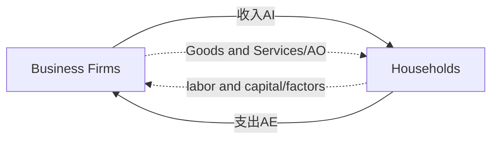
```mermaid
graph LR
B--收入AI-->A

A[Households]-.labor and capital/factors..->B[Business Firms]

A--支出AE-->B
B-.Goods and Services/AO.->A
```

- 这实际上就是核算GDP的三个维度。

在分析GDP时候，分为四个部门（sector）household，firm，government, 国际

- 国内sector
  - private sector
    - household
    - firm
  - government sector
- 国际sector
- 所以，GDP就是根据不同的统计维度（AE，AI），计算这四个部门的对应部分。

##### Using the Expenditure Approach 支出法

- **GDP = C+ I+ G + (X - M)**

  - C: Consumer spending on final goods and services 家庭消费支出
  - I: Gross private domestic investment(e.g. plant and equipment) and changes in inventory(inventory investment) 企业投资支出
    - 所以C和I就是private sector
    - 金融投资都不算在 **I** 里面，比如个人的买股票，企业买股票。
    - 这里 **I** 是投资实物资产，而个人投资算做储蓄（saving）。可以理解为，买股票相当于投资给了公司，公司用资金去投资（I），不能重复核算。
  - G: Government spending on final goods and services 政府
    - 注意：转移支付不会影响GDP。因为钱从某些群体转移给了另一个群体，被补助群体会用钱进行支付，所以不能重复核算。
  - X: Exports
  - M: imports

  - 所以，上面公式，就体现了四个部门汇总的支出：C(household)，I（firm)，G（government), X-M（international）

##### Using the income approach

收入法有两个方法，CFC和CCA其实一样

- GDP = Gross domestic income (GDI)

  = Net domestic income + Consumption of fixed capital(CFC) + statistical discrepancy

  = National Income + Capital consumption allowance(CCA) + statistical discrepancy

  = Consumer spending on final goods and services + 

  Domestic private sector savings +

  Net taxes（C+S+T)

- **GDP = National Income(国民收入) + CCA + SD**

  - CCA(capital consumption allowance): **depreciation** of the capital stock that occurs in the production of goods and services
    - 设备折旧补偿。拿出一部分总收入（GDP）来修设备等，剩下的就是国民收入（National Income）
  - SD(statistical discrepancy): the difference between two methods to calculated GDP
    - 残差项。和支出法之间的误差。

  - **National Income**= (家庭+企业+政府部门的收入)

    - \+ Employees' wages and benefits
    - \+ corporate and government enterprise profits pre-tax
      - 这里是税前（相当于政府收的直接税在这里就核算掉了，后面的政府收入只需要补充一个indirect business taxes间接税 ）
    - \+ unincorporated business owners' income
      - 个体户收益
    - \+ interest income 
    - \+ rent 
      - interest income/rent，提供资金/固定资产生产要素产生的回报
    - \+ indirect business taxes
    - \- subisidies
      - 补贴：政府给企业和个人的补贴。已经在上面核算，需要减掉。

    - **Personal Income**(个人收入)=

      = National income

      \- Indirect business taxes (减去政府收入)

      \- corporate income taxes （减去政府收入）

      \- undistributed corporate profits （减去企业收入，未分配利润（分配的分红都会落到个人，所以不能扣减））

      \+ transfer payments

      - 这里可以这么理解：政府收入=直接税+间接税 - 补贴（包括个人和企业）。所以减去政府收入，获得个人收入时候，需要把个人的转移支付加回去。（转移支付一般指的是政府补贴的一部分，转移给个人）

  - **Personal disposable income = personal income - personal tax**
    - 个人可支配收入，需要减税
    - 个人可支配收入也可以用消费+储蓄核算

- **GDP = C + S +T** 收入法\*\*\*

  - C（家庭部门） : consumer spending on final goods and services
  - S（企业部门）: Domestic private sector savings
    - S = S_business + S_individual，私人部门储蓄，企业和个人的储蓄之和
  - T（政府部门）: Net Taxes
    - 净税收 = 总税收 - 转移支付

- GDP = C + S + T的一个推导方法：
  - 个人可支配收入 = 个人收入 - 个人tax = 国民收入 - 间接税 - 直接税 - 未分配利润 + 转移支付 - 个人税 = 国民收入 - 税 - 企业未分配利润
    - **间接税 + 直接税 + 个人税 = 政府税收收入**
  - 另外，国民收入 = GDP - CCA
  - 所以，个人可支配收入 = GDP - CCA（折旧）- 税 - 企业未分配利润 + 转移支付
    - **由于企业未分配利润 + 折旧等于企业留存现金（约等于NI + NCC），也就是企业储蓄（S_business）**
  - 所以个人可支配收入 = GDP - 税 - S_business + 转移支付
  - 于是又有个人可支配收入 = 个人消费 + 个人储蓄 = C + S_individual = GDP - 税 - S_business
  - 所以，推导得到GDP = C + S + 税 - 转移支付 = C + S + T

##### Marginal Propensity 边际倾向

- marginal propensity to consume(MPC)
  - The proportion of additional disposable income spent on consumption
- Marginal propensity to saving(MPS)
  - The proportion of additonal disposable income spent on savings

$$
MPC + MPS = 1
$$

- 注意，转移支付不会提高GDP。钱搬来搬去不会创造财富。一般是税收增加才会增加转移支付。也就是GDP= C + S + T，Net Tax增加才会增加。

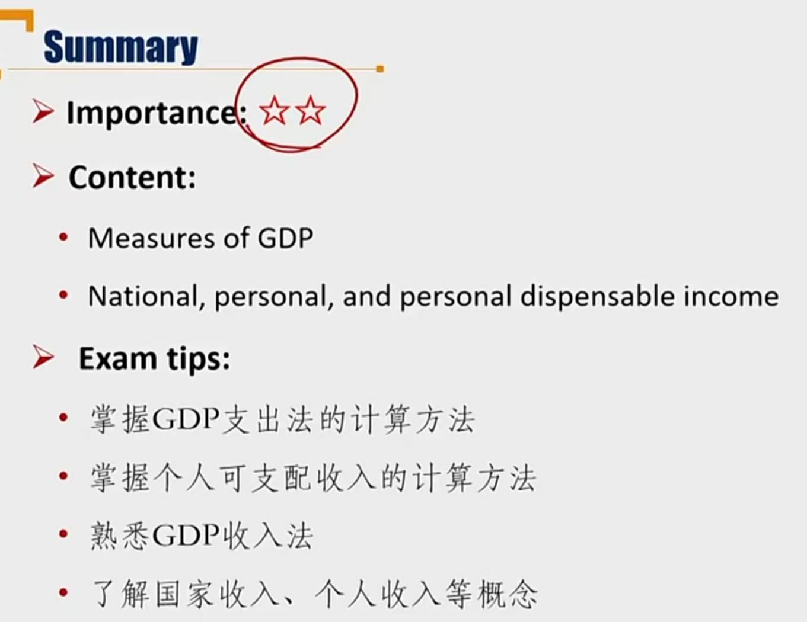

## R2 Equilibrium

### 2.1 Aggregate Demand Curve \*\*\*

- Aggregate demand (AD) represents the quantity of goods and services that households, businesses, government, and international customers want to buy at any given **level of prices**
- AD curve looks like the ordinary demand curves that we encounter in microeconomics, but the intuitive **does not** apply here because income is not fixed. 收入不是固定
- 注意坐标，纵坐标是price level，物价水平。横坐标就是GDP。

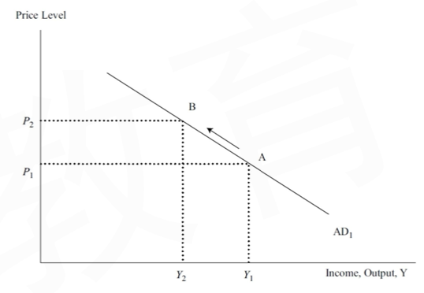

##### Three effect to explain the downward slope of AD curve

1. **Wealth Effect**

   - An increase in the price level decreases the quantity of goods and services that can be purchased with the fixed quantity of nominal wealth: consumers are less wealthy(in real terms) and therefore demand fewer goods and services

   $$
   P\uparrow \implies real\ wealth \uparrow \implies Demand \downarrow
   $$

2. **Interest Rate effect**

   - A higher price level creates greater demand for money, which raises the interest rate
   - The higher interest rate decreases demand for investment and consumption expenditures, which leads to elss demand for goods and services.

   $$
   P\uparrow \implies Money\ Demand \uparrow \implies Interest\ Rate \uparrow\\ \implies investment\ and\ consumption \downarrow \implies Demand(GDP)\downarrow
   $$

   

3. **Real Exchange Rate effect**

   - A higher price level affects the real exchange rate and makes domestic goods more expensive, and thus lower demand for domestic goods and services.

$$
1)P \uparrow \implies real\ exchange\ rate\ appreciate(本币升值)\implies \\X \downarrow M\uparrow \implies Demand(GDP) \downarrow\\
2)P \uparrow \implies Interest\ Rate\uparrow\implies foreign\ money\ inflow\uparrow\\\implies real\ exchange\ rate\ appreciate\implies ... \implies GDP \downarrow
$$

##### Factors that shift the aggregate demand

- **Household wealth**
  - Stock prices
  - Housing prices
  - 居民财富增多，AD shift right
- Consumer and business expectations
- Capacity utilization(产能利用率)
  - 利用率越高，shift right

- **Fiscal policy**
  - Government spending
  - Taxes
  - 扩张财政政策使得AD shift right
- **Monetary policy**
  - 扩张货币政策使得AD shift right
- Exchange rate
  - 影响 X - M
  - 本币贬值，有利于出口，AD向右移动
  - 本币升值，有利于进口，AD向左移动
- Growth in the global economy

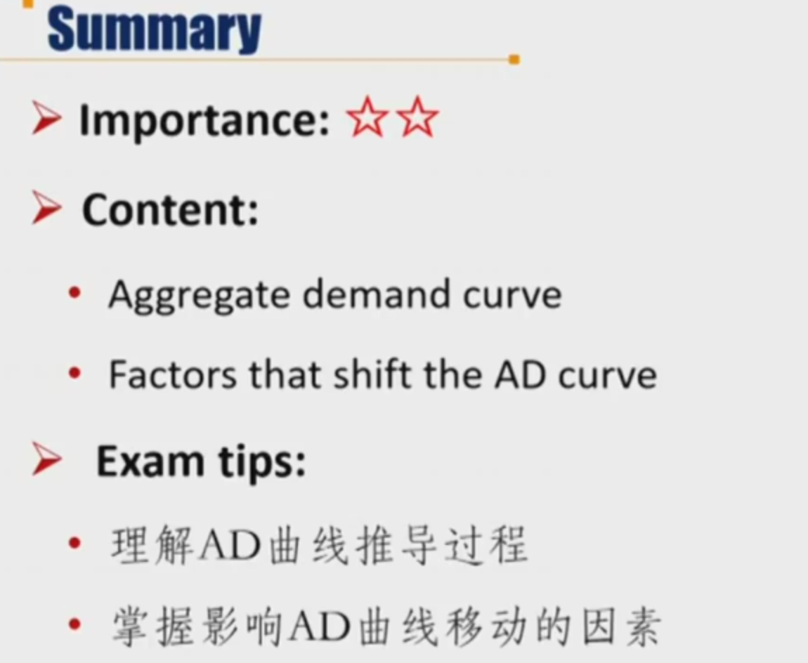

#### 补充：IS-LM Model

##### Balance

- **Aggregate income(AI) = Aggregate expenditure(AE)** ( = AO)
  - Using the **expenditure** approach: GDP = C + I + G + (X - M)
  - Using the **income** approach: GDP = C + S + T
- **S - I = (G - T) + (X - M)**
  - G - T: fiscal balance， 政府财政收支，G支出，T收入
    - G - T > 0, government **deficit** 赤字
    - G - T < 0, government **surplus** 盈余
  - X - M: net exports, or trade balance贸易平衡情况
    - X - M > 0, trade **surplus**
    - X - M < 0, trade **deficit**

##### GDP对S、I、G、T、X、M的影响

- GDP的支出法和收入法，都是站在S、I等变量的角度考虑。比如私人储蓄变多，GDP上升
- 从GDP作为自变量的角度考虑：
  - GDP上升，S储蓄上升。（一般有S(Y) = sY）
  - GDP上升，一方面，提升了企业对未来的信心，I上升；另一方面，利率上升，企业投资的机会成本上升，所以I下降；GDP的影响比较间接，所以一般我们把利率作为投资的主要影响因素。
  - GDP变化，一般不影响政府支出G
  - GDP上升，政府税收T上升
  - 本国GDP上升，本国居民储蓄增加，增加进口。
  - 外国GDP上升，外国居民购买力增加，增加出口。

##### IS Curve

- S = I + (G - T) + (X - M)
- To simplify we ignore the government and foreign sector
  - 也就是假定G - T = 0，X - M = 0

- **S(Y) = I(r)**
  - Y是real GDP, r 是 real interest rate

- **IS Curve** presents an inverse relationship between income and the rela interest rate

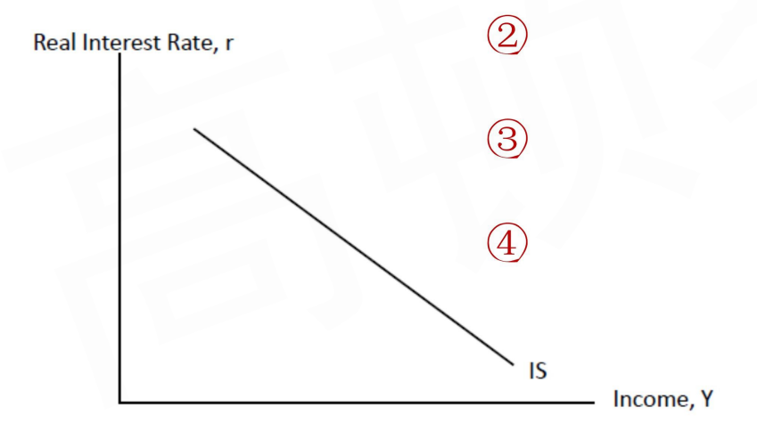

- IS曲线代表商品市场均衡
- 在IS曲线上，代表投资I = 储蓄S（商品市场）；
  - 在IS曲线上方：投资 < 储蓄（供给大）
  - 在IS曲线下方：投资>储蓄（需求大）
- IS曲线上的movement(点到点)，以及shift（线的移动）：
  - Movement意思是利率r变化，影响投资I，从而影响GDP（Y)
  - shift意思是利率意外的因素发生变化（G政府投资、进出口等），影响到Y，使得IS曲线发生变化
- 扩张性财政政策->IS向右移动；紧缩性财政政策->IS向左移动

##### Quantity Theory of Money

- **MV = PY**
  - M: Nominal money suply（央行，名义的货币供给（剔除通胀））
  - V: Velocity of money in transactions 货币流通速度（就是一张纸币流通的次数）
  - P: Average price level 
  - Y: Real GDP / Income/expenditure （注意这里是real GDP）
    - 名义GDP = 实际GDP \* 物价price
    - 所以PY = 名义GDP
- **Money Neutrality** 货币中性假设
  - Monetarists consider that velocity of money and real GDP change only slowly 
  - Change of money supply only cause fluctuation of price leverage doesn't affect real output in long run. 
    - real GDP不受到货币供给的影响

##### Keynes's Demand for Money Theory \*\*\* 凯恩斯货币需求理论

- **Transactions  demand for money**: Money held to finance transactions, transaction demand rising with larger GDP 
  - 交易需求。$Y\uparrow \implies D\uparrow$
- **Precautionary demand for money:** Provide a buffer against undoreseen events that might require money, precautionary demand rising with larger GDP.
  - 预防性需求$Y\uparrow \implies D\uparrow$
- **Speculative demand for money:** Money held to take advantage of the potential opportunities or risks, speculative demand rising with lower interest rate.
  - 投机性需求。 $r\downarrow \implies D\uparrow$. 市场利率低，持币观望，减少投资，所以货币需求量高。

##### LM Curve

$$
\frac{M^S}{P}=M^D(r,Y)
$$

- 由MV = PY 得到M / P = P / V是个常数。M 是名义货币供给，M/P是实际货币供给。

- 上式表明供需平衡。

- LM curve presents an positive relationship between **income** and the **real interest rate**.
  - 因为M/P是常数。所以M(r,Y)是常数。如果r上升，由凯恩斯货币需求理论知道，货币需求下降。如果要使得上式为常数，则必须有另外一个变量使得需求上升，那就是实际GDP（Y）

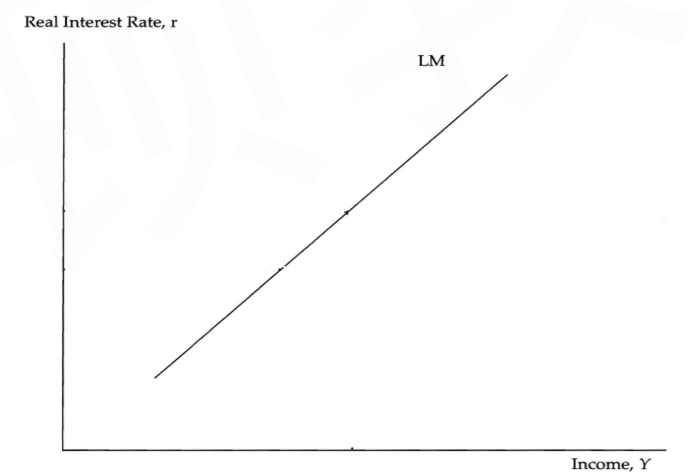

- IS是商品市场，LM上的点代表的是货币市场均衡。

- LM上的点代表均衡；LM右边的点需求大于供给；LM左边是需求小于供给
- movement and shift:
  - 利率上升，导致Y上升（线上movement）
  - (刺激性)货币供给增加，shift right
    - 如果其他因素不变，物价水平下跌，由Ms/P = Md，得到货币真实供给量上升，也能得出shift right的结论。

- 扩张性货币，LM向右移动
  - 扩张性财政政策，IS向右移动

##### IS-LM Curve

- The intersection of the IS and LM curves determines the combination of real output and the real interest rate.
- IS是商品市场均衡，LM是货币市场均衡
- IS-LM交点既是商品市场均衡，又是货币市场均衡

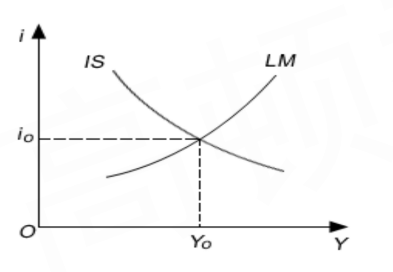

下面要用在real interest rate- real GDP坐标下的IS和LM曲线，推导出Y和Price level的总需求曲线。记住，每张图的横纵坐标最重要。

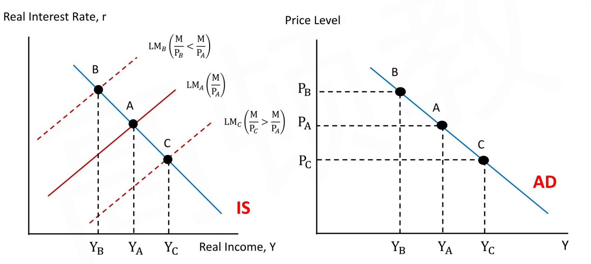

- 左图中PC < PA < PB，由对应的LM的shift，得到YB < YA < YC，得到AD向下。
- 物价水平上升，LM曲线和IS交点向上移动，导致real GDP下降。
- 也就是AD上的每一个点，有对应的IS-LM交点。

- Aggregate Demand curve presents an **inverse** relationships between the **price level** and **real output**

### 2.2 Aggregate Supply Curve

- **Very short run**
  - Companies increase or decrease output to some degree without changing price
  - 超短期内，物价水平对GDP没有关系
- **Short run**
- **Long run**
  - **Wages and other input prices** change proportionately so that higher aggregate price level has no impact on aggregate supply
  - **The level of output as**
    - **Potential GDP**(LRAS和横轴的交点，潜在GDP，所有资源得到充分利用，可以用来评价国家的经济情况)
    - **Full employment/Natural rate of unemployment**
      - 充分就业的时候，GDP达到Potential GDP
      - 充分就业不等于没有失业，其失业率等于自然失业率

#### Aggregate Supply Curve

- Very short-run aggregate supply(VSRAS) curve is **perfectly elastic**
- Short-run aggregate(SRAS) curve is **upward sloping**
- Long-run aggregate supply(LRAS) curve is **perfectly inelastic** 
  - 从图像看，也可以理解为改变物价水平，不会改变总产出。（货币中性）
  - 注意，横坐标是real GDP
  - 长期曲线是超短期曲线选择得到，因为从长期来看，所有的成本都是可变成本（AVC）。厂商售价提高，成本也会提高，刚抵消掉提高的产出。

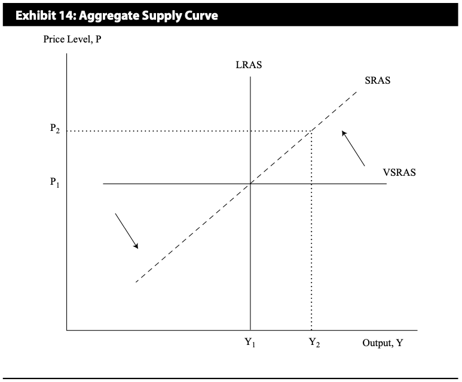

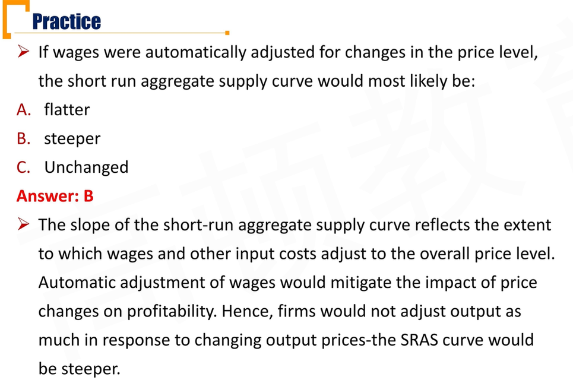

#### Factors that shift the short-run aggregate supply

短期曲线，其实是生产意愿的影响。

- **Nominal wages**
- **Input prices**, including the price of natural resources
  - Inputs price/wages $\uparrow \implies$ 企业生产意愿下降 $\implies$ shift left
- Expectations about future output prices and the overall price level
- **Business taxes and subsidies**
  - 政府的政策更多是影响AD曲线
- Exchange rate
  - 本币升值，购买国外原材料更便宜，生产意愿提高，shift right

#### Factors that shift the long-run aggregate supply

潜在GDP如何变动，供给（资源禀赋）增加，产出变高。

- Supply of natural recourse
- **Supply of physical capital** 实物资本
- **Supply of labor**（人力资源数量）
- Supply of human capital（人力资源质量）
- **Labor productivity and technology**
  - 劳动生产率
  - 全要素生产率

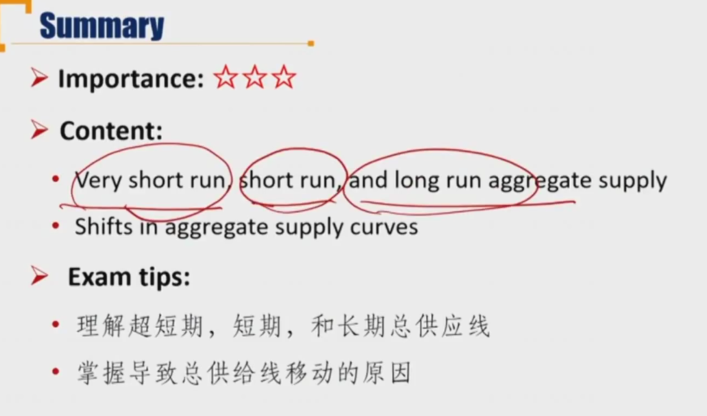

### 2.3 Market Equilibrium

4种phoenomenum

#### Long-run Equilibrium

- Under long-run full employment equilibrium
  - The economy is at **potential real GDP**
  - Both labor and capital are **fully employed**
- **长期均衡，都是看AD和LRAS交点**

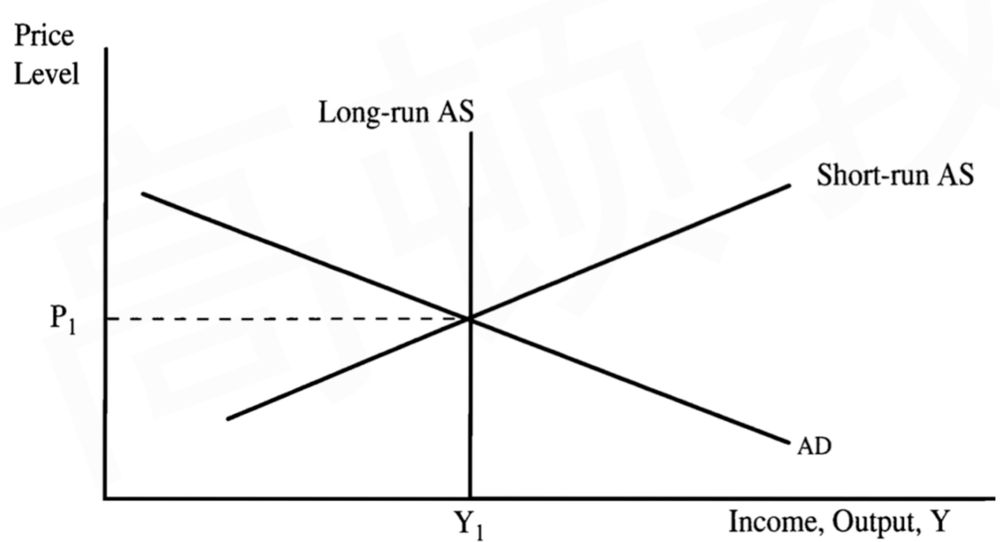

#### Recessionary Gap - 1

- **Caused by a decrease in AD**
  - AD总需求减少
- Characteristics
  - Acutal GDP < Potential GDP
    - recessionary gap = potential GDP - Actual GDP
  - Unemployment rate > Natural rate

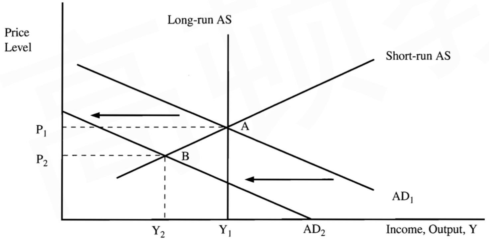

#### Recessionary Gap-2

- Policy choice 面临衰退时两种选择
  - **Do nothing** since there's a self-correcting mechanism
    - 任由经济自我修复，此时由于衰退，物价水平下跌，生产成本下降，SRAS逐渐shift right，从而使得equilibrium再次回到potential GDP(fully employment, natural employment rate)，这是新的均衡点产出不变，物价水平下跌。
  - Fiscal and monetary policy to **shift AD to the right**
    - 利用财政和货币政策，刺激AD，使得均衡点回到原来水平（物价+产出）

#### Recessionary Gap-3

- Investment implications of a decrease in AD
  - Reduce investments in cyclical companies, increase investments in defensive companies
  - Reduce investments in commodities 减少大宗商品投资
  - Increase investments in investment-grade fixed income securities, reduce investments in speculative fixed-income securites with low credit quality ratings 减少投机级债券
  - Increase investments in long-maturity fixed-income securities 增加债券久期

#### Inflation Gap-1 通胀

- **Caused by an increase in AD**
- Characteristics
  - Acutal GDP > Potential GDP
    - 通胀差（inflation gap） = acutual GDP - potential GDP
  - Unemployment rate < Natural rate

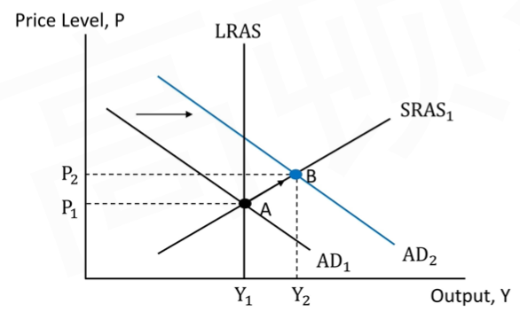****

#### Inflation Gap-2

- Policy Choice
  - **Do nothing** since there's a self-correcting mechanism
    - do nothing时，导致物价上涨，Y回到AD和LRAS交点
    - 为什么会SRAS左移动，课本的解释：

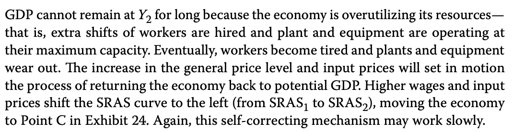

- Fiscal and monetary policy to **shift AD to the left**
  - 政府干预，紧缩政策，把AD左移

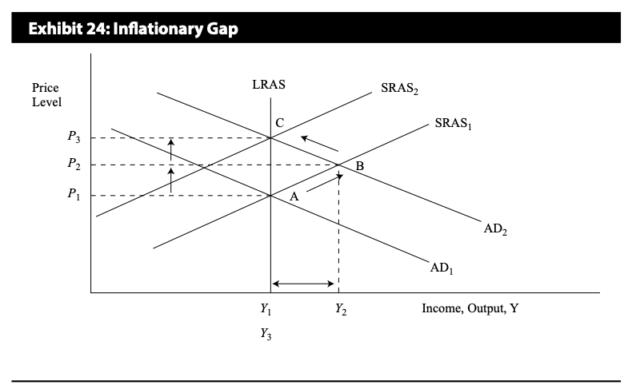

#### Inflationary Gap-3

- Investment implications of an increase in AD
  - Increase investment in cyclical companies, reduce investments in defensive companies
  - Increase investments in commodities
  - Reduce investments in fixed-income securities, especially longer-maturity securities.

#### Stagflation 滞涨

- **Caused by a decrease in AS**
  - 移动的是SRAS
- Characteristics
  - High inflation
  - Unemployment rate > Natural rate

 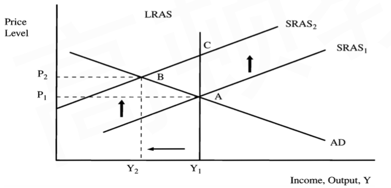

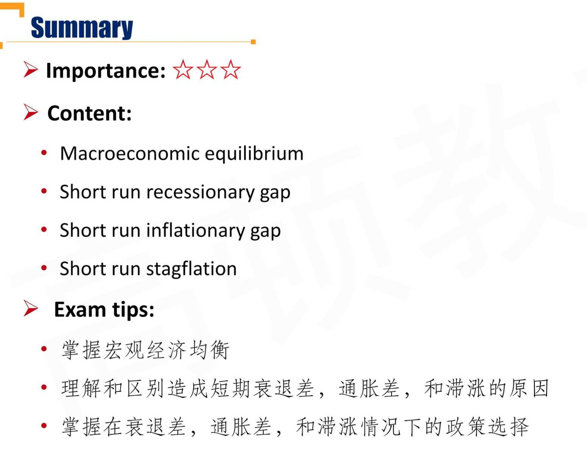

#### Combined Effects \*\*

##### Independent effects of shifting the AD and AS curve

|      | Change of Curve | Effect on GDP | Effect on Unemployment | Effect on Price |
| ---- | --------------- | ------------- | ---------------------- | --------------- |
| AD   | increase        | increase      | decrease               | increase        |
| AD   | decrease        | decrease      | increase               | decrease        |
| SRAS | increase        | increase      | decrease               | decrease        |
| SRAS | decrease        | decrease      | increase               | increase        |

##### Combined Effects of shifting the AD and AS Curve

| Change in SRAS | Change in AD | Effect on GDP | Effect on Price |
| -------------- | ------------ | ------------- | --------------- |
| Increase       | Increase     | Increase      | indeterminate   |
| Decrease       | Decrease     | Decrease      | indeterminate   |
| Increase       | Decrease     | indeterminate | Decrease        |
| Decrease       | Increase     | indeterminate | Increase        |

- indeterminate 不确定

### R3 Economic Growth

#### Production Function- Cobb Douglas Model

$$
Y = A\times f(L, K)
$$

A: total factor productivity or technology 全**要素生产率**

- **Growth in potential GDP = Growth in technology** 

  ​						**\+ $W_L \times$ (growth in labor) \+ $W_C\times$ (Growth in capital)**

如何通过Douglas 模型，推导上面的表达式？
$$
Y = AK^\alpha L^\beta
$$
一般研究$\alpha$和$\beta$的关系：

$\alpha + \beta = 1$ 时候，表示规模最优MES（一般在equilibrium研究这个点）

- 意思是，这时候，假如K,L同时增加a倍，Y也是增加a倍。

$\alpha + \beta > 1$，表示规模经济

$\alpha + \beta < 1$，表示规模不经济

我们引入ln(x)，表示增长率，原理当x无穷小，有$\ln(1+x)=x$，所以$\ln x-\ln y=\ln(1+\frac{x-y}{y})=(x-y)/y$，表示增长率。

所以Y的增长率可以表示为：
$$
\ln Y_1 - \ln Y_2=\ln A_1 - \ln A_2 + \alpha (\ln K_1-\ln K_2)+(1-\alpha)(\ln L_1 - \ln L_2)\\
\Delta Y/Y = \Delta A / A + \alpha \Delta K / K + (1-\alpha) \Delta L / L
$$
所以，potential GDP增长率 = 全要素增长率 + Wl 劳动力增长率 + Wc 资产增长率

###### $\alpha$ 的含义

- 弹性：代表K的增长百分比，带来多少百分比的Y的增长
- 比率：
  - 对Douglas模型求导，可以得到

$$
\frac{\partial Y}{\partial K}=\alpha Y/K
$$

- 由于Y对K求导，意思就是MPK（Marginal Productivity of the capital) 资本的边际产出，也就是多投入一块资本，带来的GDP产出的增加。当MPK = MC的时候，利益最大化，MC就是资金成本，利率r。所以：

$$
\alpha = rK/Y
$$

也就是说，$\alpha$代表资本占GDP部分，所要求的回报率。

#### Production Function - Cobb Douglas Model

$$
\frac{Y}{L} = A\times g(K / L)
$$

- Y/L: Output per worker
- K / L: Capital per worker, capital-to-labor ratio （人均资本）
- **Growth in per capita potential GDP**

​				= Growth in technology \+ $W_C \times$ (Growth in capital-to-labor ratio)

###### 推导：

也是假定规模最优的情况$\alpha + \beta = 1$
$$
Y/L=A(K/L)^\alpha
$$
通过上面的方式也可以推导得到。人均GDP增长率 = 全要素增长率 + WC 人均拥有资本增长率

#### Sources of Economic Growth

Y = Af(K, L)

- **Technology**（A）
  - The most important factor affecting economic growth is technology
- **Labor supply ** 劳动力（L）
  - Growth in the number of people available for work(quantity of workforce)

- **Human capital** 人力资本(实际上解释的是A)
  - It reflects the accumulated knowledge and skill, and is the quality of the labor
- **Physical capital Stock** (K)
  - The physical capital stock (accumulated amount of building, machinery, and equipment used to produce goods and services) increases from year to year as long as net investment(gross investment less depreciation of capital) is positive

- **Natural Resources**（A）禀赋
  - Renewable resources
  - Non-renewable resources
- **Public Infrastructure** 公共基础建设（A）
  - A key feature of public capital is that they create externalities(外部性)
  - 可以创造外部性，影响到GDP
- **Other factors driving growth**

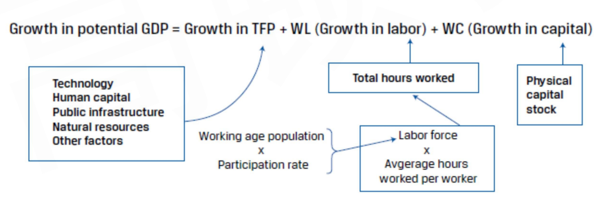

- working age population  适龄人口
- participation rate劳动参与率

####  Production Function - Sustainable Growth Model

- **Labor productivity**(劳动生产率) is the market value of goods and services (real GDP) that a worker can produce in one hour of work
  - 复习LRAS影响因素
  - Labor productivity = real GDP / aggregate hours works
    - 单位：元/人时

- **Potential GDP**  = aggregate hours worked \* labor productivity

  - Aggregate hours worked = labor force \* hours worked per worker

- **Potential GDP growth rate(sustainable growth rate)**

  = Long-term growth rate of labor force 

  ​		\+ Long-term labor productivity growth rate

  - 这里的推导假定了hours worked per worker的增长率为0.
  - 推导方式还是lnX - ln Y的逻辑。

#### Summary

- Douglas 模型

$$
\Delta Y/Y = \Delta A / A+\alpha \Delta K/K + (1-\alpha) \Delta L / L
$$

- Douglas 还有人均GDP增长率：

  - $$
    \Delta 人均GDP/人均GDP = \Delta A / A+ \Delta 人均资本/人均资本
    $$

- Sustainable growth model

$$
\Delta Y/Y = \Delta L/L + \Delta 劳动生产率/ 劳动生产率
$$

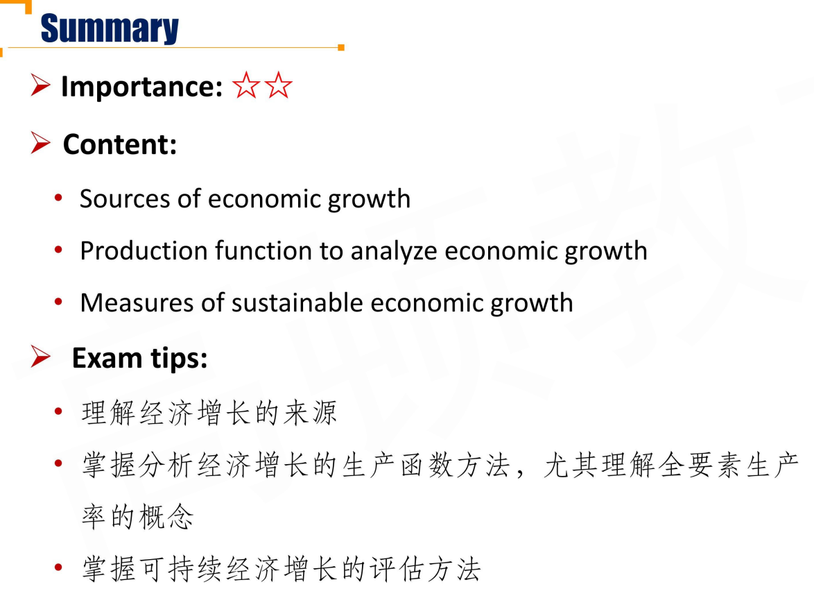

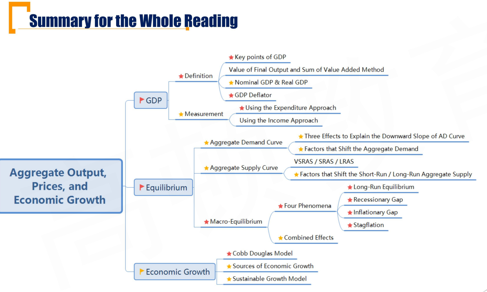

