# M4 Understanding Business Cycle

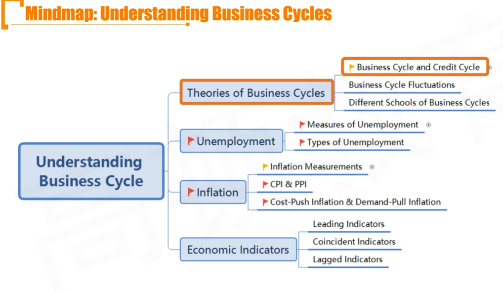

## R1 Theories of Business Cycles

### 1.1 Business Cycle and Credit Cycle

#### Business Cycle

- **Business cycle** is charactertized by fluctuations in economic activity
  1. **Classical cycle** refers to fluctuations in the level of economic activity
     - classical包含长期因素和短期因素的波动
  2. **Growth cycle** refers to fluctuations in economic activity around the long-term potential or trend growth level
     - 去除了长期因素，只看短期因素的波动
  3. **Growth rate cycle** refers to fluctuations in the growth rate of economic
     - 一阶导数，波峰和波谷体现二阶导等于0（拐点）

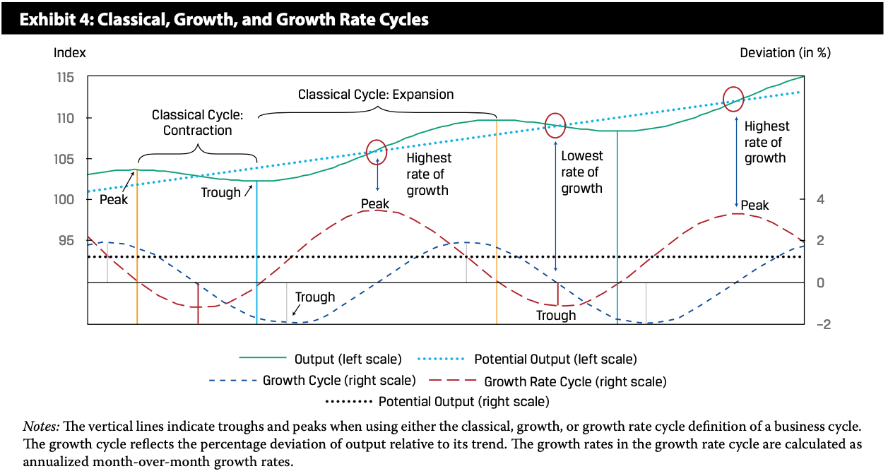

- 注意拿到图先看横纵坐标
- 黑色点线Potential Output指的是潜在增长率。growth rate cycle围绕着潜在增长率波动。

#### Phases in Business Cycle

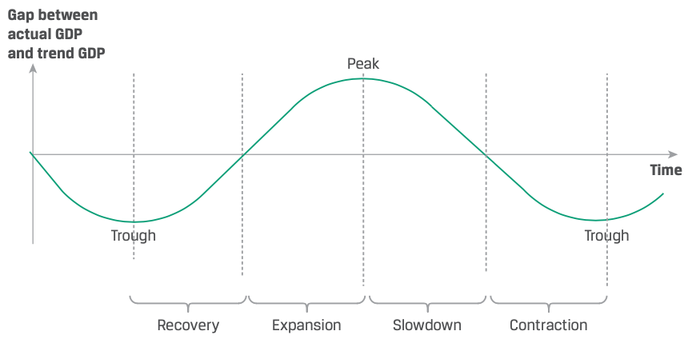

| Phase | Recovery | Expansion | Slowdown | Contraction |
| ----- | -------- | --------- | -------- | ----------- |
|       |          |           |          |             |

- 滞后：如果是滞后型指标，这种指标往往反映的之前一个周期的状况（比如失业率和通货膨胀）
  - 如：Slowdown阶段，unemplyment rate持续下降，inflation持续加速
- 与其对比的还有领先指标，同步指标。

#### Credit Cycles

- Whereas business cycles mostly use GDP as a measure of economic activity, **credit cycles** describe the changing **availability and pricing of credit**
  - Credit cycles describe growth in private sector credit (availability and usage of loans), which is essential for **business investments** and **household purchases of real estate**
    - I(r)，利率上升，投资下降；
    - 房地产投资一般是贷款，受到利率影响。
- When the economy is strong or imporoving, the willingness of lenders to extend credit, and on favorable terms, is high.
- When the economy is weak or weakening, lenders pull back, or "tighten" credit, by making it less available and more expensive.

#### Relationships between business cycles and credit cycles

business cycle衡量GDP，credit cycle衡量银行的银根，信用状况

- Investors should pay attention to the stage in the credit cycle because:
  - It helps them understand developments in the housing and construction markets
  - It helps them assess the extent of business cycle expansions as well as contractions, particularly the severity of a recession if it coincides(吻合) with the contraction phase of the credit cycle
  - It helps them better anticipate policy makers' actions 通过credit cycle预测财政和货币政策

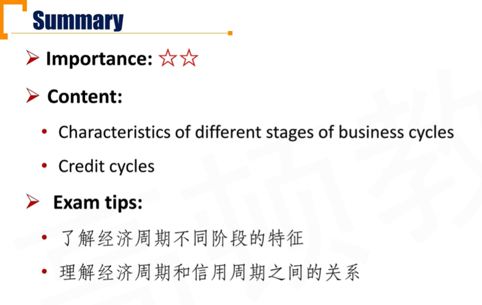

### 1.2 Business Cycle Fluctuations

#### Business Cycle Fluctuations from a Firm's perspective

- The workforce and company costs
  - When the economy enters contraction, companies reduce costs, and may *try to retain workers rather than reducing employment*
  - 衰退时，一般的企业不太愿意大幅裁员。因为经济好转时重新招聘，需要时间成本
- Fluctuations in capital spending 资本支出波动
  - Capital spending is highly sensitive to changes in economic activity
- Fluctuations in inventory levels 存货
  - 两个方面，一个是绝对指标（绝对存货的数量），第二个时相对指标（ratio: inventory / sales）
  - Inventory levels can fluctuate dramaticlally over the business cycle

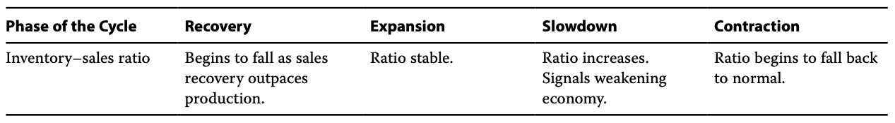

- 对于inventory-sales ratio: 在recovery 阶段，sales 大幅上涨，导致ratios下跌；在slow down 阶段，sales 开始大幅下降，ratio上升。
  - 注意：对于一般大型企业，inventory都比sales更加稳定，因为sales无法掌控。

#### Consumer Behavior

- Consumer confidence
  - It reflects expectations of future incomes and employment prospects
- Measures of consumption

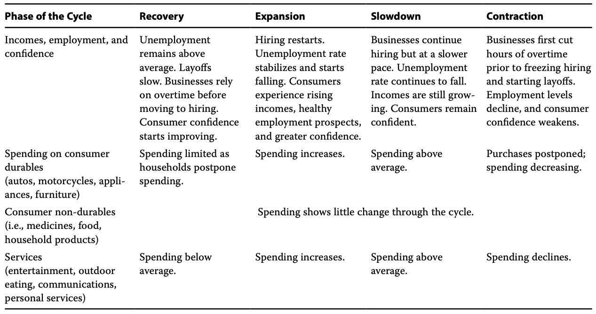

- 上图中需要注意的点：
  - 非耐用消费品，比如食物等，对经济周期不敏感
  - 耐用品、服务等，对经济周期的敏感度较高。

- Income growth
  - Growth in income is normally a good indicator of consumption prospects, especially relrevant is after-tax income, known as **disposable income** 更关注可支配收入（税后）
  - Some analysts chart consumer spending based on a concept termed **permanent income** 稳定收入
    - Permanent income excluded **temporaray income**（不稳定收入，比如中彩票）
    - Spending on durables tends to rise and fall with disposable income, regardless of the source, not just permanent income
      - 对于耐用品（比如车），一般考虑和整体可支配收入有关系（包括permanent income和temporary income）.对于non-durables，只考虑permanent income.
- Saving rates 储蓄率
  - A rise in the saving rate may indicate caution among households and signal economic weakening
  - 对未来悲观时，多存钱

##### Housing Sector Behavior

- Housing sector activity includes new and existing home sales and residential construction activity
- Home buying and consequently constrcution activity expand in response to lower loan interest rates and contract in response to higher loan interest rates
  - 买房收到credit cycle影响。利率低多买，利率高少买
- Apart from questions of affordability, house buying is affected by both the rate of family formation（家庭人口增长） and expectation of housing price increases.

#### External Trade Sector Behavior

- Cyclical fluctuations of imports and exports 要看清楚哪个国家的经济周期（进口国/出口国）

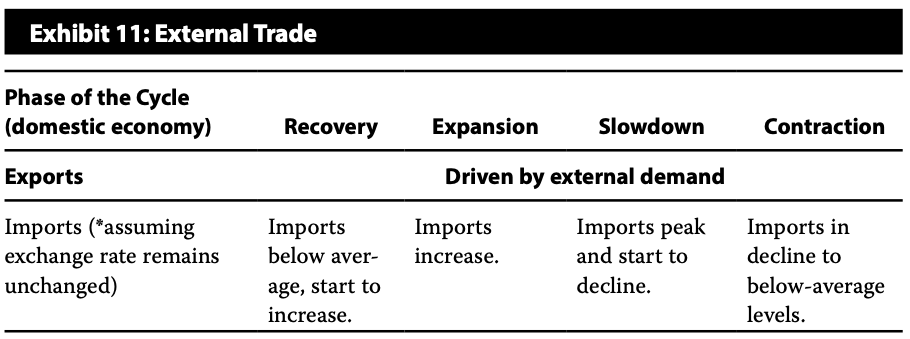

- 上图注意事项：
  - domestic economy本国经济周期
- The currency exchange rate has an independent effect different from the domestic economic cycle
  - The appreciation of a nation's currency may increase imports, and reduce exports
  - 本币升值，进口增加；本币贬值，出口增加
- **Imports** most clearly respond to **domestic GDP growth rate**, and **exports** generally respond to the **global GDP growth rates**
  - 进口受到本国GDP影响，出口受到国外GDP影响

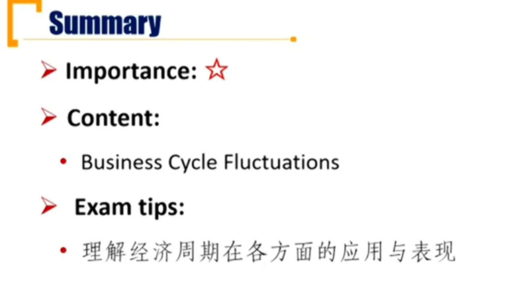

### 1.3 Different Schools of Business Cycles

#### Theories of business cycles

- Neoclassical School 新古典主义学派
  - 市场万能，波动时技术原因
- Keynesian School
  - 市场会失灵，需要政府干预
  - 向下粘性，不能轻易降工资
- New Keynesian School
- Monetarist School
  - 政府制定货币供给量
- Austrian School
  - 和新古典主义差不多，认为经济周期就是因为政府不正当干预
- New Classical School
  - 经济周期还受到其他外部因素冲击

| School                | Cause of Business Cycles                                     | Recommended policy                                  |
| --------------------- | ------------------------------------------------------------ | --------------------------------------------------- |
| **Neoclassical**      | Technology                                                   | Do nothing, full-employment equilibrium             |
| **Keynesian**         | Business expectations, Downward sticky wages                 | Fiscal or monetary policy                           |
| **New** **Keynesian** | Same as Keynesian, but other input prices also downward sticky，其他生产要素（包括劳动力）也有向下粘性 | Fiscal or monetary policy                           |
| **Monetarist**        | Inappropriate changes in money supply growth rate            | Steady and predictable growth rate of money supply  |
| **Austrian**          | Government intervention                                      | Don't force interest rate to artificially low level |
| **New classical**     | technology and external shocks                               | Don't intervene to counteract business cycle.       |

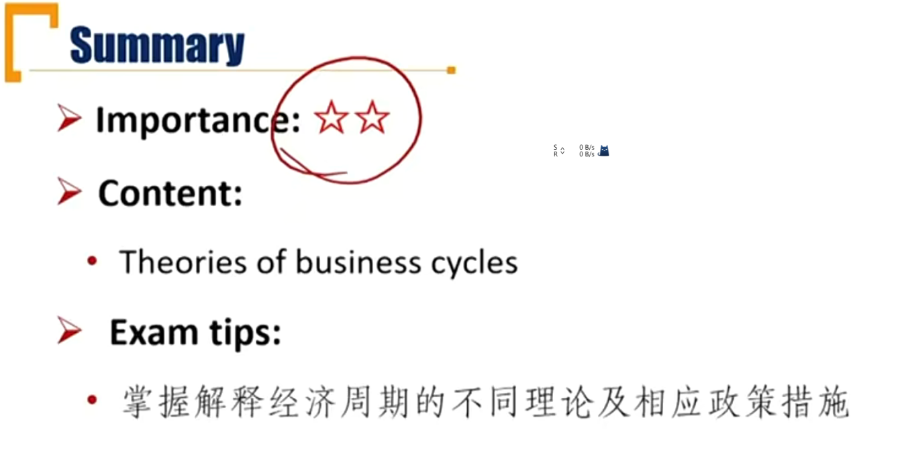

## R2 Unemployment

### 2.1 Measures of Unemployment

#### Terminology

- **Total population**
- **Working-age population** 适龄人口
  - 适龄人口不一定有工作意愿，比如全职太太
- **Labor force**
  - Number of people who either have a job or are actively looking for a job
    - 需要有工作意愿
    - 等于employed + unemployed
  - **Excluding** retirees, children, stay-at-home parents, full-time students, etc
- **Employed:** Number of people with a job
  - Not include informal sector
  - e.g. unlicensed cab drivers, illegal workers
- **Unemployed**: People who are actively seeking employment but are currently without a job 积极主动找工作，但是没有工作

- **Underemployed**
  - Person who has a job but has the qualifications to work a higher-paying job
  - 大材小用
- **Discouraged worker**
  - Person who has stopped looking for a job
  - Outside of labor force and unemployed people 
    - 躺平不算劳动力
- **voluntarily unemployed**
  - Person voluntarily outside the labor force, such as a jobless worker refusing an available vacancy for which the wage is lower than their threshold or those who retired early
  - Outside of labor force and unemployed people
  - 自愿失业，不算劳动力

##### 从属关系

- 总人口：
  - 不适龄人口
  - 适龄人口
    - 劳动力
      - 就业employed
        - underemployed
      - unemployed
    - discouraged worker
    - voluntarily unemployed

#### Measures of Unemployment \*\*\*

- Unemployment Rate = unemployed / labor force
  - 失业率
- Participation Ratio (Activity Ratio) = labor force / working-age population
  - 劳动参与率

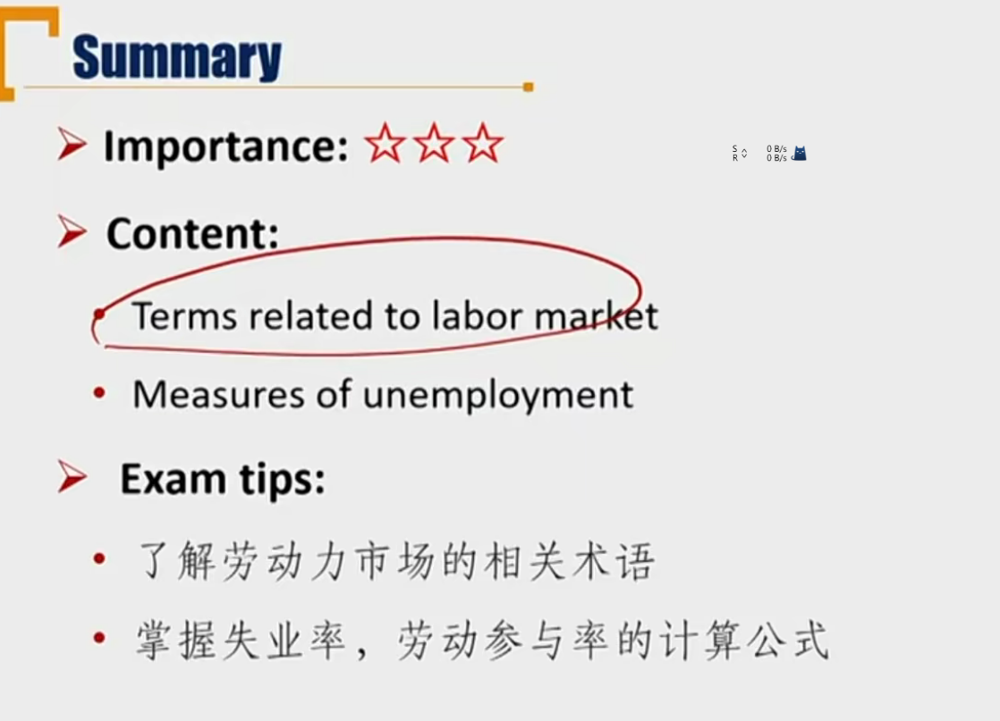

### 2.2 Types of Unemployment \*\*\*

#### Types of Unemployment

- **Frictional unemployment**
  - results from time it takes employers and employees to find each other
  - 摩擦性，找工作的时间成本，和经济周期没有关系
- **Structural Unemployment** 结构性失业
  - results from long-term changes in the economy that require workers to gain new skills to fill new jobs
    - 升级换代，结构发生改变，比如诺基亚员工
    - 和经济周期无关

- **Cyclical unemployment** 
  - results from changes in economic growth
  - 
  - 和经济周期密切相关

#### Two Important Concepts

- **Full employment** occurs when the economy has no **cyclical unemployment**
  - 充分就业，自然失业率，potential GDP
  - 没有周期性失业
  - **Structural** and **frictional unemployment** always exist
  - **Natural unemployment rate**
- The unemployment rate is a **lagged indicator** 滞后性指标（周期性失业）
  - Firms are reluctant to lay off people，因为裁员存在成本
  - 失业率 = 摩擦性 + 结构性 + 周期性失业 /  劳动力

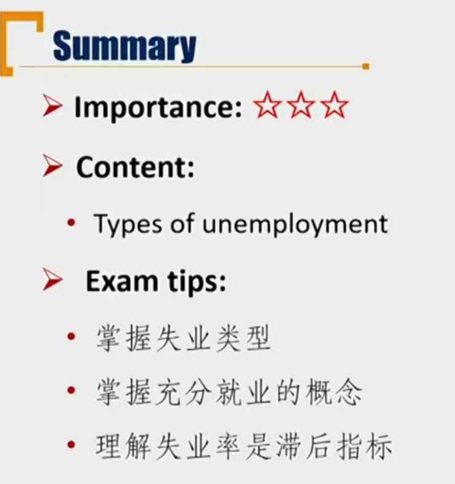

## R3 Inflation \*\*

### 3.1 Inflation Measurements

#### Concepts

- **Inflation rate**: The percentarge change in a price index, the speed of overall price level movements.
  - 物价变动的幅度，速度. 这是一个数字。
- **Inflation:** a sustained rise in the overall level of prices(inflation是经济的一种状态, inflation rate > 0)
  - **Stagflation:** A high inflation rate is combined with a high level of unemployment and a slowdown of the economy. (复习：SRAS shift left)
  - **Hyperinflation:** a extremely high inflation rate
  - **Disinflation:** positive inflation rate but declining inflation rate
    - 通货收缩，区别于通货紧缩（deflation）.意思是inflation rate > 0但是在下降（二阶导<0）
- **Deflation:** a sustained decrease in aggregate price level, negative inflation rate.(inflation rate < 0)

#### Indices Used to Measure Inflation

总物价 = 产量 \* 单价。总物价受到产量和单价影响。通过控制变量（产量），观察物价变动总物价的影响

- **Laspeyres index**: Holding the composition of the consumption basket constant(as the base year) 控制产量，基期产量不变（Q），下面的求和意思是市场上的basket商品求和

$$
I_L=\frac{\sum P_tQ_0}{\sum P_0Q_0}
$$

- Bias from using the Laspeyres index \*\*\* 这是理论上的指数，会产生偏差
  - Substitution bias 替代偏差
    - 比如，Pt > P0时，由于替代效应：
      - Laspeyres高估，因为分子Qt < Q0
      - Passche 修正了替代偏差，因为对于分子上，当期已经修正了Q0，已经考虑到了替代效应。
  - Quality bias 质量偏差
    - 高估通胀
    - 质量提升，价值提升也会导致价格上升。所以价格上升的原因有通胀+质量提升。
    - 所以Laspeyres index和Passche index会 **<u>高估</u>** 通货膨胀带来的价格上升，因为把价格上升都看作是通货膨胀导致的。
  - New product bias 新产品偏差
    - 新产品产生对老产品有替代作用，分流了以前的产品的需求量
    - 所以Laspeyres都用了Q0，高估了物价水平。

- **Passche index：** Using the current composition of the basket，控制产量为当期产量
  - GDP deflator就是Passche index的一个应用。

$$
I_P=\frac{\sum P_tQ_t}{\sum P_0Q_t}
$$

- **Fisher index:** The geometric mean of the Laspeyres index and the Paasche index

$$
Fisher\ Index = \sqrt{I_L \times I_P}
$$

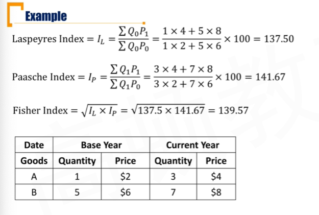

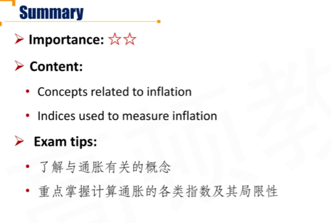

### 3.2 CPI and PPI \*\*\*

#### Consumer Price Index

- **Consumer price index(CPI)**
  - The value of a basket of goods and service bought by a typical consumer
  - 消费者角度的篮子
  - **CPI = (cost of basket at current prices) / (cost of basket at base period prices)**

$$
CPI = \frac{cost\ of\ basket\ at\ current\ prices}{cost\ of\ basket\ at\ base\ peirod\ prices}
$$

- CPI用的是Laspyres的方法，保持产量在基期不变

#### Producer Price Index

- **Producer price index(PPI)**
  - The value of a basket of goods and service bought by firms
  - 企业角度的篮子，也是Laspyres方法。
- Important questions：The links and difference between CPI and PPI
  - CPI、PPI都是滞后指标(衡量通货膨胀)，但是PPI领先于CPI，因为从供应链上看，厂商购买原材料（PPI），然后卖给消费者（CPI）
  - 不同的国家来说，PPI的差别比CPI大。因为消费者的消费结构差不多，但是国家之间的产业结构、经济部门、扶持产业会不一样。
  - PPI的波动率（volatility）比CPI大。因为CPI的价格粘性较大，消费者的需求受到价格影响较大，所以一般厂商不会大幅变动售价。但是PPI是生产原材料，一般不受国家控制，比如石油等。

#### Headline Inflation and Core Inflation

- **Headline inflation** 整体通胀率，不区分消费者和企业
  - Price indexes that include all goods and services
  - GDP deflator就是衡量headline inflation的指标，同时也是用Passche index进行计算
- **Core inflation**
  - Price indexes that exclude food and energy
    - food个人角度，energy企业角度
  - Food and energy prices are subject to large short-term fluctuations that can magnify the true inflation rate

##### 注意

- **Core inflation的波动性一般小于headline inflation。**
- **政府制定政策，一般关注core inflation，因为波动率较小。**

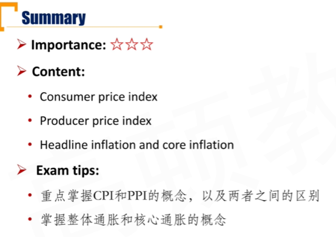

### 3.3 Cost-Push inflation and Demand-Pull Inflation \*\*\*

#### Cost-Push Inflation 成本推动

一般对应stagflation

- **Cost-push inflation**
  - 企业原材料上涨，PPI上涨，但是产品价格不能过分上涨，压缩了企业利润空间，所以企业生产意愿降低，所以SRAS shift left.
  - An intital increase in costs result in a **decrease in AS**
  - 政府决策：
    - do nothing: sras 原路返回（实际上一般难以实现）。
    - 刺激需求，AD shift right, 物价上涨，GDP恢复。
- **Characteristics**
  - High inflation
  - Unemployment rate > natural rate

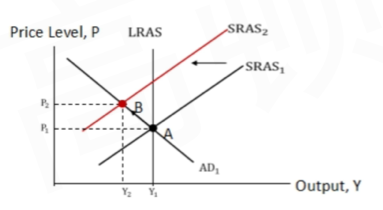

#### Demand-Pull Inflation

一般对应inflationary gap

- Demand-Pull inflation
  - An initial increase in AD
- Characteristics
  - Actual GDP > Potential GDP
  - Unemployment rate < Natural Rate
- 复习，政府干预措施
  - 如果Do nothing，新的均衡点是社会上的AD和LRAS的交点，也就是SRAS会向左移动。（注意和cost push的do nothing不一样）
  - 如果政府干预，抑制AD shift left，则返回原点。

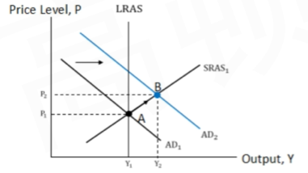

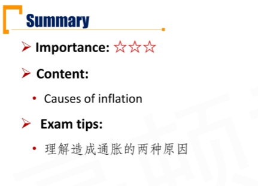

## R4 Economic Indicators

#### Leading Indicators

- **Average weekly hours, manufacturing**
- **Average weekly initial claims for unemployment insurance**
  - 平均每周初次申领失业金
  - 注意（失业率是滞后指标）
- Manufacturers' <u>new</u> orders for consumer goods and materials
  - 新订单
- ISM（Institute for supply management） new order index
  - 供应链，新订单交付速度
- Manufacturers' new orders for non-defense capital goods
  - 非国防工业新订单
- Building permits for new private housing units
  - 个人房屋建造许可证

- **S&P 500 Index** 标普500指数
  - 股票代表企业的未来
- **Money supply, real M2**
  - 供给量增加，扩张财政政策
- **Interest rate spread between 10-year treasury yields and overnight borrowing rates(federal funds rate**)
  - 利率基差。 十年期波动率较低，隔夜拆借利率波动率交高。短期利率代表对经济短期内的看法。如果对短期内经济悲观，则短期利率会上涨，基差缩小
    - e.g. 金融危机的时候，大家都不愿意借钱，隔夜拆借利率非常高
- Average consumer expectations for business and economic condition.

#### Coincident indicators 同步变化的指标

- **Employees on non-agricultural payrolls**
  - 非农就业人员数量
- **Aggregate real personal income(less transfer payments)**
  - 减去转移支付的个人实际总收入
- Industrial Production Index
- Manufacturing and trade sales 销售额

#### Lagged Indicators

- **Average duration of unemployment**
  - 平均失业持续时间
- **Inventory-sales ratio**
  - 企业生产、储存销售，需要一定时间
- Change in unit labor cost
  - 单位劳动成本变化
- Average bank prime lending rate
  - prime lending rate最优惠贷款利率（给优质客户的利率）
- Commercial and industrial loans outstanding
- Ratio of consumer installment debt to income
  - 分期贷款/收入
- **Change in consumer price index for services**
  - 服务业的CPI

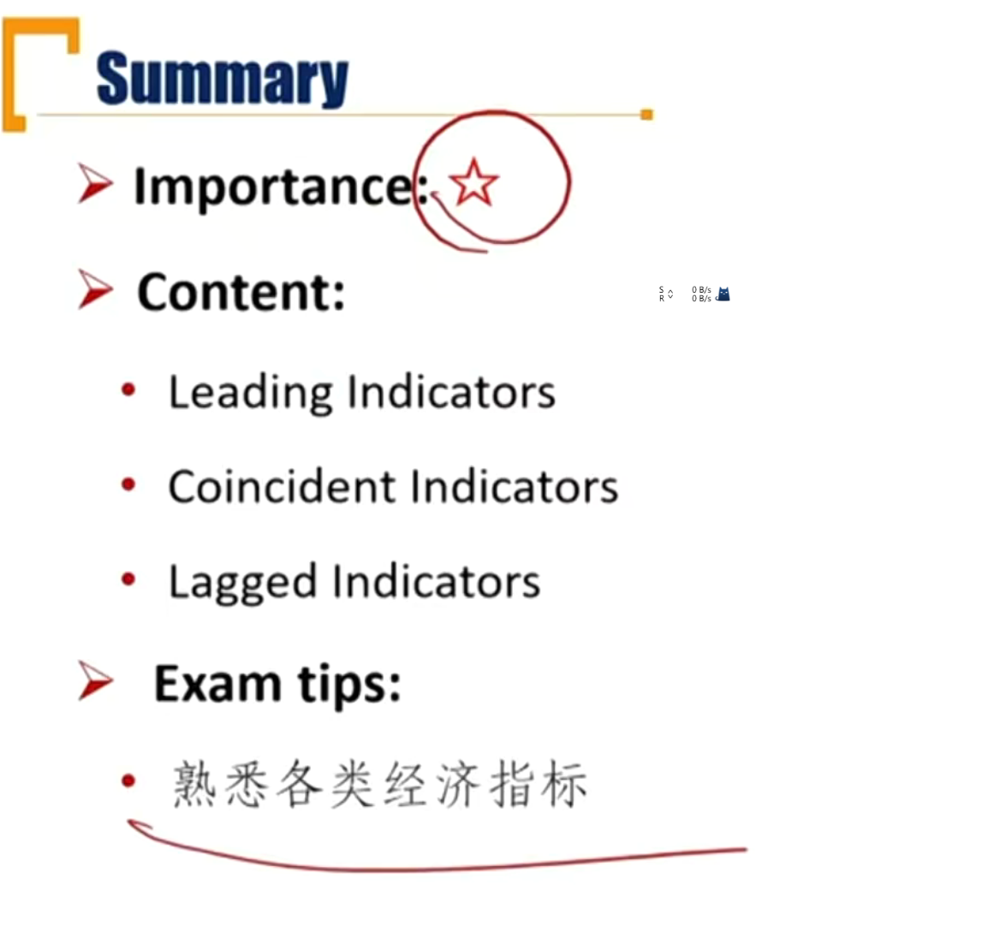

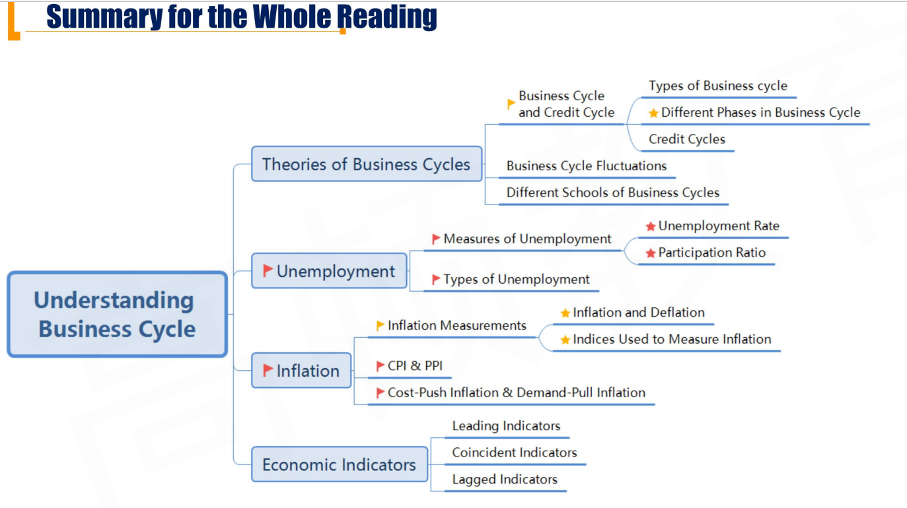

