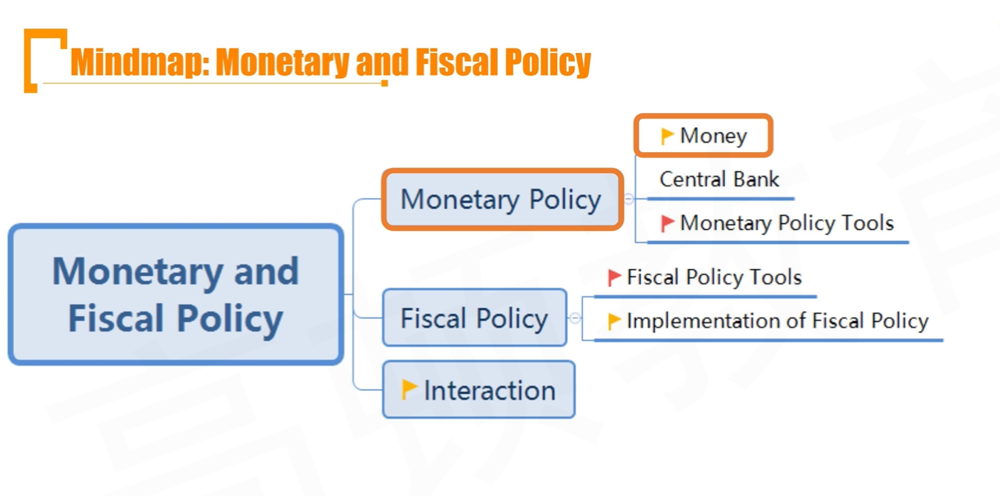
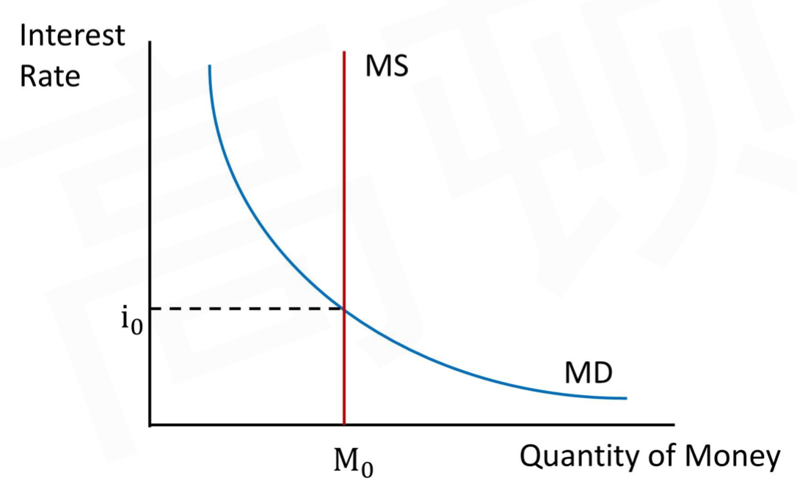
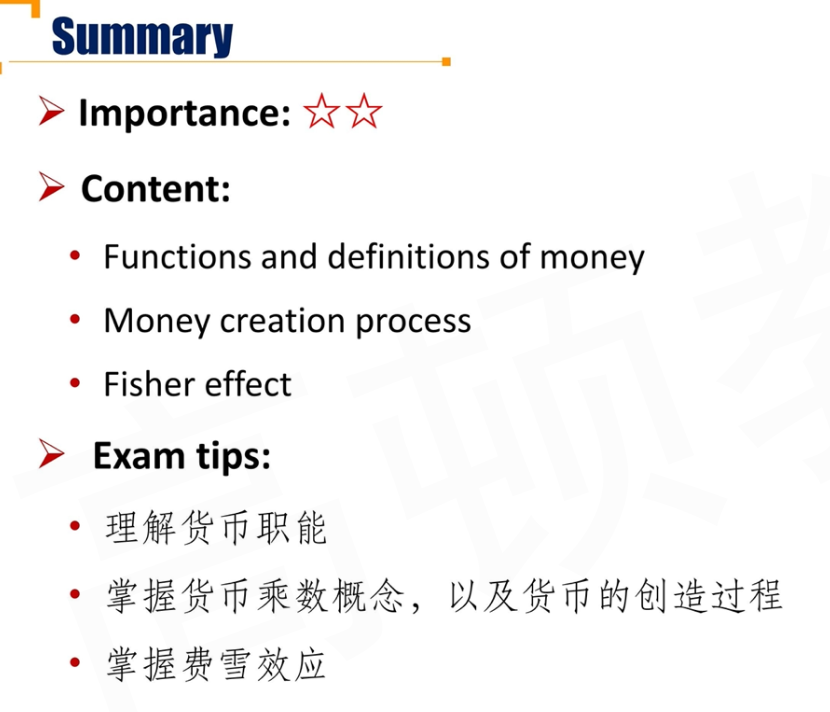
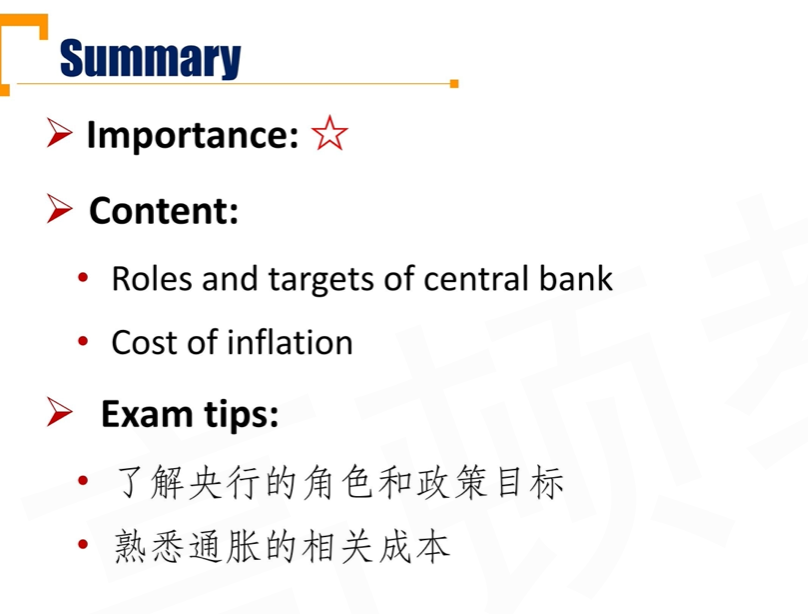
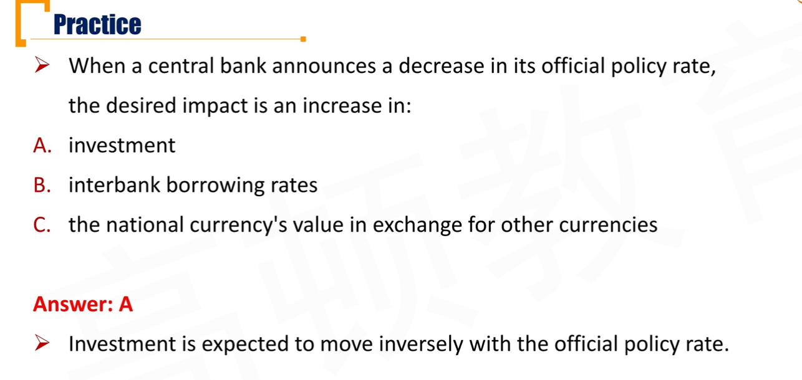
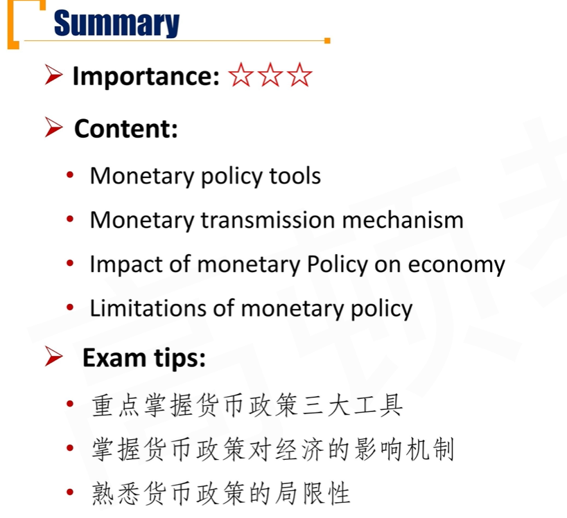
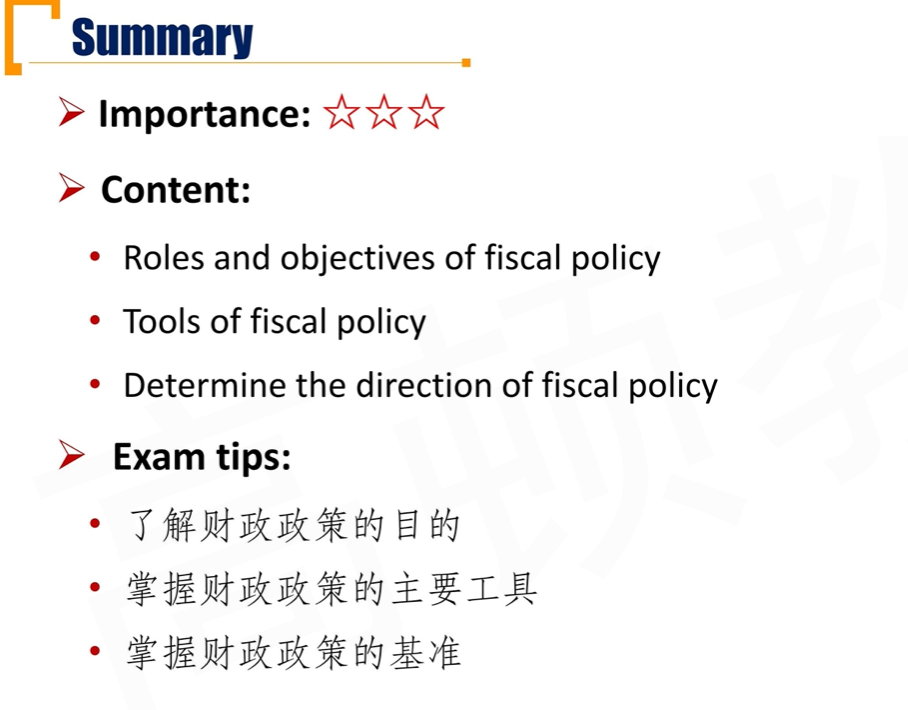
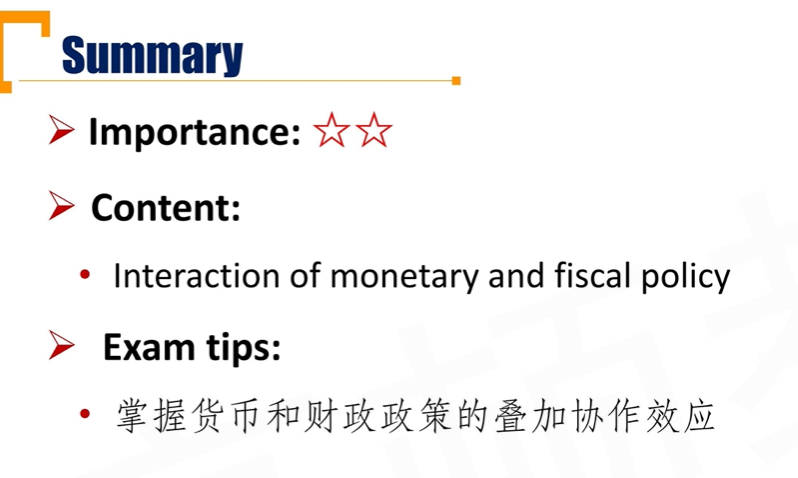
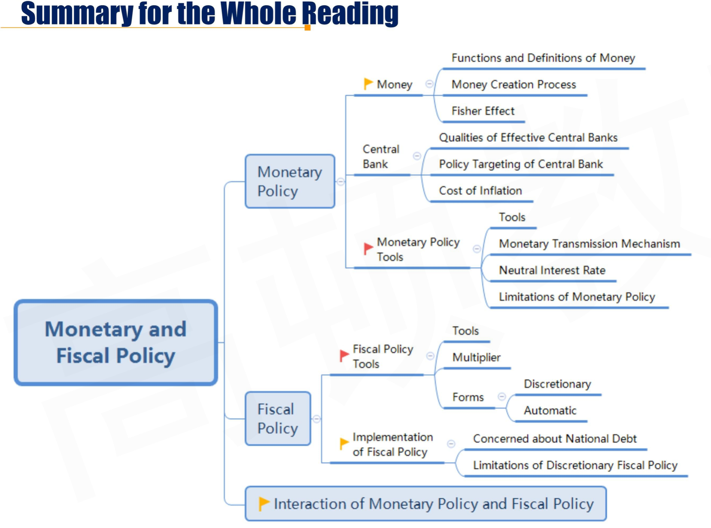

# M4 Monetary and Fiscal Supply

## R1 Monetary Policy

#### Government Policies

- **Monetary policy**
  - Central bank activities that are directed toward influencing the **quantity of money and credit** in an economy
  - 货币政策落实的工具：流通中的货币和商业银行的信贷量
- **Fiscal policy**
  - The government's decisons about **taxation** and **spending**
    - 财政政策：税收和支出
  - **Budget surplus**
    - Government tax revenues exceed expenditures
  - **Budget deficit**
    - Government expenditures exceed tax revenues

### 1.1Money

- Functions of Money
  - Medium of exchange
  - Store of wealth
  - Measure of value(unit of account) 价值度量

- **Definition of Money**
  - （拓展）M0：流通中货币，M1 = M0 + 活期存款；M2= M1 + 定期存款
  - **Narrow money(M1):** notes and coins, traveler's cheques（旅行支票）, demand deposits（活期存款） and other deposit.
  - **Broad money(M2):** M1 + time deposit(定期存款，less than \$100,000), other balances in retail money market and mutual funds.
    - M2反映现实和潜在购买力

##### Money Creation Process

存款准备金，货币乘数

- Money multiplier = 1 / reserve requirement

- Money Created = new deposit $\times$ money multiplier

  ​							= new deposit / reserve requirement

- 央行新注入的资金，除以存款准备金率，是新创造的货币。

#### Fisher Effect \*\*\*

- **Fisher effect: **The nominal interest rate is the sum of the real interest rate and expected inflation
  - **Nominal rate = real rate \+ expected inflation**
    - $(1+r_n)=(1+r_r)(1+\pi)$
  - 注意是预期通胀

- To account for uncertainty of future, the nominal interest rate is comprised of:
  - Real(risk-free) rate
  - Expected inflation
  - Risk premium

#### Money Supply and Demand

货币的价格就是利率。利率越高，货币越贵。

- **Supply of money **  : is determined by the central bank and is not affected by changes in interest rates
  - 货币供给由央行投放资金除以法定存款准备金率决定，不受到利率影响。
- **Demand of money:** is determined by:
  - transactions-realted
  - precautionary
  - speculative needs
  - 复习：凯恩斯货币需求理论，三大需求：交易（主要受到Y影响）、预防性（Y）、投机性（主要受到r影响）。

### 1.2 Central Bank

- **Roles** of the Central Bank
  - Monopoly supplier of the currency 货币垄断供应商
  - Banker to the government and the bankers' bank
  - Lender of last resort 最终贷款人
    - 如果社会出现信用危机等，最终兜底方（印钞票）
  - Conductor of monetary policy 制定、执行货币政策
  - Supervisor of the banking system 监管
  - Regulator and supervisor of the payments system
    - 清算机构的监管方
- **General objective** of the central bank / monetary policy
  - ***Price stability*** 首要目标：稳定物价

#### Qualities of Effective Central Banks 

三点对央行的要求

1. **Central bank independence**
   - **Operational independence:** central bank was free to set interest rates 操作独立（最根本的quality）：自由决定目标利率水平
   - **Target independence:** Central bank was also free to set target inflation rate 目标独立：自由制定目标通货膨胀率
2. **Credibility:** The independence of the central bank and public confidence in it are key in the design of an inflation-targeting regime
3. **Transparency**: Bank discloses inflation reports, indicators they use, and how they use them

#### Policy Targeting of Central Bank/Monetary Policy

具体目标，需要区分上面的首要目标（稳定目标）

- **Interest rate targeting:** Increasing money supply when market interest rates above the targe and decreasing money supply when rates below the target
- **Inflation targeting:** A contractionary monetary policy reduces inflation rate when inflation rate above the target
- **Exchange rate targeting:** When domestic currency depreciates, the monetary authority use foreign reserves to purchase the domestic currency in order to reach the target exchang rate

#### Cost of Inflation 

- **Cost of expected inflation** 预期到的通胀
  - Menu cost 更新定价的成本
  - shoe leather cost 取钱成本
- **Cost of unexpected inflation** 没有预期到的通胀
  - Inequitable transfer of wealth between borrowers and lenders
    - 通货膨胀不利于债权人，财富从债权人转移到债务人
  - Give rise to risk premium in borrowing rates and the prices of other assets 由于风险溢价，贴现率更高，对于资产估值（现金流估值）会更低。
  - Reduce the information content of market prices
    - 减少了有效的市场信息。比如涨价，不一定是市场需求上涨导致，有可能是通胀引起。

### 1.3 Monetary Policy Tools

三大货币政策基础工具

- **Open market operations**
  - **Buy bond**, increase money supply
  - **Sell bond**, decrease money supply
  - **Repurchase agreement,** decrease money supply
    - 回购：T=0，央行卖出债券（减少流动性），T=1回购债券
  - **Reverse repurchase agreement**, increase money supply
    - 逆回购：T=0，央行买入债券（释放流动性），T=1 逆回购债券
- **Policy rate(discount rate)**:政策利率
  - **Policy rate rises**: money supply decrease
  - **Policy rate falls,** money supply increases
- **Reserve requirements**
  - **Reserve requirements falls**, money supply increases
  - **Reserve requirements rises**, money supply decreases

#### Monetary Transmission Mechanism

- If policy rate rises(contractory): 影响银行借贷、资产价格、消费预期、汇率
  - **Banks' short-term lending rates** will increase in line with the increase of policy rate. Higher rates will decrease AD(利率升，投资下降，需求下降)
  - **Asset prices** will decrease as the discount rates applied to future expected cash flows are increased, which may decrease wealth and decrease consumption
  - Both consumers and businesses may decrease their **expenditures** because their expectations for future economic growth decrease
  - An increase in interest rates leads to an appreciation of **domestic currency**, which increases demand for imports and reduces demand exports.（这里假定了外汇能够自由流入）

#### Impact of Monetary Policy on the Economy

- A **contractionary** **monetary policy** tends to 
  - increase the interest rate
  - decrease GDP
  - decrease price level
    - AD shift left
  - increase the value of local currency
    - 吸引外资流入

- An **expansionary** **monetary policy** tends to 
  - decrease the interest rate
  - increase GDP
  - increase price level
  - decrease the value of local currency

- r和Investment 反向关系

#### Neutral Interest Rate 中性利率

用中性利率判断货币政策扩张还是紧缩，但只是理论值。

- Neutral Interest Rate of an economy

  - The growth rate of the money supply **neither spurs nor slow** down the economic growth rate 对经济既没有刺激也没有抑制的利率。

  - neutral interest rate

    ​					= real trend rate of economic growth

    ​						\+ long-run expected inflation

    - 确定中性利率：经济增长和预期通胀

- **Contractionary monetary policy** \*\*\*

  - ***Policy rate > neutral rate***

- **Expansionary monetary policy**

  - ***policy rate < neutral rate***

#### Limitations of Monetary Policy 局限性

- Central bank **cannot** control the exact level of money supply
  - The amount of money households and corporations put in banks 
  - Willingness of banks to create money
  - 存款准备金率没法控制居民真实存款，银行真实贷款
- Long-term rates may move oppositely to short-term rates because of the effect of monetary policy changes on expected inflation
  - 如央行抬高短期利率，市场认为央行在抑制通胀，预期未来通胀下降，则导致市场未来长期利率下降（nominal interest rate=... + inflation premium）。
  - **Bond market vigilantes(债市义勇军):** If monetary tightening extreme, expectations to recession may make long-term bonds more attractive, decreasing long-term rate
    - 比如，央行抑制通胀，过度抬高短期利率。市场部分投资者认为利率下降过大，会导致短期经济衰退，所以就抛售短期（避免经济衰退，短期债券违约），买入长期（短期风险较小，长期经济好转收回本金）。导致长期价格升高，长期利率上升。
- **Liquidity Trap流动性陷阱**
  - Demand for money is very elastic when interest rate is very low
    - 也就是需求曲线（横坐标货币需求Q，纵坐标利率r）在利率很低的时候，斜率比较低。
  - Short-term rates cannot be below zero
    - 这里指的是名义利率不能低于0
    - 名义利率 = 真实利率 + 通胀
    - 如果通缩，也就是inflation rate < 0，这时候真实利率（curve上的坐标）大于0
  - 另外，调节利率，银行的贷款意愿，居民的存款意愿无法直接控制。比如央行调节利率下降抑制通缩，但是商业银行不一定愿意贷款承担信用风险等。
  - Liquidity traps are usually associated with deflation（通缩）
    - **Quantitative easing(QE)**: buging longer-dated government securites, mortage securities, and risky bonds to low long-term interest rate.
      - 量化宽松QE和公开市场区别
        - 公开市场：买国债，和商业银行做交易
        - QE：不仅仅国债，央行到市场上买债券

## R2 Fiscal Policy

### 2.1 Fiscal Policy Tools

#### Objectives of Fiscal Policy

- Main objective of fiscal policy is to help manage the economy through its influence on aggregate national output, real GDP
  - Impacting economic activities
  - Reallocating resources across economic sectors and redistributing wealth among different population classes
    - 不同经济部门的资源分配（税收）

#### Fiscal Policy Tools

- **Government spending tools** 支出
  - **Transfer payments**(poor, old, or unemployed) 转移支付
  - **Current government spending**(goods and services)
    -  经常性政府支出，直接购买goods and service
  - **Capital expenditure**(roads, hospitals, schools)
    - 资本支出
- **Government Revenues Tools** 税收
  - **Direct Tax:** Income, wealth, and corporate profits and include capital gains taxes, etc.
  - **Indirect Tax:** Goods and services. Incluing value-added taxes(VATs) sales taxes, etc.
    - 增值税、营业税

#### Comments on Fiscal Policy Tools 财政政策优缺点

- **Advantages**
  - **Indirect taxes** can be adjusted almost immediately after they are announced and can influence spending behavior instantly.
    - 间接税立即能够得到实施
  - generate revenue for the government at little or no cost to the government.
    - 征税，政府不用付出成本
- **Disadvantage**
  - **Direct taxes** are more difficult to change
    - 直接税变更，会有时滞
  - **Capital spending plans** take longer to formulate and implement, typically over a period of years.

#### Multiplier

- **Fiscal spending multiplier**
  - Change in government spending have magnified effects on aggregate demand

$$
Fiscal\ Spending\ Multiplier = \frac{1}{1-MPC(1-t)}
$$

- 证明：

MPC marginal propensity of consume:每收入一块钱，愿意消费MPC元。所以，个人每收入一元，算上税收，会继续消费MPC(1-t)元，所以，政府投入1元，最后社会上产生的中消费为：
$$
1 + MPC(1-t)+MPC^2(1-t)^2+...=\frac{1}{1-MPC(1-t)}
$$

- Higher tax rate decreases the fiscal multiplier，收税抵消了财政支出效应
- Higher MPC increases the fiscal multiplier
  - 边际消费倾向（MPC + MPS = 1）
- 其实税收也有乘数（政府收入角度），所以，一般预算平衡时，税收收入=政府财政支出，然后通过乘数判断支出还是收入对社会经济影响更大。

- **Balanced budget** 预算平衡
  - The government could increase taxes by some amount to just offset the increase in spending

#### Forms of Fiscal Policy

- **Discretionary fiscal policy 相机抉择机制**
  - The spending and taxing decisions of a national government that are intended. 
- **Automatic stabilizers** 自动稳定器
  - As an economy slows and unemployment rises, government spending on social insurance and unemployment benefits will also rise and add to aggregate demand. 比如转移支付

#### Discretionary Fiscal Policy

- **Structural budget deficit**结构性预算赤字
  - The deficit that would exist if the economy was at full employment(or full potential output)
  - 和neutral interest rate类似，是理论概念 
- **Contractionary fiscal policy**
  - **budget deficit < structural budget deficit**
- **Expansionary fiscal policy**
  - **budget deficit > structural budge deficit**

### 2.2 Implementation of Fiscal Policy

#### Concerned about National Debt

- Arguments **Against Being Concerned**(不需要担忧) about National Debt

1. The scale of the problem may be overstated because the debt is owed internally to fellow citizens. 对内举债，可以借新还旧等方法缓解债务压力。
2. Money borrowed may have been used for capital investment projects or enhancing human capital. These lead to raised future output and tax revenues. 
3. Large fiscal deficits require tax changes which may reduce distortions caused by existing tax structures. 通过赤字可以帮助，优化税收结构。
4. Ricardian equivalence 李嘉图理论
   - The private sector may act to offset fiscal deficits by increasing saving in anticipation of future increased taxes.
     - 假设政府目前时扩张财政政策，需要大量举债，private sector预期未来政府将加税还债，所以增加储蓄，减少当前的了GDP，这正好和扩张财政政策相反（offset）
5. Unemployment could be reduced. 

- Arguments **for being converned** about National Debt:

1. High levels of debt to GDP lead to higher tax rates in the search for higher tax revenues, which discourages economic activities in the future.
2. If markets lose confidence in a government, then the central bank may have to print money to finance a government deficit. This may lead to high inflation.
3. Government borrowing may lead to higher interest rates and lower private sector investing(**crowding out effect**)
   - 政府借钱，挤出了原有private sector的投资行为。

#### Limitations of Discretionary Fiscal Policy- Lag 时滞

- **Recognition Lag**
  - Time for the government to process data and figure out the problem. 识别滞后性，问题已经发生才发现
- **Action Lag**
  - Time to implement the policy。行动滞后性
- **Impact Lag**
  - Time for the policy to become evident. 影响滞后性

#### Limitations of Discretionary Fiscal Policy-Macroeconomic issues

- The controversy between unemployment and inflation
- Markets losing confidence on government with high level of deficit
- The level of full employment GDP being unknown
- A shortage of supply rather than a shortage of demand, discretionary fiscal policy will lead to inflationary pressures in the economy
- Crowding out effect

## R3 Interaction of Monetary and Fiscal Policy

货币政策起效快，变化频繁，影响短端利率。

财政政策有滞后性，变化缓慢，影响长短利率

| Fiscal Policy | Monetary Policy | Interest Rate | Private Spending | Public Spending | Output(GDP)   |
| ------------- | --------------- | ------------- | ---------------- | --------------- | ------------- |
| Easy          | Tight           | $\uparrow$    | $\downarrow$     | $\uparrow$      | indeterminate |
| Tight         | Easy            | $\downarrow$  | $\uparrow$       | $\downarrow$    | indeterminate |
| Tight         | Tight           | $\uparrow$    | $\downarrow$     | $\downarrow$    | $\downarrow$  |
| Easy          | Easy            | $\downarrow$  | $\uparrow$       | $\uparrow$      | $\uparrow$    |

- private spending: private sector 包括私人和企业。
- Monetary policy影响interest rate, 进而影响private spending
- Fiscal Policy 影响 Public spending

##### Interaction of Monetary and Fiscal Policy

- **Easy** fiscal policy / **Tight** monetary policy: interest rates will rise and have a negative effect on private sector demand
- **Tight** fical policy / **Easy** monetary policy: Lower interest rate, the private sector will be stimulated and will rise as a share of GDP, while the public sector will shrink
- **Easy** monetary policy / **Easy** fiscal policy: Rise in AD, lower interest rate, both the public and the private sector grow
- **Tight** monetary policy / **Tight** fiscal policy: Interest rate rise and drop in AD from both private and public sector

