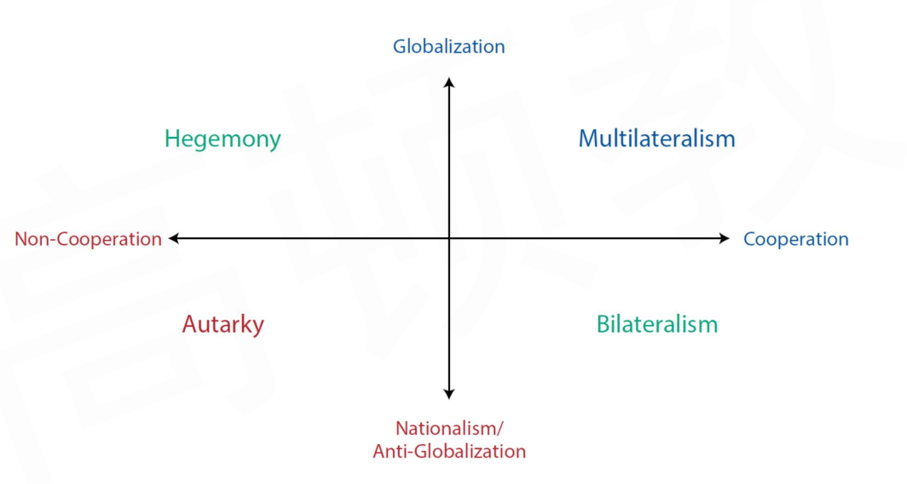
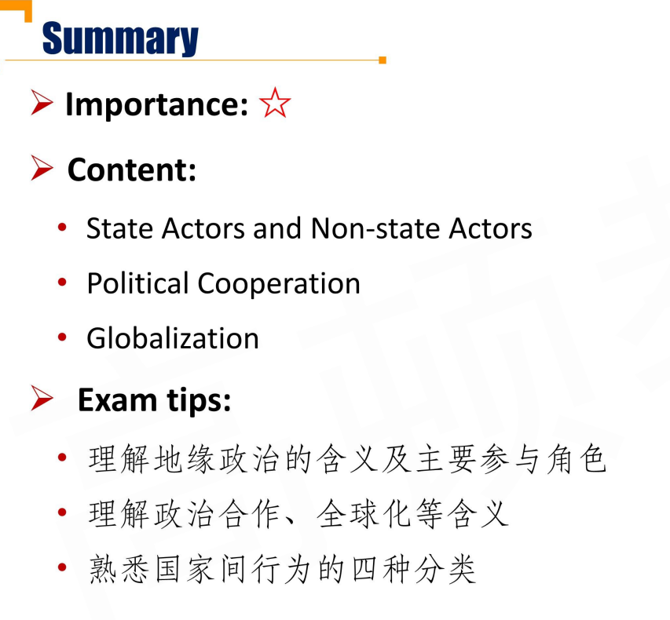
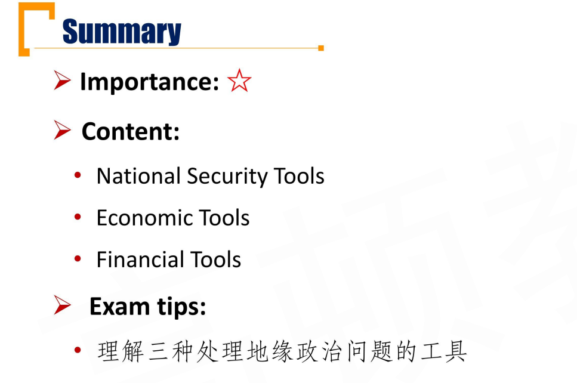
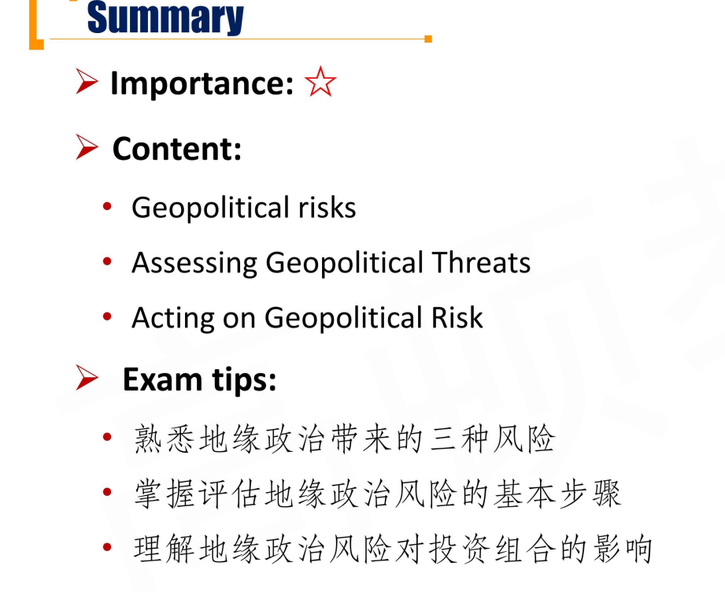

# M5 Geopolitics 

要求较低

## R1 Introduction

三个Reading: Brief Introduction of Geopolitics, Tools of Geopolitics, Geopolitical Risk

#### Concepts of Geopolitics

- **Geopolitcs** is the study of how geography affects politics and international relations
  - Within the field of geopolitics, analysts study **actors**（参与方） \- the individuals, organizations, companies, and national governments that carry out **political**, **economic**, and **financial activities** \- and how they **interact** with one another

- **Geopolitical risk** is the risk associated with tensions or actions between actors that affect the normal and peaceful course of international relations
  - On a macroeconomic level, these risks impact capital markets including economic growth, interest rate and market volatility.

#### State Actors and Non-state actors 地缘政治参与者

- There are many actors influencing international relations, political developments, and economic affairs.
  - **State actors** are typically national governments, political organizations, or country leaders that exert authority over a country's national security and resources.
  - **Non-state actors** are those that participate in global political, economic, or financial affairs but do not directly control national security or country resources.

#### Political Cooperation

- **Cooperation** is the process by which countries work together toward some shared goal or purpuse
  - A cooperative country is one who engages and reciprocates in rules standardization, harmonization of tariffs, international agreements on trade, immigration, or regulation; and allows for the free flow of information, including technology transfer

#### Motivations for coorperation \*\*合作的动机

1. **National security or military interest** 优先保障国家和军事利益
   - Geographic factors play an important role in shaping a country's approach to national security and the extent to which it will choose a cooperative approach
2. **Economic interest** 经济利益
   1. Either they would like to secure essential resources through trade, or they would like to level the global playing field for their companies or industries through standardization

- **Geophyiscal resource endowment资源禀赋** includes such factors as livable geography and climate as well as access to food and water, which are necessary for sustainable growth
  - Geophysical resource endowment is highly unequal among countries
- **Standardization** is the process of creating protocols for the production, sale, transport, or use of a product or service 三个标准化
  - Rules standardization can take many forms-from **regulatory cooperation**(BCBS), to **process standardization**(SWIFT), to **operational synchronization**(Containerization集装箱)

- Countries may engage in **a**, a means of influencing another country's decisions without force or coercion.

#### Political Non-Cooperation

- Over time, most countries are cooperative on some rules standardization on the international scale
  - A non-cooperative country is one with <u>inconsistent and even arbitrary rules</u>, <u>restricted movement of goods/services/people/capital across borders</u>, <u>retaliation</u>, and <u>limited technology exchange</u>
  - 某些方面上体现不合作

- However, there are some instances of extreme non-cooperation \- counties whose political self-determination is more important than the benefits of any cooperative actions. 各自站在各自利益上进行考量

#### Non-state actors

- Generaly, **strong institutions** contribute to **more stable** internal and external political forces.
  - Countries with strong institutions, including organizations and structures promoting government accountability, rule of law, and property rights, allow them to act with more authority.

#### Globalization

- **Globalization** is the process of interaction and integration among people, companies, and governments worldwide.
  - Globalization is carried out mostly by **non-state actors**, such as corporations, individuals, or organizations
- In addition to its **macroeconomic** impact, globalization is also visible at a **microeconomic** level. 包括微观层面，比如生产汽车的全球化产业链。

- **Anti-globalization** or **nationalism** is the promotion of a country's own economic interests to the exclusion or detriment（损害） of the interests other nations.

##### Pros and cons

- Globalization provides **potential gains**
  - Increased profits through increasing sales and/or reducing costs
  - Access to resources: market access and investment opportunities 
  - Intrinsic gains: expanding their horizons
- Globalization also has some **potential drawbacks**
  - Unequal economic and financial gains
  - Interdependence that can lead to supply chain disruption 供应链断裂风险
  - Possible exploitation of social and environmental resources. 导致社会、环境的不协调发展，比如发展中国家污染。

#### Assessing Geopolitical Actors and Risk

- The framework shown below presents four archetypes of country behavior: **autarky, hegemony, multilateralism, and bilateralism**
  - multilateralism 多边主义
  - hegemony霸权主义
  - bilateralism 双边主义
  - autarky 闭关锁国
  - 横坐标合作与非合作，纵坐标全球化与非全球化

## R2 Tools of Geopolitics

- Now that we understand the characteristics of geopolitical actors, we can examine the tools these actors use to manifest or reinforce their interests with respect to others
- The tools of geopolitics may be separated in to three types
  1. **National security tools**
  2. **Economic tools**
  3. **Financial tools**

#### National Security Tools 国家安全工具

- National security tools are those used to influence or coerce a state actor through **direct** or **indirect impact** on the country's resources, people, or borders
  - The most extreme example of a national security tools is that of <u>armed conflict</u>
  - <u>Espionage</u> is an indirect national security tool 间谍
- **Not** all national security tools are used in a non-cooperative way 合作的安全工具，军事联盟
  - <u>Military alliances</u> are often used either to aid in direct conflict or to deter conflict from arising in the first place.

#### Economic tools

- **Economic tools** are used to reinforce a **cooperative** or **non-cooperative** stance via economic means 经济工具可以合作的也可以非合作
  - Among state actors, economic tools can include <u>multilateral trade agreements</u> or the <u>global harmonization of tariff rules</u> 多边贸易协定、灌水规则全球统一制定
  - <u>Nationalization</u> is a non-cooperative approach to asserting economic control

#### Financial tools

- **financial tools** are the actions used to reinforce a **cooperative** or **non-cooperative** stance via financial mechanisms
  - Examples of cooperative financial tools include the <u>free exchange of currencies across borders</u> and <u>allowing foreign investment</u>
  - Examples of non-cooperative financial tools include <u>limiting access to local currency markets</u> and <u>restricting foreign investment</u>

#### Multi-Tools Approaches

- Just as geopolitics is multi-faceted and includes many types of actors and features, so too are the tools of geopolitics
  - Systems of political, economic, and financial cooperation can be, and often are, **intertwined** 各种工具互相影响
- Generally, as actors incorporate **more tools of collaboration**, they are **less likely to initiate conflict or use a non-cooperative tools** against associated actors. 如果合作越紧密，产生冲突可能性越小。
- <u>Cabotage</u>（航权） is the right to transport passengers or goods within a country by a foreign firm
  - Allowing cabotage requires coordination（协调\协作） on areas like physical security and economic coordination, a highly multilateral process

##### Geopolitical Risk and the Tools of Geopolitics

- Geopolitical risk and the tools of geopolitics can **shape actors' core priorities**. 使用不同的地缘政治工具，会影响当前的核心利益。
- Geopolitical risk and to tools of geopolitics can tilt **comparative advantage** in one direction or another.
  - 不同的工具有可能转变相对优势。

## R3 Geopolitical Risk

- **Geopolitical risk** is the risk associated with tensions or actions between actors(state and non-state) that affect the normal and peaceful course of international relations
- Geopolitical risk tends to **rise** when the geographic and political factors underpinning country relations **shift**.

##### Risk \*\*\*

事件风险：提前知道发生，有确定日期，总统选举

外部冲击风险：无法提前预知

主题风险：也可以提前预测，没有确定日期，延续一段时间

- **Event risk** evolves around **set dates known in advance**
  - <u>Political events</u>, for example, often result in changes to investor expectations related to a country's cooperative stance
- **Exogenous risk** is a sudden or unanticipated risk that can impact either a country's cooperative stance, the ability of non-state actors to globalize, or both
- **Thematic risks** are **known risks** that evolve and expand over **a period of time**
  - <u>Climate change</u>, <u>cyber threats</u>, and the <u>ongoing threat of terrorism</u> fall into this category.
- 注意，应对持续性的恐怖袭击是thematic risk，但如果突然的恐怖袭击（911），那就是exogenous risk.

#### Assessing geopolitical Threat 评估风险

- To make an assessment, an investor considers geopolitical risk in terms of the following three areas:
  1. **Likelihood** it will occur
  2. **Velocity(speed)** of its impact 地缘政治风险传导速度
     - ***Low*** geopolitical risk velocity matches with "**adjust asset allocation**"
     - **Medium** geopolitical risk velocity matches with "**adjust investment specific sectors**"
     - **High** geopolitical risk velocity matches with "**flight to quality**" （走为上策）
  3. **Size and nature of that impact** 影响规模

- Geopolitical risk seldom develop in linear fashion, making it **difficult to monitor and forecast** their likelihood, velocity, and size and nature of impact on a portfolio.

- As a result, many investors deploy an approach that includes **scenario building**(情景分析) and **signposting**（指示信号） rather than a single point forecast
  - Scenario analysis is the process of evaluating portfolio outcomes across potential circumstances or states. 把可能的情况罗列出来

#### Tracking Risks according to signposts指示信号

- A **signpost** is an indicator, market level, data piece, or event that signals a risk is becoming more or less likely
  - Good signposts are anchored in the key assumptions made up-front around a scenario and mark whether a scenario is materializing
  - 比如：总统选举前的民意调查。确定具体的scenario发生概率。
- High-velocity risks（高传导速度） are most likely to manifest in market volatility via prompt changes in asset prices 高传导速度会增加市场波动性。
  - Geopolitical risk index(GPR)

#### Acting on Geopolitical Risk

- On a macroeconomic level, these risks can impact **capital markets conditions**, such as economic growth, interest rates, and market volatility
  - Changes in capital markets conditions can have an important influence on **asset allocation decisions**, including an investor's choice of geographic exposures 影响资产配置
- On a portfolio level, geopolitical risk can influence the **appropriateness of an investment security or strategy** for an investor's goals, risk tolerance, and time horizon（RRTTLLU）
  - Investors can consider geopolitical risk as a factor in multi-factor models
    - 地缘政治因子，比如上面提到的GPR指数

- 三种地缘政治分类，评估（可能性、速度、size\nature）、情景分析、指示信号，影响portfolio(RRTTLLU)

3