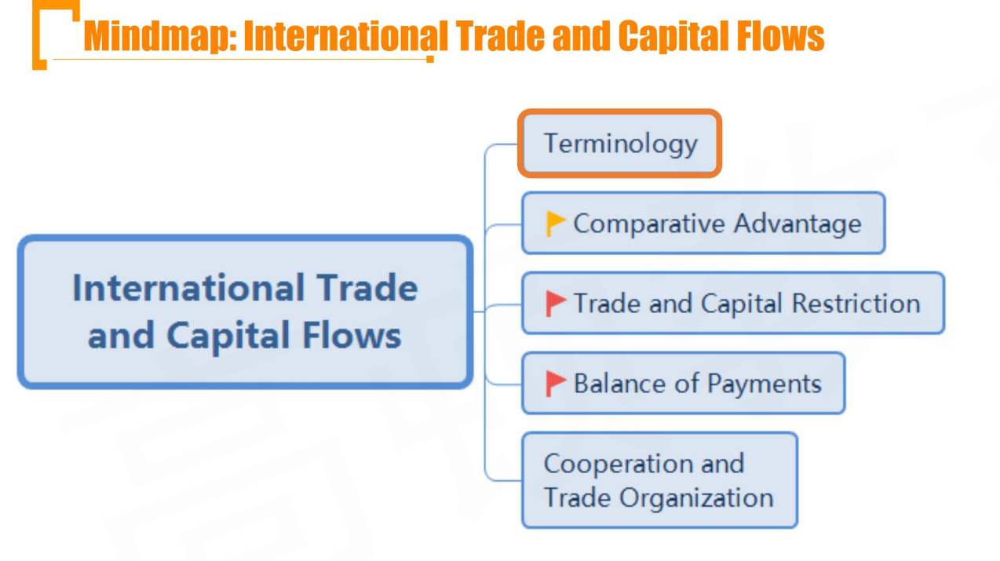
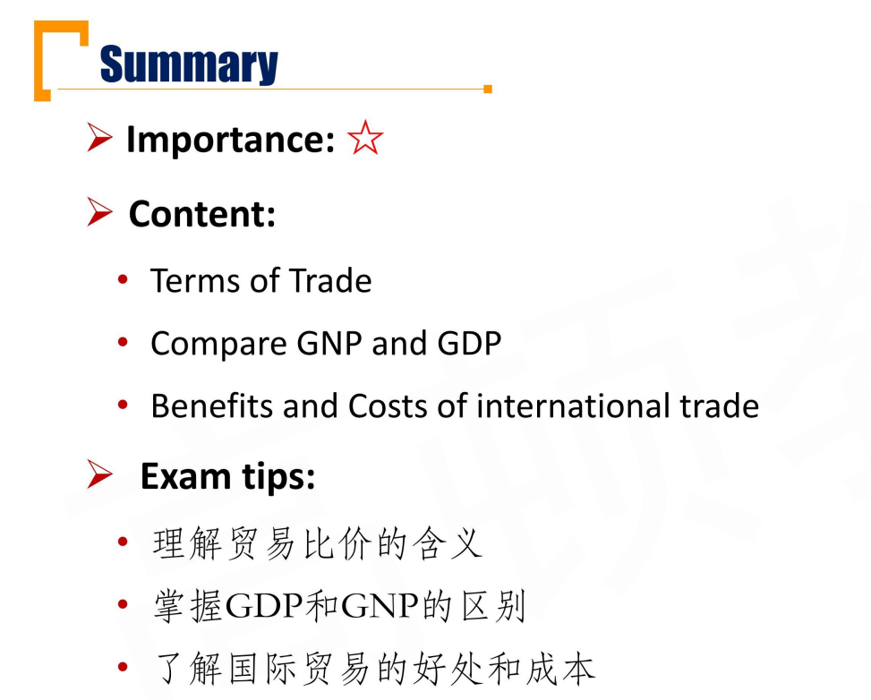
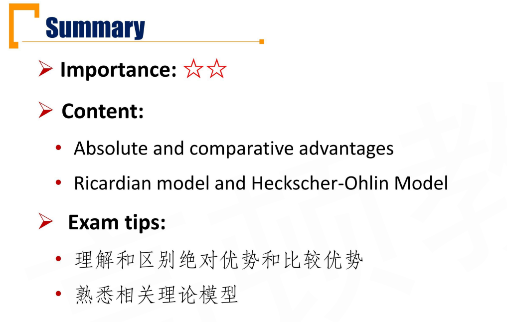
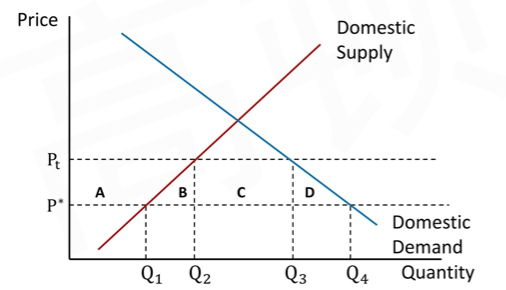
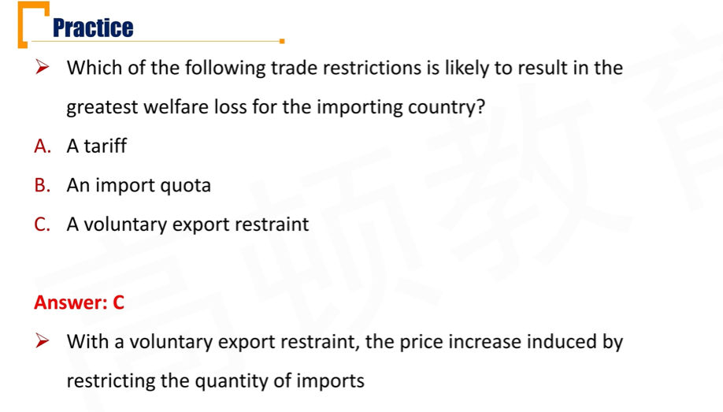
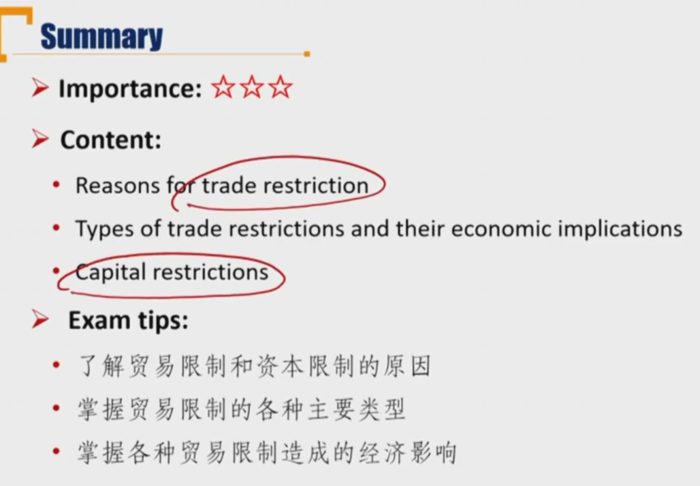
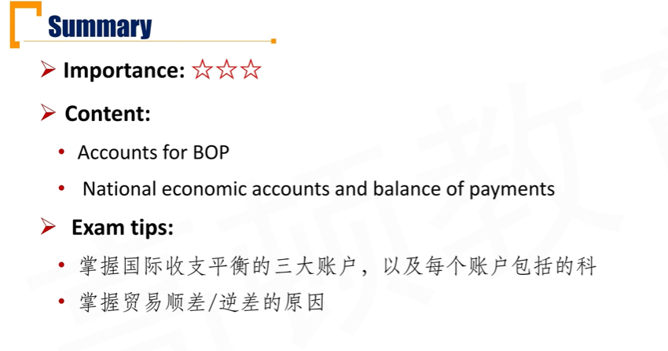
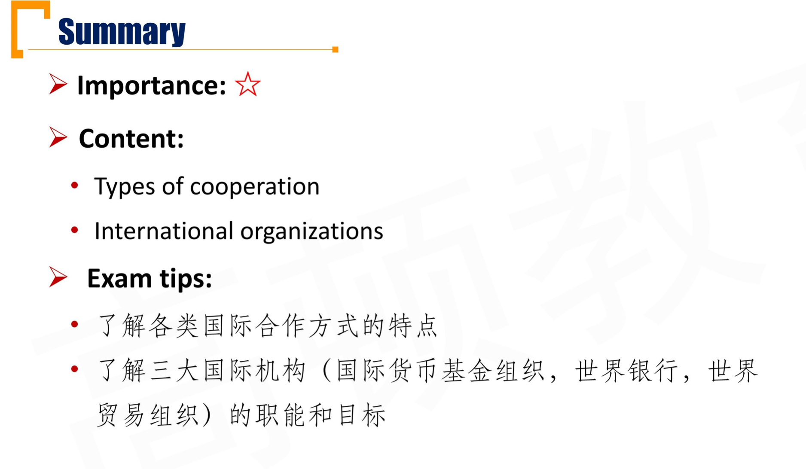
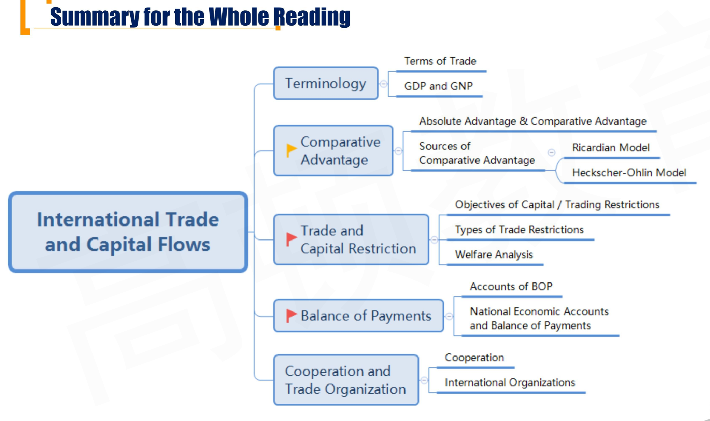

# M7 International Trade and Capital Flows

## R1 Brief Introduction of International Trade

#### Basic Terminology

- **Open economy**
  - An economy that trades with other countries
- **Closed economy**
  - Autarkic economy, no trade with other countries

- **Free trade**
  - A government places no restrictions or charges on import and export activity
- **Trade protection**
  - A government places restrictions, limits, or charges on export or imports.

#### Terms of Trade(TOT)贸易比价

- The TOT ratio of an index of the prices of a country's exports to an index of the prices of its imports, expressed relative to a base value of 100
  - 出口物价指数 / 进口物价指数 \*100
  - TOT同一币种计算，不会受到汇率影响
  - 如果TOT>100，出口物价>进口物价，用出口赚到的外汇，买国外的货物，则有出口Q < 进口Q，意思是TOT改善（TOT improves）。卖出Q，进口更多。
- A country can purchase more imported goods for every unit of export that it sells when its TOT improves.

#### GDP and GNP

- **Gross domestic product(GDP)**
  - Total value of goods and services produced with **a country's borders** over a period 属地
- **Gross national product(GNP)**
  - Total value of goods and services produced by the labor and capital of **a country's citizens** 属人
- A国公民在B国的工厂赚钱，算在B国的GDP，算在A国的GNP

#### Benefits and Costs of International Trade

- **Benefits**
  - Deepening specialization 专业化分工，做最擅长的产业
  - Promote competition and increase welfare
    - 刺激竞争，提升福利
  - Enlarge GDP
- **Costs**
  - Greater inequality
  - Unemployment in import countries

## R2 Comparative Advantage

#### Absolute Advantage and Comparative Advantage

- **Absolute Advantage:** A country is able to produce goods **at a lower cost** or **use fewer resources** in its production than its trading partner
- **Comparative advantage**: A country's **opportunity costs** of producing that good is less than that of its trading partner.

|      | Meat produced per worker | Potatoes produced per worker |
| ---- | ------------------------ | ---------------------------- |
| A    | 3                        | 4                            |
| B    | 9                        | 8                            |

- B has absolute advantage on both
- B has comparative advantage on meat
- A has comparative advantage on potatoes
- A国，生产1单位肉，机会成本是4/3土豆
- B国，生产1单位肉，机会成本是8/9土豆，所以A国有土豆的比较优势

比较优势肯定是两个国家相反：A国有商品1的比较优势，那么B国就有商品2的比较优势

#### Sources of Comparative Advantage- Ricardian Model

- **Ricardian model**
  - A country can gain from trade, if only it has a comparative advantage
  - **Labor** is the only factor of production
  - Differences in **labor productivity** reflect differences in technology
    - 劳动生产率：劳动力的质量不同（单位劳动力产出）
  - **Technology is the source of comparative advantage.**
  - **科技发达**->劳动生产率高->劳动力是关键生产要素->具有比较优势
  - 所以source of comparative advantage就是科技

#### Sources of Comparative advantage - Heckscher-Ohlin Model

- Heckscher-Ohlin Model
  - Both **capital** and **labor** are variable factors of production
  - **Differences in the relative endowment of capital and labor are the source of a country's comparative advantage.** 
    - 不同国家的资源禀赋和劳动力的配比不同，造成了比较优势。
  - Relatively abundantly endowed tend to specialize in and export that good
    - **Labor abundant countries** export goods that are labor intensive in their production 劳动密集型
    - **Capital abundant countries** export goods that are capital intensive in their production 资本密集型

## R3 Trade and Capital Restriction

#### Objectives of Capital/Trading Restrictions

- Common objectives of **captial restrictions**资本限制：限制资金
  - reduce the volatility of domestic asset prices 为了避免逐利的热钱过多涌入
  - Maintain fixed exchange rates 保持汇率稳定
  - Keep domestic interest rates low
  - Protect strategic industries
- Reasons for **trade restrictions** 贸易限制 限制服务
  - Infant industry 保护新兴产业
  - National security
  - Protecting domestic jobs
  - Protecting domestic industries

#### Types of trade Restriction

- **Tariffs** 关税
  - Taxes that a government levies on imported goods.
  - 进口方向出口国征税，站在进口方的角度
- **Quotas** 配额
  - Restrict the quantity of a good taht can be imported into a country
  - 进口国角度
- **Export subsidies**
  - Government payments to firms that exports goods
  - 出口国角度，向外贸公司进行补贴
- **Voluntary export restraint(VER) **自愿出口限制
  - A trade barrier under which the exporting country agrees to limit exports to its trading partners to a specific number of units.
  - 注意，分析时站在进口方角度，因为通常情况，进口国强制出口国实施VER。

#### Welfare Analysis for importing country

1. **Tariff**

2. **Import Quota by selling licenses**

   - Consumer Surplus: -(A+B+C+D)

   - Producer surplus: +A

   - Tariff revenue or Quota Rents: +C

   - National welfare: - B - D
   - 对于下图，假设贸易自由，没有任何资金限制的情况，世界均衡价格是$P^*$，代表本国的厂商生产Q1的产品，本国需求Q4，所以进口数量是Q4-Q1
   - 由于关税或者贸易配额，抬高了本国的销售价格。所以consumer surplus是实际价格和愿意支付价格的距离，所以减少了A+B+C+D
   - 政府的关税（tariff revenue）或者牌照，配额租金（quota rents） = $(P_t-P^*)(Q_3-Q_2)$=C

3. **Import Quota by not selling licenses**

4. **VER**

   - Consumer Surplus: -(A+B+C+D)

   - Producer surplus: +A

   - National welfare: - B - D - C
   - 自愿和没有拍照的情况，进口方政府不收税，所以C也被损失掉（deadweight loss）
   - 但这里不是政府通过关税抬高价格，而是减少进口数量。是出口国为了利益最大化主动抬高价格。

#### Effect of Trade Policies

|                       | Tariff                                           | Import Quota                                      | Export Subsidy        | VER               |
| --------------------- | ------------------------------------------------ | ------------------------------------------------- | --------------------- | ----------------- |
| Impact on站在谁的角度 | Importing Country                                | importing country                                 | **Exporting country** | Importing country |
| Producer surplus      | Increases                                        | Increases                                         | Increases             | Increases         |
| Consumer surplus      | Decreases                                        | Decreases                                         | Decreases             | Decreases         |
| Government revenue    | **Increases**                                    | **Uncertain**                                     | **Falls**             | **No change**     |
| National welfare      | Decreases(could increase in **large countries**) | Decreases (could increase in **large countries**) | Decreases             | Decreases         |
| Price                 | Increase（这里不考虑large country）              | Increase                                          | Increase              | Increase          |
| Domestic Consumption  | Decrease                                         | Decreases                                         | Decreases             | Decreases         |
| Domestic Production   | Increases                                        | Increases                                         | Increases             | Increases         |
| Trade                 | Imports decreases                                | Import decreases                                  | **Export increase**   | Imoprt decreases  |

- import quota，卖配额的时候，government revenue increase，no license的时候 no change

- 对于Export subisdy，政府补贴，导致政府revenue下降=producer surplus上升，两者抵消后，剩下consumer surplus下降，所以national welfare decreases
- 对于Tariff和import quota，进口方是贸易强势国，出口国不愿意丢失市场份额，不涨价，自掏腰包付关税。这个时候national welfare增加。

- VER: -B-C-D

## R4 Balance of Payments 国际收支\*\*\*

#### Accounts of BOP - 1

三大账户，下面有若干子账户

1. **Current account经常账户:** Measure the flow of goods and services 货物和服务
   - **Merchandise trade:** all commodities and manufactured goods bought, sold, or given away
   - **Services: ** Tourism, transportation, engineering, and business services（business：会计、法律服务等）
   - **Income receipts（投资收入）:** Income derived from ownership of asset such as dividends, interest payments, income on foreign investments
     - 重要：和投资**收入**有关的计入
   - **Unilateral transfers单边转移:** One-way transfers of assets such as worker remittances(汇款) and foreign direct aid or gifts
     - 国外打工往国内汇款，国外援助，国际捐赠

2. **Capital Account资本账户**: Measure transfer of capital
   - **Capital transfers资本转移:** Debt forgiveness and migrants' transfers
     - 免除债务，移民资产转移
   - **Sales and purchases of non-produced, non-financial assets:** Patents, copyrights, trademarks, franchises.
     - **注意：如果是付费使用patent(无形资产)，则计入current account的sercives；如果是直接购买了patents（无形资产），则计入capital account的sales and purchases or non-produced, non-financial assets.**
3. **Financial Account: 金融账户**: Records investment flows
   - **Government-owned assets abroad:** Gold, foreign currencies, foreign securiteis, reserve in the IMF, direct foriegn investment
     - 本国人持有的外国资产.
   - **Foreign-owend assets in the reporting country:** domestic government and corporate securities, direct invesmtnet in the domestic country, domestic country currency
     - 外国持有的本国资产

#### National Economic Accounts and Balance of Payments

- Aggregate Income(AI) = Aggregate Expenditure(AE)
  - C + S + T = C + I + G + (X - M)
  - (X - M) = S - I + T - G
- **X - M = current account balance = $S_p$ + $S_g$ - I**
  - 出口 - 进口体现在经常账户current account净值
  - $S_p$: private sector savings(S) 居民+企业的储蓄
  - $S_g$: governemnt savings(T - G)
- **Trade deficit** can result from :
  - A lack of private savings $S_p$
  - A lack of government savings $S_g$
  - Boming investment $I$

## R5 Cooperation and Trade Organization

#### Cooperation

层层递进

- **Free Trade Areas: ** All barriers to import and export of among member counties are removed
  - e.g. 北美自由贸易区。没有进出口壁垒
- **Customs Union关税联盟:** FTA plus a common trade policy against non-members
  - 关税联盟，FTA + 一致对外
- **Common market: **共同市场 Customs Union plus free flow of labor and capital goods among member countries
  - customs union + 生产要素自由流动
- **Economic Union 经济联盟:** Common market plus common institutions and economic policy for the union
  - common market + 经济政策统一
- **Monetary union: ** Economic Union plus a common currency
- 欧盟就是从common market 逐步演变到monetary union

#### Advantages of Regional Integration

- Easier, politicaly less contentious, and quicker than multilateral trade negotiations(e.g. WTO)
- Greater specialization, economies of scale from larger market size, better quality intermediate inputs at world prices 发挥各个国家的优势
- Fostering greater interdependence among members of the regional trading bloc reduces the potential for conflict
- Members of the bloc also have greater bargaining power and political clout in the global economy

#### International organizations -1

- **International Monetary Fund**
  - Facilitates the growth of international trade and promotes employment, economic growth, and pverty reduction 
  - Suppots exchagne rate stability and an open system of international payments
  - Lends foreign exchange to members, on a temporrary basis, to help them address balance of payments problems. 紧急的流动性救助
- **World bank group**
  - Implement legal and judicial systems that encourage business 
  - Protect individual and property rights and honor contracts
  - Develop financial systems robust enough to support endeavors ranging from micro credit to financing larger corportate ventures 提供贷款，帮助开展建设，和IMF的贷款不一样
  - Combat corruption
- **World Trade Organization**
  - regulates cross-border trade relationships
  - Implementattion, administration, andoperation of individual agreement
  - Acting as a platform for negotiations
  - Settling disputes
  - Insure coherence and transparency of member country's trade policies

