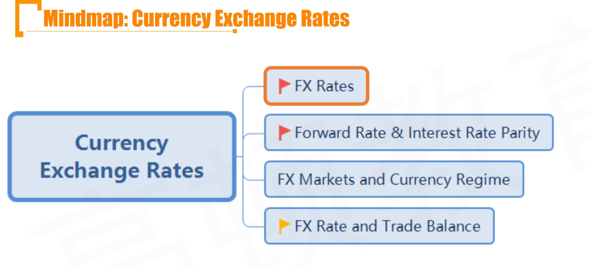
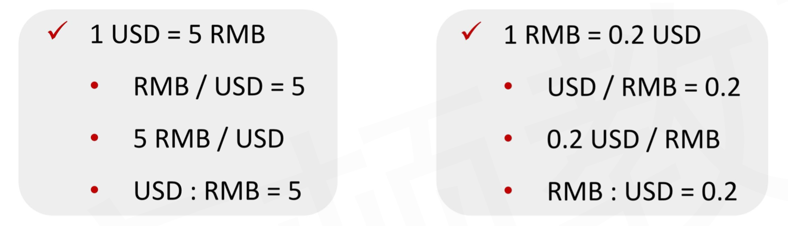
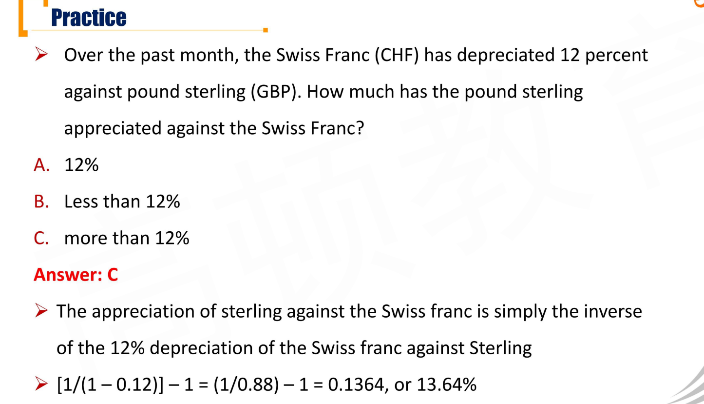
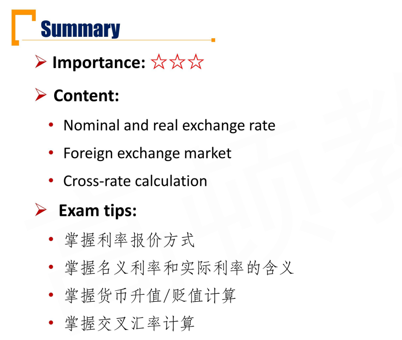
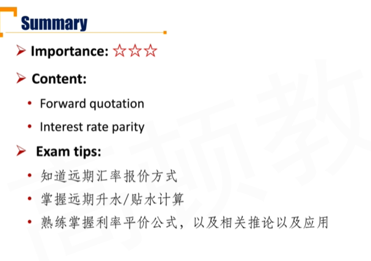
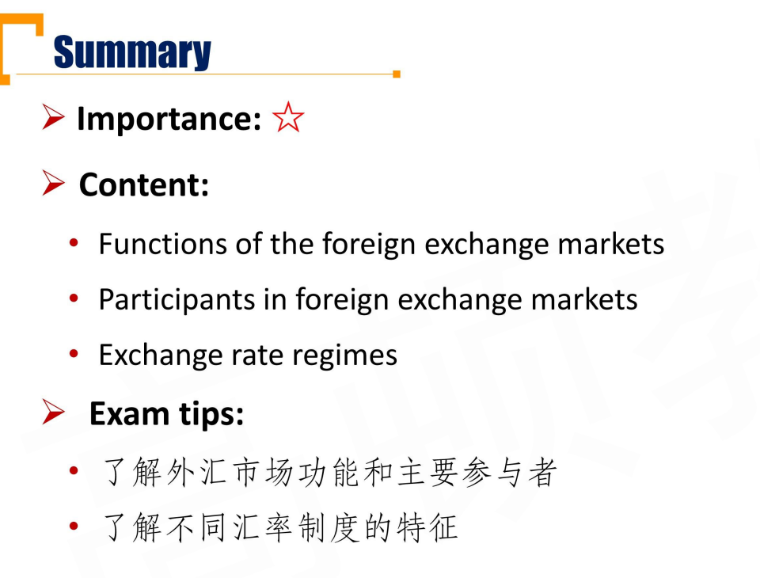
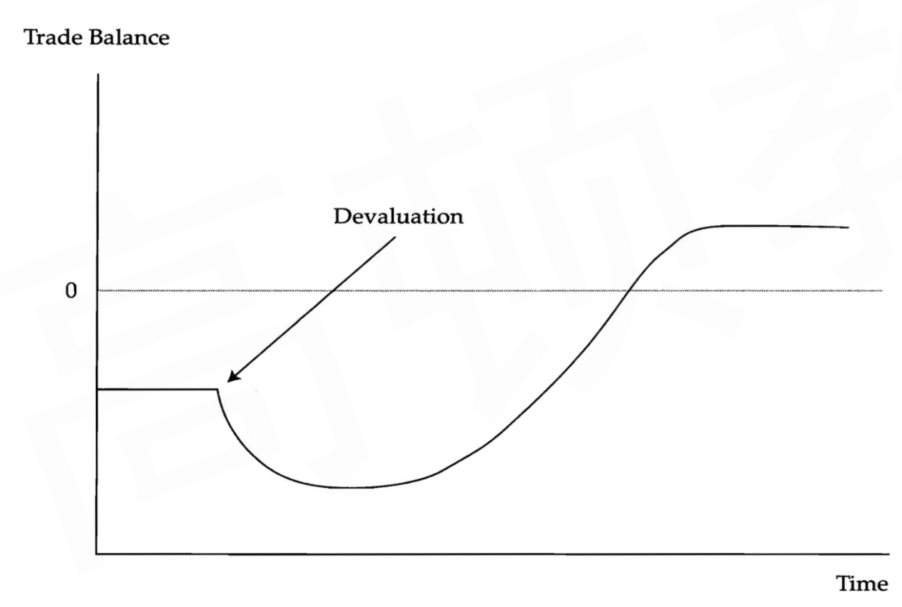
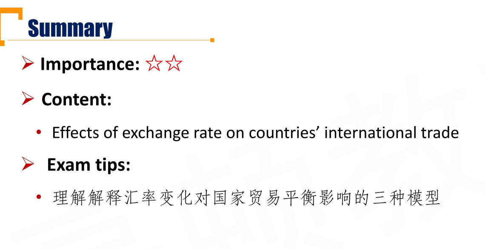

# M8 Currency Exchange Rates

## R1 Introduction of Foreign Exchange Rates

#### Exchange Rate Quotation

- **Foreign Exchange(FX) rate:** The price of one currency in terms of another.

- For the quotation as A/B(B:A)
  - A is the **Price currency**
  - B is the **Base currency**
- **Direct quotation:** foreign currency as the base currency
- **Indirect quotation**: Domestic currency as the base currency

#### Nominal/Real exchange rate

- **Nominal exchange rate**
  - The price that we observe in the marketplace for foreign exchange
- **Real exchange rate**
  - Adjust nominal exchange rate to reflect the relative **purchasing power** between countries

$$
Real_{d/f}=Nominal_{d/f}\times\frac{P_f}{P_d}
$$

- 证明方法：

$$
Real_{d/f} = \frac{DC/P_d}{FC/P_f}
$$

名义/P = real。 1个FC，可以买

#### Currency Appreciation or Depreciation

- Base currency is critical
  - A/B报价的涨跌，代表了B的升值贬值。比如A/B从1涨到2，表示B升值。
- Suppose the exchange rate for USD/EUR changes from 1.25 to 1.30
  - What is the percentage change in the value of EUR relative to USD？
    - 这里，其实就是把EUR当成base currency，当成一个货物。用美元去标价，问这个商品涨了多少钱。
    - 显然就是(1.3-1.25)/1.25
  - What is the percentage change in the value of USE relative to EUR？
    - 同样，一个美元等于多少欧元。把美元当作商品，看美元的变动
    - $1.3^{-1}/1.25^{-1}-1$

有一个诀窍：

比如某一个报价法则d/f下，从$x_1$变动到$x_2$，变动幅度是$a$，这里$a$既可以正数也可以负数，则有
$$
\frac{x_2}{x_1}=1+a\\
\frac{x_2^{-1}}{x_1^{-1}}- 1=\frac{-a}{1+a}
$$
所以，在直接报价法则（d/f）下的时候，f relative to d 如果appreciate 了 a，表示a > 0
$$
a>\frac{a}{1+a}
$$
即，d relative to f的depreciation幅度小于a

另外一种情况，如果f relative to d depreciate 了 a，表示a < 0，
$$
|a|<|\frac{a}{1+a}|
$$
即，d relative to f 的appreciation幅度大于a

所以有结论：

- d relative to f 贬值a时，f relative d 升值幅度大于a

- d relative to f 升值a时，f relative d 贬值幅度小于a

也就是**贬值的幅度比升值的幅度小**，所以下面的题目不用算都可以

#### Cross-Rate Calculation

- USE/EUR = 1.4, CHF/USD = 0.9, and USD/ GBP = 2
- Calculate
  - CHF / EUR
  - GBP / EUR
- 当成除号展开就可以

## R2 Forward Rate and Interest Rate Parity \*\*\*

#### Spot Rates and Forward Rates

- **Spot exchange rate**
  - Currency exchange rates for immediate delivery

- **Forward exchange rate**
  - Currency exchange rates for an exchange to be done in the future

#### Forward Discount or Premium 折价、溢价

复习：盯住base currency. quote高，base currency 升值

- If the forward quote is higher than spot price
  - Base currency is trading at a forward premium
  - Price currency is trading at a forward discount
- If the forward quote is less than spot price
  - Base currency is trading at a forward discount
  - Price currency is trading at a forward premium

#### Forward Quotation - Point Basis

- Spot rate + 0.0001 $\times$ points = Forward rate
- 0.01 for Yen
- Example
  - Spot rate GBP/EUR = 0.8552, one month points are \-1.1
- Answer:
  - The one month forward rate
  - GBP/EUR = 0.8552 \- 1.1 \* 0.0001 = 0.85509

#### Forward Quotation - Percentage Basis百分比基差

- Example
  - Spot rate GBP/EUR = 0.8552
  - One month forward quote is \-0.29%
- Answer
  - The one month forward rate
    - GBP/EUR = 0.8552 \* (1-0.29%) = 0.8527

#### Interest Rate Parity

$$
\frac{F_{forward(x/y)}}{S_{spot(x/y)}}=\frac{1+r_x(\frac{days}{360})}{1+r_y(\frac{days}{360})}
$$

- 前提：**x国和y国不存在套利机会**，这里用的是单利
  - 考虑下面两种投资方式，不存在套利机会
    - 在Y国投资1元，并在y国投资，在一年后能够获得$(1+r_y)$
    - 在y国投资1元，并兑换成x币$S_{x/y}$，在x国投资，一年后获得x币$S_{x/y}(1+r_x)$，然后兑换成y币，$\frac{S_{x/y}}{F_{x/y}}(1+r_x)$
  - 由于不存在套利机会，上面两个一年后现金流相等

- The percentage difference between forward and spot exchange rates is approximately equal to the difference between the two countries' interest rates
  - **The currency with higher nominal interest rate will depreciate**

$$
\frac{F-S}{S}=\frac{1+r_x}{1+r_y}-1=\frac{r_x-r_y}{1+r_y}\approx r_x-r_y
$$

- 利率差，代表远期汇率偏差幅度。如果rx > ry，意思是x/y的报价，远期大于即期，也就是说预期远期升值，所以base currency （y) 预期升值。
  - 也就是，谁的利率低，谁的远期就高于即期。谁的利率高，谁的远期就低于即期。
  - 注意：这里和之前宏观讲到的降低policy rate->interest rate 降低->货币贬值刺激出口。结论完全相反。因为汇率平价公式站在无套利的假设进行，角度不一样。
  - 思考：
    - 假设t=0时刻，x国政府宣布降息。

## R3 FX Market and Currency Regime

#### Functions of the Foreign Exchange Markets

- Facilitate international trade in goods and services 国际贸易，最根本需求
- Hedging
  - Have an existing FX risk that they want to reduce with forward FX contracts
- Speculation
  - Have no existing FX risk, they take on FX risk with the expectation earning a profit.

#### Participants in foreign exchange markets

- **Buy side**
  - Corporate, retail accounts, governments, central banks, pension plans, sovereign wealth funds(SWFs,e.g. 中投、新加坡[淡马锡](https://zh.wikipedia.org/wiki/淡马锡控股))
- **Sell side**
  - Dealing banks: Large multinational banks

#### Currency Regimes-1

- **Dollarization:** The country use the currency of another nation and gives up its own monetary policy 美元化
- **Currency board arrangement**: Legislative commitment of a government to maintain fixed rate with another currency(e.g., Hong Kong) 货币局制度，法律规定和另外币种绑定
- **Conventional fixed peg arrangement:** No legislative commitment, fixed rate with another currency within margins of +/- 1%
- **Pegged exchange rates with horizontal bands (target zone):** Permitted fluctuations in currency value relative to another currency are wider(e.g., +/- 2%)
- **Crawling pegs:** Frequently adjusted fixed rate 爬行钉住，中间的围绕的线可以移动。
  - Active crawling pegs: to manipulate inflation expectation
    - 主动，可以主动移动。让本币升值，可以抑制本国通胀。（C+I+G+(x-m）)
    - 提前公布crawling peg，让市场知道通胀预期。
  - Passive crawling pegs: keep pace with country's inflation rate
    - 被动，用通胀移动基准线。
    - 比如A钉住B。B国发生通胀->B国物价上涨->B国出口需求下降->B国货币贬值->A国钉住B->A也贬值->A也发生通胀。

这里之前都是固定

- **Fixed parity with crawling bands** 爬行钉住，中间价可以调节，但是上下区间越来越宽。

这里之后就是浮动

- **Managed Float:** Floating with government intervention(without explicit target)
  - 管理浮动，适当的时候参与干预（不会公布干预目标）。
- **Independently floating rates**: FX rate left to market determination, central bank has independent monetary authority.
  - 完全浮动制度

## R4 FX Rate and Trade Balance

本币贬值，不一定会改善贸易状况，下面三个模型从不同角度看贬值的时候，给贸易状况带来的影响。

#### Elasticities Approach

- Depreciation of domestic currency can improve trade deficit, only when imported or(and) exported goods' demand is elastic. （进口出口货物有弹性时）
  - 复习: TR = P \* Q. 

$$
\frac{\Delta TR}{TR}=\frac{(P+\Delta P)(Q+ \Delta Q)-PQ}{PQ}=\frac{\Delta P}{P}+\frac{\Delta Q}{Q}\\
\epsilon=\frac{\Delta Q/Q}{\Delta P/P}
$$

- 如果具有价格弹性，意思是价格下降幅度小于数量上涨幅度，也就是降价一点点，销量增加很多。反映在TR曲线上，就是收益增加。也就是good具有弹性->价格下降->revenue增加。
- 如果出口货物具有弹性：
  - 当本币贬值->出口价格下跌->出口revenue增加

- 如果进口货物具有弹性：
  - 当本币贬值->进口价格上升->进口revenue下降
- 根据GDP = C + I + G + (X - M)，得到有弹性时，GDP才会改善。

- Marshal-Lerner Condition
  - $w_XE_X+W_M(E_M-1)>0$（上面逻辑的具体量化）
  - $w_X$and $w_M$ are the shares of exports and imports
  - $E_X$and $E_M$ are the absolute value of the price elasticities of demand.

- The FX rate adjustment has larger impact on trade balance if a country exports and imports：（下面的商品意思就是弹性很大）
  - Goods for which there are goods substitutes
  - Goods that trade in competitive markets
  - Luxury goods, rather than necessities
  - Goods that represent a large portion of consumer expenditures or a large portion of input costs for final producers 占收入或者花销比重越大，弹性越大。

#### J-curve Effect

- In a very short run, export and import quantities don't respond to FX rate change, currency depreciation may worsen a trade deficit

纵坐标X-M. 短时间里贸易的数量Q没有受到影响。

#### Absorption Approach

看产能有无充分利用。

- Trade balance must equals absorption(gross income minus domestic expenditure), so the FX rate effect on trade balance varies
  - BT = X - M = Y - (C + I + G) = Y - E
  - BT = Y - E
  - If there's excess capacity（多余产能） in the economy, depreciation increases gross product(income) and cause surplus, can improve the trading deficit.
    - 本币贬值，使得需求从国外转移到国内，使得Y上升，E也上升。同时，由于边际消费倾向的存在，国内消费增加时，有一部分储蓄下来。所以Y上升大于E上升，所以贸易状况改善。
  - If there's no excess capacity, depreciation raise domestic price and cancel out the FX rate effect.

