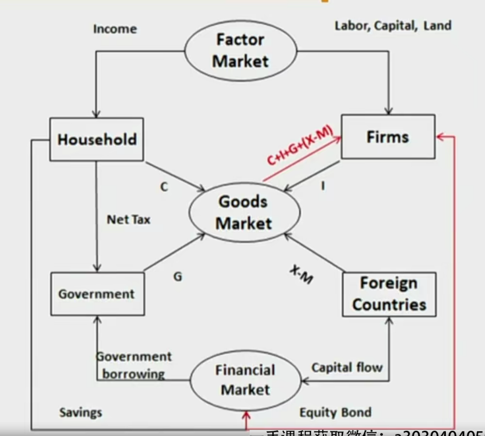
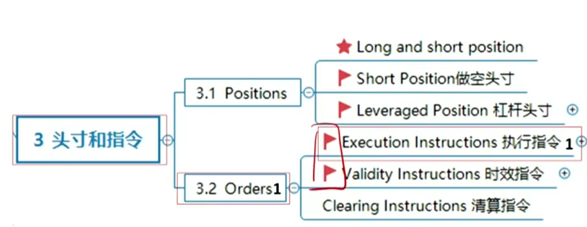
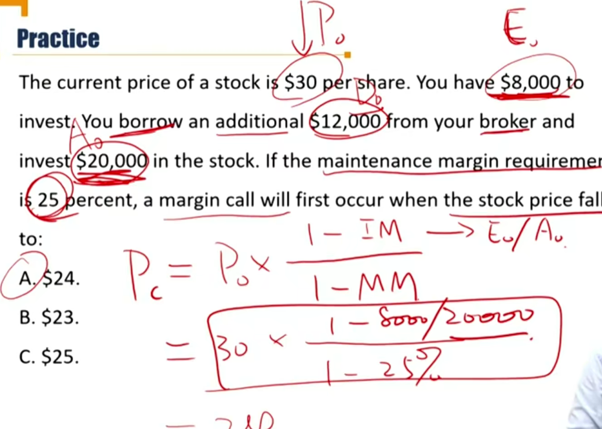
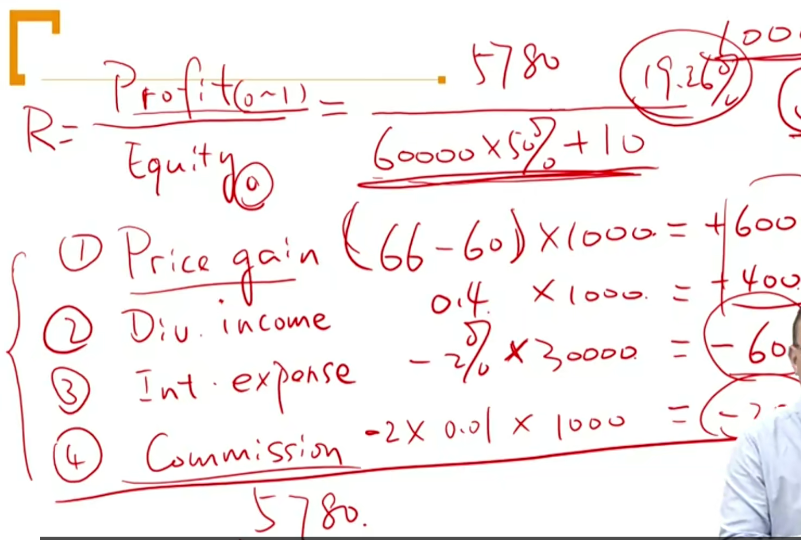
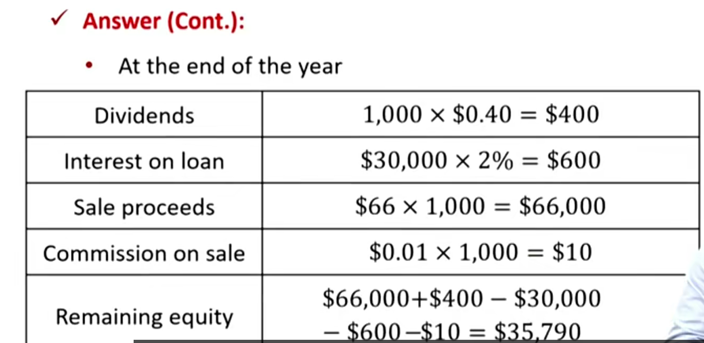
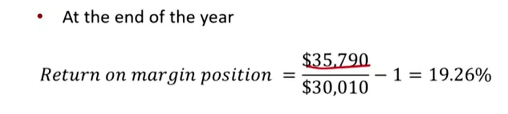
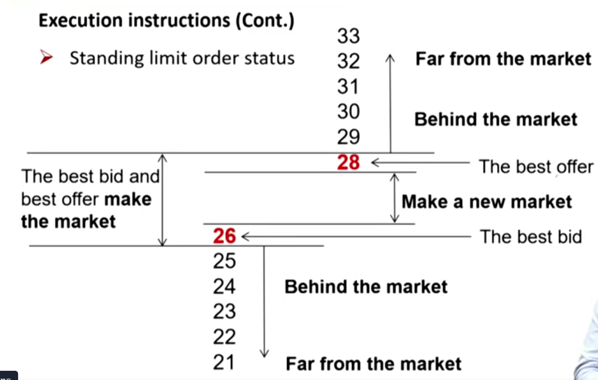
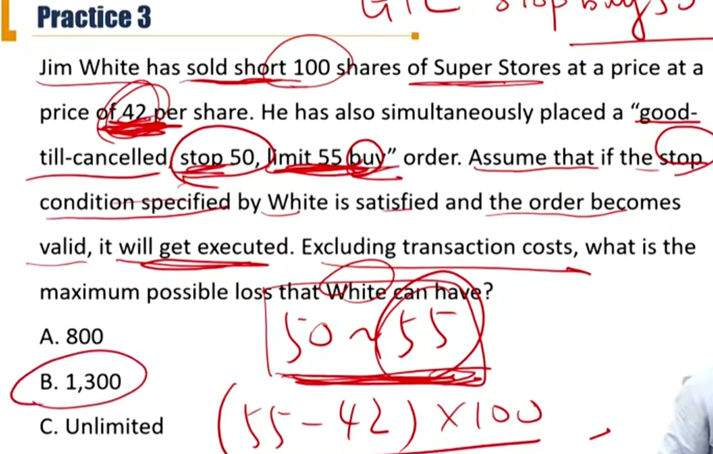

# V5-M1 Market Organization and structures \*\*\*

- 美国是金融市场、商品市场双引擎。金融市场可以按照最优配置，把资金投向最赚钱的地方。

### 1） Market function, classification and assets

#### Three main functions of the financial system

- **Achieving purposes in using financial system** 满足投资者不同需求
  - Saving 储蓄：现在的钱存起来，未来用
  - Borrowing 借贷：未来的钱借过来，现在用
  - Raising equity capital 股权融资：也是未来的钱现在用
  - Managing risks 管理风险
    - e.g. Hedgers use derivative contracts to manage risks.
  - Exchanging assets 交换资产
    - e.g. currency exchange，跨国公司交换外汇
  - Information-motivated trading 根据信息驱动的交易
    - Information-motivated traders expect to earn an additional return by identifying assets that are currently undervalued or overvalued. 信息优势赚取差价
    - The distinction between pure **investors** and **information-motivated traders** depends on their motives for trading and not on the risks that they take or their expected holding period. 纯投资者和信息驱动交易者不一样，关键看投资的动机，是passive（比如跟踪指数，指数基金pure investors） 还是 active（主动投资，跑赢大盘 information-motivated traders）
- **Determining equilibrium rates of return** 提供均衡回报率
  - **Equilibrium rate of return** is the rate that equates the aggregate supply of funds to the aggregate demand for funds
    - 当流动性偏好Liquidity preference = Money Supply 时，形成equilibrium。（LM curve)
- **Capital allocation efficiency** 资本市场的有效性
  - Economies are **allocationally efficient** when their financial systems allocate scarce capital to the most productive uses. 稀缺资本流向生产力最需要的地方
  - 另外，区分另外两个efficiency: information efficiency 市场价格能充分反映基本面、公司的基本信息, operational efficiency指的是公司运营过程中产生的摩擦成本最低。
  - 美国资本市场为什么能充当美国经济的引擎，就是资本市场有效性，让资金能流到最能提高生产力的行业、公司（谷歌、微软等）。相反，A股最高市值的股票并不能反应国内最高生产力。

#### Classification of Market

##### Based on delivery date(交割日)

- Spot markets(现货市场) is the market where deliver happens now.
- Future markets(期货市场) is the market where deliver happens sometime in the future.

##### Based on maturity

- Money markets(货币市场) trade debt instruments maturing in **one year or less**.
  - 1 reverse repurchase agreement逆回购
- Capital markets(资本市场) trade instruments of longer duration.

##### Based on position and underlying

- **Traditional market传统投资** *long public* debts and equities and pooled investment vehicles 集合类资产（公募基金等）.
  - （只能做多、交易所市场公开买卖）

- **Alternative market** 另类投资市场 include hedge funds, private equity（私募股权）, commodities（大宗商品）, **real estate securities**, collectibles（收藏品：油画、文物等）, etc.
  - hedge funds 对冲基金

##### Based on capital flow 资金流向

- **Primary market一级市场** is the market where newly issued securities are sold by **issuers股票发行方 to investors**. 投资者直接把资金投资给上市公司
  - IPO，二次增发
- **Secondary market二级市场** is the market where **investors trade to each other**

#### Classification of Assets 资产分类 较重要

Securities（重要），currencies，contracts，commodities，real assets

##### Securities

- Security Based on underlying characteristic

  - Fixed income

    - Bills短期国债, notes中期国债, bonds长期国债
    - Commercial paper企业债（3月~12个月）, certificate of deposit（CDs,大额存单，银行发行，3月~3年）, repurchase agreements(repos，回购协议，区分reverse repos（逆回购协议)，204001）
    - Convertible debts

  - Equities 普通股

    - Common shares, preferred shares, warrants
    - 普通股residual right 剩余求偿权：破产时，先结算工资，然后还债，然后优先股，最后才是普通股。
    - warrants权证：1）有行权的权利；2）可以在市场转让（类似option期权）

  - Pooled investment vehicles 集合类投资

    - Mutual funds公募基金, trusts信托基金, depositories存款, hedge funds对冲基金

    - Open-ended fund开放式, closed ended fund 封闭式

      - 封闭式基金有锁定期lockup period
      - NAV净值
      - open-ended fund存在cash drag，现金准备投资人赎回，影响业绩。
      - Exchange-traded funds(ETFs，交易所可交易基金), exchange-traded notes(ETNs：交易所可交易债券), Authorized participants(APs：合格投资人), In-kind deposits and redemptions
        - In-kind：以物易物。In-kind deposits and redemptions时，存在tax defer.

      - Asset-backed securities（ABS）资产证券化类资产，如果是住房抵押（MBS）

- Based on whether trade publicly

  - Public securities: are traded on exchanges or through securities dealers and are subject to regulatory oversight（监管力度较大）. 流动性较好
  - Private securities: are not traded in public markets which are often illiquid（流动性较差） and not subject to regulation（监管要求较小）.

##### Currency

- Primary reserve currencies(**the US dollar and the euro**)
- Secondary currencies(the British pound, the Japanese yen, the Swiss franc)

##### Contracts衍生类合约

- Forward contracts远期
  - counterparty risk 对家违约风险
- Future Contracts
  - clearing house, initial margin初始保证金, maintenance margin维持保证金
- Swap Contracts
  - Interest rate swap
  - commodity swap
  - Currency swap
  - equity swap
- Option Contracts
  - European style
  - American style
- Other Contracts(Credit default swaps-CDS 信用违约保险)

##### Commodities

- Precious metals（贵金属4兄弟，黄金、白银，铂金，钯金）
- energy products
- industrial metals 铝
- agricultural products
- carbon credits碳排放权

##### Real assets

- Real estate, airplanes, machinery, or lumber stands
- Real estate investment trusts(REITs)房地产信托基金 and master limited partnerships(MLPs合伙权)
  - master理解为可上市交易。在美国的原油冶炼中游企业会出现。
  - REITs和MLPs都可以上市交易

### 2）Financial Intermediaries市场中介

#### Financial intermediaries I 帮助市场撮合交易的（matching)

- **Brokers**(经纪商) help client buy and sell securities by finding counterparties. 
  - 收取佣金commission，以撮合模式运作matching，希望市场成交量大。
  - **Block brokers** provide brokerage service to large traders. 大宗交易经纪商
- **Investment banks（投行）** provide advice to corporate clients and help them arrange transactions.
  - 投行承销模式：包销：underwriting，代销：best effort
- **Exchanges**交易所 provide places where traders can arrange their trades.
  - **They have regulatory authorities**交易所有监管功能
- **Alternative trading systems**(ATSs/ECNs/MTFs) 另类交易系统 serve the same trading function as exchanges but **have no regulatory authority**.没有监管职能
  - Many ATSs are known as **dark pools**暗箱 because they  do not display the orders that their clients send to them.
  - Electronic Communication Networks: ECNs
  - Multilateral trading Facility: MTFs
  - 很多大机构不希望自己的委托被别人知道，另类交易系统产生（大概1998年）

#### Financial intermediaries II （有库存）

- **Dealers(交易商)** trade by buying for or selling from **their own inventory, move liquidity through time** for market.自己有库存，给市场提供流动性
  - **Broker-dealer** have a conflict of interest with respect to how they fill their customers' orders. broker和dealer存在冲突
    - dealer赚取买卖价差，期望市场流动性差，价差大（和broker不一样）
  - **Primary dealers**主交易商 are dealers with whom central banks trade when conducting monetary policy.
- **Securitizers**证券化 buy assets, place them in a pool, then sell securities that represent ownership of the pool.
  - 和ABS和MBS有关系。把资产打包后，tranch分层。
- **Depository institutions** 存款类机构 include commercial banks, savings, and loan banks, credit unions, and similar institutions, that raise funds from depositors and other investors and lend it to borrowers.
  - 赚取存款和贷款利差
- **Insurance companies**保险公司 help people and companies offset risks that concern them. 
  - Credit default swaps are also insurance contracts. 
  - 保险公司会遇到的风险：Fraud骗保, moral hazard道德风险, and adverse selection逆向选择often plague insurance markets.
  - 保险公司需要1)精算保费发生概率，2）增大保单规模
- **Arbitrageurs**套利 buy and sell identical or similar instruments at different prices in different markets.
  - **They move liquidity through markets.**

#### Financial intermediaries III(管控风险)

- **Settlement and custodial services** help their customers settle their trades and ensure that the resulting positions are not stolen or pledged more than once as collateral.
  - **Clearinghouses** 清算所 arrange for final settlement of trades. In futures markets, they guarantee contract performance.
  - **Custodians** 托管方 hold securities on behalf of their clients. These services, which are often offered by banks, help prevent the loss of securities through fraud, oversight, or natural disaster.

### 3）Position 头寸

两个头寸计算：1计算保证金；2计算return

#### Long short Position

- A **position 头寸** in an asset is the <u>quantity</u> of the instrument that an entity or a people owns or owes. 拥有或者欠的数量。
- **Long positions(多头头寸)** benefit from an **appreciation** in the prices of the assets or contracts owned.
  - Examples: purchase stocks/bonds/calls/futures/forwards, sell or write puts.
- **Short positions(空头头寸)** benefit from a **decrease** in the prices of the assets or contracts sold.
  - Examples: sell short, purchase puts, sell or write calls/futures/forwards. 

##### Option Position

| Option | Option Position | Risk exposure of underlying底层资产的风险敞口 |
| ------ | --------------- | --------------------------------------------- |
| Call   | Long            | Long                                          |
| Call   | Short           | Short                                         |
| Put    | Long            | Short                                         |
| Put    | Short           | Long                                          |

期权费：option premium

底层资产的风险敞口（间接头寸），根据定义，资产升值，对投资者有利，那就是long。持有一个call，当标的上涨时，对投资者有利，所以相当于持有了标的的long头寸。

#### Short selling

- Investor **borrows stock and sells it.**
- **Repurchases the stock and returns** it to the lender(covers the short position).
- Short seller's profit(loss) is the original selling price minus the repurchase price(interest, commissions).
  - Unlike a long position, the potential gains on a short position are limited to no more than 100 percent whereas the potential losses are **unlimited**. 做空亏损无限，盈利有限。做多盈利无限，亏损有限。

- **Payment-in-lieu**(已付款代替)：short sellers pay the security lenders all dividends or interest that they otherwise would have received had they not lent their securities. short seller在借券期间，股票派发红利，short seller需要向借券人（security lender）支付该红利（payment in lieu（in lieu:代替品））
- short sellers must deposit the **proceeds** of the short sale with the security lenders as **collateral**. short sale掉的股票得到的钱存在broker作为抵押品。

- Short rebate rate: security lenders invest the collateral in short-term securities and may return a portion of interest earned to the short sellers. broker托管short seller卖券的收益（proceed）以及保证金（margin)，这些资金的投资收益，扣除服务费后需要还给security borrower。
  - Short rebate rate is the difference between interest rate from investing collateral and **implicit loan fees**扣除隐性成本：服务费等. 
  - The implicit loan fees are affected by the availability of the security, the investment risk of collateral and the default risk short sellers.
  - The short rebate rate may be very small or even **negative**.

#### Leveraged Position 杠杆头寸

- **Buy on margin**(保证金交易)：investors buy securities by borrowing some of the purchase price. 
- The borrowed loan is called the **margin loan/borrowed fund**（保证金贷款）. **Buyer's equity** is the portion of the security price that belongs to the buyer.
- The interest rate that the buyers pay for their margin loan is called the **call money rate**(保证金贷款利率) 
- **Financial leverage ratio** is the ratio of the value of the position to the value of buyer's equity. （Asset/Equity）
  - 比如：投资者自有7万块，作为保证金（margin），借入了broker 7万块（margin loan）。

- **Initial margin requirement**(初始保证金)：the minimum fraction of the purchase price that must be buyer's equity. (E0/A0：是杠杆比例的倒数）
- **Maintenance margin requirement**(维持保证金)： the minimum amount of equity in buyer's position. （Equity 1/ Asset1)
- **Margin call**(追加保证金)：if the value of the equity falls below the *maintenance margin requirement*, the buyer will receive a request for additional equity, or the position will be liquidate. 保证金比率跌破维持保证金时，券商给你打电话，如果不补齐margin的话，会强制平仓。

- Price triggering a margin call(**margin call price**)

$$
P_C=P_0\times \frac{1-IM}{1-MM}
$$

$P_C$: margin call price

$P_0$: initial price

IM = Initial margin requirement = E0 / A0

MM=maintenance margin requirement  =E1 / A1

证明：（注意，下面E1 = E0 + Pc - P0，意思是股票价格跌造成的亏损，全都算在自由资金，也就是Equity）

- Pc - P0是股价变动，A0 / P0是持仓股数。

$$
MM=\frac{E_1}{A_1}=\frac{E_0+(P_C-P_0)(A_0/P_0)}{P_C(A_0/P_0)}
$$

$$
IM=\frac{E_0}{P_0}
$$

- The rate of return on a margin transaction
  - Example: An investor buys 1,000 shares of a stock on margin at a price of \$60 per share at the beginning of the year. The initial margin requirement is 50% and margin loan rate is 2%, commission on purchase, sale is \$0.01 per share. Stock pays annual dividend of \$0.40 per share. At the end of the year, investor sells stock at \$66 per share. Calculate the leverage ratio and the investor's return on the margin position.

  - LR =A0 / E0 = 2. It means ignoring transaction costs and commissions, a return of 10% on the stock would result in a return of 20% on equity investment（本金收益20%）
  - 关于计算return on the margin position:
  - R = Profit(year begin to year end) / Equity(year begin)
  - 这里特别注意，年初买股票的1股票的佣金，算入Equity0（可以看成capitalized一项支出），另外：年初和年末买卖股票的佣金，都要算入Profit中。

- 也就是：
  - 分子=price gain + div income - Int Exp. - 两个commision
  - 分母：初始equity + 初始commision
- 第二种计算方法：R = Profit / E0 = (E1 - E0) / E0

E1 = 现金流流入 - 现金流流出。

### 4) Orders 订单

#### Terminologies

- **Bid price** is the price at which a dealer or various other proprietary traders is willing to buy a security.
- **Ask/offer price** is the price at which a dealer or various other proprietary traders is willing to sell a security.
- **Bid-ask spread** is the difference between bid and ask price 
  - Bid-ask spreads are an implicit cost of trading
- **The best bid** is the **highest** bid in the market
- **The best ask/offer** is the **lowest** ask/offer in the market

#### Execution instructions 执行性订单

- **Market orders市价指令** instruct the broker to buy or sell **immediately** at the **best current** **price**.

- **Limit orders限价指令** instruct the broker to obtain the best price immediately available, but in **no** case accept a price **higher** than a specified limit price when **buying** or accept a price **lower** than a specified limit price when **selling**.
  - 如果买限价P，在<=P价格内找最小价格；
  - 如果卖限价P，在>=P价格内找最大价格
  - A limit buy/sell order is aggressively priced when the limit price is high/low relative to the market prices.
  - Marketable limit orders: at least part of the order can trade immediately.

|              | Market Order                                                 | Limit Order                                                  |
| ------------ | ------------------------------------------------------------ | ------------------------------------------------------------ |
| Advantage    | Generally execute immediately                                | Generally execute at better prices than do market orders     |
| Disadvantage | May execute at unfavorable prices when: 1) the order is placed in a market for a thinly traded security流动性比较差的时候（价格跳动大）; 2) the order is large relative to the normal trading activity in the market.（订单数量太大，把盘口都吃了） | May not execute if: 1) the limit buy price is too low. 2） the limit sell price is too high. |

- Standing limit order status
  - **Make the market**: a limit buy order placed at best bid, or a limit sell order placed at best ask. 和best 一样的价格
  - **Make a new market**: a limit buy/sell order placed between the best bid and the best ask.
  - **Behind the market**: a limit buy order placed below the best bid, or a limit sell order placed above the best ask.
  - **Far from the market**: a limit buy order placed considerably below the best bid, or a limit sell order placed considerably above the best ask.
  - **Take the market**: a limit buy order placed at current best ask, or a limit sell order placed at current best bid. 和best一样的价格

- **All-or-nothing orders**(AON) can only trade if the entire sizes can be traded. (价格和数量都要同时满足)
- **Hidden orders(隐藏指令)** are exposed only to broker/exchange.
  - **Iceberg orders(冰山指令)** expose only the display size, the rest of the orders is hidden from the public.
  - 优先撮合显示的订单。

#### Validity Instructions有效性指令

- **Day orders**(当日有效指令) expire if unfilled by the end of the trading day.
- **Good-till-cancelled orders**(GTC) are valid until the orders are cancelled.一直有效
- **Immediate-or-cancel(fill-or-kill)(IOC/FOK)** orders cancel immediately if they cannnot be filled in part or in whole.  可以部分成交，剩下撤单（和AON区别）。
  - Immediate or cancel orders (IOC) are good only upon receipt by the broker or exchange. If they cannot be filled in part or in whole, they cancel immediately. In some markets these orders are also known as fill or kill orders. When searching for hidden liquidity, electronic algorithmic trading systems often submit thousands of these IOC orders for every order that they fill.
- **Good-on-close orders** can only be filled at the close of trading. 只在收盘一刻有效
- **Good-on-open orders** can only be filled at the open of trading. 只在开盘一刻有效

- **Stop orders（止损指令）** cannot be filled until the stop price condition has been satisfied. 超过了价格就买，跌下了价格就卖
  - 目的：1）比如做空股票时有头寸的情况。为了避免股票上涨过多，设置stop buy，当股价涨到目标价格时自动买入止损
  - 2）没有头寸的情况，帮助追涨杀跌。比如超过了某个阻力位，股价就有概率会上涨，设置阻力位的stop buy，就能快速追涨。
  - For a stop sell order, the execution is suspended until a trade occurs **at or below** the specified stop price. Stop loss on **long position**. stop sell多头止损
  - For a stop buy order, the execution is suspended until a trade occurs **at or above** the specified stop price. Stop loss on **short position**. stop buy 空头止损
  - Can be set as market confirmation price for traders.
  - Stop orders reinforce market **momentum**.

#### Clearing Instructions

- Clearing instructions tell brokers and exchanges how to arrange final settlement of trades. 交割
- These instructions indicate what entity is responsible for clearing and settling the trade. For retail trades, that entity is the customer's broker. For institutional trades, that entity may be a custodian or another broker.

### 5）Primary Market

#### Primary Market

- Public offering
  - **IPO** 重要
  - Secondary offering
- Other primary market transactions
  - Private placement 私下增发
  - Shelf registration 上架增发
  - Dividend reinvestment plan(DRPs)
  - Rights offering

#### Public offering

- **IPO(initial public offerings)**: first time issues by firms whose shares are not currently publicly traded.
  - The investment bank then lines up subscribers who will buy the security. Investment bankers call this process **book building**簿记. 记录有谁要买，多少钱会买。
  - In an **underwirtten offering**(包销), the investment bank guarantees the sale of the entire issue. 投行承担发行风险。e.g. 中概股在美股上市，2010当当上市.
    - 这种模式下，投行想发行价格越低越好，和上市公司存在“利益矛盾”
  - In a **best effort offering**(代销), the investment bank acts only as broker, and is not obligated to buy the unsold portion if the issue is undersubscribed. 上市公司承担风险。
    - A股上市一般是这个模式，这种模式下投行和上市公司的利益一致。
- **Seasoned offerings(secondary issues)**（增发新股）：new shares issued by firms whose shares are already tarding in the marketplace. 面向对象是市场上所有投资人

#### Other Primary market transactions

- **Private placement(私下配售)**：corporations sell securities directly to a small group of **qualifited investors**.定向增发，面向的是合格投资人
- **Shelf registration（提前注册/暂搁注册/储架注册/上架注册）**：corporations sell new issues of seasoned securities directly in to the secondary market when they need capital, and when the market is favorable. 可以一次提前注册，但是择机、分批发行新股。
- **Dividend reinvestment plan(DRPs)**: allow shareholders to reinvest their dividends in newly issued shares.股利再投资。
- **Rights offering(配股)** : shareholders are given the **rights** to buy new shares at a discount to the current market price. （warrant）

### 6）Secondary Market

- Classified by trading session
  - Call market 集合竞价
  - Continuous market 连续竞价
- Classified by trading mechanism
  - Quote-driven markets
  - Brokered markets
  - Order-driven markets

#### Classified by trading session

- **Call market 集合竞价**
  - Trades can be arranged only when the market is called at a particular time and place.
  - All buy and sell orders are gatherd, a single price is chosen to maximize the total volume of trade. 最大撮合成交原则，成交最多成交量的价格。
  - 集合竞价可以让开盘时刻只有1个成交价格，降低波动率volatility，减少开盘风险
- **Continuous market连续竞价**
  - Trades are arranged and executed anytime when the market

|                   | Advantage                                                    | Disadvantage                                                 |
| ----------------- | ------------------------------------------------------------ | ------------------------------------------------------------ |
| Call market       | **Easier** for buyers and sellers to find trading counter party | Trade can only execute **when makret is open**.              |
| Continuous market | Buyers and sellers can trade at anytime as long as the market is open. | If buyers and sellers arrive in the market at different time, they cannot trade with each other. |

- call market easier to find counterparty. 因为按照最大成交量撮合，并且撮合时间段内报单。

#### Classified by execution mechanism 按照执行机制分类

- **Quote-drive market报价驱动市场**
  - also known as price-driven markets, dealer markets, or over-the counter(OTC) markets, customers trade at the prices quoted by dealers.
  - quote一般和dealer对应，E.g. NASDAQ，其实是OTC市场
- **Brokered markets 经纪人市场** 
  - 比如房产中介市场，block trading大宗交易
  - Brokers arrange trades amont their clients.
  - This service is valuable when a client has a unique or illiquid instrument for which finding a buyer or a seller willing to trade is difficult(e.g. block trade)
  - 单一、流动性较差
- Order-driven markets订单驱动市场
  - A 股
  - Order matching rules 撮合规则: establish an order precedence hierarchy
    - **Price priority:** the highest priced buy orders and the lowest priced sell orders are traded first. 价格优先
    - **Display precedence** 按照展示优先：displayed quantities at a given price have precedence over undisplayed quantities. （对于hidden order顺序在展示的之后）
    - **Time precedence** 时间优先: earliest arriving orders with the same display status at a given price are traded first.
  - Trading pricing rules 展示价格规则: determine the price after orders are created using order matching rules.
    - **Uniform pricing rule**: all trades are executed at the same price that maximizes the trading volume. 只出现在call market集合竞价
    - **Discriminatory pricing rule**: the limit price of the order that **first arrived** is the trade price.哪个先到哪个展示，出现在连续竞价
    - **Derivative pricing rule**: prices are derived from other market.
      - 比如大宗交易

### 7) Well-Functioning Financial System

#### Characteristic of a well functioning financial system

重点关注三个efficient，对应financial functions

- **Complete market**: instruments available to serve the purposes of people/entities.
- **Operational efficient**: 交易成本低 low transaction costs
- **Informationally efficient**:信息有效性 security prices reflect their fundamental values(intrinsic values). 股价可以反映其公司基本信息
- **Allocationally efficient**: resources go where they are most valuable. 资源配置最优

#### The objectives of market regulation

- Control fraud 金融欺诈
- control agency problems 代理人问题
- promote fairness 公平
- set mutually beneficial standards 多边获益
- prevent undercapitalzied financial firms 难以融资的金融公司 from exploiting their investors by making excessively risky investments. 规避投资人投资风险过高的领域
- Ensure that long-term liabilities are funded. 鼓励长期投资

