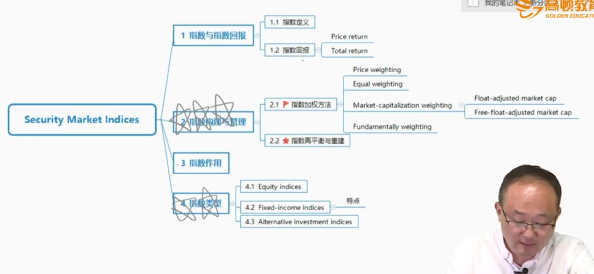

# V5-M2 Security Market Indices

重点在2）指数构建与管理；其次是4）指数类型

### 1) Index and Index return

#### Definition of security market indices

- A security market index represents a given security market, market segment, or asset class. 衡量一个市场、市场板块、资产种类。
- The individual securities included in a security index are known as **constituent securities(成分证券)**

- Dow Jones (1896年)

#### Index return and value concepts

- A **price return index**(价格回报指数) reflects only the prices of constituent securities. 单纯包括价格指数。
- A **total return index**(总回报指数) reflects not only the prices of the constituent securities but also the reinvestment of all incomes received since inception. 包括了指数中成分股的红利、汇率损益等。包括了Income
- As time passes, the value of the total return index will exceed the value of the price index.
- The **divisor**分母 is a number initially chosen at inception so that the index has a convenient initial value, such as 1000.
  - 比如上证综指，divisor使得初始指数为100

#### Index return

- The value of a price return index is calculated as:

$$
V_{PRI}=\frac{\Sigma_{i=1}^{N}n_iP_i}{D}
$$

Where:

$V_{PRI}$=The value of the price return index

$n_i$=The number of units of constituents security i held in the index portfolio 

$N$ = The number of constituent securities in the index

$P_i$=The unit price of constituent security i;

$D$ = The value of the divisor;

- Calculation of **single-period price return** 价格回报指数

$$
PR_I=\frac{V_{PRI1}-V_{PRI0}}{V_{PRI0}}
$$

Where

$PR_I$=the price return of the index portfolio

$V_{PRI1}$=the value of the price return index at the end of the period

$V_{PRI0}$=the value of the price return index at the beginning of the period

- Calculation of single-period price returns加权平均计算：

$$
PR_I=w_1PR_1+w_2PR_2+...+w_NPR_N
$$

where

$PR_I$= the price return of the index portfolio

$w_i$= the weight of security i;

$N$= the number of securities in the index

- Calculation of single-period **total return**（总回报指数）

$$
TR_I=\frac{V_{PRI1}-V_{PRI0}+Inc_I}{V_{PRI0}}
$$

$PR_I$=the price return of the index portfolio

$V_{PRI1}$=the value of the price return index at the end of the period

$V_{PRI0}$=the value of the price return index at the beginning of the period

$Inc_I$=the total income from all securities in the index. 一般就是红利

- Calculation of single-period total returns 同样，也可以加权平均计算：

$$
TR_I=w_1TR_1+w_2TR_2+...+w_NTR_N
$$

where

$TR_I$= the total return of the constituent security i;

$w_i$= the weight of security i;

$N$= the number of securities in the index

- Calculation of index values over **multiple time periods** 多个时间周期(compounding/link)

$$
V_{PRIT}=V_{PRI0}(1+PR_{I1})(1+PR_{I2})...(1+PR_{IT})
$$

Where:

$V_{PRI0}$=The value of the price return index at inception;

$V_{PRIT}$=The value of the price return index at time T;

$PR_{IT}$=the price return on the index over period t, t=1,2,...,T

- Calculation of index values over **multiple time periods **对应total return 

$$
V_{PRIT}=V_{PRI0}(1+TR_{I1})(1+TR_{I2})...(1+TR_{IT})
$$

Where:

$V_{PRI0}$=The value of the price return index at inception;

$V_{PRIT}$=The value of the price return index at time T;

$TR_{IT}$=the total return on the index over period t, t=1,2,...,T

### 2) Index Construction and Management

#### Index construction steps

- Target market
- select securities
- weight of each selected securities
- when rebalanced, 权重调整
- when selection and weighting decision be re-examing?

#### 2.1 Price Weighting 直接价格平均

3个计算：PR, Index，拆股，2个disadvantage

##### Weighting method, advantage and disadvantage

- The index value is the arithmetic average of security prices. It's simply done by **buying an equal number of shares** of each security in the index. 简单算算数平均数，然后除以每个成分股权重都一样。
- **Advantage** is its **simplicity**. 计算简单
- **Disadvantage**
  - Highly priced securities have a **greater influence** on index value. 价格高的对指数影响越大。
  - When a **stock split** occurs, the divisor is adjusted so that the index value is maintained unchanged. 拆股的时候，股价降低，需要调节divisor变小，使得index不变，这里需要掌握计算
- Dow Jones 1896年，直接全部价格相加，然后除以股票个数
- 用每个股票加权平均算总PR的时候，每个股票的权重是价格权重

#### 2.2 Equal Weighting 市值n_i\*P_i相等

设定好了初始的V0，（比如1000）,按照设定好的使市值相等的n_i，计算出divisor

##### Weighting method, advantage and disadvantage

- Each constituent security has an **equal weight**.（每个成分股市值上一样） The index is matched by investing **equal dollar amount** in each stock.（相当于每个成分股投入固定的金额）
- Index return is the **arithmetic mean of HPRs**(holding period return持有期收益) on index stocks. Price return以及total return 可以用每个股票的算数平均数
- **Advantage** is its **simplicity**
- **Disadvantage**
  - **Small-cap bias小盘股偏差:** small-cap stocks are over-presented because it is over-weighted and has greater volatility. 小盘股被超配。小盘股波动性较大，给指数带来更高波动性。
  - Requiring **frequent rebalance** as prices change. 价格变动时，需要重新调节权重，使得市值相等。

#### 2.3 Market Capitalization Index

按照市值加权

##### Weighting method, advantage and disadvantage

- The weight is determined by dividing a stock's market capitalization by the total market capitalization of the index. 按照市值占总市值百分比计算
- **Advantage** is that constituent stock's weight equals to its actual market fraction. 反映出市场真实市值比例。
- **Disadvantage**
  - Firms with larger market capitalizations have a **greater influence** on the index's value（Equal Weighting是小市值影响大（small-cap bias））,which leads to **momentum tilt**. 大市值股票在价值上涨时，对指数的影响也变大。（momentum tilt）

对于指数计算，就是先确认$n_i$的产生方法（平均价格、平均市值、真实市值），然后在基点确定divisor，然后计算$V_1$以及对应的$PR$和$TR$。并且计算PR和TR有两种方法，总的指数计算或者按照每个股的涨跌进行加权平均。

##### Float-adjusted market-cap weighting（流通市场加权）

排除掉限售股票对市值的干扰，float指的是流通性的股票（站在国内投资者角度）

- The weight is determined by adjusting its market capitalization for its **market float**, which is the number of shares available to the investing public.
  - E.g., excluding shares held by controlling shareholders控股股东, strategic investors战略投资人.

##### Free-float-adjusted market capitalization weighting

进一步排除掉外国人不能投资的股票

- Further reduce the number of shares by **excluding shares not available to foreign investors.**

#### 2.4 Fundamentally weighting 基本面加权 

不要求掌握计算

- This method used uses measures of a company's size that are **indepedent of its security price** to determine weight on each constituent security.不考虑股价
- These measures include book value, cash flow, revenues, earnings, dividends, and number of employees. 考虑基本面，比如book value等
- It leads to index that have a **"value tilt".** 指数倾向于价值类股票（比如倾斜向EPS/P高的公司）
- It leads to indexes that have a **contrarian effect.** 反向操作，体现在价值类股票价格上涨的时候，股票的EPS/P反而下跌，但是所占的部分还是占大多数。（别人恐惧我贪婪，别人贪婪我恐惧）
  - momentum追涨杀跌，contrarian反向

#### 2.5 Rebalancing and Reconstitution

##### Rebalancing

- Refers to **adjusting the weights** of the constituent securities in the index. rebalancing就是调整权重（注意不是divisor）。
- Price-weighted indexes are **not** rebalanced because the weight of each constituent security is determined by its price.
- For market-capitalization-weighted indexes, rebalancing is **less of a concern** because the indexes largely rebalance themseleves.
- Market-capitalization weights are only adjusted to reflect mergers acquisitions, liquidations, and other corporate actions between rebalancing dates. 市值加权时，破产清算、并购时需要调整，因为市场上流通的股份改变了。
- Equal weighting 的rebalance的频率最高(价格一变就要调整)，美股一般要求quarterly每季度 rebalance equal weighting index.

##### Reconsitution 指数重构

- The process of **changing the constituent securities** in an index.
  - Constituent securities that no longer meet the criteria are replaced with securities that meet the criteria.
  - Reflect changes in the target market(bankruptcies, de-listings, mergers, acquisition, etc.).
  - Reconstitution is part of the rebalancing cycle. 是rebalancing的过程
-  一般一年调一次。
- 一般发生剔除成分股时，影响所有成份股的权重，因为新纳入的股票价格和剔除的价格有可能不一样。

### 3）Use of Index 指数作用

#### Use of security market Indices

- Gauges of market sentiment. 市场敏感度，经济晴雨表
- Proxies for measuring and modeling returns, systematic risk, and risk-adjusted performance. 衡量回报、系统风险、风险调整。
- Proxies for asset classes in asset allocation models. 资产配置模型
- Benchmarks for actively managed portfolios. 主动管理投资组合的衡量基准benchmark。
- Model portfolios for such investment products as index funds and ETFs. 指数基金等被动基金（passive investing）

### 4）Index Types

- Equity indices 权益市场指数
- Fixed income indices 固定收益指数
- Alternative investment indices 另类投资指数

#### Equity index types

- **Broad market indices** 广泛的全面的市场指数 represent an entire equity market.
  - Shanghai Stock Exchange Composite Index(SSE) 上证综指
  - The Russell 3000. 罗素3000，美国整体市场的指数
- **Multi-market indices** comprise indices from different countries. 跨市场指数
  - MSCI International Equity Indices. MSCI国际全球指数
  - **Fundamental weighting** in multi-market indices weight the securities within each country by market capitalization and weight each country in proportion to its relative GDP. 两个依据：1）国家的GDP作为权重的参考依据。2）然后再看每个成分股的实际市值。
- **Sector Indices** represent different economic sectors. 板块指数
- **Style Indices** 风格类别指数 represent securities classified according to market capitalization, value, growth, etc.
  - Equity style

|                  | Value                      | Growth                      |
| ---------------- | -------------------------- | --------------------------- |
| Large-Cap 大盘股 | Large-Cap Value 大盘价值股 | Large-Cap Growth 大盘成长股 |
| Small-Cap 小盘股 | Small-Cap Value 小盘价值股 | Small-Cap Growth 小盘成长股 |

#### Fixed-Income Indices

##### Fixed-income index characteristics \*

- Broad universe  范围更广
  - Fixed-income securities can be classified along many dimensions: issuer, maturity, currency, credit quality, etc. 固定收益类覆盖的范围、种类更广
- High turnover 固定收益类的指数成分股变化更频繁（因为债券含有到期日因素）
  - Securities mature.
- Dealer markets and illiquidity 固定收益的流动性较差，需要做市商
  - Index providers rely on dealers for prices or must estimate the prices by themselves.

#### Alternative Investment Indices 另类投资

##### Real estate indices

- Categorized as appraisal（估值的）indices, repeat sales indices, and REIT indices.
  - appraisal index，估值指数存在主观上的偏差subjective
  - repeat sales表示两次成交的房地产才纳入指数，更能克服主观性，更objective。但是经常成交的房地产是更优质的房地产，又存在selection sample bias样本偏差.
  - REIT index（Real Estate Investment Trust房地产投资信托基金）,领展基金。有市场价格，更加objective。

##### Commodity indices 大宗商品价格

- Consist of **futures contracts** on commodities. 用期货合约价格编制指数
  - Potential problem: The performance of commodity indices can be quite different from their underlying commodities.期货的价格和现货有差距（基差）

##### Hedge fund indices

- Reflect returns on hedge funds
  - Index providers rely on the voluntary cooperation of hedge funds.
  - May have survivorship bias.幸存者偏差
  - 对冲基金指数需要对冲基金提供数据，通常表现好的基金才愿意给出数据，所以存在幸存者偏差。（overvalued）

