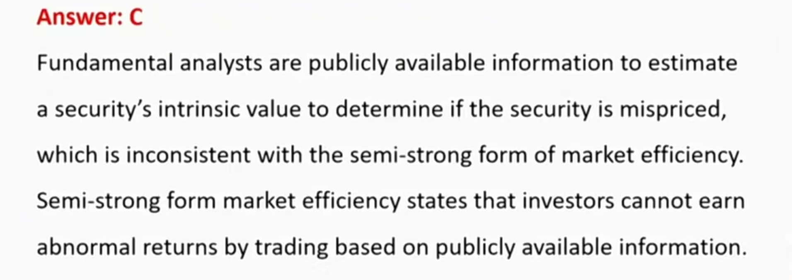
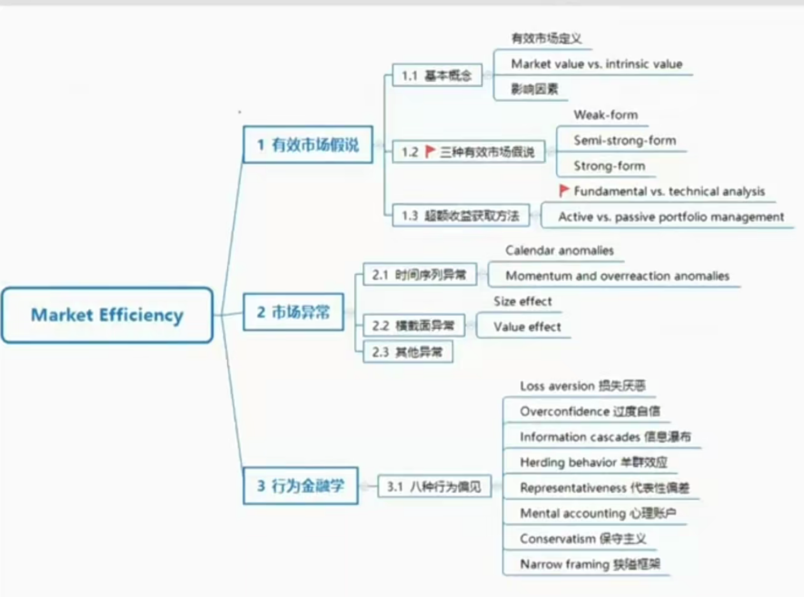

# V5-M3 Market Efficiency

1. 有效市场假说 \* \*\*
2. 市场异常 \*
3. 行为金融学 \*\*

咸水学派、淡水学派。Fama Nobel Price

### 1) Efficient Market Hypothesis有效市场假说

#### 1.1 Market Efficiency Concepts

##### Information efficient market 信息有效

- A market in which asset prices reflect new information **quickly** and **rationally**.
  - 资产价格**快速**、**理性**地反映新产生的信息，新产生的信息指的是（unexpected）
  - 新产生信息，可以快速反应=>如果股价在信息公布前上涨，那么就不符合信息有效的定义。
  - A passive investment strategy is preferred to an active investment strategy due to lower cost. 有效市场成立下，更多采取被动管理，因为股价已经反应了基本面信息，已经包含了超额利润信息，并且交易成本较低。
  - Prices react only to the "unexpected" information.

##### Market value vs. Intrinsic value

- **Market value** is the price at which an asset can currently be bought or sold.
- **Intrinsic value(内在价值)** is the value if investors had a complete understanding of asset's investment characteristics. 
  - In an efficient market, market prices accurately reflect intrinsic values.
- 只有market value = intrinsic value，才是有效市场

##### Factors affecting a market's efficiency

- Market participants 
  - The larger the number of participants, the more efficient the market.
  - 投资者和分析师
- Information availability 
  - fair公平 market
- Limits to trading 交易的局限性
  - Limits to trading, such as arbitrage, short selling, will impede market efficiency.
  - 如果限制**套利**和**做空**，市场有效性会受损。

##### Transaction costs and information-acquisition costs

- Transactions costs: 
  - "efficient" should be viewed as efficient within the bounds of transactions costs.
  - 市场有效性需要在交易成本范围内讨论，比如套利收益大于交易成本，就可以套利获得收益，成为无效市场。如果没有套利空间，及市场价差等于套利成本，则是有效市场。
  - These bounds of arbitrage are relatively narrow in highly liquid markets, such as the market for US Treasury bills, but could be wide in illiquid markets. 流动性越高，套利空间越窄（手续费越低），流动性越差，套利空间越大（手续费高）
- Information-acquisition costs: in equilibrium, if markets are efficient, returns net of such expenses are just fair returns for the risk incurred. The modern perspective views a market as inefficient if, after deducting such costs, active investing can earn superior returns.
  - 获得信息的成本。作为主动管理基金经理，基金获得的收益扣除获得投资信息付出的风险得到的net return和所承担的风险对等，则市场是均衡的有效的。所以这种情况下，无法获得超额回报，和被动管理基金的收益是一样的。
  - 则在modern perspective下，只有无效市场，主动管理基金花钱买信息才可以获得超额收益。
  - 也就是说，基金收益减去信息成本如果大于平均收益，那市场无效。

##### Types of information

- Past market information  
  - All historical price and trading volume information
  - 历史价格、成交量等，技术分析
- Public information 公开市场信息
  - E.g., **financial statement data**(earnings, dividends, changes in management, etc.), **financial market data**(opening and closing prices, shares traded, etc.)
- Private information
  - Information that has not been disseminated to the marketplace.

#### 1.2 Three forms of Market Efficiency

- Weak form efficient market 弱
- Semi-strong form efficient market 半强
- Strong forms of market efficiency 强

##### Weak-form efficient market hypothesis

- Securities prices reflect **all historical prices and trading volumes information.**
- Investors cannot consistently earn abnormal profit using technical analysis.
  - **Technical analysis(技术分析)** involves the analysis of historical trading information in an attempt to identify recurring patterns that can be used to guide investment decisions.
  - 股价已经包括了历史信息，不能持续通过技术分析赚取收益

##### Semi-strong form efficient market

- Securities prices accurately and quickly reflect **all publicly known and available information**.
- The semi-strong form **encompasses** the weak form. 
  - 半强有效性比弱有效性更高，semi-strong也包括了past market information，包括了weak-form.
- Investors cannot consistently earn abnormal profits using fundamental analysis.
  - **Fundamental analysis(基本面分析)** is the examination of publicly available information and the formulation of forecasts to estimate the intrinsic value of assets.
  - 股价已经反应基本面信息

##### Strong forms of market efficiency

- Securities prices fully reflect **both public and private information**
- Strong form **encompasses** semi-strong and weak form
- Insiders cannot consistently earn abnormal returns from trading on private information.

##### Market Price reflect summary 重要

| Forms of efficient market | Past market information | Public information | Private information |
| ------------------------- | ----------------------- | ------------------ | ------------------- |
| weak form                 | √                       |                    |                     |
| semi-strong               | √                       | √                  |                     |
| strong                    | √                       | √                  | √                   |

- 在技术分析可以赚到超额收益，那就是weak form **inefficient**.
- 在基本面分析可以赚到超额收益时，那就是semi-strong form **inefficient**.
- weak form和semi-strong form inefficient都可以通过基本面分析赚取超额收益
- weak form通过基本面分析赚取超额收益，是通过active主动管理获得收益
  - 但是，不能说semi-strong form efficient可以通过主动管理获得收益，因为使用private information不被法律和道德允许。
  - 所以semi-strong form一般采取passive 管理模式
- weak form efficient 中使用statistical data检验有效市场
- semi-strong form使用event study 检验有效市场
  - event study比如分析公司有没有发生重大事件等。
- strong form 使用private information来检验是不是有效市场。

##### Roles for portfolio manager in efficient markets

基金经理在有效市场中的作用

- Establish portfolio risk/return objectives 设置风险和收益目标
- Portfolio diversification 投资分散管理（分散非系统性风险）
- Implement asset allocation based on risk/return objectives 使用金融工具按照目标分配资金
- Tax minimization 合理避税

### 2) Market Anomaly 市场异常

- Time-series anomaly
- Cross-sectional anomaly
- Other anomaly

#### Market Anomaly

- A market anomaly may be present if a change in the price of an asset or security cannot directly be linked to current relevant information known in the market or to the release of new information into the market.
  - 新信息或者已知信息不能解释市场波动，就是市场异常。
- Market anomalies, **if persistent**, are exceptions to the notion of market efficiency.
  - 长期的市场异常，就是有效市场无法解释的。
  - 换言之，短期的市场异常，也是有效市场可以解释的。
- In the widespread search for discovering profitable anomalies, many finds could simply be the product of a process called **data mining**, also known as data snooping.
  - datamining就是短期存在的市场异常，不可持续

有个投资人，从统计角度观察到了看到某种abnormal profit收益，请问观察到了：

A. Anomaly

B. Inefficient

C. Future abnormal profit opportunity

答案：A。历史数据观察到的abnomaly不可持续，不可长期存在。如果是长期存在，才是违反市场有效假设。

接下来的三种异常不是data mining，是长期存在的

了解：1987年金融危机，产生了熔断机制、ETF

#### Time-series anomalies

长期存在，不能用有效市场解释

- **January effect/turn-of-the-year effect:** \*\* stock returns in January are significant;y higher compared to the rest of the months of the year.
  - This may be due to "tax-loss selling" and "window dressing"（有效市场无法解释）
  - tax-loss selling: 年底的时候，把unrealized loss的股票卖掉，变为realized loss，可以抵扣当年的税。然后在第二年年初的时候，再买回来。
  - window dressing窗饰效应：年底基金评比，基金经理都会处理掉亏损的持仓。
- **Turn-of-the-month effect**: returns tend to be higher on the last trading day of month and the first three trading days of next month.
  - 类似窗饰效应，月底处理持仓

- **Day-of-the-week effect**: the average Monday return is negative and lower than the average rturn sfor the other four days.
- **Weekend effect**: returns on weekends tend to be lower than returns on weekdays.
- **Holiday effect**: returns on stocks in the day prior to market holidays tend to be higher than other days.
- 四巫日

- **Momentum and overeaction anomalies**\*\*
  - Momentum anomalies relate to short-term share price patterns.
    - momentum是短期股价表现模式。
  - Overreaction effect: Stock prices will be inflated(depressed) for those companies releasing good(bad ) information.
    - 股票对利空利好消息会过度反应。
  - Securities that have experienced high returns in the short term tend to continue to generate higher returns in subsequent periods.
    - 短期角度来说，上涨股票有可能继续上涨。但也可能回归均值。

#### Cross-sectional anomalies

横截面，从股票种类、特征考虑。有一些不能用有效市场解释，有一些可以。

- **Size effect:** small cap stocks tend to outperform large-cap stocks on a risk-adjusted basis.
  - 某些时段小盘股表现更优秀。但是不能长期使用这规律，只是短期的市场规律。可以用有效市场假说解释。
- **Value effect**：value stocks, which are generally referred to as stocks with below-average PE ratios and P/B ratios, have consistently outperformed growth stocks.
  - 通过财务指标判断投资价值。如果value effect长期存在，不能用有效市场解释，违反的是semi-strong form. 
  - 小票红利策略：把size effect/value effect结合一起。

#### Other Anomaly

- **Closed-end fund discounts**封闭式基金折扣：closed-end funds generally trade at a discount from their net asset value(NAV)
  - market value 和 NAV 不相等：交易时的手续费、税收等。
  - 可以用有效市场假设解释
- **Earnings suprise**: slow adjustment of prices for unexpected earnings(earnings surprise)
  - 市场上出现不及预期的信息时，价格会有调整，比如实际EPS和市场预期有区别。
  - 也是长期存在，无法用有效市场解释

- **Initial public offerings(IPOs)**: investors able to buy IPO shares at their offering prices may earn abnormal profits. But the long-term performance is generally below average.
  - IPO有underprice，上市第一天有可能大涨。比如，包销时，投行会把股价压低。
  - 但长期来看，还是会回归价值，也可以用有效市场解释。
- **Economic fundamentals**: stock returns are related to known economic fundamentals, such as dividend yields, stock volatility, and interest rates.
  - 这些都是公开信息，长期一定会回归均值，长期一定不成立，可以用回归解释。

#### Summary

- Most researchers conclude that observed anomalies are not violations of market efficiency but, rather, are the result of statistical methodologies used to detect the anomalies. As a result, if the methodologies are corrected, most of these anomolies *disappers*.
  - 大多数异常都不可持续
- On average, the markets are efficient. In other words, investors face challenges when they attempt to translate statistical anomalies into economic profits.
  - 很难把市场异常转化为长期收益。但是总是存在市场异常的，并且总有长期存在的市场异常。
- 了解：AMH理论

### 3）Behavioral Finance

- Behavioral finance attempts to explain why individuals make the decisions that they do, whether these decisions are rational or irrational. The focus of much of the work in this area is on the behavioral biases that affect investment decisions.
- The behavior of individuals, in particular their behavioral biases, has been offere as a possible explanation for a number of pricing anomalies.

- Market efficiency and asset-pricing models do not require that each individual is rational-rather, **only that the market is rational**. 有效市场假说前提是市场是理性的
  - 但是个体有可能非理性
- If individuals deviate from rationality, other individuals are assumed to observe this dviation and respond accordingly. These responses move the market toward efficiency. 
  - 短期的anomalies是部分人不理性行为导致，最终还是会回归市场有效
- If this does not occur in practice, it may be possible to explain some market anomalies referencing observed behaviors and behavioral biases. 总体的行为偏差，人性的缺点，会带来市场anomalies.
- **Loss aversion（厌恶损失）***Investors dislike losses more than they like comparable gains. This can explain the **overreaction** anomaly.
  - 损失给人带来的冲击比盈利更强。所以会带来disposition effect:
  - disposition effect：面对盈利，盈利确定得过早，面对亏损，清仓得过晚。
  - Risk aversion(风险厌恶)。refers to the endency of perople to dislike risk and to require higher expected returns to compensate for exposure to additional risk.
    - 面对盈利时，投资人一般都不喜欢风险(risk aversion)。面对承担损失时，一般会喜好风险（risk seeking）。上面两种情况risk aversion 和risk seeking合起来考虑，就是loss aversion.
- **Overconfidence(过度自信)**：Investors place too much emphasis on their ability to process and interpret information about a security, which leads to mispricing.

- **Information cascades（信息瀑布）\***：transmission of information from those acting first and whose decisions influence others.
  - This behavior is consistent with **rationality**. 理性的
  - 跟投股票，跟着理性投资人买，可以增强市场有效性。
- **Herding behavior(羊群效应)\***：trading occurs in clusters and is not necessarily driven by information.
  - 和information cascade相对。所作的交易没有对应的理论基础，只是从众心理。减少了市场有效性。
- 越是理性的行为，越是促进了市场的有效性。信息瀑布促进市场有效性。比如：基金经理告诉你，有个股票低谷，你去买股票，所作的行为是：提升了市场的有效性。
  - 市场有效性：market value = intrisic value。如果market value低估的时候买入，那就是拉近了market value和intrinsic value, 增强了市场有效性。

- **Representativeness代表性偏差**：Investors assess new information and probabilities of outcomes based on similarity to the current state or to a familiar classification.
  - 拿历史的状态估计未来，比如以前要涨，然后就估计今天也要涨。
- **Mental accounting 心理上对不同资金的对待方式不同**: Investors keep track of the gains and losses for different investments in separeate mental accounts and treat those accounts differently.
- **Conservatism保守性偏差**: Investors tend to be slow to react to new information and continue to maintain their prior views or forecasts.
  - 瞻前顾后的投资心理，看到股票涨起来了，但是不敢买进，看到股票跌了，担心会涨回去也不敢卖掉。（也存在loss aversion）
- **Narrow framing **: Investors focus on issues in isolation and respond to the issues based on how the issues are posed.
  - 听投资决策的时候，或者信息的时候，只关注了片面的部分。

Practice

Obeserved overreactions in markets can be explained by an investors' degree of:

A. risk aversion

B. loss aversion

C. confidence in the market

answer: B. Loss aversion要和overreaction联系。Behavioral theories of loss aversion can explain observed overreaction in markets, such that investors dislike losses more than comparable gains.

Practice

Fundamental analysts assume that markets are:

A. strong-form inefficient.

B. semi-strong form efficient

C.semi-strong form inefficient

