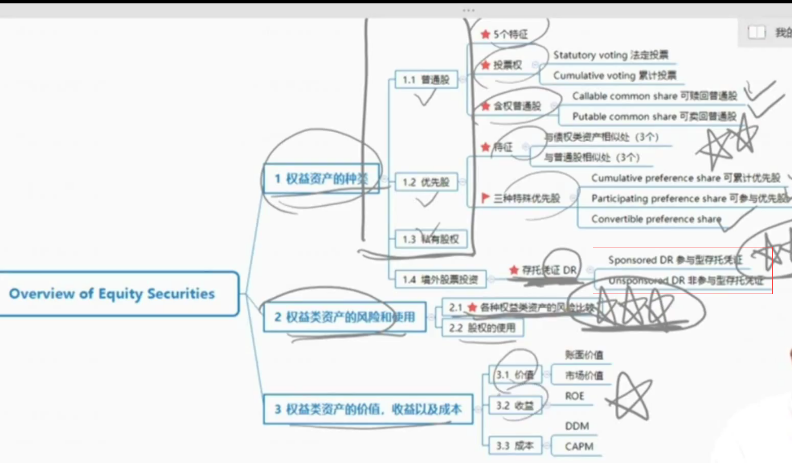
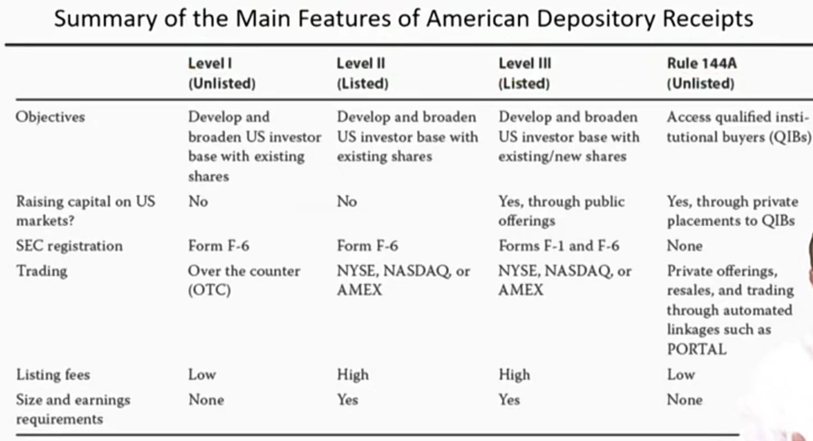
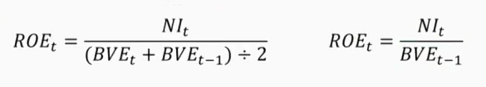
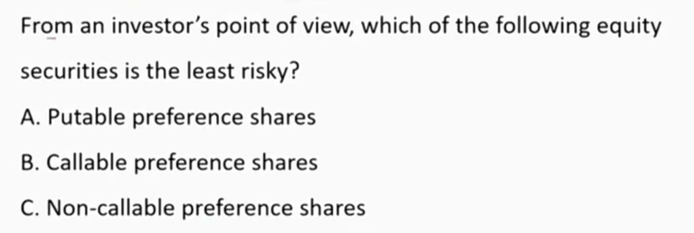
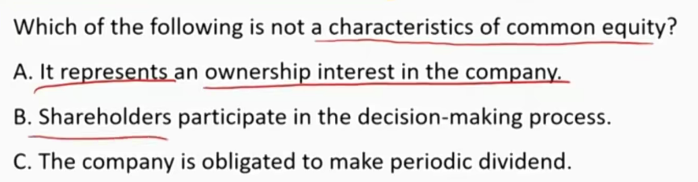

# V5-M4 Overview of Equity Securities

## Types of Equities Asset 

### 1) Domestic Equity Securities

#### 1.1 Common Shares

##### Characteristic of common shares

- Represent an **ownership interest** in a company.
- Share in the operating performance of the company.
- Have a **residual claim** on company's net assets in liquidation.
- The payments of dividend are **not** **contractually obligation**. 股利支付不是义务
- Participate in the governance process through **voting rights.**

##### Common share voting right

- **Proxy voting**: allows a designated party to vote on the shareholders' behalf.
  - 代理投票。基金经理可以代表投资人参与投票。
- Companies can issue **different classes of common shares**, with each class offering different ownership rights. 
  - 发行不同级别股票，不同级别投票权不同。同股不同权。有利于管理层。
- **Statutory voting（法定投票）**：each share represents one vote
  - 对大股东更有利
  - 投票方法：对每个“是否选取候选人“的投票，按照每个人股数=票数，进行投票。显然，大股东每次都获胜。
- **Cumulative Voting（累计投票）**：total voting rights are based on the number of shares owned **multiplied by the number of board directors being elected**. Shareholders can direct their voting rights to specific candidates. 对小股东更有利。
  - 总票数=公式总已经发行股数×待选举人数
  - 然后按照持股比例分配总票数

##### Common shares with embedded options

- **Callable common shares(可赎回普通股)**： give the issuing company the option(or right), but not the obligation, to buy back shares from investors at a predetermined call price. 
  - 上市公司有权按照约定价格赎回股票，所以市场价格有上限，对于投资人不利，所以对投资人风险较高。
- **Putable common shares(可卖回普通股)**：give investors the option(or right) to sell their shares back to the issuing company at a predetermined put price.
  - 给股价设置了一个floor price，对投资人有利，对于投资人风险较低。
- 有点类似带有期权性质的股票。

#### 1.2 Preference share 优先股

- Preference shares rank above common shares with respect to the payment of dividends and the distribution of the company's net assets upon liquidation.
  - 比普通股先派发股利
  - 资产清算时，比普通股有优先求偿权

##### Characteristic

同时具有股性和债性

- Similar to debt securities:
  - The dividends are fixed. 股利固定
  - Do not have voting rights
  - Do not share in the operating performance of the company.
- Similar to common shares:
  - Preference shares can be perpetual. 没有到期日
  - Dividends **are not contractual obligations**. 优先股的股利不是义务！！
  - Can be callable or putable.

##### Special preference shares

- **Cumulative preference shares(可累计优先股)**：the unpaid dividends in the prior periods **accrue** over time and must be paid in full before dividends on common shares can be paid.
  - 今年欠的明年再给，并且要在普通股之前给。
- **Participating preference shares(参与优先股)**：entitle the shareholders to receive the standard preferred dividends plus the opportunity to receive **an additional dividend** if the company's profits exceed a pre-specified level.
  - 可以参与普通股的分红。
- **Convertible preference shares(可转优先股)** entitle shareholders to convert their shares into a specified number of common shares.
  - Earn a higher dividend
  - Share in the profits of the company
  - Benefit from a rise in common shares' price through the conversion
  - Have less price volatility than underlying common shares. 波动性更小。

#### 1.3 Private Equity Security 私募股权投资

##### Characteristic of private securities

- No active secondary markets 没有二级市场
- **Less transparent** than public securities 公开信息更不透明
- greater ability to **focus on long-term prospects** because there is no public pressure for short-term results. 更关注长期利益，因为没有短期利益压力
- **Lower reporting costs.** 报告成本更低
- Potentially greater return for investors once the firm goes public. IPO后能获得很高回报

##### Types of private securities investment

- **Venture capital investments 风险投资（**VC）provide financing to companies that are in the early stages of development and require additional capital for expansion. 投初期不成熟的公司，但是投的资金比较少。
- **Leverage buyout(LBO)**: investors use debt to purchase all of the outstanding common shares of a firm.  投资标的更多的是成熟的公司，需要投的资金会比较多，但是公司运营的风险更低（对比VC投资）
- **Private investment in public equity(PIPE)** : a public company quickly sell ownership position to private investors. 上市公司向私下募集资金。(回忆：第一章primary market的private placement，面对合格投资者私下配售股份)

### 2）Non-Domestic Equity Securities

一共三种：Direct investing, DR存托凭证,  GRS（全球注册，不同市场按照不同货币计价）

#### Types of non-domestic equity securities \*\*\*

- **Depository receipts(DRs)(存托凭证)**：Represent **ownership in a foreign company**. The price of each DR is affected by factors affecting the price of the underlying shares.
  - 一份存托凭证代表多份股份，具体数量由存托银行来确定。存托银行通过统一管理DR，降低跨国投资股票的交易成本、分红成分。
  - 1927，JP Morgan Selfridge
  - **Sponsored DR(参与型存托凭证)**:Foreign company has a **direct involvement** in the issuance. Investors have the same rights as the direct owners of the common shares.
    - 有保荐的。国外公司主动发行，同时具有分红和投票权。阿里巴巴。
  - **Unsponsored DR(非参与型存托凭证)**：Foreign company has **no involvement** with the issuance. Investors have right to receive dividends, but no voting rights, which is held by the issuer of DRs.
    - 无保荐的。国外公司没有国外融资动作，仅仅是存托银行发行DR进行赚取差价、手续费等。腾讯。投资人没有投票权，投票权在托管银行。
  - Compare

|                | Whether foreign company has a direct involvement in issuance | Voting rights remains to |
| -------------- | ------------------------------------------------------------ | ------------------------ |
| Sponsored DR   | Yes                                                          | DR investors             |
| Unsponsored DR | No                                                           | Depository bank          |

- 美国发行的DR的监管制度

- 阿里巴巴等中概股都是Level III。上市公司目的是融资。Level III和普通上市公司一样，受到严格的监管。
- Rule 144A，更像定向增发，只向合格投资着发行，受到的监管较低。
- Rule 144A和Level III就是Sponsored DR.
- Level II中，发行目的不是融资（可能是当地的存托银行想要盈利，当地投资者想要投资等）。受到监管程度更弱。
- Level I是柜台交易，监管较弱。

#### Types of non-domestic equity securities

- **Global depositray receipts** are issued outside of the company's home country and outside of the United States. GDR，发行地不在美国的DR。
- **American depository receipts(ADR)** is a **US dollar-denominated** security that trades like a common share **on US exchange**. 美国交易所
- **Global registered shares** are common shares that are traded on different stock exchanges around the world in different currencies.
  - GRS：同一间公司在不同国家交易所以当地货币发行普通股
- **Basket of listed depository receipts**（BLDR） is an exchange-traded fund that represents a portfolio of depository receipts.
  - ETF形式，底层资产代表DR的投资组合。按照DR组合进行切分。

## Risk and Use of Equity Securities

#### Risk of equity \*\*\*

- Equity returns: price change, dividend, and foreign exchange gains(losses) in the case of foreign investments.
- Equity risk
  - Preference shares are less risky than common shares.
    -  优先股比普通股风险更低，价格波动更小
  - Putable shares are less risky than callable or non-callable shares
    - 风险：putable < non-callable (non-option) security< callable
  - Cumulative/participating preference shares are **less risky** than non-cumulative/non-participating preference shares. 累计/可参与比非累计、非可参与风险更低
- Use of equity securities
  - To make acquisitions
  - To provide option-based incentives to employees.
  - To finance their operating activities(buy long-lived assets, R&D, etc.).

## Equity Value, Return and Cost

### Equity Value

#### Market value and book value

- **Book value** of equity = total assets minus total liabilities
- Market value of equity is the stock trading price times number of shares outstanding
  - Book value and market value are **rarely equal.**
  - Management actions can **directly** affect the book value, but they can only **indirectly** affect the market value.
  - 回忆：intrinsic value也不一定等于BV和market value.（市场有效intrinsic value = market value）
  - P/B市净率 = marketvalue / bookvalue。
    - 创业板P/B较高，银行P/B较低。marketvalue反应投资者对公司未来的预期，book value反应过去的经营状况。

#### Return on equity

- **ROE** is used by investors to determine whether the management is efficiently using the quity capital to generate profits.
- Both formulas are appropriate to use as long as they are applied consistently.

- ROE不是越高越好原因：
- One reason ROE can increase is if net income decreases at a slower rate than shareholders' equity, which is not a positive sign. 净利润NI比股本还减得快
- ROE can increase if the company issues debt and then uses the proceeds to repurchase some of its outstanding shares. This action will increase the company's leverage and make its equity risker. 借钱回购股票，使得杠杆增加，总资产不变，Equity减少。
  - 回购股票“？？

#### Cost of equity

- When a company raises capital by issuing equity, the cost it incurs is called th **cost of equity**.
  - The company's cost of equity is often used as a proxy for the investors' minimum **required rate of return**. 投资人的要求回报率
  - Two models commonly used to estimate cost of equity: the DDM(dividend discount model), and the capital asset pricing model(CAPM)
  - 复习：CAPM = Rf + beta \* (E(Rm) - Rf), DDM: P0 = D1 / (re - g)

答案；A

答案C

