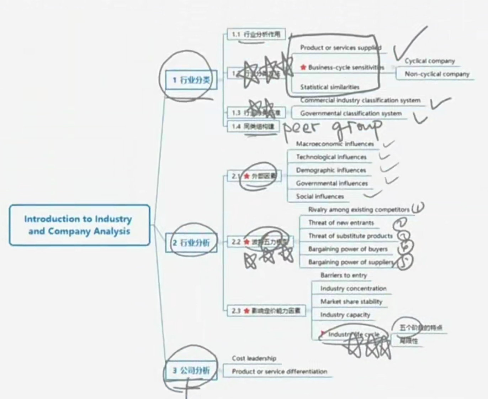
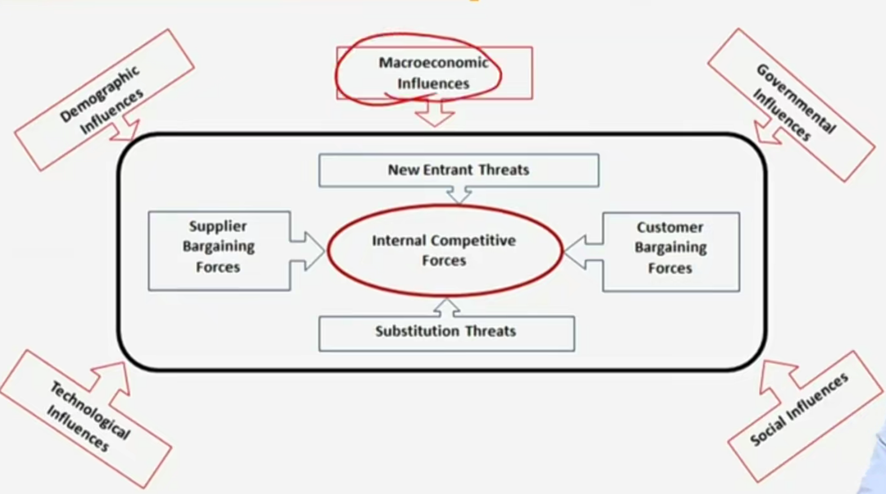
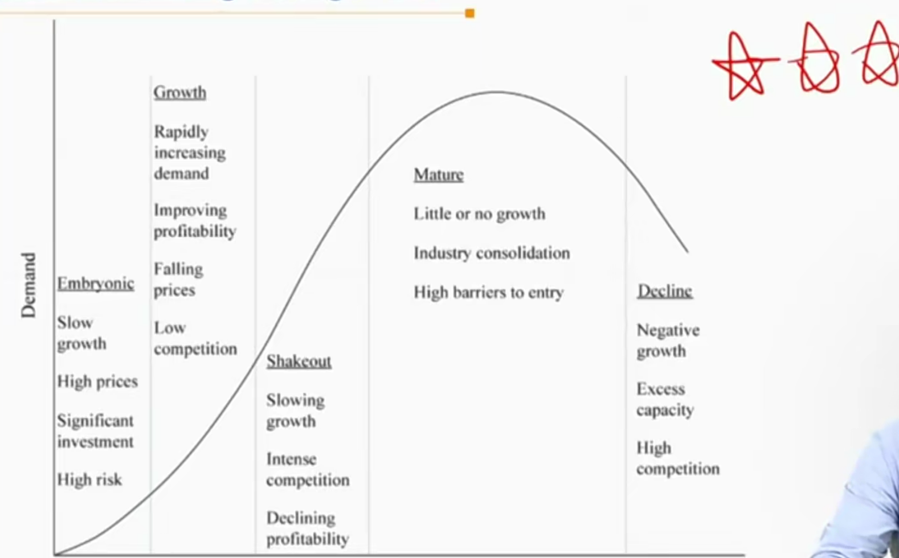
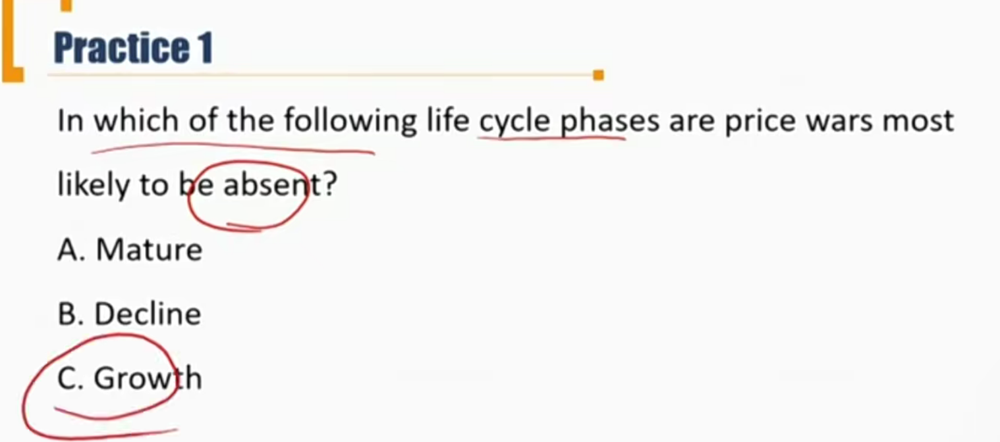
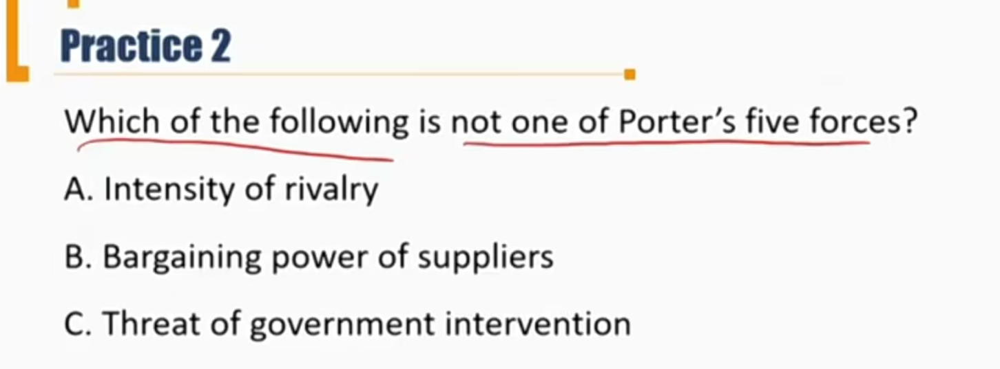
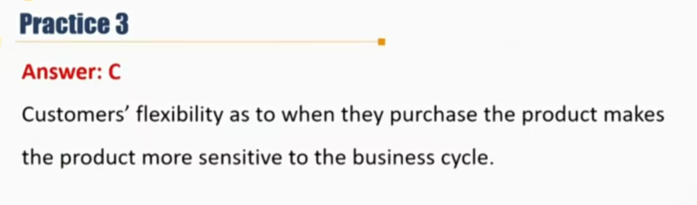

# V5-M5 Introduction to Industry and Company Analysis

以top-down的角度分析，从宏观->公司。

### 1）Industry Classification

- Uses of industry analysis
- **Industry classification approaches**
- **Industry classification system**
- peer group

#### 1.1 Uses of Industry analysis

- Understanding a company's business environment
- Identifying active equity investment opportunities
- Portfolio performance attribution 业绩归因。
  - 比如分析一个基金的业绩对比benchmark涨了多少

#### 1.2 Industry classification approaches

- Product or services supplied
- Business-cycle sensitivities

- Statistical similarities

##### Product or services supplied 按照产品和服务分类

- An industry is defined as a group of companies offering similar products or services.
- Usually has three layers:
  - Sector(板块)
  - industry（行业）
  - Company（公司）

- **Representative Sectors 11个常见板块**
  - Basic Materials and Processing 基础原料，钢铁、煤炭、建材
  - Consumer Discretionary 消费决策权，非必需品，奢侈品包包等
  - Consumer Staples 消费必需品，衣食住行，柴米油盐
  - Energy 能源，燃油，铁矿石（和Basic Material有区别，更加上游，铁矿->钢材）
  - Financial Services 金融服务业，证券公司，投行，银行等
  - Health Care 健康
  - Industrial/Producer Durables 耐用品，汽车、家电
  - Real Estate 房地产，房地产公司+REITs
  - Technology 科技板块，互联网
  - Telecommunications 电信服务商
  - Utilities 公用基础设施：机场、高速公路等
- 上面的分类，可以存在交叉，一个公司可以出现在多个板块。

##### Business-cycle sensitivities

长周期：60年，中周期：9-12年，中周期：2-4年

- Companies are grouped on the basis of their relative sensitivity to the business cycle.
- **Cyclical company**周期类: profits are strongly correlated with the business cycle.
  - 随着经济周期波动
- **Non-cyclical company**非周期: profits are independent of the business cycle.
  - **Defensive**防御类: Basic goods and services with relatively stable demand.(food, health care, etc.) 必需品：食品等
  - **Growth**成长类: Demand is so strong that the firm is largely unaffected by business cycle.(telecommunication, cloud computing, etc.) 成长类行业
- Limitations按照经济周期分类的缺点
  - Placement of companies in one of the two groups is arbitrary. Severe recessions may affect all companies. 
    - 有些公司介于周期和非周期之间，在极端的经济衰退的时候所有公司都会受到影响。这时候用周期性股票进行分类，无法将不同股价表现的公司进行分类。
  - Different countries frequently progress through the various stages of the business cycle at different times
    - 不同时间段、不同国家会被分类到不同周期类别。

##### Statistical similarities 统计数据分类

- The grouping is based on the correlations of past securities' returns. 按照统计学将不同历史收益率的股票进行分类
- Limitations
  - Often result in **non-intuitive** groups of companies.
    - 分类的基础是基于统计学，不够直观。
  - 用的是历史数据，常常无法代表未来：
  - The composition may vary by time and region.  
  - No guarantee that past correlations will continue in the future.
  - Carry the inherent dangers of all statistical methods.

#### 1.3 Industry Classification system

##### Commercial industry classification system 

- Global industry Classification Standards(GICS)
  - MSCI和SP在采用
  - **4 levels** （掌握）4个级别进行分类
  - 157 sub-industries, 68 industries, 24 industry groups, and 11 sectors
- Russell Global Sectors(RGS)
  - Russell在采用
  - **3 levels** （掌握）
  - 9 sectors, 33 subsectors, 1578 industries
- Industry Classification Benchmark(ICB)
  - DJ，和FSTE在使用
  - **4 levels** （掌握）
  - 10 industries, 19 supersectors, 41 sectors, and 114 subsectors.

##### Governmental classification system

- **Including the International Standard Industrial Classification (ISIC)** 
  - **联合国**
- Statistical Classification of Economic Activities in the European Community(NACE) 
  - 欧盟
- Australian and New Zealand Standard Industrial Classification(ANZSIC)
  - 新西兰和澳大利亚
- North American Industry Classification System(NAICS)
  - 美国和加拿大

##### Strengths and weaknesses of current system

政府效率低，商业效率更高

- Information disclosure 信息披露角度
  - The government system do not disclose information about specific business or company. 政府系统不会披露公司具体信息
  - Commercial system is more transparent.
    - 商业体系更透明
- Update frequency
  - The government system updated quite infrequently, usually updated only every five years.
    - 政府体系更少更新换代
  - Commercial system update more frequently.
    - 商业更新效率更快

- Company distinguish公司辨识度
  - Government system do not distinguish between small and large, for-profit and not-for-profit, and private and public business. 政府对企业性质辨识比较弱。
  - Commercial system distinguishes between small band big companies, included only for-profit public traded companies. 商业系统对公司性质辨识度更高。
- Narrowest classification unit assigned to a company generally cannot be assumed to be fundamentally comparable. 分类太细，类别里公司太少，反而不好比较公司的区别。

#### 1.4 Peer Group

Consist of companies engaged in similar business activities whose economics and valuation are influenced by closely related factors. 比行业分类更加细致。通过找peer group找还可以投资的公司。

- Steps in constructing a peer group怎么找peer group
  - Examine commercial classification system for identifying companies in the same industry. 找商业分类系统下的公司
  - Review the subject company's **annual report** for specific competitors. 看公司的年报，一般有可能披露竞争对手。
  - Review industry publications to identify comparable companies. 
  - Confirm that companies have similar business activities, demand drivers, cost structure drivers, availability of capital.

### 2）Industry Analysis

#### Strategic Analysis

和tactic analysis相对。Strategic analysis讲的是自上而下，宏观上分析，tactic analysis是择股择时，微观上分析。

研究：1）External analysis, 2）Porter's model, 3）Factors affecting pricing power

最外圈其实就是**PEST分析**：Political（Governmental Influences）、Economic（Macroeconomic Influences）、Social（Social / Demographic Influences）、Technology（Technological Influences）

#### 2.1 Main external factors 五个宏观因素相互影响

- **Macroeconomic influence**: GDP, interest rates, the availability of credit, inflation, etc.
- **Technological influence**: new technologies create new or improved products that can radically change an industry.
  - **科技对需求端的改变更重要，因为目前需求不足**
- **Demographic influences**: changes in population size, the distributions of age and gender, etc.
- **Governmental influences**: tax, regulations.
- **Social influences**: how people work, spend their money, enjoy their leisure time, etc.

#### 2.2 Porter's Five Forces Model \*\*\*

- Rivalry among existing competitors
- Threat of new entrants
- Threat of substitute products 替代品威胁
- Bargaining power of buyers
- Bargaining power of suppliers

五种力量越强，对应的公司的估值越低。第一个和第二个影响较大，代表竞争者带来的潜在威胁，优先考虑。所以下面分析的是行业竞争带来的对定价能力的影响。

#### 2.3 Evaluate the threat of new entrants and the level of competition in an industry

如何分析竞争者带来的威胁

- Barriers to entry 进入行业壁垒
- Industry concentration 行业集中度
- market share stability 市场份额稳定程度
- Industry capacity 行业产能状况（供不应求、供过于求）
- **Industry life cycle 行业生命周期** \*\*\*
- Price competition 价格因素

##### 2.3.1 Barriers to entry

壁垒：政府政令壁垒，资源壁垒，已投入资源壁垒（电信基站），

- Barriers to entry are determined by capital requirements, intellectual capital, regulation, etc.
- Industries with low barriers to entry is likely to be competitive, and **often have little pricing power**. 越低的壁垒，就越没有定价权。
- High barriers to entry do not guarantee pricing power when: 高壁垒也不一定有定价权：
  - Price is a large component of customers' purchase decision 消费者对价格敏感度
  - Companies have high barriers to exit, which means they are prone to overcapacity. 退出壁垒过高，而且利润较低，一般是产能过剩
- Barriers to entry can change over time.壁垒会变化

##### 2.3.2 Industry concentration 行业集中度

行业集中度：

1）CR_n指标；2）HHI指标：市场份额平方求和；3）厂商需求曲线的需求弹性：价格弹性小，P-Q曲线陡，所以厂商越接近垄断

- Fragmental industries tend to be highly price competitive.
- Concentrated industries **do not guarantee pricing power.** 集中度不保证定价权
- **Relative market** shares have a greater impact on pricing power than **absolute market shares.** 要从市场中的相对集中度判断公司的定价权，看公司在市场中的竞争力。

##### 2.3.3 Market share stability

- Market share stability is influenced by barriers to entry, frequency of new product introductions, product differentiation.
  - **Stable market shares** typically indicate less competitive industries.
  - **Unstable market shares** often indicate highly competitive industries with limited pricing power.
  - 联系：寡头竞争中的窜某

##### 2.3.4  Industry capacity 产能

- **Under-capacity** leads to more pricing power as demand exceeds supply. 供不应求
- **Over-capacity** leads to price cutting and a competitive environment as supply exceeds demand.
  - Capacity is fixed in the short term and variable in the long term.
- **Physical capacity** 物理产能 is hard to re-deploy, and producers may overshoot long-run demand.
  - 物理产能难以调配（类似固定成本）
- **Non-physical capacity**(financial and human capital) can be quick shifted to new uses.
  - 非物理产能，可以快速调配到新需求（人力、金融资源）

##### 2.3.5  Industry life cycle 行业生命周期

- **Embryonic stage(初期阶段)**
- **Growth(成长阶段)** \*\*\*
  - **low competition**
- **Shakeout**（震荡期）
- **Mature**（成熟期）
  - **industry consolidation** 产业整合，行业比较稳固
    - 行业出现大量M&A，公司兼并
- **Decline**

###### i) Embryonic stage（初期阶段）:the industry is just beginning to develop

- **Slow growth**: customers tend to be unfamiliar with the products. 增长速度慢
- **High prices**: sales and production are not yet sufficient to achieve economies of scale.
  - 产品卖价较高
- Substantial investment is generally required. 大量资本投入
- The risk of failure is high. 风险较高

###### ii) Growth stage(成长阶段)

- **Rapid growth**: demand is fueled by new customers
- **Falling prices**: economies of scale are achieved, and distribution channels develop.
  - 产生了规模效应，价格下降
- Improving profitability: sales rise and economies of scale are attained.
- **Relatively low competition**: rapidly expanding demand allows companies to grow without needing to capture market share from competitors
  - 竞争程度较低
- Threat from new entrants is usually highest as barriers to entry relatively low.
  - 技术壁垒较高

###### iii) Shakeout stage（震荡阶段）

- **Slowing growth**: demand approaches market saturation. 市场饱和
- **Intense competition**: growth becomes increasingly dependent on market share gains.
  - 竞争加剧，有人出局
- **Increasing over-capacity**: company investments exceed demand growth
  - 产能过剩
- **Declining profitability**: companies cut prices to fill excess cap[acity]
  - 利润下降
- **Increasing failure**

###### iv) Mature Stage(成熟阶段)

- **Little or no growth**: market is saturated and growth is limited to replacement demand and population expansion
  - 市场饱和了，厂商之间竞争没有那么激烈，有可能出现寡头窜谋
- **Increasing consolidation:** market evolves to oligopoly due to merges and acquisitions
  - 产业整合，寡头垄断，出现M&A
- **High barriers to entry**: surviving companies tend to have brand loyalty and efficient cost structures.
- **Stable pricing**: companies are interdependent and try to avoid price wars. But periodic price wars do occur during periods of declining demand. 价格稳定
- Companies with superior products gain market share and grow faster than industry average.

###### v) Decline Stage(下降阶段)

- **Negative growth**: demand declines due to technological substitution, social changes, and global competition.
- **Declining prices**: excess capacity, and price wars often occur.
- Consolidation: weaker companies exit, merge, or redeploy capital into different products/services.

###### Limitations of industry life cycle analysis

- The evolution of an industry does not always follow a predictable pattern. 不一定按照五个阶段的模式
- Various external factors may cause stages to be longer or shorter, or to be skipped altogether.出现
- Life-cycle models tend to be most useful for analyzing industries during periods of stability. 稳定期的分析才有效
- Not all companies in an industry experience similar performance. 同一行业的生命周期下，不是所有公司都按照相同的生命周期。

##### 2.3.6 Price Competition

- Industries for which price is a large factor in customer purchase decisions tend to be more competitive than industries in which customers value other attributes more highly. 
  - 消费者如果更在意价格，那竞争更激烈。
  - 比如，航空机票，消费者可能更关注价格；相机、汽车等，消费者也关注产品质量

### 3）Company Analysis

#### Firm's competitive strategy

- **Cost leadership(low cost)**: lowest costs of production ,lowest prices; sell enough volume to earn superior return. 成本领先策略
- **Product or service differentiation**: distinctive in terms of type, features, quality, or delivery; achieve price premium. 产品差异化策略

#### Spreadsheet modeling 数据表模型估值

- Although spreadsheet models are a valuable tool for understaning past financial performance and forecasting future performance, the complexity of such models can at time be a problem.
  - 用过去的报表预测未来的业绩。
- Spreadsheet 不完美，历史数据不代表未来。

Practice2: answer: C

