# V5-M6 Equity Valuation: Concepts and Basic Tools \*\*\*

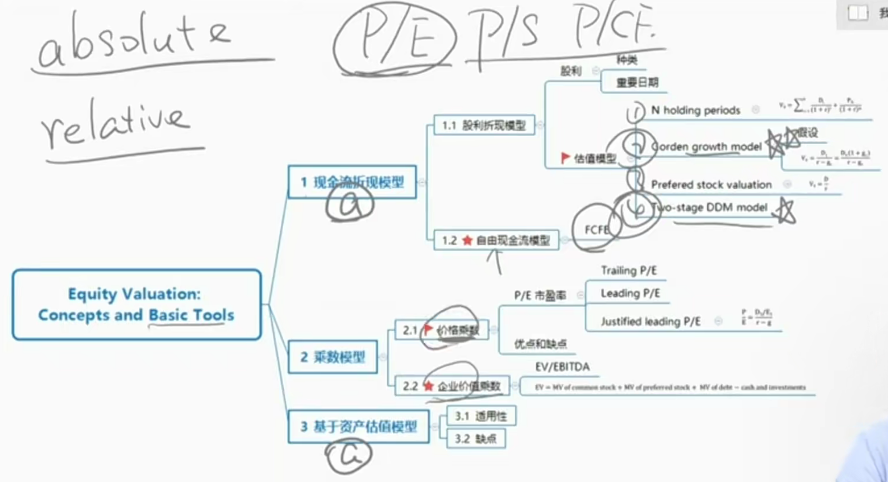

两种估值方法：

- 绝对估值（absolute，现金流折现模型、基于资产估值模型），算intrinsic value，和market value比较。

- 相对估值(relative，乘数模型)，选取参照物，进行判断公司股票的买卖机会。

## Cash Flow discount model

### 1）Cash Flow discount model: Dividend Discount Model

- 股利折现模型，是用过研究股利，是站在小股东被动接受股利的角度分析，所以小股东倾向于选择股利折现模型。
- 自由现金流模型，FCFE是股东自由支配现金流，是大股东可以自由支配的现金流，所以大股东对公司估值倾向于选择自由现金流模型。

#### Background of dividend

- A dividend is a distribution paid to share holders based on the number of shares owned.

  - **Cash dividend**: distribute cash to shareholders, typically paid out **regularly** at known intervals. 
    - 派发周期不确定，并且派发股利不是义务。
    - 虽然不是义务，但是有些公司会采取相对稳定的股利政策，吸引大客户大机构持有股票。大机构持有股票，是长期持有，看重股利派发。
  - **Special/Extra dividends**特别股利: dividend that is not regularly paid to shareholders or as a supplement to regular cash dividend.
    - 特别情况下，比如公司周年庆派发股利

- A **stock dividend** is a distribution of additional shares.

- Stock split and reverse stock split:

  - **Stock split**: increase in the shares outstanding with a decrease in share price.(e.g. 2-for-1 stock split) 拆股

  - **Reverse stock split**: reduction of shares outstanding with a increase in share price.(e.g. 1-for-20 reverse stock split) 并股

- **Share repurchase**: a transaction in which a company use cash to buy back its own shares. **Can be viewed equivalent to cash dividends**回购可以等同于现金dividend. 回购的四种情况：
  - Signaling a belief that their shares are undervalued; 提振市场信息
  - Flexibility of distributing cash to shareholders; 给投资人派发现金
  - Tax efficiency in markets where tax rates on dividends exceed tax rates on capital gains; 回购的时候交的是资本利得税。
    - 回顾：股东的capital gain->回购价格  - 股票成本。
    - 如果派现金交税比资本利得交税更多，公司有可能会选择股票回购的形式派发现金。
  - The ability to absorb increases in outstanding shares because of the exercise of employee stock options.
    - 用于员工期权行权

#### Dividend payment chronology

- **Declaration date宣告日**: the day that the corporation issues a statement declaring a specific dividend.
- **Ex-dividend date(ex-date) 除权日**: the first date that a share trades without the dividend. 
  - 股价减去股利
  - 这一天，或者这一天之后，买入股票，都不会有股利。
- **Holder-of-record date股权登记日:** the date that a shareholder listed in the corporation's records will be deemed to have ownership of the shares for purposes of receiving the upcoming dividend.
  - Typically **one or two business days** after the ex-dividend date.
  - **除权日1~2个工作日之后**。（原因，美国清算所登记股票从T+3改为了T+2）
- **Payment date**: the date that the company actually mails out or electronically transfers the dividend payment.
- Example of payment chronology:

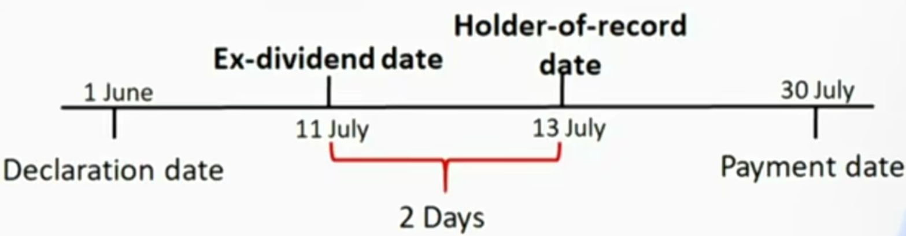

### 2） Cash Flow Discount Model: 估值模型

#### Principal of DDM

- Rationale基础原理 for using the present value models: 
  - Investors expect a rate of return over the investment period. 预期回报率
  - The value of an investment should equal to the present value of the expected future benefits. 未来利益折现
- The intrinsic value of a share is the present value of expected future dividends.
  - 通过模型计算的是expected intrinsic value，不一定和intrinsic value相等

$$
V_0=\sum_{t=1}^{\infty}\frac{D_t}{(1+r)^t}
$$

Where

$V_0$ is the value of a share of stock today;

$D_t$ is expected dividend in year t;

$r$ is the required rate of return on the stock

这里是无限期数的折现

- $D_t$ is hard to predict. If we hold the stock infinitely, it it almost impossible to get an intrinsic value. Thus, we can further discuss the following situations:
  - **N holding period**: hold the sotck for N period then sell ite
  - **Gordon growth model**: assume a sustainable growth rate for dividend
  - **Preferred share valuation**: assume the growth rate of dividend is zero(fixed dividend)
  - **Two stage DDM**: assume different stages of dividend growth.

#### N holding periods

- The intrinsic value is the present value of the expected dividends for n periods plus the present value of the expected price in n periods. 持有N期后，卖掉股票。

$$
V_0=\frac{P_n}{(1+r)^n}+\sum_{t=1}^{n}\frac{D_t}{(1+t)^t}
$$

Where,

$V_0$ is the value of a share of stock today, at t=0

$D_n$ = expected dividend in period n, assumed to be paid at the end of the year;

$r$=required rate of return on the stock;

$P_n$ = the sell price after N period(terminal value)

#### 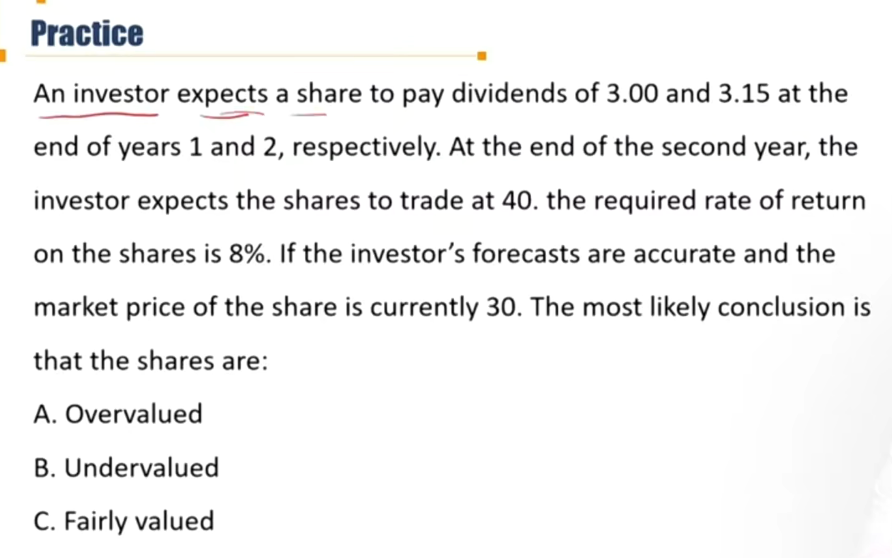

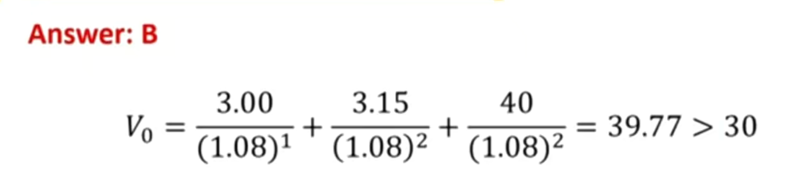

#### Gorden Growth Model

- The Gordon Growth Model assumes dividends grow indefinitely at a **constant rate **g

- **Assumptions** of the Gordon Model: Gordon模型的假设
  - The dividend growth rate is forever and never change
  - The required rate of return is constant over time
  - The **dividend growth rate is less than the required rate of return**. g < r
- 所以$D_t=D_0(1+g)^t$，通过求和收敛级数，得到

- The formula of GGM:

$$
V_0=\frac{D_0(1+g)}{r-g}=\frac{D_1}{r-g}
$$

Where

- g = retention rate \* ROE(sustainable growth rate)
  - ROE：开源能力；retention rate：节流能力

- Earning retention rate = 1 - dividend payout ratio 留存收益率

- dividend payout ratio = Dividend / NI

- ROE = return on equity

- r，required rate of return回忆：CAPM， $r_e = r_f + \beta (E(r_m) - r_f)$. 注意risk premium就是（r_m - r_f）

定性规律：

- 公司估值V0和要求回报率成反比，要求回报率越高，估值越低

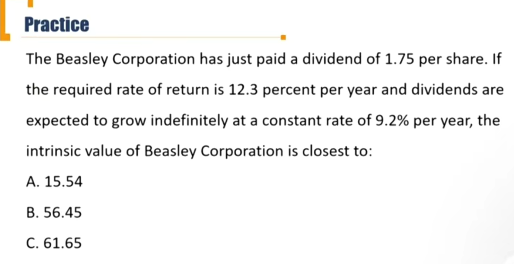

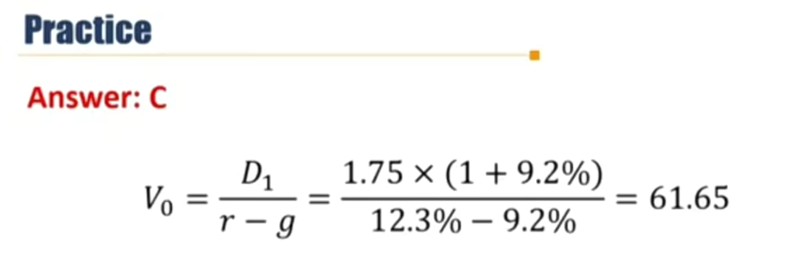

#### GGM 补充：Sustainable growth rate

GGM用D进行折现的原因是one bird in hand。给公司估值的时候，其实可以选RE、CF、Dividend等各种现金进行折现。但是只选择dividend，因为dividend是确定的到股东手里的收益。

当ROE和retention rate不变，Equity、NI、Div、RE增长速度都相同。g = ROE \* b

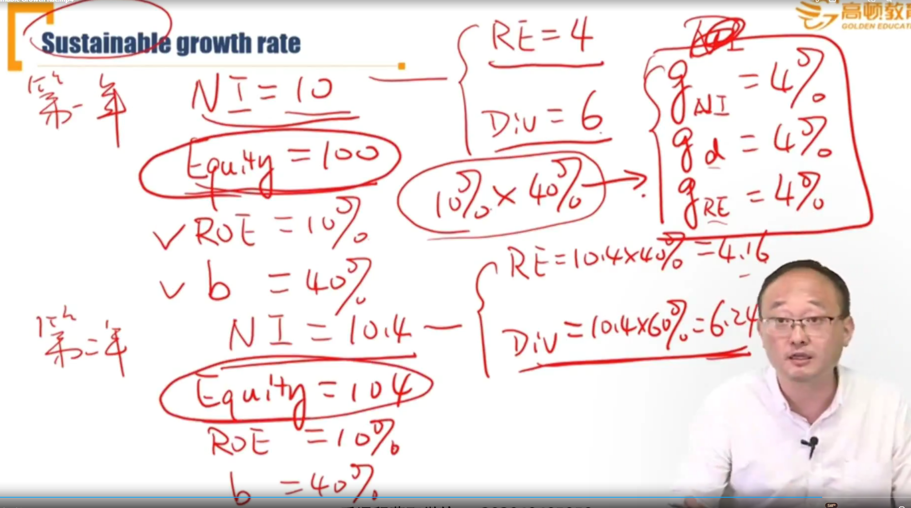

只要ROE和Retention rate发生改变，NI和Dividend和RE增长速度都发生变化，此时不能用Sustainable growth rate.

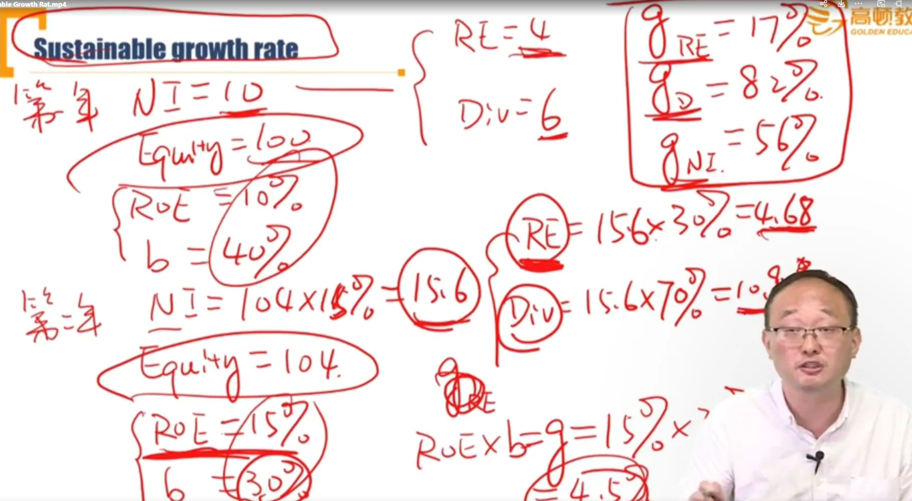

#### Preferred stock valuation 优先股估值

- Preference stock valuation as a special case of Gordon growth model if we **assume zero growth**(fixed dividend)
- 永续的优先股
- For a non-callable, non-convertible **preferred** share paying a dividend D each period and assuming a constant required rate of return r over time: 注意不含权

$$
V_0=\frac{D}{r}
$$

- 其实就是Gordon模型假设g=0
- 存在到期状态的优先股

- For a non-callable, non-convertible preferred stock **with maturity at time n**, the estimated intrinsic value can be estimated by 

$$
V_0=\frac{F}{(1+r)^n}+\sum_{t=1}^{n}\frac{D_t}{(1+r)^t}
$$

Answer: B

N=12, I/Y=4.1, PMT=2, FV=20，CPT+PV=-31.01

注意：如果是callable preference stock, 股票价格涨到一定程度，公司有权按照某个价格回购股票，对投资者风险更高，所以required rate of return应该更高，从而根据折现估值会比31.01更低。相对应，如果是putable preference stock，应该估值比31.01更高。

#### Two-stage DDM model 公司成长不一样 \*\*

- Assumes the company experiences **an initial and finite period of high growth**, followed by an **infinite period of sustainable growth**.
  - Appropriate for a company already moved through its growth phase and is currently in the transition phase prior to moving to the maturity phase.
  - The Gordon growth model is used to estimate the **terminal value** at the end of period of high growth. 第一阶段后，使用GGM模型. terminal value就是第一阶段结束时候的估值。

$$
V_0=\sum_{t=1}^{n}D_0(\frac{1+g_h}{1+r})^t+(\frac{D_{n+1}}{r-g_l})/(1+r)^n
$$

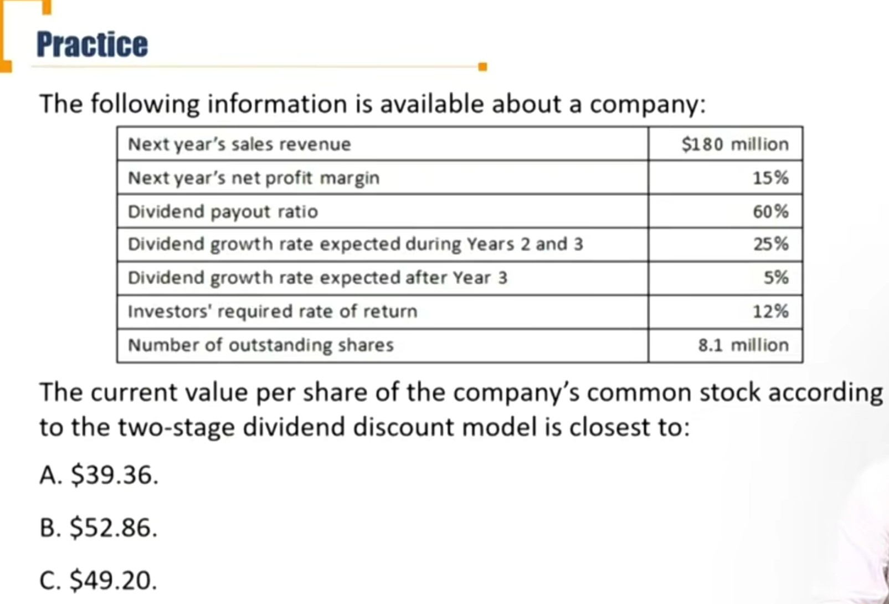

注意：

- 按照题目的意思，current year应该是站在t=0时刻（比如12月31日），也就是D0是今年已经发生的分红，Next year's sales revenue就是year 1. 时间需要注意
- 如果题目给了D0，不要加进去，因为GGM考虑的是未来现金流
- D3不要漏掉
- GMM的结果需要折现

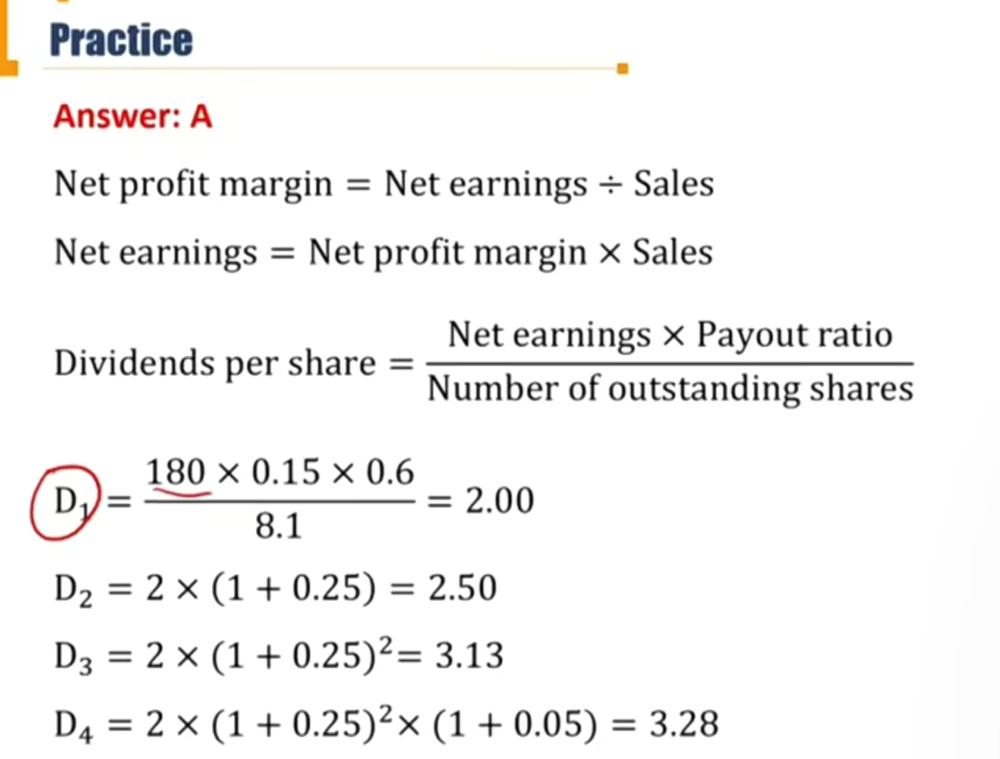

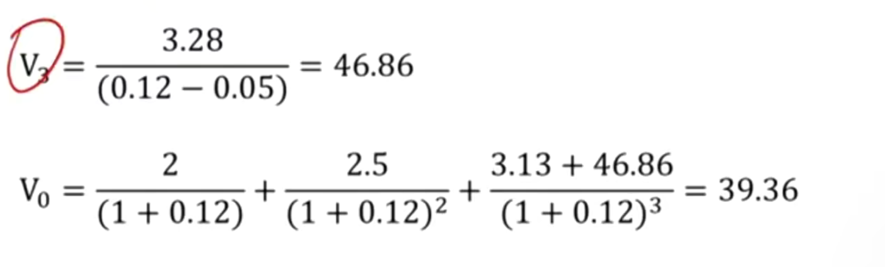

###### Three-stage DDM models 了解

- For most publicly traded companies(that is , companies beyond the start-up stage), practitioners assume growth will ultimately fall into three stages: 1) growth, 2)transition, and 3)maturity. 就是两阶段进一步分为3阶段。
- This assumption supports the use of a three-stage DDM, which makes use of three growth rates: a high growth rate for an initial finite period, followed by a lower growth rate for a finite second period, followed by a lower, sustainable growth rate into perpetuity.

### 3）Free Cash Flow Model

复习：

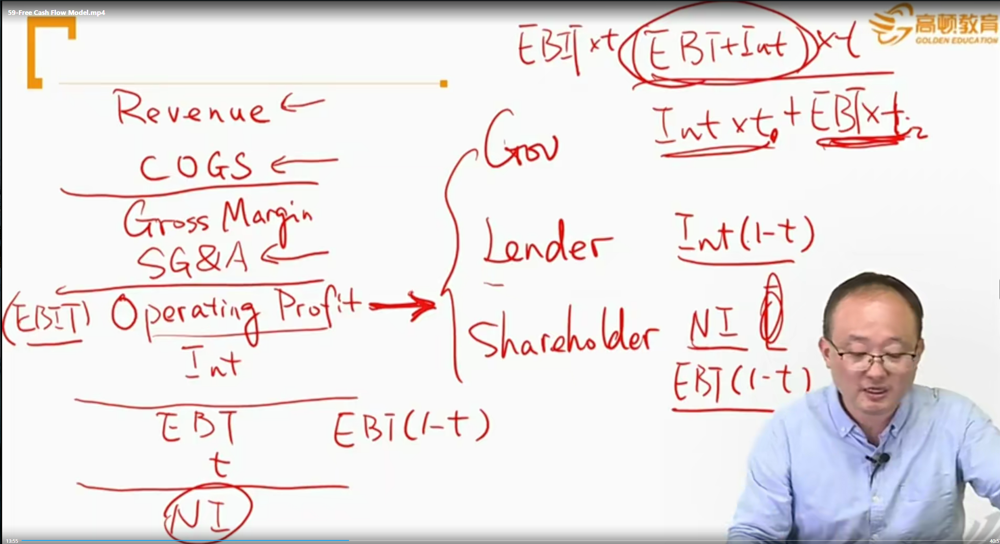

赚到的钱，分给了政府EBIT\* t, 分给了债权人 Int(1-t)，分给了shareholder NI= EBT(1-t)

- FCFF = NI + NCC - WC Inv. - FC Inv. + Interest Exp. \* (1 - Tax rate)
  - NI到CFO，需要进行两种调整，一个是非现金支出（折旧等），一个是Working capital（应收账款等），所以CFO = NI + NCC - WC. Inv.
- FCFF = CFO - FC Inv. + Interest Exp. \* (1 - Tax rate) 

- FCFE = FCFF -  Interest Exp. \* (1 - Tax rate) + Net debt borrowing

- FCFE = NI + NCC - WC Inv. - FC Inv. + Net debt Borrowing
- FCFE = CFO - FC Inv. + Net debt borrowing

所以，套用Gordon模型等
$$
V_0=\frac{FCFE_1}{r_e-g}
$$

- 这个估值是针对大股东的角度考虑，因为只有大股东有权力支配FCFE
- 大股东有权力借债、分配股利。

#### Free cash flow to equity

- The instrinsic value is the present value of the expected FCFE.
  - FCFE is a measure of **dividend-paying capacity**（股利支付能力）
  - FCFE model is appropriate for a non-dividend-paying stock.
    - 可以用于没有分红的股票的估值，因为DDM、GGM需要用到股利
- FCFE=  NI + NCC - WC Inv. - FC Inv + Net debt Borrowing
- 如果是计算股东要求的估值（r是要求回报率）

$$
V_0=\sum_{t=1}^{\infty}\frac{FCFE_t}{(1+r)^t}
$$

- 如果是估算公司资产价值：

$$
V_0=\sum_{t=1}^{\infty}\frac{FCFE_t}{(1+WACC)^t}
$$

## Mutiplier Model

相对估值（relative）

### 4) Price Multiples 价格乘数

- Price multiples
  - **P/E,** P/B, P/S, P/CF
- Enterprise value multiples
- John Neff, Bill Miller, Peter Lyach 使用了这些乘数，获得了高额基金回报

#### The method of comparable

- Price multiple compares the share price with some sort of monetary flow or value.
- The comparable method uses a price multiple to evaluate whether an asset is **fairly-valued, undervalued, or overvalued relative** to a **benchmark** value.通过benchmark（指数、peer group等），判断这只股票是高估还是低估。
  - Choices for the **benchmark** include: the multiple of a closely similar stock, average or median value of the multiple for the industry. 也可以选行业的平均值、中位数作为benchmark
- 比如，P/E = Price / EPS。代表投资人愿意为1块钱收益支付多少钱。P/E越高，代表投资人愿意承担的风险越高。

#### Trailing vs. leading price multiples

- P/E的分子和分母可以按照不同角度进行选择：
  - 分子：
    - P按照market value市场实际股价，算出来的P/E就是普通的P/E
    - P按照GGM按照未来的预计的dividend进行折现，P = D1 / (r - g)，算出来的P/E叫做Justified P/E
  - 对于分母：

- **Trailing price multiples(实际价格乘数)** use trailing or current values of the **divisor**.
  - E.g. P0 / E0
- **Leading price multiples(预期价格乘数)** use leading or forward values of the **divisor**.
  - E.g. P0 / E1

所以，分子分母按照不同逻辑组合，算出来的P/E含义不一样：

- Justified leading P/E:

  P/E = (D1/(r-g)) / EPS1

- Justified trailing P/E:

  P/E = (D1/(r-g)) / EPS0

- Trailing Price P/E: 直接用market value

  P/E = P0 / E0

- Leading Price P/E:

  P/E = p0 / E1

并且可以进一步变形：

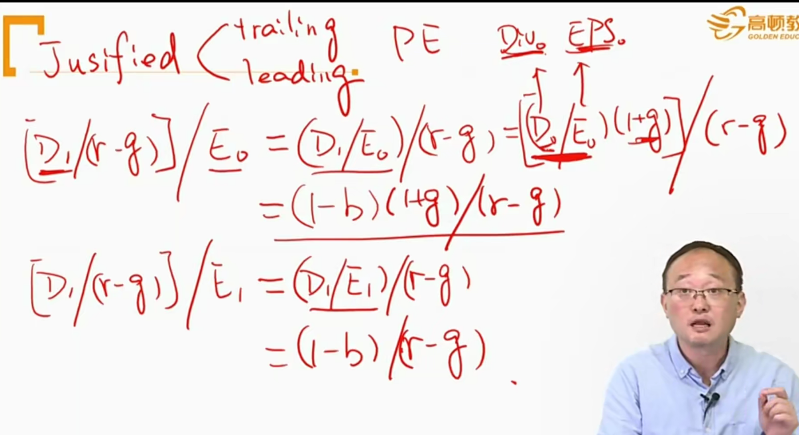

- **掌握下面两个公式 !！**
- Justified trailing P/E = (1 - b) (1 + g) / (r - g)

- Justified leading P/E = (1 - b) / (r - g)

#### Price multiples based on fundamentals

- The stock value is justified by fundamentals or a discount cash flow model。这里考虑的justified leading P/E

$$
\frac{P_0}{E_1} = \frac{D_1/E_1}{r-g}=\frac{Dividend\ Payout\ Ratio}{r-g}=\frac{1-b}{r-g}
$$

- 这里b是retention rate 

- The P/E ratio is **inversely** related to the required rate of return, and **positively** related to the growth rate. 

  - Justified P/E 和要求回报率r成反比。要求回报率越高，风险越高，估值越低，市盈率越低。
  - Justified P/E 和增长率g正比。

- The relationship between P/E and payout ratio is **ambiguous** because a higher payout ratio may imply a slower growth rate. P/E和dividend payout ratio关系不确定

  - Net Income分为RE和Dividend
  - dividend payout ratio = dividend / NI，g = ROE \* b

  - 也就是说，如果NI中的Dividend上升，b下降，对应的g也下降。至少b的变动会引起g的正向变动(b和g正相关)。所以在justified P/E中，P/E和dividend payout ratio关系ambiguous.

#### Advantage and disadvantage of price multiples

- **Advantages**
  - Allow for relative comparisons, both cross-sectional and in time series.
    - 可以用P/E进行同行业，以及时间维度进行对比
  - Price multiples are popular among investors.
- **Disadvantages**
  - May generate a contradictive conclusion with those of the discounted cash flow methods.  有可能和折现模型的结论有矛盾。
  - Differences in accounting standards and/or methods can result in multiples not easily comparable. 会计准则的差异。
  - The multiples for cyclical companies may be highly influenced by current economic conditions. 周期性公司的乘数会受到经济周期的影响，P和E波动较大。

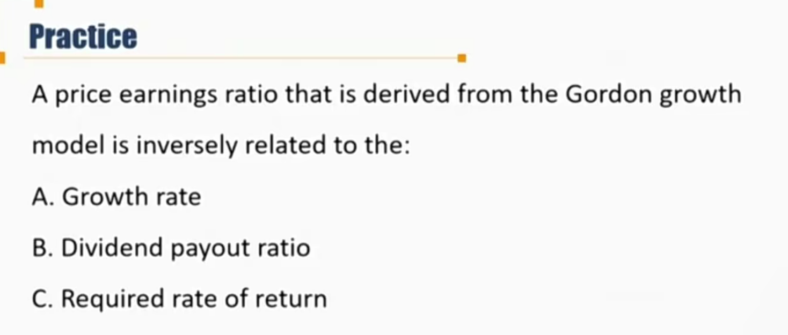

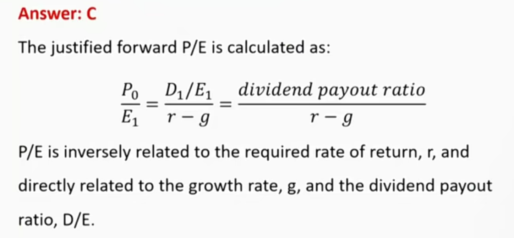

### 5）Enterprise Value Multiples

- 价格乘数上，P/E中的P和E是站在Equity股东角度进行分析。
- 在这里，enterprise就是站在公司的角度

- Enterprise value = market value of common stock + market value of preferred stock + market value of debt - cash and cash equivalents(short term investment)
  - Market value of debt包括long, short, middle term debt
  - 只有迫不得已的时候，可以用book value替代market value
- Enterprise value is often viewed as the cost of a **takeover**. 和收购类似

$$
EnterpriseValueMultiple=\frac{EnterpriseValue}{EBITDA}
$$

- Enterprise value is most useful when comparing companies with significant differences in capital structure. 不同资本结构的公司站在了同一角度进行考虑
  - 不同国家，杠杆水平，税率不一样，EBITDA排除了这些干扰
- EBITDA is usually **positive**.
- EBITDA和enterprise value一样，都是站在公司口径(包括债权人、股东)进行统计。

下面的例子中，中短期负债没有market value，所以对应部分采用book value.

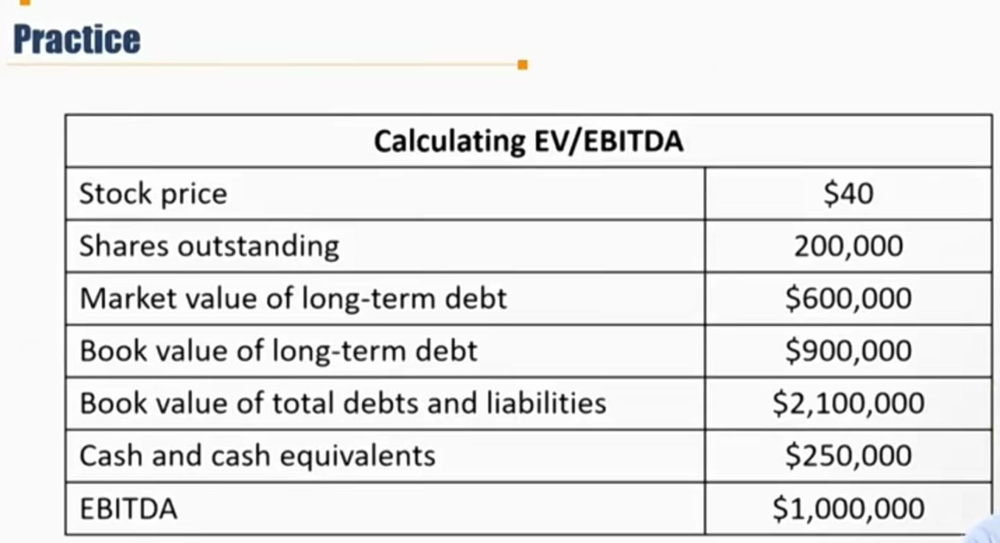

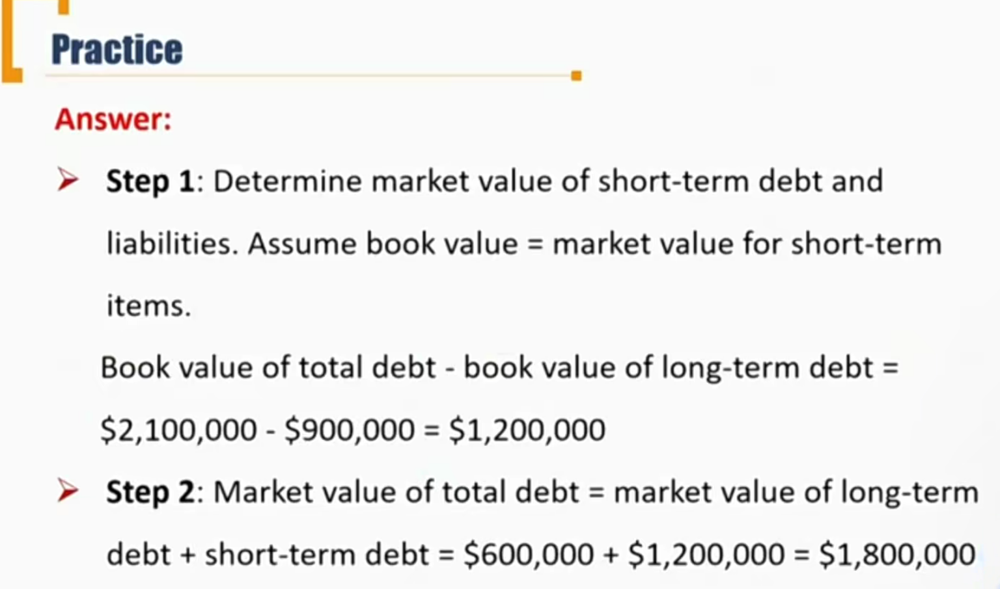

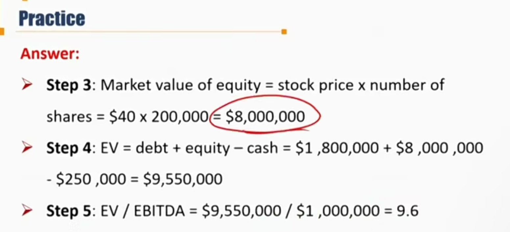

## Asset-based Valuation

#### Asset-based valuation

没有现金流，现金流无法估计，采用这种方法。比如即将破产的公司，初创期的公司。

- Market value of equity = market value of assets - market value of liabilities
  - A - L，使用market value

- **Appropriateness** for companies which: (Asset based valuation适用于以下情况的公司)
  -  primarily hold tangible short-term assets; 主要持有短期有形资产
  - hold assets with ready market values 资产已有明确价格
  - are held privately; 非上市公司
  - cease to operate and are being liquidated 停止运营，马上要破产清算

- Asset-based valuation is problematic when: 不适合的情况

  - Companies with assets that do not have easily determinable market values
  - Fair values of assets and liability can be very different from their book values
    - 公允价值和账面价值不一样，资产价格难以确定
  - It may understate value of a company because of some important intangible assets. Thus it gives a "floor" value.
    - 一些无形资产难以被估计，比如管理层水平等。所以asset-valuation估计的是floor value.
  - Asset values are more difficult to estimate in a hyper-inflationary environment.
    - 超级通货膨胀时，价格每天都在变化，所以比较难估计。

  

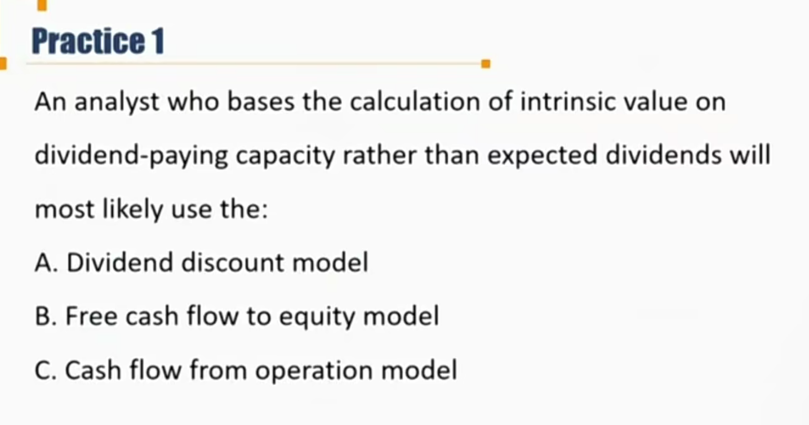

支付股利的**能力**： FCFE。

预期股利：dividend discount model

cfo没有反应股利。答案：B

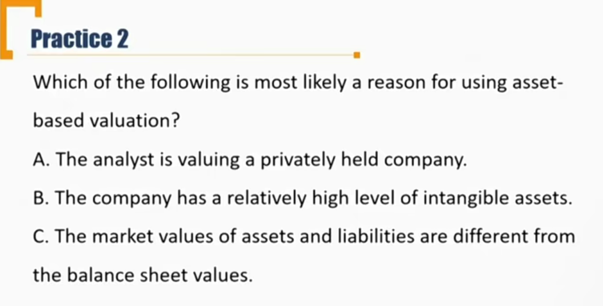

现金流不确定，资产比较好估计，都适合asset-based valuation. 答案：A
