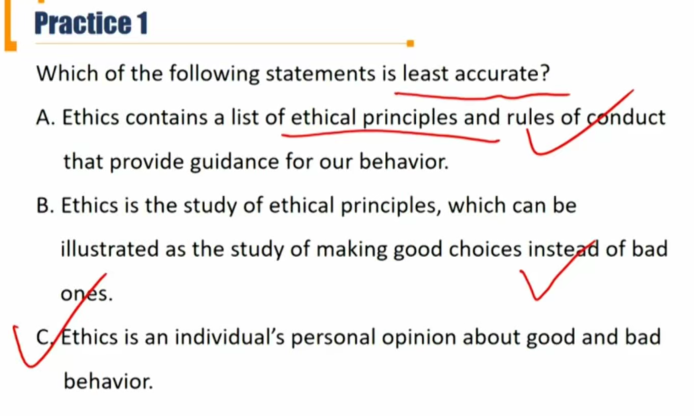
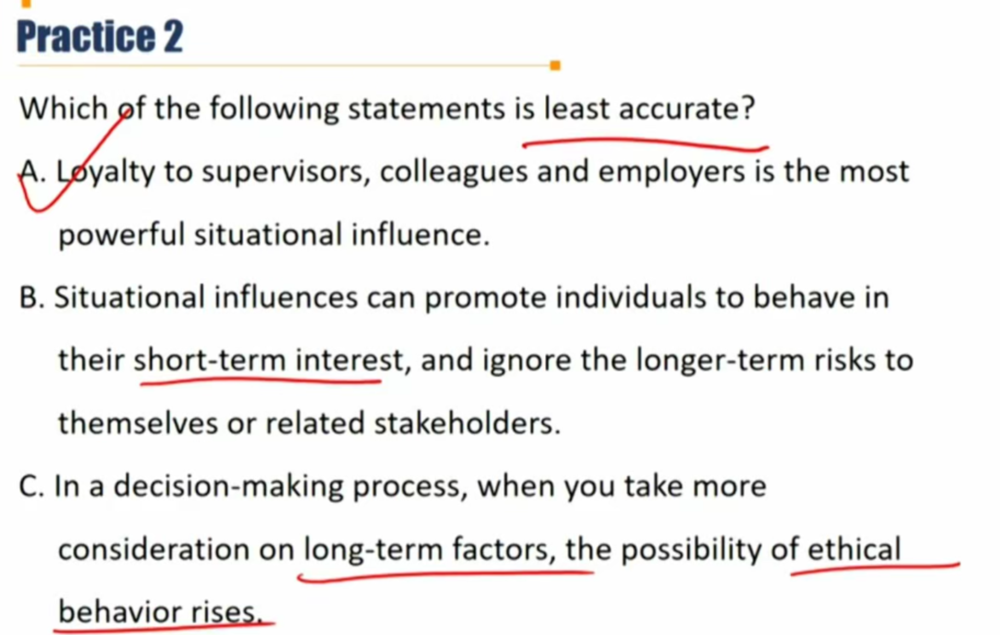
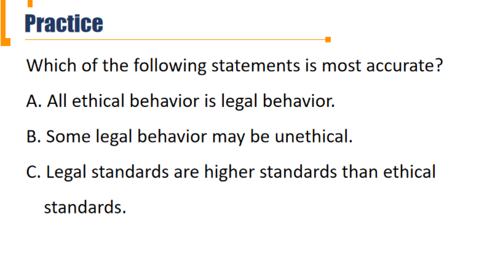
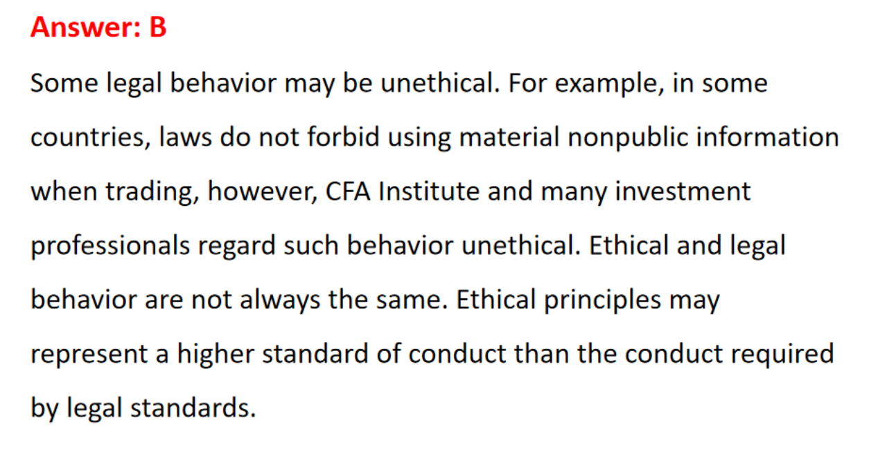
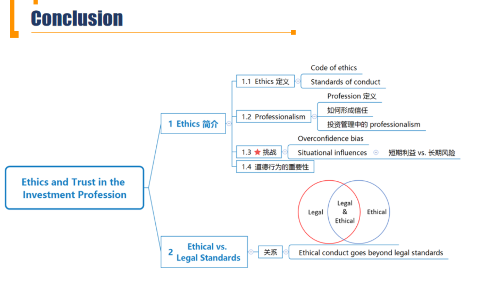

# M1 Ethics and Trust

### 1.1 Introduction to Ethics

##### Definition of ethics

- Our decision and behavior can harm or benefit a variety of **stakeholders(利益相关方)**.
  - Examples of stakeholders: colleagues, clients, employers, the communities in which we live and work, the investment profession, and other financial market participants
- **Ethics** encompasses a set of moral principles and rules of conduct that provide guidance for our behavior.

- **Code of ethcis 道德规范**： beliefs about **obligatory and forbidden conduct** in a wirtten set of principles
- **Standards of conduct: 行为标准**：benchmarks for the **minimally acceptable** behavior of community members and can help clarify the code of ethics.
  - 针对道德规范的细化。

##### Ethics and professionalism 新考纲

- A **profession** is an occupational community that has specific education, expert knowledge, and a framework of practice and behavior that underpins community trust, respect, and recognition.
  - 专业人士的定义。提供服务。

##### How professions establish trust

- Professions normalize practitioner behavior 行为规范化
- Professions provide a service to society
- Professions are client focused 
  - 以客户为中心，fiduciary duty(受托责任)。
  - （fiduciary复习：衍生品中call-put parity也出现了这个词，fiduciary call: call + 零息债券）
- Professions have high entry standards
- Professions possess a body of expert knowledge.

- Professions encourage and facilitate continuing education
  - 需要终身学习
- Professions monitor professional conduct
  - 行为收到客户、群体内部的监督
- Professions are collegial
  - collegial: repsonsibility is shared between serveral people. 共同受到约束。
- Professions are recognized oversight bodies
  - 受到认可的群体
- Professions encourage the engagement of members

##### Professionalism in investment management

- Trust is especially important in the investment industry for several reasons
  - The nature of the client relationship
    - 存在受托责任
  - Specialized knowledge and access to information
    - 投资需要专业知识，客户不了解（信息不对称）
  - The nature of investment products and services
    - 金融服务本身复杂，客户难以了解（信息不对称）

- Ethical behavior builds and fosters trusts
- Ethical behavior by all market participants can lead to :
  - broader participation in the markets 市场参与者更多
  - protection of clients interests 更好保护客户利益
  - more opportunities for investment professionals and their firms. 更多投资机会

- **CFA Institute as an investment management professional body**
  - CFA Institute is the largest body for investment management professionals
  - The mission of CFA Institute is "to lead the investment profession globally, by promoting the highest standards of ethics, education, and professional excellence for the ultimate benefit of society."

##### Challenges to ethical conduct \*\*\* 保持道德水准的挑战

- **1) Overconfidence bias 过度自信**
  - definition: people tend to believe that they are ethical people and that their ethical standards are higher than average.

- **2) Situational influences情境影响**
  - Definition: external factors(environmental or cultural elements), that shape our thinking and behavior.
    - 外部因素影响个人的思考和行为
  - Examples: 
    - the bystander effect 旁观者效应：a phenomenon in which the greater the number of people there are present, the less likely people are to help a person in distress.
    - large financial rewards and prestige(威望)：受到金钱的诱惑
    - loyalty 对雇主的loyalty
    - promotions 晋升，比如雇主提供晋升诱惑，让员工做违法事件
  - We tend to focus on **short-term** interests and ignore the **longer-term** risks, thus the likelihood of suffering ethical lapses and making poor decisions increases.

- Ethics 不是personal opinion，是行业公认的准则

### 1.2 Ethical vs. Legal Standards

##### Ethical vs. Legal standards

- Legal and ethical conduct are NOT always the same.
  - 两者相交不重合。$A \cap B \ne \emptyset, A\cup B\ne A\ne B$

- The law is **not** always the best mechanism to reduce unethical behavior: 法律存在的一些缺陷
  - Laws typically follow market practices法律存在滞后性
  - a new law may reduce existing activity while simultaneously creating a different but problematic activity.
    - 法律通常解决一个问题，同时带来一个新的问题。
  - Laws vary across countries or jurisdictions
    - 法律在不同国家不同地区不一样。比如星巴克不选择在高税率的英国实现利润
  - laws are also subject to interpretation and compliance by market participants
    - 法律需要司法解释
- **Ethical conduct goes beyond legal standards**

##### Ethical decision-making frameworks

- **Identify**: relevant facts, stakeholders and duties owed, ethical principles, conflicts of interest.
- **Consider**: situational influences, additional guidance, alternative actions.
- **Decide and act.**
- **Reflect**: was the outcome as anticipated ? why or why not?

