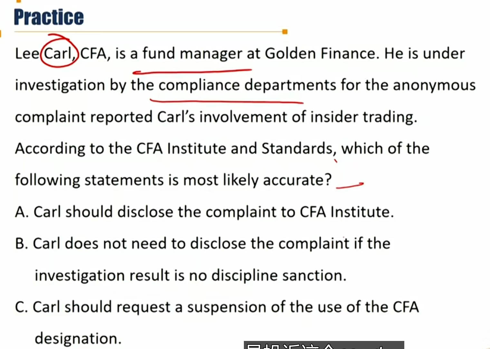
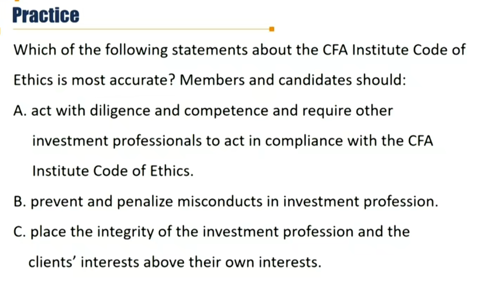
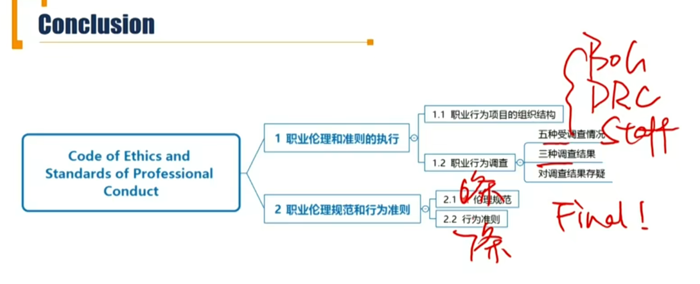

# M2 Code of Ethics and Standards of Professional Conduct

### 2.1 Enforcement of the Code and Standards

#### Structure of the professional conduct program

- **The CFA Institute Board of Governors(CFA协会治理委员会)** maintains **oversight** and responsibility for the Professional Conduct Program(PCP)(职业行为规划)
  - BOG，类似董事会。关键字：oversight，全责
- **The Disciplinary Review Committee(DRC 纪律审查委员会)** is responsible for **enforcement ** of the Code and Standards.
  - The DRC is a volunteer committee of CFA charter-holders
  - DRC，类似高管。关键字: enforcement, 执行
- **Professional Conduct Staff(职业行为调查工作人员)** conducts professional conduct inquiries under the direction of the CFA Institute Designated Officer(CFA 协会指定官员)
  - 负责conduct inquiries，调查取证，类似公司里的普通员工。

#### Circumstances that can prompt an inquiry 导致调查的5种情况

- **Self disclosure** by members and candidates on the annual Professional Conduct Statement(PCS)(职业行为陈述表)
  - 自我披露。只要被怀疑有不道德行为（不一定是事实），都要披露。
- **Written complaints** received by Professional Conduct Staff.
  - 投诉，举报
- **Evidence of questionable conduct** through <u>public source</u>.
  - 公开信息
- A violation report by a CFA examination proctor（监考） for breaching the examination rules.
  - 考试作弊
- **Analysis of scores and exam materials** after the exam, and monitor social media to detect disclosure of confidential exam information.
  - 考试成绩分析

#### Investigation result 三种调查结果

- No discipline sanction
- Issue a cautionary letter
- A disciplinary sanction
  - Public censure公开谴责
  - Suspension of membership and the use of the CFA designation. 暂停CFA会员资格
  - Revocation of the CFA charter 收回持证
  - Suspension from further participation in the CFA Program 以后都不能参与

#### Disagreement on investigation results

- If the member or candidate does not accept the proposed sanction, the matter is referred to a **hearing panel(听证陪审团)** composed of DRC members(Disciplinary Review Committee).
- The hearing panel's conclusion is **Final.** **最终裁决**

答案：A。只要被怀疑，都要披露disclosure。

### 2.2 Code of Ethics and Standards of Professional Conduct

6条Code of Ethics , 7条Standards of Professional Conduct.

#### Code of ethics 六条Code \*\*\*

1. Act with integrity, competence, diligence, respect, and in an ethical manner with the public, clients, prospective clients, employers, employees, colleagues in the investment profession, and other participants in the global capital markets.
   - 坚持诚信、称职、勤奋、尊重的行为原则，以符合职业道德的方式对待投资专业领域的公众、客户、潜在客户、雇主、雇员、同事以及其他全球资本市场的参与者。 
   - 以什么态度对待什么样的人
2. Place the integrity of the investment profession and the interests of clients **above** their own personal interests.
   - 将投资专业的诚信和客户的利益置于个人利益之上。
   - 谁的利益至上？市场>客户>个人

3. Use **reasonable care** and exercise **independent** professional judgment when conducting investment analysis, making investment recommendations, taking investment actions, and engaging in other professional activities.

   - 进行投资分析、提供投资建议、采取投资行动和参与其他专业活动时，应保持**合理的谨慎**，做出**独立**的专业判断。

   - 专业活动、专业判断

4. Practice and **encourage** others to practice in a professional and ethical manner that will reflect credit on themselves and the profession.

   - 履行并**鼓励**（注意仅仅是鼓励，不是require）其他人履行职业道德规范，彰显其自身和行业的信誉
   - 影响他人

5. Promote the integrity and viability of the global markets for the ultimate benefit of society

   - 促进全球资本市场的诚信和发展，最终造福社会。
   - **影响社会**

6. Maintain and improve their professional competence and strive to maintain and improve the competence of other investment professionals.
   - 保持和加强自身专业能力以及努力保持和加强其他投资专业同仁的能力。
   - **终身学习**

工作上：态度、利益、专业性

影响：他人、社会

个人：终身学习

#### Standards of professional conduct

7大条22个细节

I. Professionalism

II. Integrity of capital markets

III.  Duties to Clients

IV. Duties to Employers

V. Investment Analysis, Recommendations, and Actions

VI. Conflicts of Interests

VII. Responsibilities as a CFA Institute Member or CFA Candidate

答案：C

B中的penalize没有涉及。A中是encourage.

