# M3 Guidance for Standards I-VII

I. Professionalism

II. Integrity of Capital Markets

III. Duties to Clients

IV. Duties to Employers

V. Investment Analysis, Recommendations, and Actions

VI. Conflicts of Interests

VII. Responsibilities as a CFA Institute Member or CFA Candidate

每条细则分为：content、**guidance**、recommendation、example

### Standard I: Professionalism 专业性

- (A) Knowledge of the law
- (B) Independence and Objectivity
- (C) Misrepresentation
- (D) Misconduct

#### I(A) Knowledge of the Law 法律知识

##### Content

- Members and Candidates must **understand** and **comply** with all applicable laws, rules, and regulations(including the CFA Institute Code of Ethics and Standards of Professional Conduct) of any government, regulatory organization, licensing agency, or professional association governing their professional activities.
  - applicable laws适用法
- In the event of conflict, Members and Candidates must comply with the **more strict** law, rule, or regulation.
  - 出现冲突时，从**严**遵守
- Members and Candidates must not **knowingly** participate or assist in and must **dissociate** from any violation of such laws, rules, or regulation.
  - 关键词：dissociate回避，不可以同流合污

##### Guidance

- **Relationship between the code and standards and applicable law**
  - **Applicable law**(适用法) is the law that governs the member's or candidate's conduct
  - Must follow the **more strict** of the applicable law or the Code and Standards.
- **more strict 从严遵守例子：**
  - NS = no securities laws; LS=less strict securities law(less than CFA code and standards); MS: more strict than code and standards.

| Applicable Law                                               | Duties                                                       |
| ------------------------------------------------------------ | ------------------------------------------------------------ |
| Members resides in LS country, Does business in NS country, **LS law applies**. | Member must adhere to the Code and Standards.(LS < Code and standards) |
| Member resides in MS country; Does business in LS country; **MS law applies.** | Member must adhere to the law of MS country                  |
| Member resides in MS country; Does business in LS country; MS law applies, but it state that **law of locality where business is conducted governs.** （MS的法律表明遵守业务所在国法律即可，则LS < Code and Standards） | Member must adhere to the Code and Standards.                |

- **Association with violation by others** 发现违规

  - **Inaction** may be construed as participation.
    - 装作没看见，视同参与
  - **Report** to supervisor or compliance department
    - 报告上级或者合规部门
  - **Must dissociate** from the illegal/unethical activity. 回避
    - E.g., removing member's or candidate's name from reserach report, asking for a different assignment, etc.
    - 回避方式：报告除名、换任务、换客户、辞职

  - In extreme case, dissociation may require **resignation**.

  - It is **encouraged(not required)** to report violations by fellow members and candidates to CFA Institute.
  - **No requirement** to report violations to government authorities
    - 注意，只是鼓励向CFA和政府部门举报，不是要求
    - 但是要求向上级、合规部门的举报
  - Should **consult** legal and compliance advisers when there is doubt whether a violation occurred.
    - 如果不确定是否违规，应该咨询法务、合规

- **Investment products and applicable laws**

  - Understand and comply with the laws and regulations of the countries of <u>origination</u> and <u>expected sale</u>.
    - 跨国产品，了解产品来源地、销售地的法律。
  - Review whether **associated firms**（分销商） responsible for distributing products also abide by the laws and regulations
    - 关注分销商的行为是否合法合规。

- **Others**

  - No requirement to be experts on all the applicable laws.
    - 有任何疑问必须及时consult

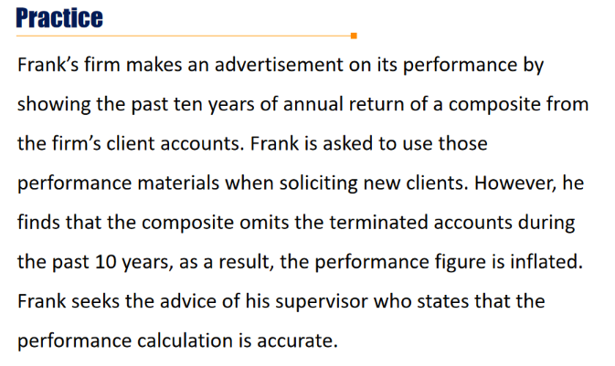

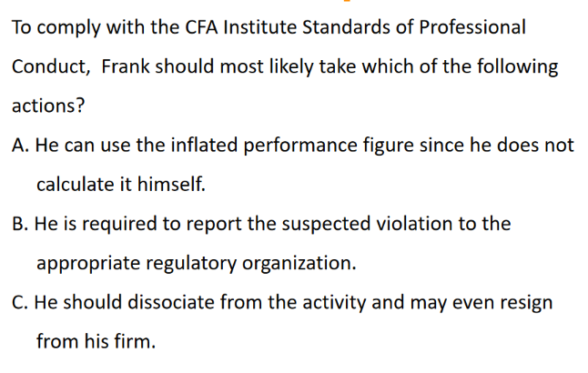

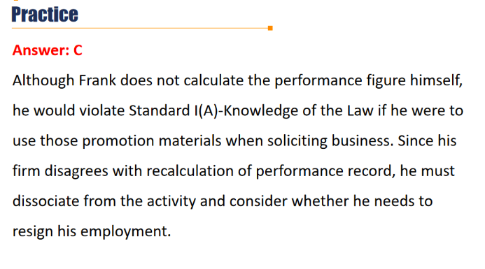

- 不要求，只是鼓励向regulatory organization报告

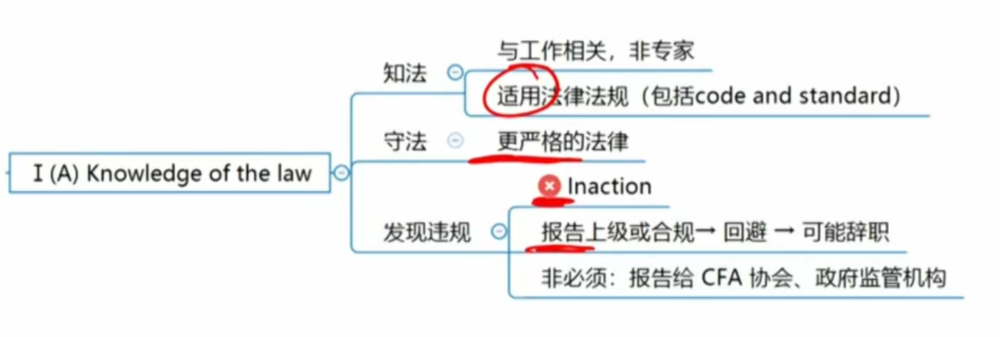

#### I(B) Independence and Objectivity 独立性与客观性

##### Content

- Members and Candidates must use reasonable care and judgment(合理的审慎和判断力) to achieve and maintain independence and objectivity in their professional activities
- Members and Candidates **must no offer, solicit, or accept** any gift, benefit, compensation, or consideration(报酬) that reasonably could be expected to compromise(危及、损害) their own or another's independence and objectivity. 拒绝利诱。
  - consideration: 报酬
  - compromise: 危及、损害

| Buy side                 | Sell side                        |
| ------------------------ | -------------------------------- |
| Asset management         | Investment bank(IBD)             |
| Hedge fund               | Selling and trading(S&T)         |
| Mutual fund              | Research analysts                |
| Pension fund             | Credit rating 信用评级           |
| 手里有钱，去投资产生收益 | 负责设计和销售金融产品，提供服务 |

##### Guidance

- **Buy-side clients** may influence **sell-side** analyst's independence because:
  - Portfolio managers have significant positions in the security under review
  - a downgrade may affect the manager's compensation
  - bad performance may affect the manager's professional reputation.
  - buy-side clients就是基金经理
- **Influence during manager(or custodians) selection process** 挑选基金经理
  - In a hiring capacity, **should not solicit** gifts, contributions, or other compensation; and **refuse** gifts, donations, and other offered compensation that may be perceived to influence decision-making process.
  - When working to earn a new investment allocation, members and candidates **should not offer** gifts, contributions, or other compensation to influence the decision of the hiring representative. (e.g., **pay-to-play**，政治献金)

- **Performance measurement and attribution** 基金经理业绩评判
  - Performance analysts业绩分析师 must not allow internal or external influence to affect their independence and objectivity.

- **Investment banking relationships** 投行和分析师之间的冲突 \*\*\*
  - Analysts must not be pressured to issue favorable report on current or prospective clients by their firms
  - Having analysts work with investment banking colleagues is appropriate only when the conflicts are adequately managed and disclosed.
  - **"Firewalls**" are used to minimize conflicts of interest.(e.g., separate reporting structures, compensation arrangements)
    - 隔离墙：物理隔离（办公场所）、管理隔离（上级领导不是同一人）、信息隔离（不可以直接互通信息，需要经过合规等）

- **Public companies** 上市公司和分析师
  - Analysts must not be pressured to issu favorable reports by the companies they follow.
- **Credit rating agency opinions** 信用评级机构
  - Members and candidates must prevent influences from the company requesting the rating.

下面是具体避免冲突的方法

- **Issuer-paid research** 付费报告
  - Analysts must disclose potential conflicts of interest
  - A **flat fee**(固定费用) **not linked to** recommendations should be determined **prior to** writing the reports.
    - 公司雇佣分析师撰写报告的时候，需要事先确定的固定费用，分析师要披露冲突。

- **Travel funding** 差旅费 \*\*\*
  - Best practice is to pay by themselves or pay by their firms
  - May accept modestly arranged travel when commercial transportation is unavailable(e.g., the destination is **remote**), but disclosure is needed.
    - 调研地点是remote\far away\not easily accessible的时候可以例外，但是需要披露

- **Gifts\*\*\***
  
  - **Modest gifts**(token gift 小礼物) are acceptable, but special care must be taken to resist pressures to act in conflict with the interests of their clients.
  
  - **Best practice** is to **reject** any offer of gift or entertainment that could be expected to threaten their independence and objectivity.
  
  - A gift from a client is acceptable but should be disclosed to their employers prior to accepting such gift or benefit. 
  
  - 礼物分为两种：
    - 研究对象送的礼物：
      - modest/token可以收
      - 大礼物、贵重的礼物不可以
      - 客户报答：可以收，但是需要**事先**获得雇主批准
  
##### Recommendation

- Create a **restricted list**(限制清单) **\*\*\***
  - 券商列出限制清单，分析师不再对限制清单里的公司发表买入卖出意见，避免和投行等部门形成利益冲突。
- Restrict special cost arrangements 规范差旅费等支出
  - For example, members should encourage issuers to limit use of corporate aircraft to situations in which commercial transportation is not available.

- Limit gifts 收礼限制
  - The standard does not preclude customary and ordinary business-related entertainment as long as its purpose is not to influence members and candidates.
- Restrict investments
  - Strict limits should be imposed on personnel investment on IPOs or private placement.
    - 限制新股认购

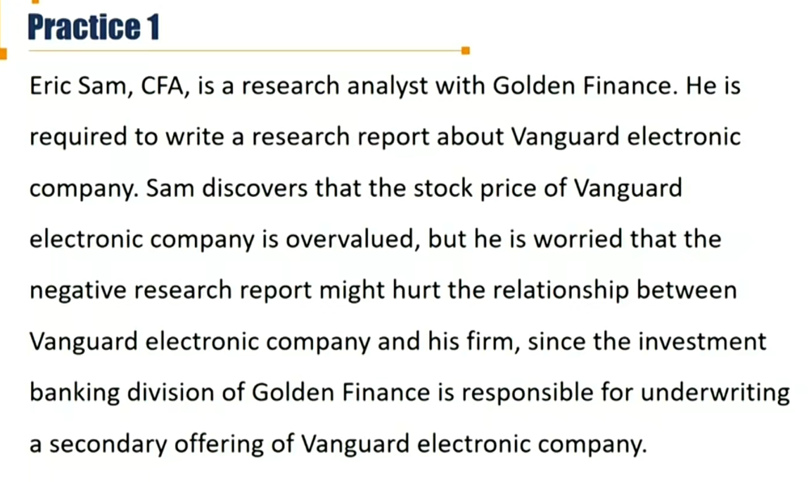

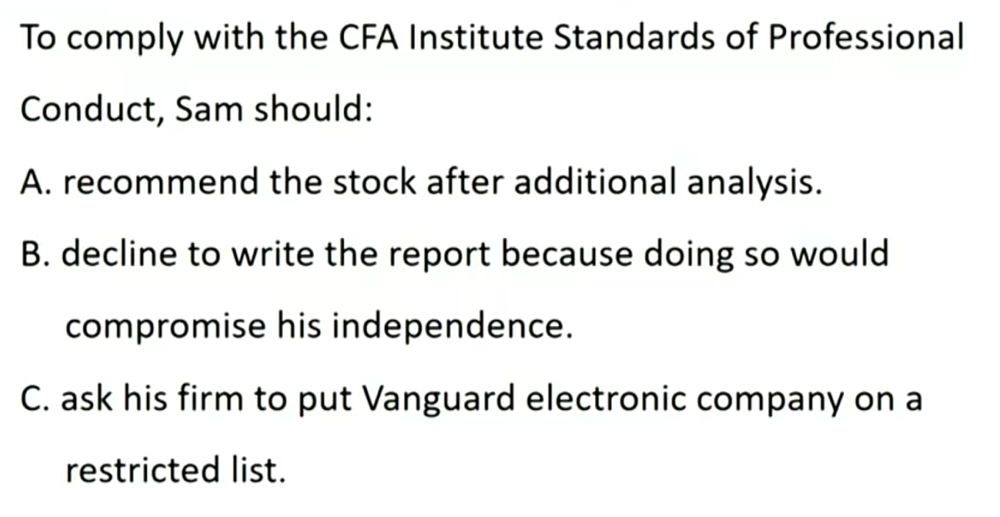

- C选项更加准确。B、报告还是可以写，只是只能写一些事实性的内容，不能给出投资建议。

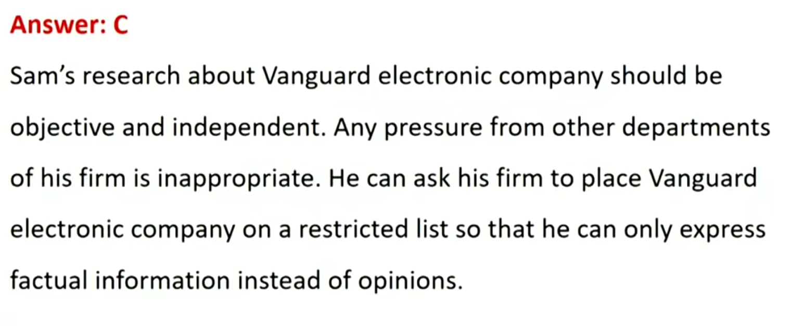

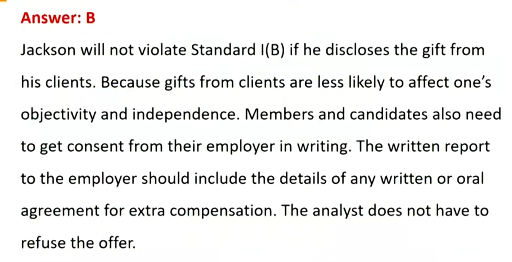

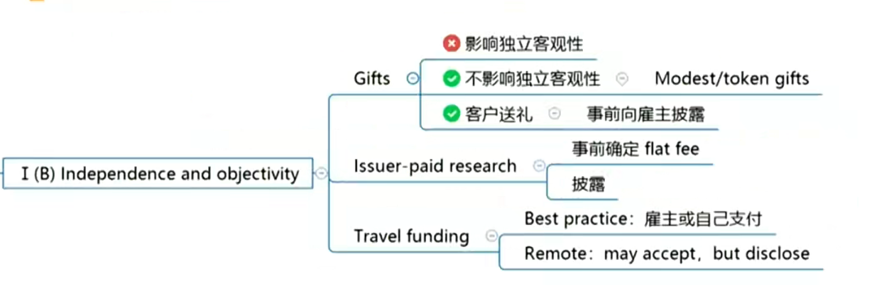

差旅费和Gift比较重要

#### I(C) Misrepresentation 曲解

##### **Content**

- Members and Candidates **must not knowingly** make any misrepresentations relating to investment analysis, recommendations, actions, or other professional activities.

##### Guidance

- A misrepresentation is any **untrue** statement or **omission** of a fact or any statement that is otherwise false or **misleading.**
  - 不真实、不完整、有误导，都会导致曲解

- **Impact on investment practice**

  - Members and candidates must not misrepresent both their and their employer's **qualifications or services**.
    - 吹牛、夸大现状，夸大个人资质。
  - Misrepresentations resulting from the use of **third-party information** become the responsibility of the members and candidates.
    - 直接搬用错误的第三方信息
  - Members and candidates **must disclose** their intended use of external managers and must not represent those managers' investment practices as their own. 
    - 委托了外部基金经理管理基金的情况，需要完整披露。

- **Performance reporting业绩披露，业绩报告**

  - Members and candidates must ensure that performance is **accurate** and **complete**, e.g., **cherry picking** is not allowed.
    - 披露业绩需要准确、完整，不可以选择性披露。

  - The standard prohibits members and candidates from making any **return guarantee on volatile investments**. 
    - 波动性产品不可以有业绩承诺，但是T-bonds、CDs（certificate of deposit）这两种固定收益可以。
  - When performance benchmark is required, select the **most appropriate benchmark**.
    - 选择合适的业绩基准
  - Valuations for illiquid or non-traded securities, **shops for values is not allowed**.
    - 对流动性较差的产品进行估值的时候，不可以直接选估值最高的方法，需要选最符合现状的方法进行估值。

- **Social media**

  - When communicating through social media channels, members and candidates should provide **only the same** information
    - 不同的社交媒体平台，表达意见要一致
  - The perceived anonymity granted through social media platforms may entice(诱使) individuals to misrepresent（歪曲） their qualifications or abilities or those of their employer.
    - 即使在匿名性平台，也要对言论负责，保持一致。

- **Omissions  遗漏**

  - The omission of a fact or outcome can be misleading, especially in the use of models and technical analysis.
    - 估值的时候故意遗漏一些事实（fact）
  - Outcomes from models shall not be presented as fact.
    - 估值的时候，不可以用按照事实去表述，应该是分析师个人的**opinion**.
      - 比如the stock price will be 30 three month later，不符合规范。应该为the stock price is estimated to be 30 three month later.
  - Develop strict policies for composite development to prevent cherry picking.
    - composite组合群。构建的时候要有严格制度，防止挑选好的业绩进行组合。
  - The omission of any accounts appropriate for the defined composite may misrepresent to clients the success of the manager's implementation of its strategy.
    - 遗漏掉一些亏损账户，导致composite偏高，误导客户。

- **Plagiarism 抄袭**

  - The standard **prohibits** plagiarism 禁止抄袭

  - Plagiarism practices include:

    - take a research report done by another firm or person, change the names, and release as one's own original analysis.
    - use excerpts from articles or reports prepared by others either verbatim（逐字） or with only slight changes in wording without acknowledgement

    - cite specific quotations as attributable to "leading analysts" and "investment experts" without naming the specific references.
      - 引用的时候不指名，表述为“某知名分析师表示”等。
    - present statistical estimates of forecasts and using charts and graphs without stating their sources.
      - 抄袭数据
    - copy proprietary（所有者、所有权） computerized spreadsheets or algorithms without authorization of creators.
      - 抄excel和算法
    - prepare research reports based on multiple sources of information without acknowledging the sources.
      - 多个来源组合成自己的文章

  - Members or candidates may use research conducted or models developed by others within the same firm **without committing a violation**. The firm may issue future reports without providing attribution to the prior analysts.

    - 不属于抄袭的情况：用的同事的工作成果。（同个公司）

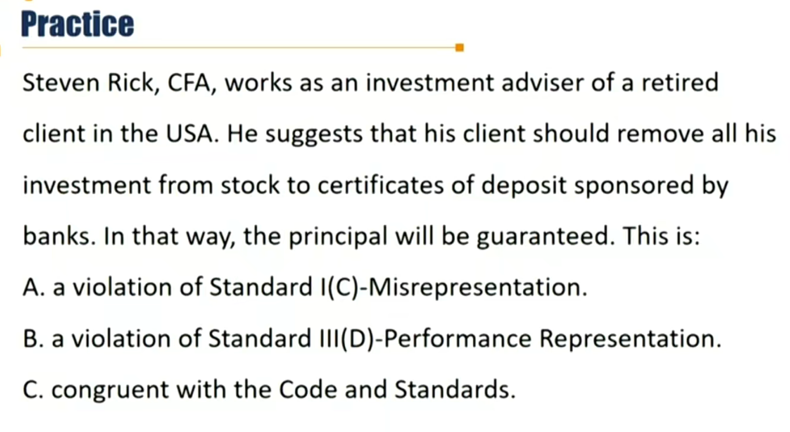

- CDs可以承诺保本。

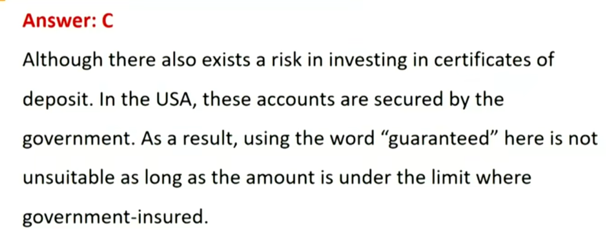

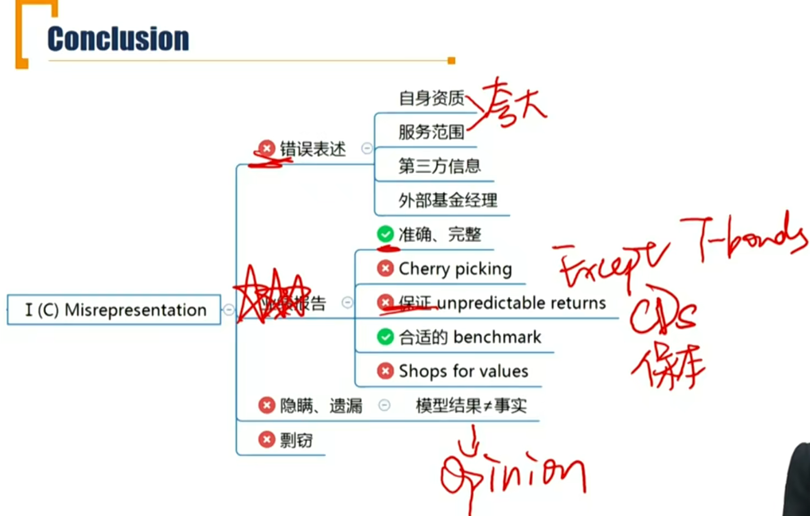

- 业绩报告重要

#### I(D) Misconduct 渎职

##### Content

- Members and Candidates must not engage in any professional conduct involving **dishonesty, fraud, or deceit** or commit any act that reflects adversely on their professional reputation, integrity, or competence.
  - 不可以欺诈

##### Guidance

- The standards are **primarily** aimed at conduct related to a member's or candidate's **professional life.** 主要关注职业行为，不是个人行为。
  - Conduct that, although not illegal, but negatively affects a member's or candidate's trustworthiness or competence, is a violation.
    - 即使不违法，但是损害了可信度或者能力，也算违规
  - The lack of diligence(sufficient effort) in providing professional services may be a violation.
    - 不尽职不尽责
  - Do not seek the standards as a method of settling personal, political, or other disputes unrelated to professional ethics.
    - 不考虑个人生活，政治立场等和职业行为无关的行为.
- Any act that involves lying, stealing, or other dishonest conduct is a violation if the offense reflects adversely on a member's or candidate's professional activities. 个人的不诚信行为算渎职.
  - Personal bankruptcy may violate the standard if it involves **fraudulent or deceitful business conduct.**
    - 因为欺诈导致的个人破产也算渎职

- 所以: 对于个人职业行为来说, 不尽职尽责算渎职;对于欺诈行为都算违规.

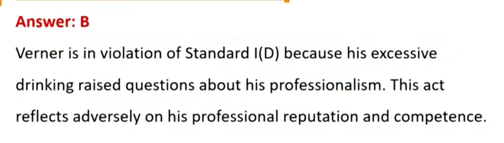

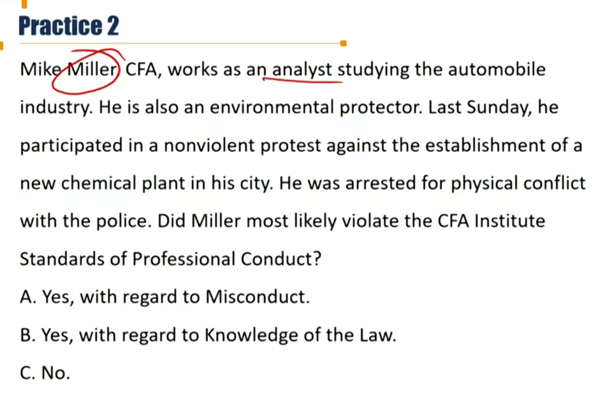

- 不涉及欺诈行为. 只是个人生活.

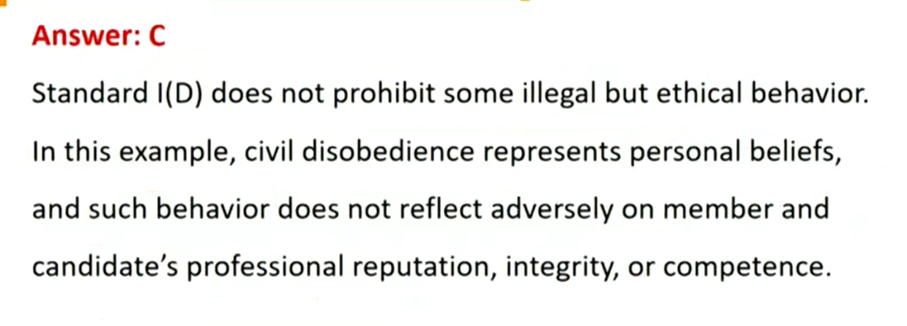

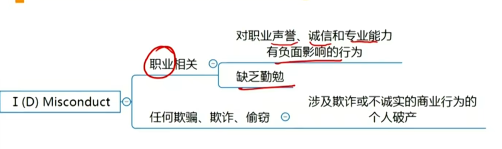

#### 

### Standard II: Integrity of Capital Markets 资本市场的诚信

- II(A) Material Nonpublic Information
- II(B) Market Manipulation

#### II(A) Material Nonpublic Information内幕消息

##### Content

- Members and Candidates who posses material nonpublic information that could affect the value of an investment **must not act or cause others to act** on the information.
  - 不能根据内幕信息行事或促使他人行事

##### Guidance

- **What is "material information"?** 重大信息的定义
  - The information is "material" if:
    - 1. its disclosure would have an **impact on the price** of a security
      2. investors would **want to know the information** before making an investment decision.
      3. the source of information is **reliable**(\*\*\*反义词：rumor，谣言不算重大信息)
    - Examples: earnings, merger & acquisition, innovative products(比如创新药20年保护期), changes in management, legal disputes, etc.

- **What consitutes "nonpublic" information?**
  - Information is "nonpublic" until it has been disseminated(传播) to the **marketplace in general**.
  - Information that is made available to **a select group of people** remains nonpublic.
    - 只向一小部分人公开的也是非公开信息
  - Members and candidates may use insider information legitimately for the specific purpose of conducting due diligence for such activities as mergers, security underwriting, credit ratings, etc.
    - 尽职调查 due diligence中为了写尽职调查报告用到内幕消息不算违规。

- **Mosaic theory马赛克理论** \*\*\*
  - Members candidates do not violate the standard when they reach a material conclusion about a corporate action or event through an analysis of **public information** and **nonmaterial nonpublic information**.
    - 用非重大、非公开信息结合公开信息推出来的结论去做交易决策，不算违规

- **Social media**
  - Information from internet and social media platforms **may not** be considered public. Example: social media that requires membership in order to access the published content.
  - Members and candidates should **verify** that material information obtained from these sources can also be accessed from a source that is available to the public(e.g., webpages, press releases).
  - 由于平台会员等机制，社交媒体上看到的信息不一定是公开信息，需要搜索信息验证其是否为公开信息。

- **Using industry experts** 和专家交流
  - Members and candidates may speak with experts regarding economic conditions, industry trends, and technical issues relating to products and services.
  - Members and candidates are **prohibited** from taking investment actions based on material nonpublic information provided by industry experts.
  - 不能使用和行业专家沟通获得的重大非公开信息
- **Investment research reports**
  - When a particularly **well-known analyst** issues a report or makes changes to his or her recommendation, that information alone may have an effect on the market and thus may be considered material. Therefore, such a report would have to be **made public** at the time it was distributed to clients.
  - 知名分析师改变投资建议时，认为是重大信息，所以需要及时公布，公开化此消息。

##### Recommendation

- **Achieve public dissemination**
  - Members and candidates should make reasonable efforts to achieve public dissemination of material information. 尽力促使该信息公开化。
  - If public dissemination is not available, members and candidates must communicate the information only to their supervisory and compliance personnel of their firm. 
    - 无法公开化该信息的时候，应该通知上级或者合规部门。

- prudent 审慎的

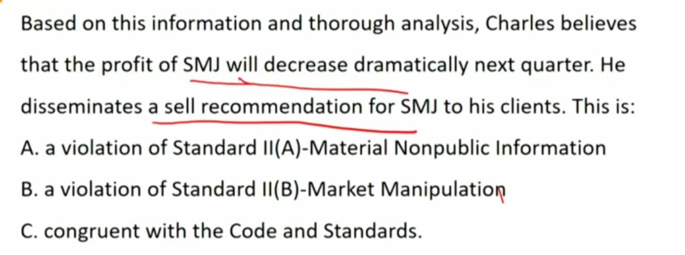

- 这里是mosaic理论，选C

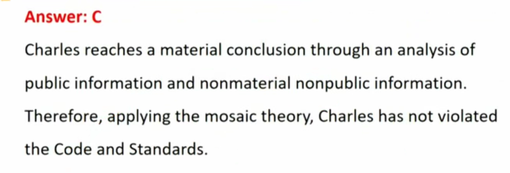

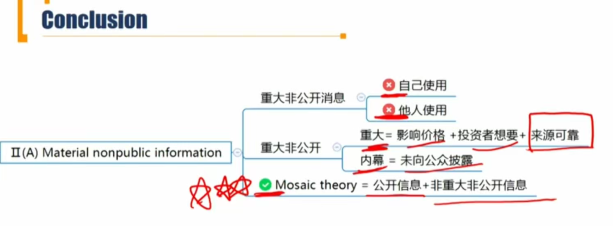

#### II(B) Market Manipulation 操纵市场

##### Content

- Members and Candidates must not engage in practices that **distort prices or artificially inflate trading volume** with the intent to mislead market participants.
  - 操纵股价、交易量，从而误导投资者

##### Guidance

- **Information-based manipulation** 基于信息的市场操纵
  - Spreading false **rumors** to induce trading 散播谣言
- **Transaction-based manipulation** 基于交易的市场操纵
  - Securing a controlling and dominant position in a financial instrument to manipulate the price of a related derivative or the underlying asset.
    - 庄家操纵交易量（自买自卖，对敲），通过操纵交易量，从而操纵股价
- **The standard is not intended to preclude transactions undertaken on legitimate trading strategties.** \*\*\*
  - 这条标准**不包括**合法的交易策略：套利arbitrage、做空short selling.

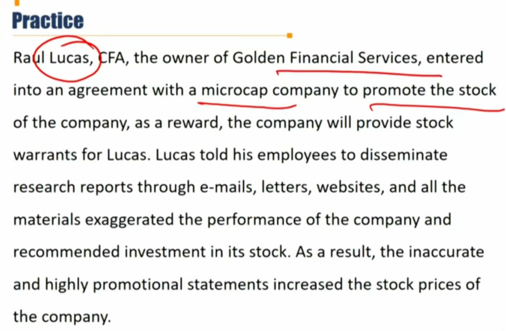

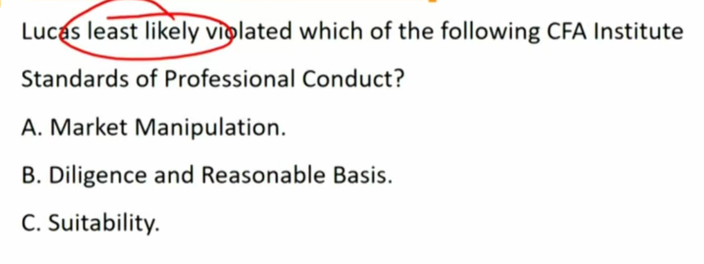

- suitability: 适当性，

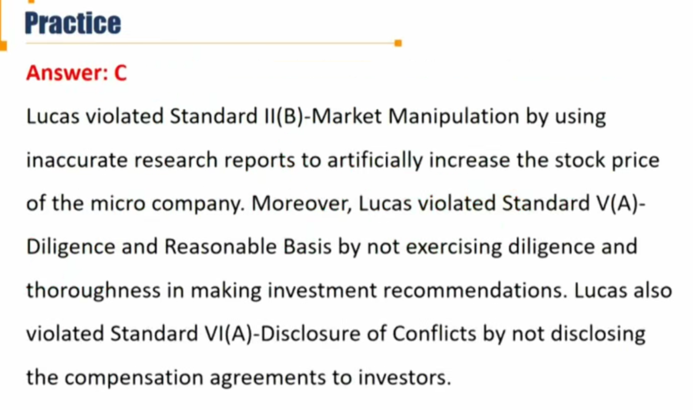

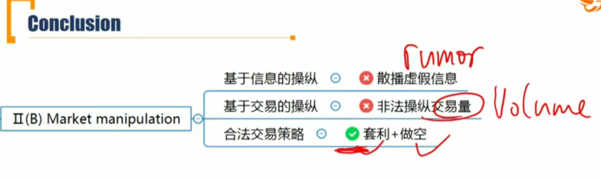

### Standard III: Duties to Clients 对客户的忠诚

- III(A) Loyalty, Prudence, and Care
  -  III（A）是纲领性的细则，只要违反下面四条细则，就一定违反III(A)
- III(B) Fair Dealing
- III(C) Suitability
- III(D) Performance Presentation
- III(E) Preservation of Confidentiality

#### III(A) Loyalty, Prudence and Care忠诚、审慎和谨慎

##### Content

- Members and Candidates have a duty of loyalty to their clients and must act with reasonable care and exercise prudent judegement.
- Members and Candidates must act for the benefits of their clients and place their client's interests **before** their employer's or their own interests.
  - 客户利益至上>雇主>自己的利益

##### Guidance

- **Understanding the application**
  - A minimum benchmark for the duties of loyalty, prudence, and care that are required of all members and candidates **regardless of** whether a **legal fiduciary** duty applies.（法定受托责任）
    - 不仅限于法定受托责任。
  - **Fiduciary duties** are often imposed by law or regulation when an individual or institution is charged with the duty of acting for the benefit of another party.
- **Identifying the actual investment client**
  - Special cases:
    - When the manager is responsible for the portfolios of **pension plans or trusts**, however, the client is not the person or entity who hires the manager but rather the **beneficiaries** of the plan or trust.
      - 基金经理管理养老金或者信托时，考虑的客户是养老金计划和信托的受益人。
    - If an actual client or group of beneficiaries does not exist, investment should be consistent with the **stated mandate**（基金说明文件）.没有具体的受益人的时候，按照说明文件行事。

- **Developing the client's portfolio**
  - Members and candidates should ensure:
    - investment recommendations and transactions are suitable to clients' objectives and circumstances. (和后面的III(C) suitability关联)
    - particular care must be taken on the potential conflict(潜在利益冲突) between the members and candidates or their firms and clients' interests.
      - 存在潜在利益冲突时，需要向客户披露
    - investment decisions are judged in the context of the **total portfolio**, rather than by individual investment.
      - 需要在整个投资组合的角度构建客户的portfolio.比如，风险中下的portfolio也可以小部分配置高风险的股票。
- **Soft dollar/commision(软美元) Policies 证券互惠行为**
  - **Soft dollar** is the practice that an investment manager uses client brokerage to purchase research services.
    - 比如，客户委托基金经理投资，基金经理选择broker进行交易。作为补偿，broker为基金经理提供免费的研究报告。
  - Brokerage is client's asset, its uses must benefit client.
    - broker提供的soft dollar是客户的资产，不能用去其他用途
  - "**Directed brokerage**" （客户制定经纪费）is a practice that a client directs a manager to use the client's brokerage to purchase services or goods for the client.
    - 客户可以选择broker.
  - **When selecting broker for clients, members must seek "best transaction cost" and "best execution".** \*\*\*
    - 首先考虑的不是证券互惠，而是佣金、交易速度。需要选择**性价比**最高的。比如，如果只按照佣金最低进行选择，或者只按照提供的soft dollar最高进行选择，都违反规定。

- **Proxy voting(代理投票) policies**
  - A cost-benefits analysis must be made prior to any proxy voting.
    - 是否参与投票需要根据cost-benefits analysis，看看参与投票是否影响客户的利益。
  - Voting proxies may not be necessary in all instances.
    - 不是强制要求投票。

##### Recommendation

- Regular acount information(**at least quarterly**) **每个季度**关注客户信息
- Client approval
- Firm policy
  - Follow all applicable rules and laws
  - Establish the investment objectives of the client
  - Consider all the infomration when taking actions
  - diversify
  - carry out regular revies
  - vote proxies and so on

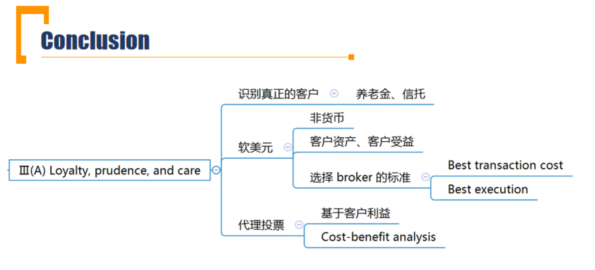

- 养老金、信托：受益人是客户
- 选择broker是看性价比，既不是越便宜越好，也不是交易速度越快越好。
- 代理投票不一定，看cost-benefits analysis

#### III(B) Fair Dealing 公平对待

##### Content

- Members and Candidates **must deal fairly and objectively** with all clients when providing investment analysis, making investment recommendations, taking investment action, or engaging in other professional activities.

##### Guidance

- **"Fair" is not "Equal"**
  - The standard does not state "equally" because:
    - communicating with all clients on a uniform basis presents practical problems due to differences in timing and methods of communications with clients
    - each client has unique needs and objectives
    - **firms may differentiate their services to clients, but different levels of services should be disclosed, and must not disadvantage any client.** 允许为客户提供差异化服务。（normal、VIP）但是提供的差异化服务需要对客户披露。不可以损害任何客户利益\*\*\*
- **Investment recommendations**
  - No discrimination against any client when disseminating investment recommendations.
    - 分发投资建议时不可以歧视，比如先告诉VIP，两小时后再告诉normal
  - Particular care should be taken that updated recommendation reaches those clients who have acted on the earlier advice.
    - 之前投资建议影响到的客户需要及时更新投资建议。
  - Clients who place orders **contrary** to a current recommendation should be <u>advised</u> before the order is accepted.
    - 客户进行相反操作时，需要先advise。

- **Investment action**
  - If security issue is **oversubscribed** (超额认购)， the issue should be **prorated** (按比例) to all subscribers.\*\*\*，超额认购，实际认购数量低于申购数量，按认购比例分配给每个客户。
  - Members and candidates should be prohibited from participating in "**hot issue**".
    - 热门股票，比如IPO发行的新股。也就是说，基金经理不可以自己参与打新，损害客户利益。
  - Family-member accounts are treated similarly to the accounts of other clients.\*\*
    - 基金经理的家庭成员的账户也应该公平对待（fee paying account）

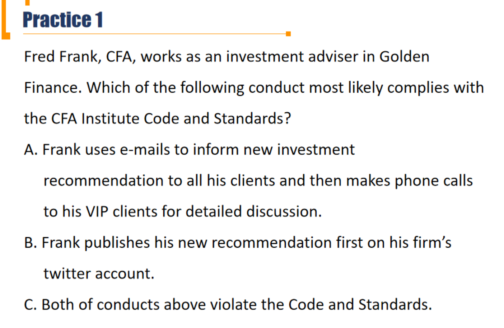

- 答案A。在twitter上发布，有可能有些没有关注的客户看不到，会损害客户利益。

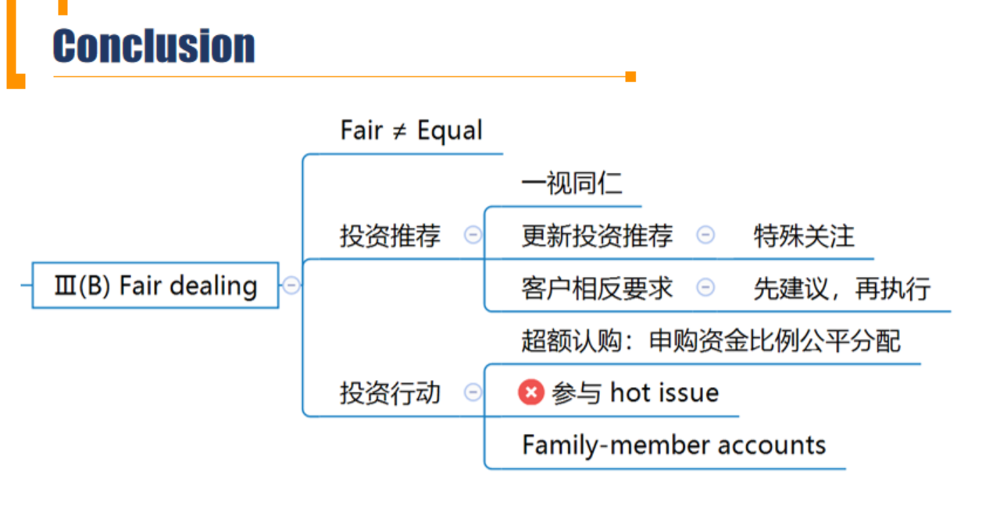

- 注意可以差异化服务：前提是公开披露+不损害客户利益
- 基金经理自己不能参与hot issue

#### III(C) Suitability 适当性

##### Content

- When members and candidates are in **an advisory relationship**(咨询服务) with a client, they must:
  - make a reasonable inquiry into a client's or prospective client's investment experience, risk and return objectives, and financial constraints **prior** to making any investment recommendation or taking investment action and must **reassess and update** this information regularly.
    - 在做出投资建议或者投资行为前，了解客户的投资经验，风险和回报目标。并且定期更新，定期重新评估。
  - determine that an investment is <u>suitable</u> to the client's financial situation and consistent with the client's written objectives, mandates, and constraints before making an investment recommendation or taking investment action.
  - judge the suitability of investments in the context of the client's **total portfolio.**
    - 根据整个投资组合判断适当性。
- When members and candidates are responsible for **managing a portfolio to a specific mandate, strategy, or style**, they must make only investment recommendations or take only investment actions that are consistent with the stated objectives and constraints of the portfolio.
  - 共同基金mutual fund按照募集说明书，约定好的投资风格去投资即可。

##### Guidance

- **Developing and updating investment policy statement(IPS)**
  - The **IPS(投资政策声明)** addresses the client's risk tolerance, return requirement, investment constraints, the roles and repsonsiblities of the parties to the advisory relationship.
    - Risk tolerance, return requirement, investment contraints(RRLLTTU复习portfolioM4)
    - 需要深入了解客户，然后再提供建议
  - Based on the IPS, members and candidates can develop an appropriate strategic asset allocation.根据IPS配置股票
  - Updating the IPS should be repeated at least **annually and also prior to material changes**.每年以及重大变化之前更新。
- **Understanding the client's risk profile**
  - Consider whether **leverage** is suitable for clients. 不要随意给客户加杠杆。
- **Need for diversification**
  - The unique characteristics (or risks) of an individual investment may become partially or entirely neutralized when it is combined with other individual investments within a portfolio.
  - An investment with high relative risk may be a suitable investment in the context of the entire portfolio.

- **Addressing unsolicited(主动提出） trading requests**
  - When a client makes an **unsuitable** trade request:(和IPS不符合的request)
  
    - If it has only a **minimum impact** on the entire portfolio, first educating clients on the effects of the request, then may exectue the trade.
    - If it has a **material impact** on the portfolio, updating client's IPS may be necessary. If clients decline to modify their IPS while insisting the trade be made, determining whether continuing the relationship with the client.
  
    - 影响小：先教育再投资；影响大：改IPS，考虑是否结束关系。
  
- **Managing to an index or mandate** （管理的是mutual fund，跟踪大盘index或者自己的投资策略mandate）
  - Investing in a manner consistent with the mandate.
    - mutual fund只需要按照约定好的投资风格即可，不需要了解每一个投资者的情况。
  - Members and candidates are not responsible for determining the suitability of the fund for investors.
  - Determining suitability for clients applies to situations where members and candidates have an advisory relationship with clients. 存在咨询关系才需要考虑suitability.

##### Recommendation

- Investment policy statement 撰写IPS的建议
  - Client identification
    - Type of client, the existence of separete beneficiaries
      - 客户类型（机构、个人），有没有受益人
  - Investor objectives
    - Return objectives, risk tolerance
  - Investor constraints
    - Liquidity needs, Investable funds, time horizon, etc.
  - Performance measurement benchmark

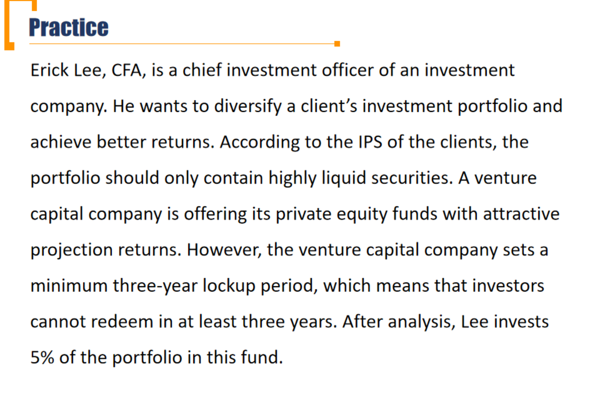

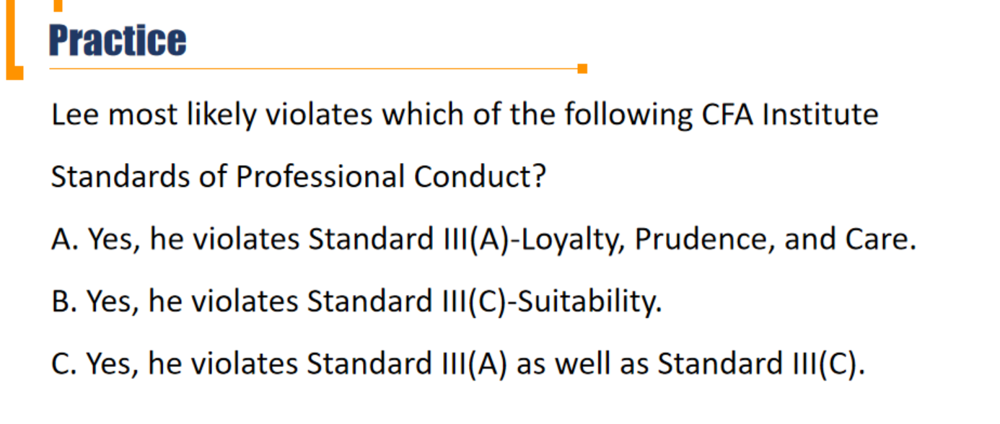

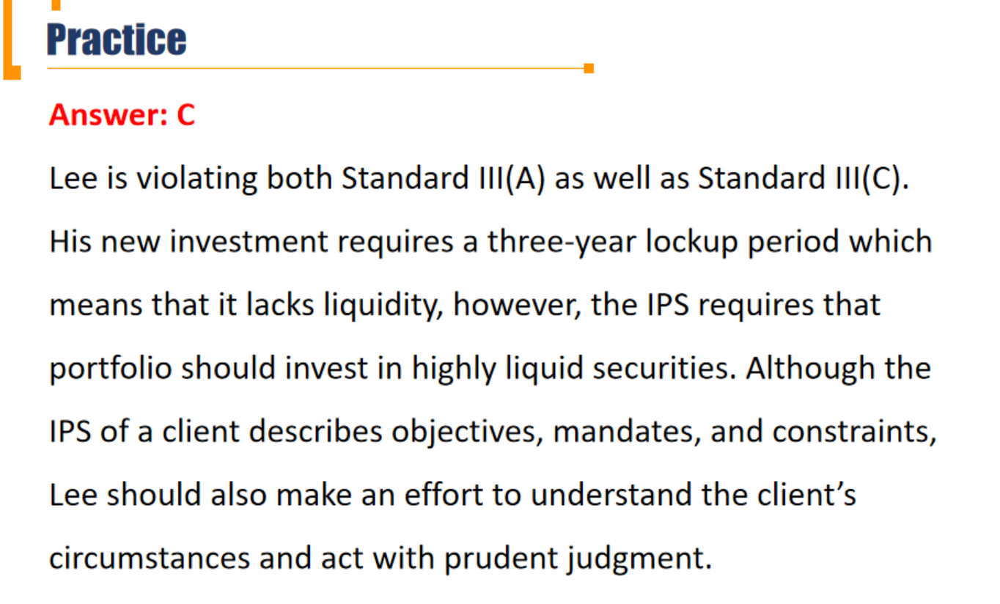

- only high liquidity，违反III(C)。由于III(A)是纲领性，所以也违反III（A）

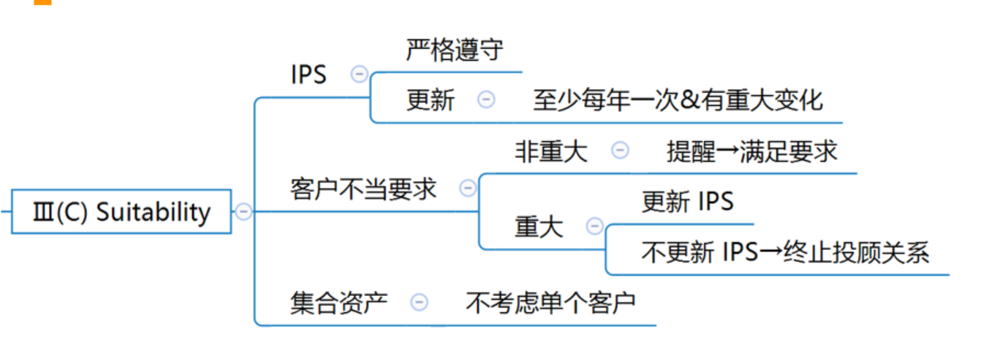

- mutual fund按照mandate投资，不考虑单个客户。

#### III(D) Performance Presentation 表现介绍

##### Content

- When communitcating investment performance information, members and candidates must make reasonable efforts to ensure that it is **fair**, **accurate**, and **complete**.
  - 沟通历史业绩的时候，做出应有努力，确保合理、完整、正确

##### Guidance

- Do not **misrepresent** past performance
- Provide complete performance information: no cherry-picking, including **liquidated/terminated** accounts.
- Do not state or imply that clients will obtain a return that was generated in the past.
- Do not make return **guarantee** on volatile investment.
  - 不可以做业绩承诺（除了T-bill， T-bond， CDs，定期存款）
  - 复习I(C) Misrepresentation，部分内容一致。
    - 只要违反III(D) 一定违反I(C).
    - 但是违反I(C)不一定违反III(D)

##### Recommendation

- Members and candidates should encourage their firms to comply with the **GIPS** standards. GIPS是首选。

- Compliance without applying GIPS standards
  - Consider audience sophistication（考虑客户复杂性） when presenting performance.
    - 比如商科背景客户可以适当写专业一点
  - Use performance of the weighted composite of similar portfolios.
  - Include terminated accounts as port of historical performance.
  - Make all disclosures and maintain records.

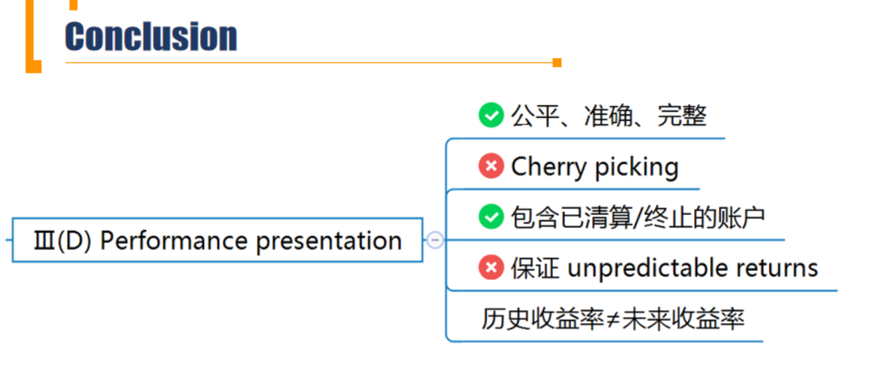

- III(D) -> I(C) Misrepresentation

#### III(E) Presevation of Confidentiality 保密 

##### Content \*\*\*

- Members and Candidates must keep information about **current, former, and prospective** clients confidential unless: 保护当前、以前、潜在的客户的秘密，除非
  - the information concerns(牵涉) illegal activities on the part of the client. 客户有违法
  - disclosure if required by law 法律要求
  - the client or prospective client permits disclosure of the information.客户允许

##### Guidance

- **Status of clients**
  - Must continue to maintain the confidentiality of client records even after the client relationship has ended
- **Compliance with laws** \*\*\*
  - If **applicable** law requires to maintain confidentiality, even if the information concerns illegal activities on the part of the client, members and candidates should not disclose a client's information.
    - e.g. 瑞士银行。 法律要求不能披露，就算有违法也不能披露。
- **Professional conduct investigated by CA Institute**
  - When permissible under applicable law, members and candidates shall consider the PCP(Professional Conduct Program) an extension of themselves when requested to provide information. 发现客户是CFA并且违法，鼓励向协会上报，但不强制。

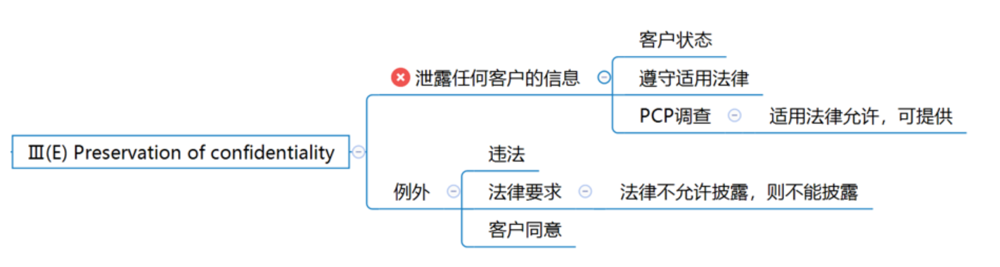

### Standard IV: Duties to Employers

- IV(A) Loyalty 纲领性细则（只要违反下面两条，就违反IV(A)）
- IV(B) Additional Compensation Arrangements
- IV(C) Responsibilities of Supervisors

#### IV(A) Loyalty

##### Content

- In matters related to their employment, Members and Candidates must **act for the benefit of their employer** and not deprive their employer of the advantage of their skills and abilities, divulge(泄漏) confidential information, or otherwise cause harm to their employer.
  - 不可以剥夺雇主占有雇员技能的权利

##### Guidance

分为：在职时、准备离职、离职后

- **Independent practice**独立实践（兼职）
  - "Undertaking independent practice" means engaging in **competitive business**, as opposed to making preparations to begin such practice.
    - 比如，基金经理去麦当劳打工兼职，不算independent practice，因为和雇主不存在竞争关系。
  - If planning to engage in independent practice, **notifying** employer the types of services provided, the duration of the sercives, and the compensation.
    - 如果打算参与independent practice,需要通知雇主，兼职时间、薪酬、服务类型。
  - Do not **proceed** without **consent** from employer.

- **Leaving an employer **\*\*\*

  - If planning to leave employer, act in the best interest of employer until the resignation is effective.
  - Employee is free to make preparations to leave as long as such preparations do not breach his duty of loyalty.
    - 离职准备期，也需要工作。可以用年假等个人时间（**own time**）进行下一份工作的准备
  - No prohibition on use of experience or knowledge gained at former employer.
    - 客户清单、工作记录不能带走（背下来也不可以），自己的工作经验可以带走。
  - No prohibition on engaging in competitive conduct unless a "**non-compete agreement**"(竞业禁止协议) was signed.
    - 签了竞业不能去竞争行业
  - The member or candidate must not take records or files to a new employer **without the written permission** of the previous employer.有书面同意可以带走
  - Members and candidates are **free to use public information** after departing to contract former clients without violating Standard IV(A) as long as there is no specific agreement not to do so.
    - 正式离职前，不可以招揽原客户
    - 正式离职后，可以招揽原客户
    - 但是需要公开渠道找到客户联系方式

  - Activities that might constitute a violation
    - Misappropriation of trade secrets
    - Misuse of confidential information
    - Solicitation(招徕) of the employer's clients prior to cessation(停止) of employment
    - Self-dealing假公济私
    - Misappropriation of clients lists, records or work performed on behalf of the firm.

- **Use of social media**

  - Firm-approved business related social media accounts would be considered the firm's assets, trasfer or delete the accounts upon resignation. 工作社交账号是公司资产。
  - Best practice is to maintain separate accounts for personal and professional social media activities.

- **Whistleblowing(揭发)**

  - Members and candidates **must** act contrary to employer's interests in order to comply with duties to the market and clients(e.g., when employer is engaged in illegal or unethical activity).
    - 维护利益顺序：**市场>客户**>雇主>个人
  - Such action is permitted only if the intent is aimed at protecting clients or integrity of the market, not for personal gain.
    - e.g. 梅林梅林揭发雇主

- **Nature of emplyment**

  - Members and candidates must determine whether they are employees or independent contractors(劳务派遣人员).
  - Duties within an independent contractor relationship are governed by terms of agreement.
    - terms of agreement是劳务派遣的合同。合同工只按照合同办事。
    - 注意，实习生也要遵守IV(A)

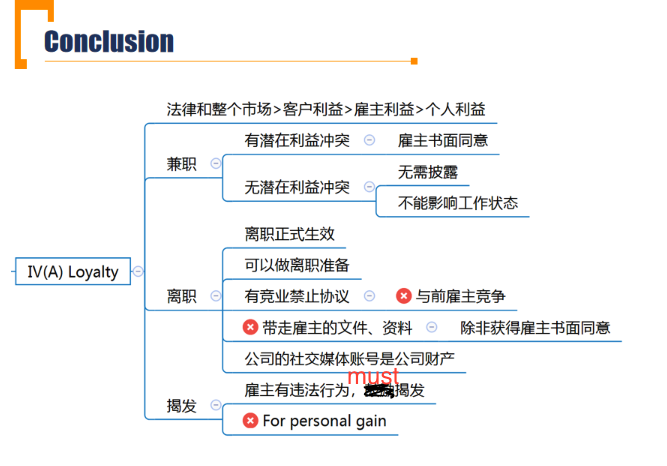

#### IV(B) Additional Compensation Arrangements 其他报酬安排

##### Content

- Members and Candidates **must not accept** gifts, benefits, compensation, or consideration that competes with or might reasonably be expected to create a conflict of interest with their employer's interest unless they obtain **written consent**(书面同意) from all parties involved. 

##### Guidance

- Compensation and benefits include direct compensatio by the client, and any indirect compensation or benefits received from third parties.
- "**Written consent**" includes any form of communication that can be documented(e.g. email)
- Employer is entitled to know all compensation or benefit arrangements to assess the motivations and true cost of the services(e.g., the nature of the compensation, amount, and duration of agreement) 
  - 和I(B) Independent and Objectivity和IV(A) Loyalty有关。
  - e.g. 在特殊情况下，无法汇报，事后向雇主说明原因及时报告也不违规。

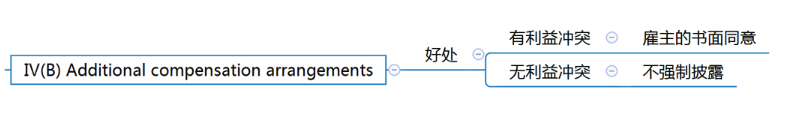

#### IV(C) Responsibilites of Supervisors 作为上司的责任

##### Content

- Members and Candidates must make reasonable efforts to ensure that anyone subject to their supervision or authority complies with applicable laws, rules, regulations, and the Code and Standards.

##### Guidance

- **System for supervision** 

  - 监管体系考虑的方面：预防、管理、从严
  - Establish **an effective** and **adequate** compliance system.
  - "Adequate" means meeting industry standards, regulatory requirements, the requirements of the Code and Standards, the circumstances of the firm.
  - Bring inadequate compliance system to the attention of senior management and recommend corrective action. 如果管理层发现合规系统不够充足（inadequate），需要上报并且提出改进意见。

  - Once compliance system is established, ensure the procedures are monitored and enforced.
  - If a compliance system is absent or inadequate, **decline in writing** to accept supervisory responsibility(or promotion) until the firm adupts reasonable procedures.
    - 合规流程做充足后才可以接受升职
  - When **delegating** supervisory duties to subordinates, instruct about methods to promote compliance. 委托他人履行监管责任时，需要指导被委托人监督方法。
  - Once a violation occurs, a supervisor should:
    - **respond promptly** to assess the extent of wrongdoing. 
    - conduct a thorough **investigation**. 
    - **place appropriate limitations** on the wrongdoer until investigation is complete. 
      - 限制被调查员工的行为
    - **increase the monitoring** to ensure violation will not be repeated. 加强监管，防止再发生。

  - Once a violation occurs, **inadequate actions**(不充分行为) include:
    - relying on employee's statement about the extent of the violation
    - relying on employee's assurances that the wrongdoing will not reoccur.
    - simply reporting the misconduct up the chain of command. 只向上汇报。
      - chain of command: 董事长->CEO->部门leader->...
    - simply warning the employee to cease the activity. 

- **Supervision includes detection**

  - If the supervisor makes a reasonable effort to detect violations, but fails to detect a violation that occurs, she is in compliance with the standard.
  - If no effort is made to dtect and prevent violations, the supervisor is in violation of the standard even if no violations by her subordinates have occurred.

  - supervision注重过程，不重结果：
    - 就算下属有人违规，但是supervisor尽力了，那么supervisor没有违规
    - 即使下属没有人违规，但是supervisor没有履行监督义务，那么supervisor也有违规。

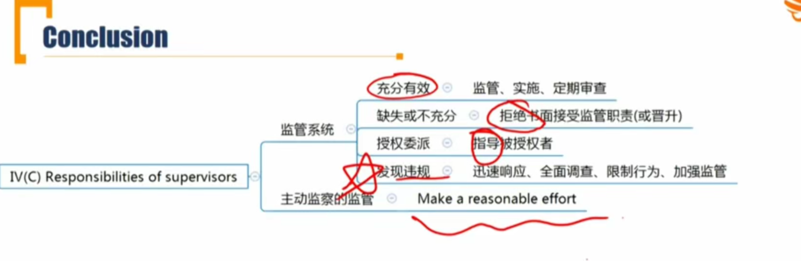

### Standard V：Investment analysis, recommendations, and actions

V(A): Diligence and Reasonable basis

V(B): Communication with clients and prospective clients

V(C): Record Retention

#### V(A) Diligence and Reasonable basis 有理有据

##### Content

- Members and Candidates must:
  - exercise diligence, independence, and thoroughness(彻底) in analyzing investments, making investment recommendations, and taking investment actions.
  - have a reasonable and adequate basis, supported by appropriate research and investigation, for any investment analysis, recommendation, or action.

##### Guidance

- **Defining diligence and reasonable basis**  有理有据的影响因素
  - The nature of diligence and level of research **rely on:** 
    - the investment philosophy 投资哲学
      - 基本面分析的依据就是公司的基本状况、EPS、FCFE等指标
      - 技术面分析的依据就是历史的price and volume
    - the product or service being offered
      - 指数基金依据是指数走势
      - 主动投资基金依据是投资的选股依据，比如在医药板块，军工板块等。
    - the role of the member and candidate in the investment decision-making process.
      - 基金经理的责任：选股
      - 交易员的责任：择时
    - the support and resources provided by employer
      - 比如收集数据需要费用，具体收集的数据的质量一定程度上取决于雇主提供的资源。

- **Using secondary and third-party research**
  - **Secondary research** is research conducted by colleagues. 第二方，同事的。
  - **Third-party research** is research conducted by entities outside the firm(brokerage firm, research firm, etc)第三方，其他公司的。
  - Members and candidates must make diligent efforts to determine the source and soundness of the research. 需要验证来源合理性、严谨性。
  - Criteria in determining soundness include:
    - assumptions, rigor of the analysis, timeliness of the research, evaluation of objectivity, and independence. 
    - 需要验证假设、严谨性、数据的时间、独立和客观性。
  - Members and candidates **may rely on others** in the firm to determine the soundness of secondary and third-party research, unless having reason to question its validity.
    - 可以让其他同事验证
  - Members and candidates should verify that firm has a **policy** about the timely and consistent review of approved research providers.
    - 需要根据policy来验证数据

- **Using quantitatively oriented research** 使用量化模型投资时，如何做到有理有据

  - Members and candidates need to understand **parameters** used in models and quantitative research
    - 参数
  - They **are not required to become experts** in every technical aspect of model, but they must understand **assumptions** and **limitations** of the model and how the results were used in the decision-making process.
    - 不需要称为专家，但必须知道模型参数的条件，以及局限性。
  - Members and candidates should make reasonable efforts **to test the ouput** of investment models and other preprogramed analytical tools they use.
    - 需要回测，测试
  - They should ensure that their analyses incorporate a **broad range of assumptions** sufficient to capture the underlying characteristics of investments
    - 需要在不同时间段，不同条件下（assumptions）测试模型。

- **Developing quantitatively oriented techniques** 量化模型的开发者，如何做到有理有据

  - Members and candidates who create quantitative models must show a **higher level of diligence** in reviewing new products.
    - 需要更加尽职尽责
  - They **must understand technical aspects** of the products. A thorough testing of model and resulting analysis should be completed before product distribution.
    - 需要了解技术上
  - Members and candidates need to consider the **source** and **time** horizon of the data used in models. 需要了解数据的来源和时间段。
  - members and candidates may need to test the models by using volatility and performance expectations that represent **scenarios outside** the observable databases.
    - 开发时需要考虑各种情景

  - They need to pay particular attention to the <u>assumptions</u> and <u>rigor</u> of the analysis to ensure that the model incorporates **a wide range of possible input expectations**, including negative market events.
    - 考虑到数据源的多方面

- **Selecting external advisors and sub-advisors** 选择外部基金经理时

  - Members and candidates must review external advisors as diligently as reviewing individual funds and securities.
  - Criteria for reviewing external advisor include its:
    - established code of ethics 符合准则
    - compliance and internal control procedures. 合规
    - quality of the published return information 过去业绩表现高质量、公允
    - investment process and adherence to its stated strategy 了解投资策略

- **Group research and decision making** 小组工作时，如何做到有理有据
  - The conclusion represent the consensus of the group. 结论代表一致意见
  - When **disagreeing** with the view of group, members and candidates need not decline to be identified with the report, provided that the group's opinion has a reasonable and adequate basis and is independent and objective. \*\*\*
    - 意见不一致时，不需要在报告中除名。（只要有理有据）复习，I(A)Dissociate, 如果出现违规，需要除名。
    - dissociate，划清界限

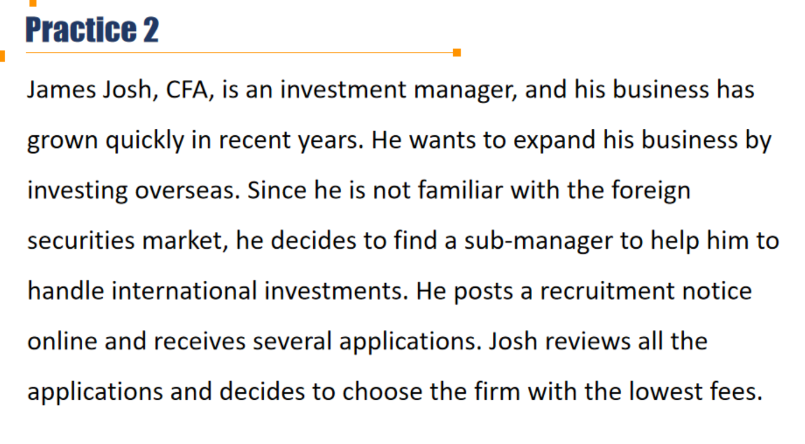

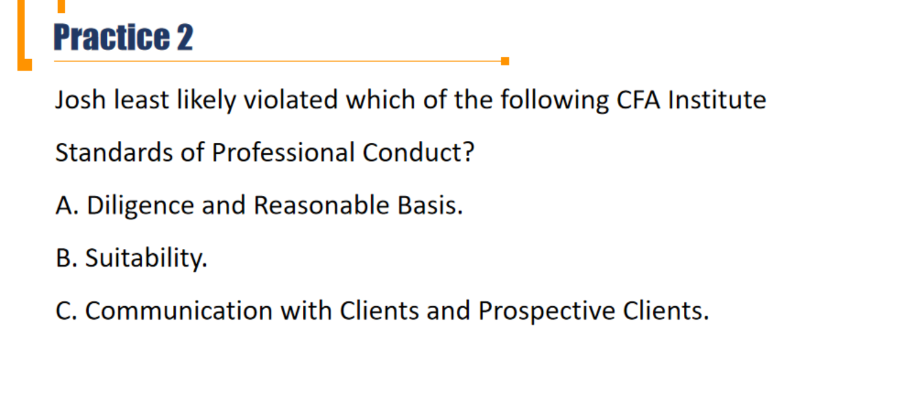

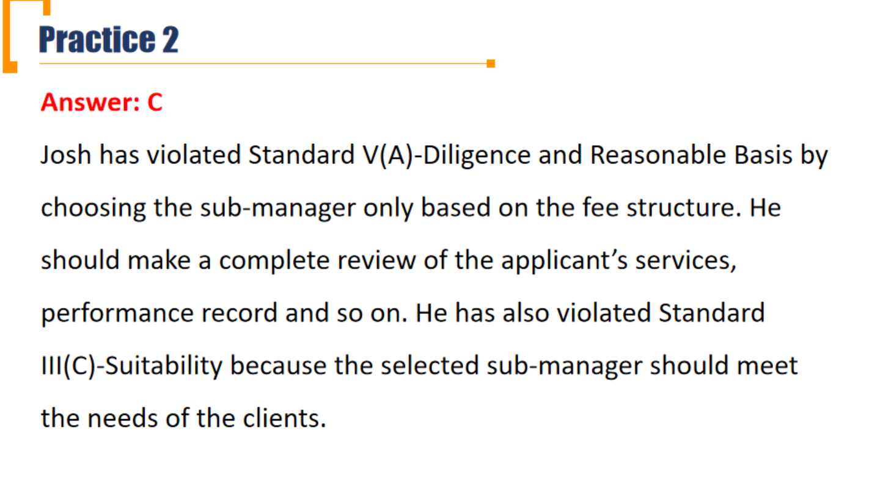

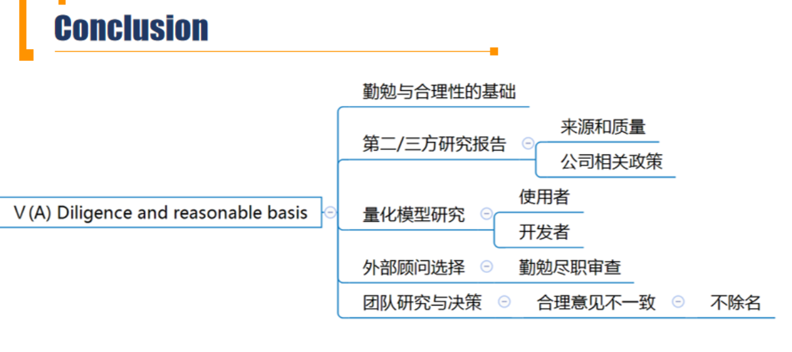

- 只要合作的报告有理有据，意见不一致也不需要除名。

#### V(B) Communication with clients and prospective clients 与客户以及潜在客户的沟通

##### Content

- **Members and Candidates must**:
  - Disclose to clients and prospective clients **the basic format and general principles** of the investment processes they use to analyze investments, select securities, and construct portfolios and must **promptly** disclose any changes that might materially affect those processes.
    - 沟通基本格式和原则，有变化及时通知
  - disclose to clients and prospective clients **significant limitations and risks** associated with the investment process.
    - 风险和限制进行如实陈述。
  - use reasonable judgement in identifying which <u>factors are important</u> to their investment analyses, recommendations, or actions and include those factors in communications with clients and prospective clients.
    - 用自己合理的判断识别关键因素，并且和客户沟通
  - distinguish between **fact and opinion** in the presentation of investment analyses and recommendations.
    - 事实和观点不能混淆

##### Guidance

- **Informing clients of the investment process 需要沟通什么内容**

  - Address factors that have positive and negative influences on recommendations, include significant risks and limitations of investment process.
  - Keep clients informed **promptly** about changes to the investment process, especially newly identified significant risks and limitations. 立即沟通

  - Disclose the basic characteristics of an investment.
    - 沟通基本特征，比如benchmark

- **Different forms of communication** 沟通方式

  - Forms of communication include:
    - in-person description, telephone conversation, media broadcast, internet, etc.
    - Treat all clients fairly when communicating with clients.
      - 注意，III(B) Fair dealing相关
    - If information is communicated in **capsule form**(简要的表达形式e.g., a recommended stock list), notify clients that additional information and analyses are available.

- **Identifying risks and limitations** 沟通清楚风险和限制
  - Types of risk that may be disclosed include:
    - leverage risk, market-related risks, country risk, industry risk, security-specific risk, credit risk, etc.
  - Limiting factors of investment include
    - liquidity（比如基金有锁定期等）, capacity（策略的资金容量，基金的投资金额有上限，太多资金策略不支持）, etc.
  - No disclosure of risks or limitations unknown at the time recommendations are made may not breach Standard V(B), but may violate Standard V(A) Diligence and Reasonable basis. (ex ante basis)

- **Report presentation** 呈现研究报告
  - Include those elements important to the analyses and conclusions of the report.
  - A research report may emphasize certain areas, touch briefly on others, and omit certain aspects deemed unimportant.
    - 重要的多讲，简单讲不太重要的，忽略完全不重要的。
- **Distinction between facts and opinions** \*\*\*
  - Violations often occur when reports fail to separate the past from the future **by not indicating ** that earnings estimates, changes in the outlook for dividends, or future market price information are opinions subject to future circumstances.
    - 比如opinion应该说”will be estimate“
  - Recommendations and conclusions of report are opinions

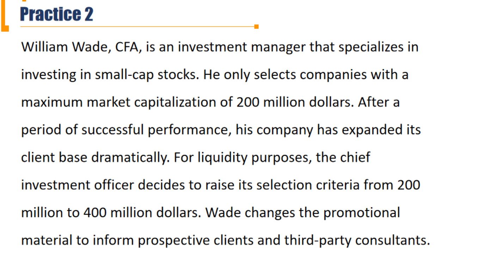

- 挖坑：只通知了潜在客户和第三方顾问

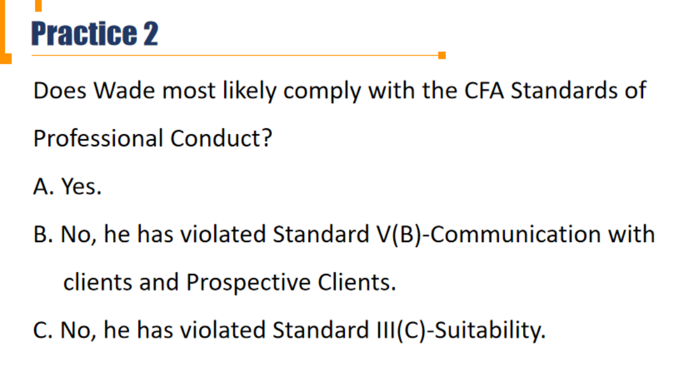

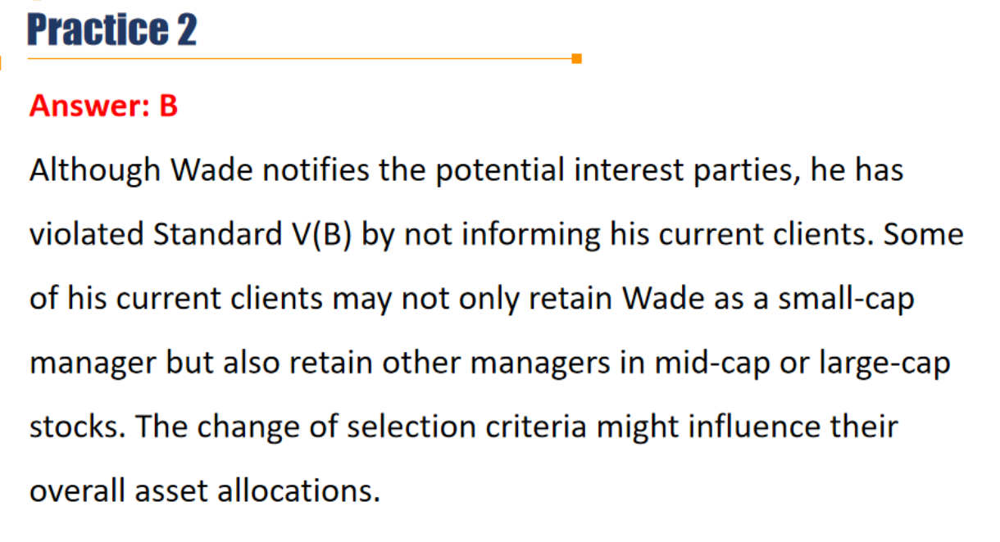

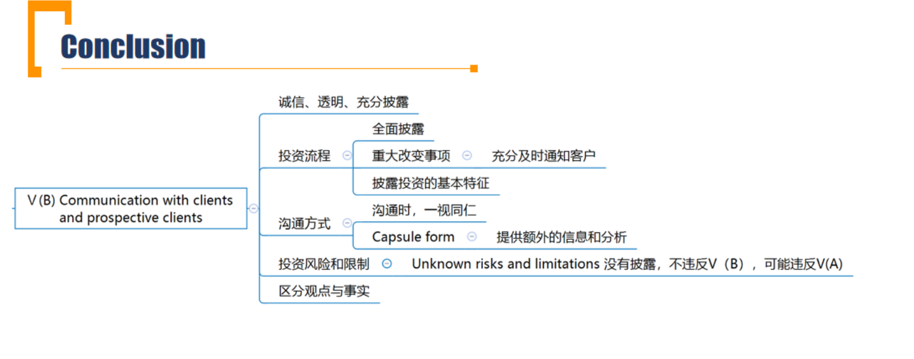

- 记得区分fact != opinion

#### V(C) Record Retention 保留记录

##### Content

- Members and Candidates must develop and maintain appropriate records to support their investment analyses, recommendations, actions, and other investment related communications with clients and prospective clients.

##### Guidance

- Records may be maintained either in hard copy or electronic form.
- Examples of supporting documents include:
  - personal notes from meetings with covered company
  - computer-based model outputs and analyses
  - notes from clients' meetings to review IPS
  - outside research reports 引用的外部研究报告
- **If no regulatory requirement**, CFA Institute recommends maintaining records **at least 7 years.**
  - 如果法律规定5年，第6年销毁，不算违规。

- **Records are property of employer**
  - 和IV(A) Loyalty对雇主的忠诚相关
  - When leaving employer, **cannot take** the records without employer's consent
  - **Cannot use** historical recommendations or reports created at former employer when supporting documentation is unavailable.
  - **Must re-create** supporting records with information gathered through public sources or covered company, not from memory or sources obtained from former employer.

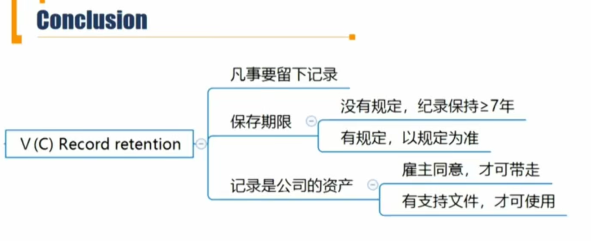

### Standard(VI) Conflicts of Interest

- VI(A) Disclosure of Conflicts
- VI(B) Priority of Transactions
- VI(C) Referral Fees

#### VI(A) Disclosure of Conflicts 冲突披露

##### Content

- Members and Candidates must make **full and fair** disclosure of all matters that could reasonably be expected to impair their independence and objectivity or interfere with respective duties to their clients, prospective clients, and employer.
- Members and Candidates must  ensure that such disclosures are prominent(显著的), are delivered in plain language, and communicate the relevant information effectively.

##### Guidance

- **Disclosure of conflicts to clients**
  - Relationship between an issuer(推荐的股票对应的上市公司) and the member/candidate
    - Board service(推荐股票的member/candidate是董事会成员
    - Consulting service（推荐人为公司提供了咨询服务）
    - **Beneficial ownership of stock**（推荐人持有了该股票）
  - Relationship between an issuer and the member/candidate's firm
    - Investment banking relationship 	推荐人所属的公司正在进行投行业务
      - 复习：I(B) independence & objectivity，投行和分析师之间的冲突
    - broker/dealer market-making activities 做市业务，有可能是为了提高股票流动性而推荐
  
  - Fee or compensation arrangements that would conflict with clients' interest
    - referral fee 推荐费（VI(C)）
    - incentive fees 激励费
    - rebates 返点，折扣 
    - bonuses based on short term performance
  
- **Disclosure of conflicts to employers**
  - Circumstances that generate conflicts with clients should be disclosed to employer as well.
  - Any potential confict situation that could prevent clear judgment about or full commitment to the execution of a member's or candidate's duties to the employer.
    - 关联：IV(A) Loyalty, Independent practice; IV(B) Additional compensation agreement
    - 利益冲突需要向雇主披露
- **Cross-departmental conflicts部门间冲突**
  - A **sell-side analyst** working for a broker/dealer may be encouraged to write favorable reports.
    - 买方分析师会受到投行IBD的压力，被鼓励只出具正面报告。关联: I(B) Independent and Objectivity.
  - The **buy-side analyst** is likely to be faced with similar conflicts as banks exercise their underwriting and security-dealing powers.
  - The marketing division(销售部门) may ask an analyst to recommend the stock of a certain company in order to obtain business.
- **Conflicts with stock ownership**
  - Most prevalent（最重要的冲突） conflict requiring disclosure is a member's or candidate's **ownership of stock** in companies that he or she recommends to clients or that clients hold.
  - The easiest method for preventing a conflict is to prohibit members and candidates from owning any such securities, but this approach is **overly burdensome**（过度严格）.
  - Conflicts arising from personal investing are discussed more fully in the guidance for Standard VI(B)

- **Conflicts as a director** 董事会成员
  - Serve as a director poses three basic conflicts of interests:
    - duties owed to clients vs. duties owed to shareholders
    - may receive securities as compensation for serving on the board.
    - opportunity to receive material nonpublic information involving the company.

##### Recommendation

- If firm does not permit diclosure, consider disscociating from the activity
- Firms are encouraged to include compensation information in promotional materials.

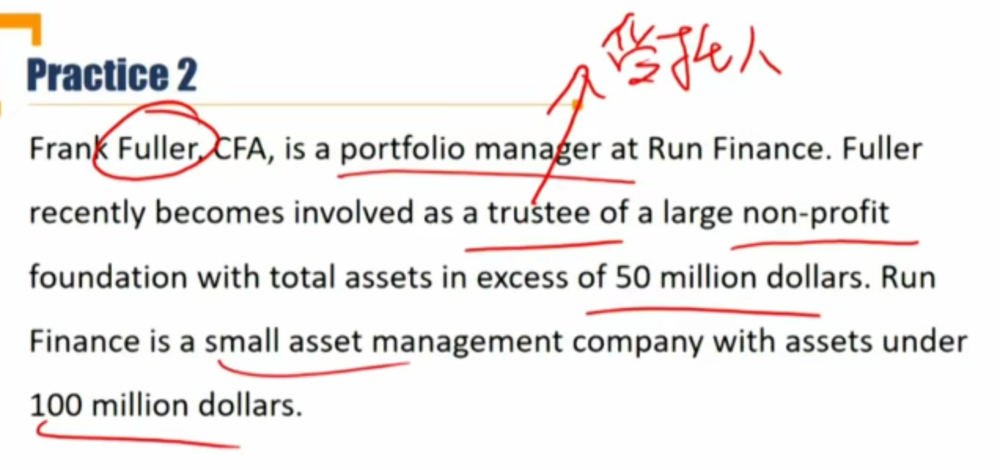

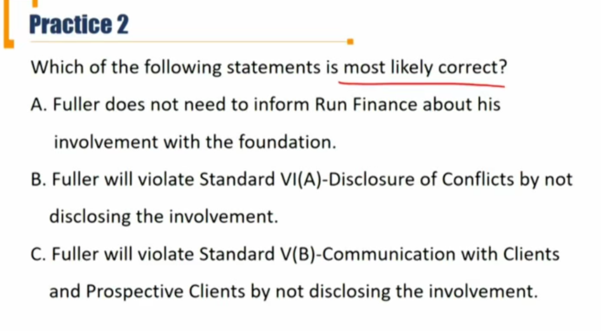

- NGO，存在利益冲突，需要向雇主披露. 答案：B

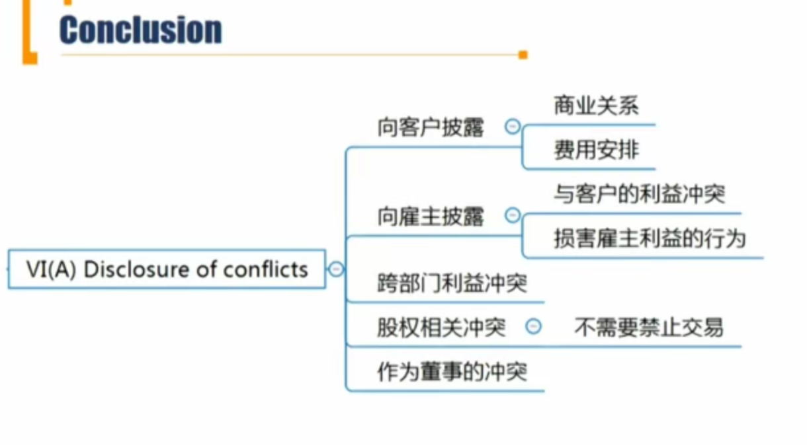

- 只要披露，就不违反IV(A)

#### VI(B) Priority of Transaction 交易优先权

##### Content

- Investment transactions for clients and employers must have priority over investment transactions in which a Member or Candidate is the beneficial owner.
  - 交易顺序：客户>雇主>个人

##### Guidance

- **Avoiding potential conflicts**

  - Investment managers can make money from personal invetments as longs as:

    - client is not disadvantage by the trade
    - professionals does not benefit personally from trades undertaken for clients.
    - professional complies with regulatory requirements

    - The same three criteria should be applied in the transaction when enter a personal transaciton that runs counter to current recommendations. (transaction方向和推荐方向相反时，也要满足上面三个条件) \*\*\* (counter to 相反)

- **personal trading secondary to trading for clients**
  - Prevent personal transactions from adversely affecting the interests of clients or employers.
- **Standards for nonpublic information**
  - Members and candidates are prohibited from conveying nonpublic information to any person whose relationship to the member or candidate makes the member or candidate a beneficial owner of the person's securites.
  - 把重大非公开信息给亲属投资，违反II(A) + VI(B)
- **Impact on all accounts with beneficial ownership**  个人账户定义
  - Personal transactions include those made for the member's or candidate's own account, for family(including spouse, children) accounts, and for accounts in which the member or candidate has a direct or indirect pecuniary(金钱的) interest, such as a trust or retirement account.

##### Recommendation

- The firm's compliance procedures
  - Limited participation in equity IPOs. 不参与新股认购（III(B)也涉及）
  - Restrictions on private placements. 限制非公开发行认购
  - Establishing blackout/restricted periods. 限制期内不能购买、出售股票
  - Reporting requirements include:
    - disclosure of holdings in which the employee has a beneficial interest
    - providing duplicate confirmations of transactions（双重监督，交易前汇报上级、合规部门）
    - preclearance procedures.交易前的事先汇报

(pro rata按比例分配)答案A

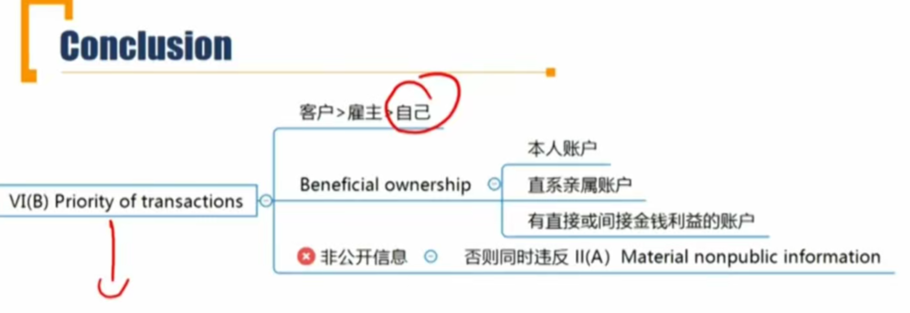

- VI(B) 和III(B) Fair dealing有关联
- 个人交易允许的前提：合法合规、不损害客户利益

#### VI(C) Referral Fees 推荐费

##### Content

- Members and Candidates must disclose to their employer, clients, and prospective clients, as appropriate, any compensation, consideration, or benefit received from or paid to others for the recommendation of products or services.

##### Guidance

- Disclosure allows clients and employers to evaluate full cost of service and any potential biases.**事先披露、全面披露**
  - 比如银行代销基金产品过程，客户需要了解推荐费，以衡量基金的真实成本。

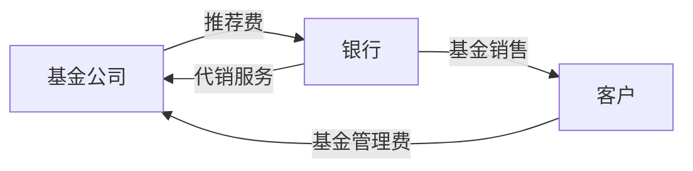
```mermaid
graph LR
A[基金公司]--推荐费-->B[银行]
B--代销服务-->A
B--基金销售-->C[客户]
C--基金管理费-->A

```

- Disclosure is to be made **prior** to entering into any formal agreement for services
  - 签约之前就要披露，事先披露
- Disclose the nature of the consideration or benefit(e.g., flat fee or percentage basis, one-time or continuing benefit, benefit in the form of provision of service or other noncash benefit and its estimated money value) 全面披露推荐费形式：固定费用，百分比，一次性/持续性，其他形式的奖励。

- 最好是书面形式

- 下面这道题的业务模式：

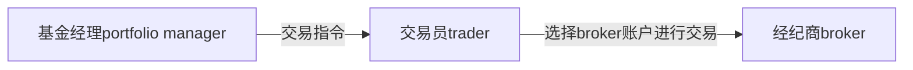
```mermaid
graph LR
A[基金经理portfolio manager]--交易指令-->B[交易员trader]
B--选择broker账户进行交易-->C[经纪商broker]
```

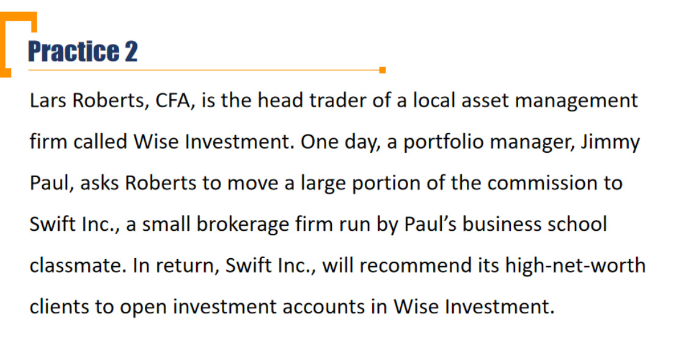

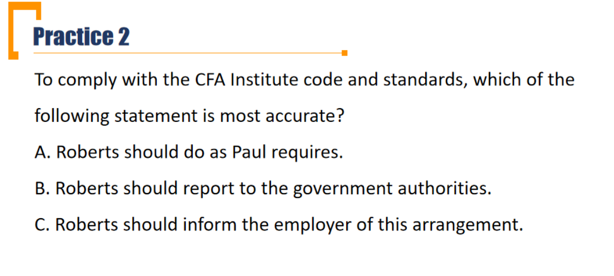

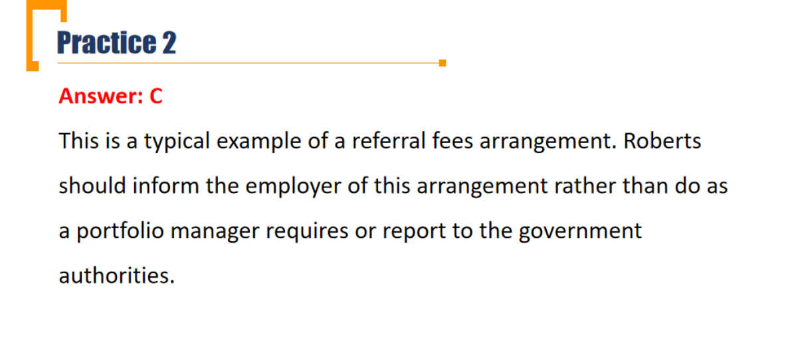

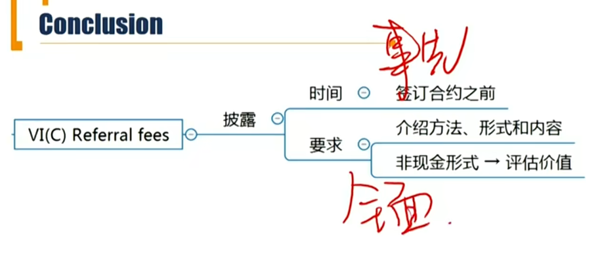

### Standard VII Responsibilities as a CFA Institute Member or CFA Candidates

- VII(A) Conduct as Participants in CFA Institute Programs
- VII(B) Reference to CFA Institute, the CFA Designation, and the CFA Program.

#### VII(A) Conduct as Participants in CFA Institute Programs

##### Content

- Members and Candidates must not engage in any conduct(行为) that compromises the reputation or integrity of CFA Institute or the CFA designation or the integrity, validity, or security of CFA Institute programs.

##### Guidance

- **Confidential Program Information** 机密的信息
  - CFA Institute program rules, regulations, and policies prohibit candidates from disclosing confidential material gained during the exam process. 考题不可以泄露
  - All aspects of the exam, including questions, broad topical areas, and formulas, tested or not tested, are considered confidential.
    - 话题、公式都需要保密
  - CFA Institute actively polices blogs, forums, and related social networking groups for confidential information.
- **Additional CFA Program restrictions**
  - Violating any of the testing policies, such as the calculator policy, personal belongings policy, or the Candidate Pledge, constitutes a violation of Standard VII(A)
  - Examples of information that **cannot be shared** by members involved in developing, administering, or grading the exams include but are not limited to :
    - questions appearing on the exam or under consideration
      - 出卷人
    - deliberation related to the exam process
      - 考试中的细节安排，监考
    - information related to the scoring of questions
      - 改卷

- **Expressing an opinion**
  - Standard VII(A) does not cover expressing opinions regarding CFA Institute, the CFA Program, or other CFA Institute programs
  - When expressing a personal opinion, a candidate is prohibited from disclosing content-specific information, including any actual exam question and the information as to subject matter covered or not covered in the exam.
  - 可以吐槽，但是不能透露机密信息

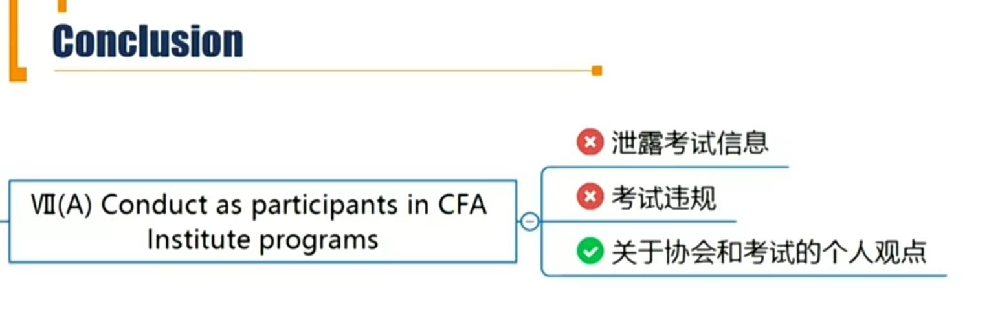

#### VII(B) Reference to CFA Institute, Designation, and Program

##### Content

- When referring to CFA Institute, CFA Institute membership, the CFA designation(名衔), or candidacy in the CFA Program, Members and Candidates **must not misrepresent or exaggerate** the meaning or implications of membership in CFA Institute, holding the CFA designation, or candidacy in the CFA Program.
  - 不可以曲解和夸大CFA称号

##### Guidance

- **CFA Institute membership** CFA会员
  - To maintain status of member
    - Complete and remit PCS(Personal Conduct Statement个人行为陈述表) annually.
    - Pay membership dues annually.
  - Failure to comply with the requirements above results in an inactive member status.

- **Using the CFA designation** CFA持证人
  - To earn the right to use the CFA designation
    - Completion of the CFA Program （通过三级考试）
    - Required years of acceptable work experience
      - 3年4000小时相关工作经理
    - Must satisfy CFA Institute membership requirements to maintain the right to use the designation
      - CFA会员交钱、PCS
  - Do not misrepresent or exaggerate the meaning or implications of holding the CFA designation
  - Must not use a pseudonym(假名、笔名) to hide identify.

- **Referring to candidacy in the CFA program **CFA 考生
  - A person is a candidate in the CFA program if:
    - application for registration in the CFA Program has been accepted by CFA Institute.
    - the person has sat for the exam but exam results have not yet been received
  - Do not imply achievement of any type of partial designation.
    - 不可以说CFA level one，可以说pass CFA level 1 exam.
  - Okay to say "passed all levels on first attempt"

- 通过CFA考试、持证，不能代表你是精英、也不能代表你投资能获得高回报。

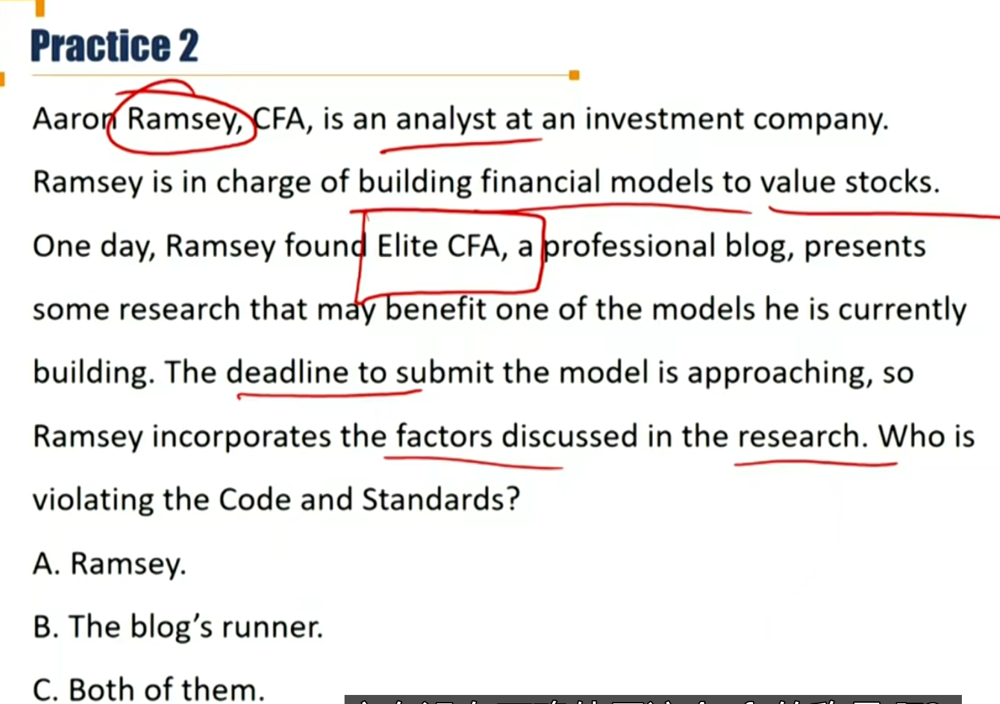

答案C. 

- incorporate: 合并。Ramsey违反了V(A) diligence and reasonable basis

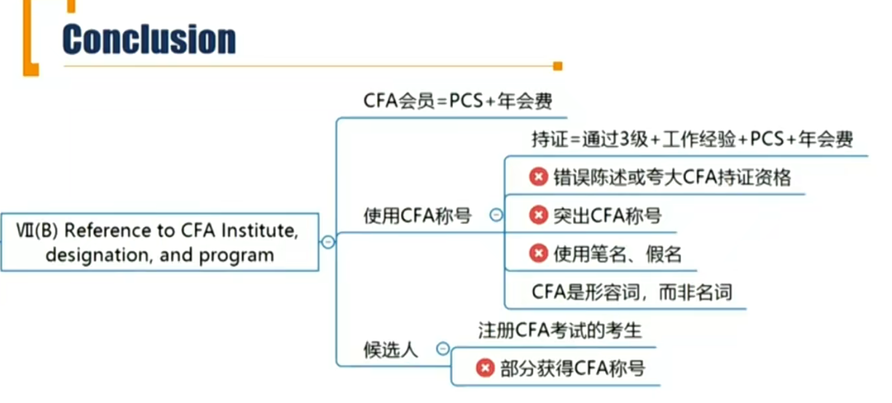

