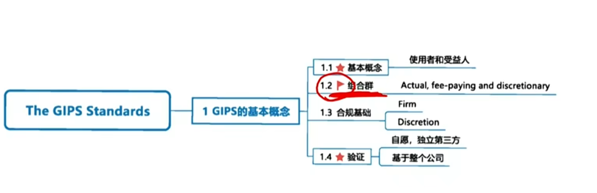

# M4 Introduction to GIPS (Global Investment Performance Standard全球投资业绩标准)

- Why were the GIPS Standards created
- Parties affected by GIPS
- Definition of firms
- Composites组合群
- Verification

#### Introduction to GIPS

##### Introduction 

就是资产管理公司披露自己业绩的一套规则

- Misleading practices of performance presentation 披露中存在的三个问题
  - Representative accounts  代表性账户，隐藏业绩差的账户
  - Survivorship bias 幸存者偏差，把亏损账户清盘，展示不全面
  - Varying time periods 业绩时间段不一样
- Why the GIPS standards were created?
  - GIPS aim to **avoid misrepresentation**（误导性陈述） of performance of investment firms and to give clients relevant information to evaluate past performance.

##### Parties affected by GIPS

- Firms
  - The GIPS apply to **any firm that actually manages assets and asset owners **
- Asset managers and their prospective clients, asset owners and their oversight bodies
  - Complete and fair record, strengthened firm's internal controls 内控
  - Enhancing credibility 可信度
  - Information to oversight bodies 

##### Composites 组合群 \*\*\*

- An aggregation of one or more portfolios managed according to a **similar investment mandate, objective, or strategy.** 相似的策略放在一个群，进行业绩展示。
  - Prevent from **cherry-picking**
  - Must include all **actual, fee-paying, discretionary** portfolios managed in accordance with the same investment mandate, objective, or strategy.
    - 三个条件进群：真实账户、收管理费的基金、自主决定权
    - 另外有相似的投资策略
  - Groupings must be done according to **pre-identified criteria.**
    - 事先确定组合群

##### Fundamental of compliance

- Definition of firm
  - The scope should include all geographical (country, regional, etc.) offices operating under the same brand name, regardless of the actual name of the individual company.

##### Verification \*\*\*

- Firms that claim compliance with the GIPS **self-regulate**自律 their claim of compliance.
- Firms **may voluntarily** hire **an independent third party** to verify its claim of GIPS compliance. 自愿验证。
- Verification is performed on **entire firm**, not specific composites. 要么就全部都要验证，全部都要GIPS；要么就不用GIPS

