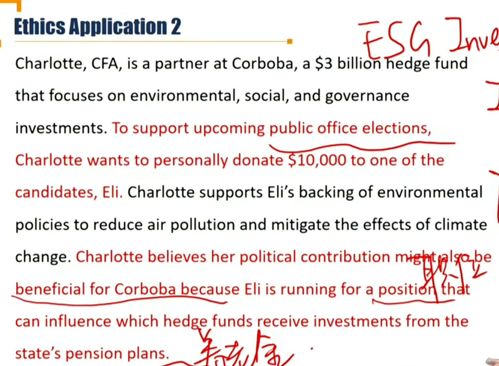
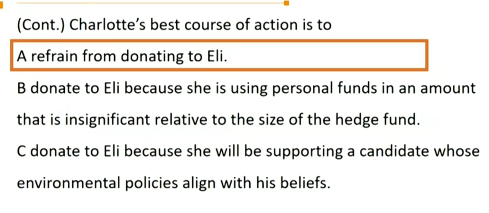
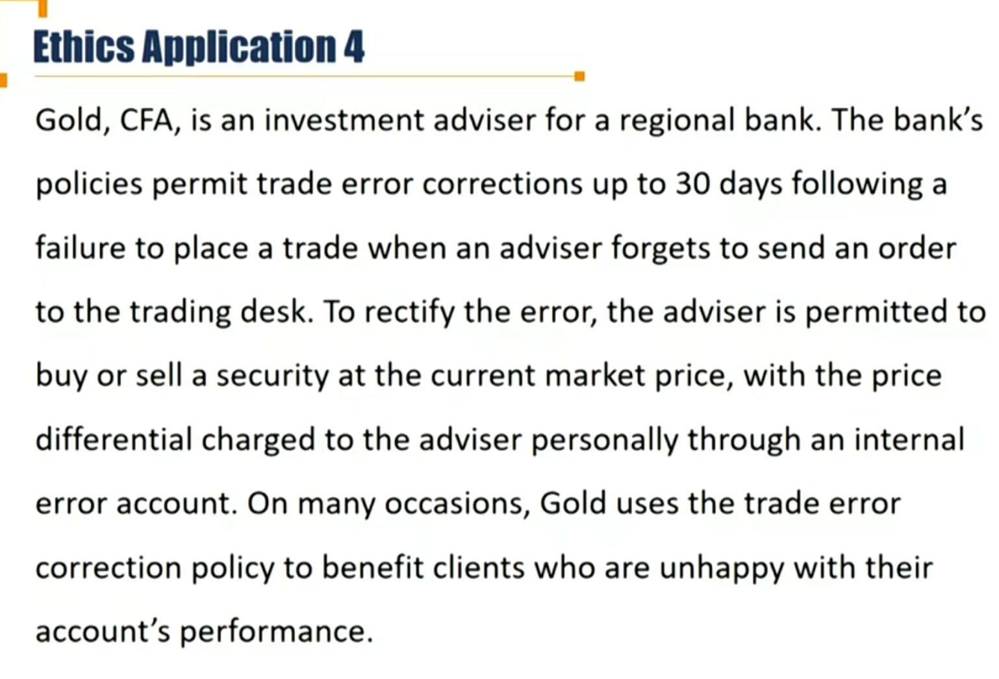
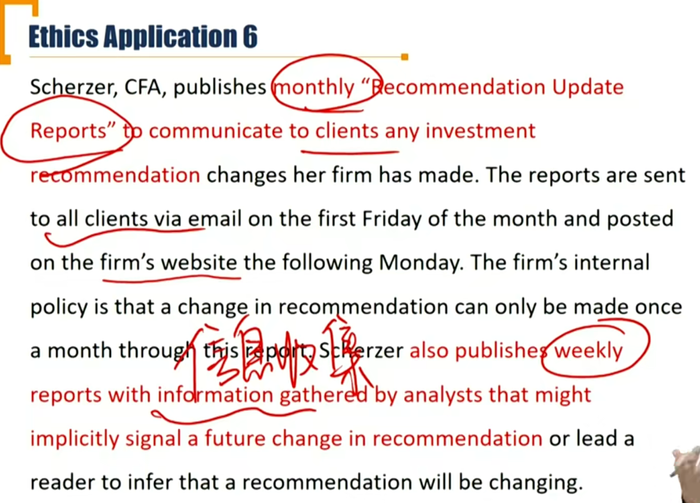
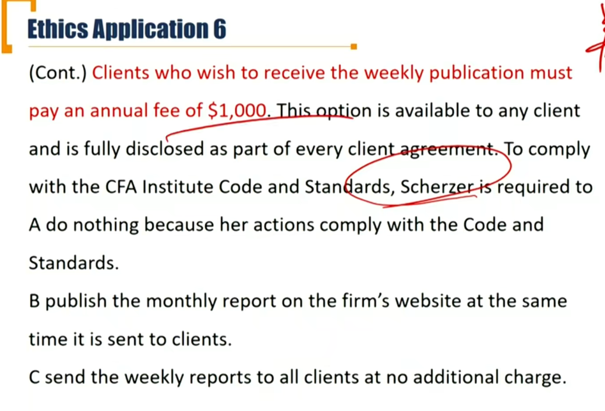

# M5 Ethics Applications

- Evaluate practices, polices, and conduct relative to the CFA Code and Standards
- Explain how the practices, policies, and conduct do or do not violate the CFA Code and Standards

#### Application 2

pay-to-play 政治献金

#### Application 4

- with the price differential charged to the adviser personally through an internal error account. 比如月初advisor想下单但是忘了，月底的时候，股票已经涨了。然后可以用月初的价格确认成本价，其中的差价损失记在advisor的个人账户上。

- I(D) Misconduct

#### Application 6

- 差异化服务：1）公开、2）不损害客户利益；就是符合规定。

- 答案：A

#### Application 10

- IV(C) Responsibility of supervisor, 当合规制度不完善的时候decline to accept.
- 一家公司的基金经理被提拔为CCO，提拔后空有头衔，所有事情都听原来CCO的。违反了这条准则。

#### Application 12

- Referal Fee 需要披露

- imminent即将发生的

- Inaction视为共同参与