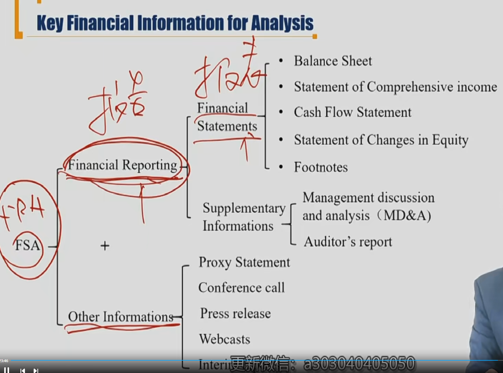
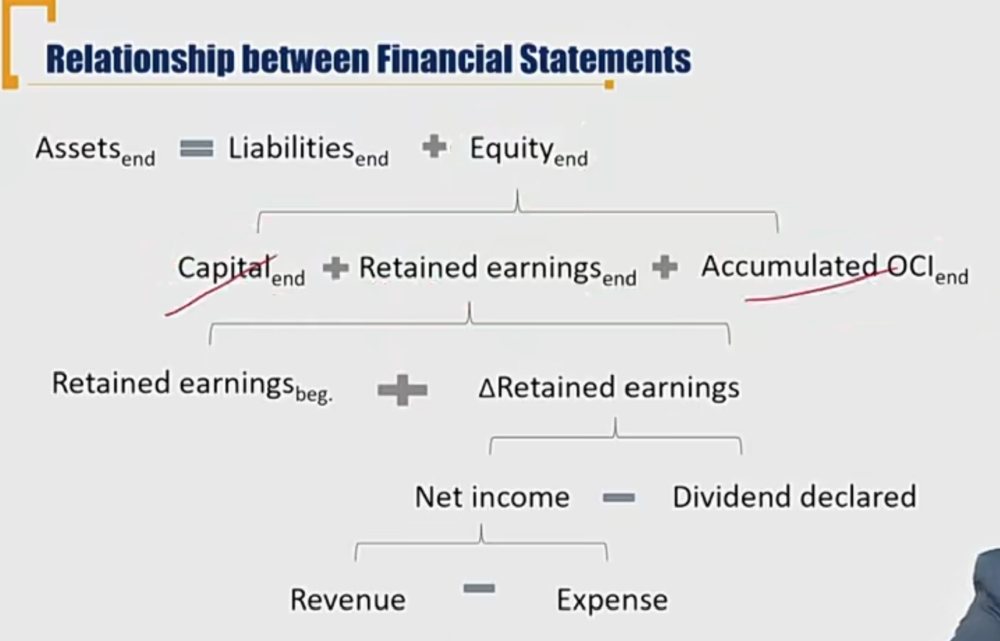
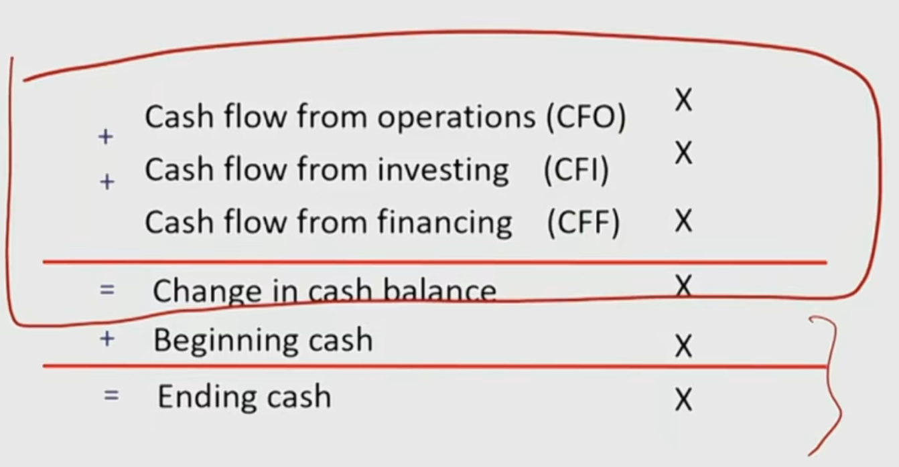

# V3-M1 Introduction

### 1) The roles of financial reporting analysis

- 财务报表是**该企业**提供的，反应企业一定时期资金、利润状况的**会计报表**。
- 财务报表分析是分析师出具的，对企业财务报表所提供的数据进行**分析、比较、评价和预测**。
- 财务报表只披露**历史**财务数据和信息，无法完全作为报表使用者做出经济决策判断的依据

#### Definition of Financial report

- The way companies provide information to wide range of users, such as investors, creditors, and other interested parties about: 投资者，股东，债权人，管理层等**外部和内部**人员都会使用财务报表
  - **financial position** 时间点的状况
  - **financial performance** 时间段上的表现
  - changes in financial position of an entity(主体，指的是公司，也就是通过财务状况的变化，推断时间段内的变化)
- The role of financial reporting analysis
  - Use financial **reports** and **other information**（不一定所有信息都在财报内） to evaluate company's performance and financial position for the purpose of **making economic decisions.**（看财报的目的是经济决策）

#### FSA的框架（重要）

- 补充信息属于财务报告
- 审计报告属于补充信息属于财务报告（不是财务报表）
- 审计报告神对财务报表（Financial Statements）发表意见
- 财务报表：四表一附注（B/S, I/S, CF/S, statement of changes in equity, footnotes），注意Footnotes属于财务报表

### 2) Financial Reports and Other sources of Information

#### Balance sheet

- presents a company's current financial **position**(表明是时间点) by disclosing the resources the company controls (Assets) and its obligations to lenders or other creditors(liabilities) **at a specific point of time**.

- Elements on Balance sheet:
  - **Assets** are the resources controlled by the firm.
    - Economic resources which owned by a business and future economic benefit expected to flow to the entity.
  - **Liabilities** are amounts owed to lenders and other creditors.
    - Obligations of the entity to lender and other creditors.
  - **Owner's equity** is the residual interest in the net assets of an entity that remains after deducting its liabilities.

著名资产负债表的**会计恒等式**：

- **Asset = Liabilities + Owners' Equity**
- A = L + E, E = A - L

确认资产的三个充要条件：

- 为企业拥有，控制
- 为企业将来带来经济收益
- 可靠计量

#### Income Statement 损益表

- Also known as profit and loss(P&L) statement
- presents information on the financial results of a company's business activities **over a period of time**.时间段概念
- Net Income is known as the **bottom line**. 净利润是底线。

Income - Expenses = Net Income

- Income = Revenue（收入） + Other Income + Gain（利得）
  - Revenue: The amount charged for the goods delivered or service rendered in the ordinary activities of business。业务上的利润。Revenue是主营业务收入，other income是其他业务收入。
  - Revenue = Sales = Sales Revenue
  - Gain和业务不直接相关
- Expenses = Expenses from ordinary activities of business + Other Expense + Loss（损失）
  - Expenses: the outflows and depletion of assets, or incurrence of liabilities in the course of business activities.费用和业务相关
  - Loss和主营业务无关

#### Relationship between Financial Statements（B/S and I/S）

Net Income => dividend分红 => $\Delta$ Retain Earning

**Base Rule**: 期末 = 期初 + 新增值 - 减少值

**Ending RE = Beginning RE + Net Income - Dividends**

Retain Earning 是时间点数，留存收益。

capital：股本；Accumulated OCI: 累计综合收益

Dividend declared: 宣告红利。（董事会决定发放红利，第二天股东大会表决通过（宣告日），再过两天发放红利，那么在宣告日就要记账（权责发生制，只要有权利和义务发生，就要记账））

#### Cash Flow Statement

- Reports the company's sources and uses of cash **over a period of time** 时间段数
- Elements on cash flow statement
  - cash flows from **operating** activities(CFO) 经营性现金流
  - cash flows from **investing** activities(CFI) 投资性现金流
  - cash flows from **financing** activities(CFF) 融资性现金流（借钱，还本金）

权责发生制 accrual accounting  vs. 收付实现制。

CF/S按照收付实现制编制，B/S和I/S都按照权责发生制。

#### Relationship between Financial Statements(C/F B/S)

同样的规则，期初+增加-减少=期末

#### Statement of Changes in Equity

- Presents each components of equity's beginning balance, any changes during the period, and the ending balance. 解释Balance Sheet的具体变动。
- The basic components of owners' equity are paid-in capital 股本 and retained earnings留存收益.

#### T-account 重要, T型账户

- Assets = Liabilities + Equities
  - $\Delta$Assets = $\Delta$Liabilities + $\Delta$ Equities
  - Ending R/E = Beginning R/E + NI -Dividend
  - Ending Cash = Beginning Cash + Change in cash balance（cash flow in  - cash flow out）
- 复式记账法，Double Entry Accounting . 每笔记账，都会涉及两笔以上的记账。

### 3）Other Information Source

#### Footnotes

- Provide information that is essential to understanding the primary statements
  - Basis of preparation of financial statements财务报表编制基础
  - Significant accounting policies and methods 重大的会计政策和方法
  - Significant accounting estimates重大会计估计（估计设备能用多久等）
  - Explanatory information of statements' line items 部分列示科目的解释
  - Additional disclosures(financial instruments, contingencies, acquisitions, related parties, segments（分部报告） etc) 其他重要披露
  - **Footnotes must be audited**， Footnotes是属于Financial Statement里的，所以需要审计。

#### Supplement Disclosure

属于Financial report，但不属于Financial Statements

##### **MD&A Management commentary/management** 管理层分析与讨论

- reporting operating and financial review，体现财务报告中没有的内容
  - including the nature of business, past performance, and future outlook.(contents other than financial excerpts are typically unaudited) 对未来的看法等，通常不需要审计。
    - Highlight any favorable or unfavorable trends。有利和不利的外部趋势
    - Identify **significant events and uncertainties** that affect the company's **liquidity**, capital **resources**, and **results of operation**.
    - Information about **off-balance-sheet obligations**（表外负债） and **contractual commitments**（合同性约定）.

##### **Audit**审计

- An **independent** review of an entity's financial statements
- **Reasonably assure(合理保证)** the statements are fairly presented (free from misstatement and in accordance with accounting principle) 合理保证statement被合理编制，根据会计准则不存在重大差错。
- Must provide opinion on company's **internal controls**内部控制 for US listed companies.同时对内控发表意见。

##### Auditor's Opinion

- **Unqualified opinion**(clean opinion) 无保留意见: **Free from material omissions and errors, fairly presented**, give a "true and fair view". 公允编制
- **Qualified opinion**有保留意见：If statements make some **exceptions**（错报） to the accounting principles.
- **Adverse opinion**否定意见：If the statements **materially depart from** accounting standards and are **not presented fairly**.
- **Disclaimer of opinion**无法表达意见: **unable** to express an opinion due to **scope limitation（审计范围受限）.** 

### 4）Other Relevant Information

- Interim reports 内部报告
  - quarterly reports
- Proxy statment
  - matters to vote in a shareholders' meeting
- Press release 媒体发布
  - Earnings' announcement
- SEC filling 证监会表格
- Conference call

- Information from other sources regarding economy, industry, the company, and competitors.

### 5） Financial Statement Analysis Framework

1. Purpose and Context of Analysis
2. Collect Data
3. Process Data
4. Analyze/Interpret Data
5. Conclusions and recommendations
6. update analysis periodically