# V3-M8 non current liabilities

## 1. Bond

### Terminology

**Face value (par value)**

- The Value of principal that the bondholders received at the maturity. 面值，债券到期时约定还的本金。

**Coupon Rate**

- the interest rate which is stated in the bond 票面利率

**Coupon Payment**（cash flow的概念，现金概念）

- periodic interest payments given to the bondholders 每期付给债权人的利息

**Effective Interest Rate**(实际利率, 区分票面利率)

- the interest rate which equates **PV of future CF**(未来现金流的现值，包括每期利息和最后的本金，折现到今天) and the issue price（发行价格）. 

**Interest Expense **利息费用（利润表中权责发生制的概念）

- Interest Expense reported in the I/S, is calculated by multiplying **book value of bond liability** at the beginning of period with the effective interest rate（期初摊余成本$\times$ 实际利率）

### Bond Issuance 债券发行

at issuance date:

- market rate = coupon rate: the bond is par bond(priced at face value)
- market rate > coupon rate: the bond is discount bond(priced below face value)
- market rate < coupon rate: the bond is premium bond(priced above face value)

三种发行价格，发行价格PV和未来现金流对比$\Sigma\frac{CF}{(1+r)^i}$，显然，发行价格和实际利率（market rate）成反比。如果r = coupon rate($r_c=r$)，可以算得PV=face value，因为
$$
\Sigma_{i=1}^{n}\frac{Cr_c}{(1+r)^i}+\frac{C}{(1+r)^n}
=\frac{1}{r}(1-\frac{1}{(1+r)^n})Cr_c+\frac{C}{(1+r)^n}=C
$$
所以，如果实际利率和票面利率有区别，就相当于发行价格和票面价格有区别。

### Debt covenants 契约条款

Covenants are restrictions imposed on the borrower to protect the lender. 为了保护债权人的条款，主要有两个，**肯定条款**和**否定条款**

- Affirmative covenants: required actions, 例如
  - Make principal and interest payments in time
  - Maintain certain ratios(Liquidity and solvency ratios) at specific levels
  - Maintain collateral抵押
- Negative covenants: restricted actions
  - Increase dividens or repurchasing shares
  - Make new borrowings
  - Engage in M&A transactions收购与合并

### Accounting for Bond Amortization

- Two ways to calculate the amortized cost of bond计算摊余成本的两种方法

  1、Bond amortization schedule(BV: book value) 
  $$
  BV_t=BV_{t-1}+Interest\ Expense_t-Coupon\ Payments
  $$

  $$
  Intereset\ Expense_t=BV_{t-1}\times Effective\ MarketRate
  $$

  $$
  Coupon\ Payments=Coupon\ Rate\times Par\ Value
  $$

  - 

  - $$
    Amortization=Interest\ Expense-Coupon\ Payments
    $$

  - 

  期初摊余成本+利息费用（权责发生制）-票面利息（Coupon Payments，现金概念)=期末摊余成本

  利息费用=期初摊余成本乘以市场利率（effective interest rate）

  - 可以理解为：期初账面价值，代表欠多少钱，乘以实际利率后，表示期末的时候，需要付出的实际的利息。

  2、按计算器可以算出。把第t期末的摊余成本，相当于债券到期前的N-t折现。

  比如，N年的债券，要算第4年的利息费用（interest expense)

  4th year interest expense = 第四年年初的摊余成本 乘以 市场利率

  第四年年初摊余成本等于第三年年末的摊余成本 = N - 3年的债券的发行价格

  所以，N年的债券，要求第k年年末的摊余成本，那就算N-k的债券的发行价格。

  比如10年，票面利率6%，票面价格100，要求第4年利息费用。那就是要算第三年年末的摊余成本。市场利率4%

  那就计算器按-> PMT=6（coupon payment）, FV(100), N=10-4=7, I/Y=4%，计算PV即可。

- 资产负债表的概念

假设摊余成本变化为：

1000票面价格，3年期，coupon rate 10%的债券

|      | BV 1st Jan | Interest Expense 12% | Coupon | BV 31st Dec |
| :--: | ---------- | -------------------- | ------ | ----------- |
| 2003 | 951.96     | 114.24               | (100)  | 966.20      |
| 2004 | 966.20     | 115.94               | (100)  | 982.14      |
| 2005 | 982.14     | 117.86               | (100)  | 1000        |

对于borrower 和lender的B/S表。上面是borrower，下面是lender。

Retain Earning 

|                     | 2003初  | 2003末 | 2004末 | 2005末      |                    | 2003初  | 2003末                                          | 2004末  | 2005末      |
| ------------------- | ------- | ------ | ------ | ----------- | ------------------ | ------- | ----------------------------------------------- | ------- | ----------- |
| Cash                | +951.96 | -100   | -100   | -100-1000   | Bonds Payable      | +951.96 | +14.24(代表amortization)                        | +15.94  | +17.86-1000 |
|                     |         |        |        |             | RE(Retain Earning) |         | -114.24（interest expense, accrual accounting） | -115.94 | -117.86     |
| Cash                | -951.96 | +100   | +100   | +100+1000   |                    |         |                                                 |         |             |
| FA(Financial Asset) | +951.96 | +14.24 | +15.94 | +17.86-1000 | Retain Earning     |         | +114.24                                         | +115.94 | +117.86     |

### Analysis of accounting Treatments

Questions:

- When the bond is issued at premium / discount? 
  - How will the coupon payments change?
  - How will the interest expenses change?
    - what's the speed of the above changes?
  - For each period, which is larger, interest expense or coupon payment?
- What will happen if the market rate changes in the following years?

Answers:

- 利息费用 = 初期摊余成本 $\times$ 实际利率
- $\Delta$利息费用=（期末摊余成本 - 期初摊余成本） $\times$ 实际利率 = (本期利息费用 - coupon payment) $\times$ 实际利率

如果是溢价发行，发行价格>面值，摊余成本会逐渐下降至面值，所以摊余成本下降导致利息费用下降。

另外（利息费用 - coupon payment） = 期末 - 期初摊余成本 < 0，所以利息费用 < coupon payment。

最后，由于利息费用不断下降，$\Delta$利息费用不断下降，所以利息费用下降速度不断变快。

issued at premium => 利息费用<coupon, 利息费用不断下降且不断加速。

同理，issued at discount => 利息费用> coupon，利息费用不断增加且不断加速

- 如果市场利率变动，**不会影响到债券摊销计算**。市场利率仅仅影响二级市场，不会影响一级市场。

#### Cash Flow of Amortization

- periodic payment of coupon: 每期付息的分类
  - CFO outflow(US GAAP)
  - CFO outflow or CFF outflow(IFRS)
- Principal: **CFF**， **本金有关的现金流都是Financial cash flow**
  - amount received at issuance: CFF inflow
  - principal repayment at maturity: CFF outflow

- In CFA: CFA中，认为每期的现金流动分为两部分，一部分Interest Expense是CFO，另一部分摊销调整是CFF
  - CFO: Interest Expense
  - CFF: Amortization
  - issued at discount
    - original CFO = CFO for Financial Asset - CFF for Financial Asset

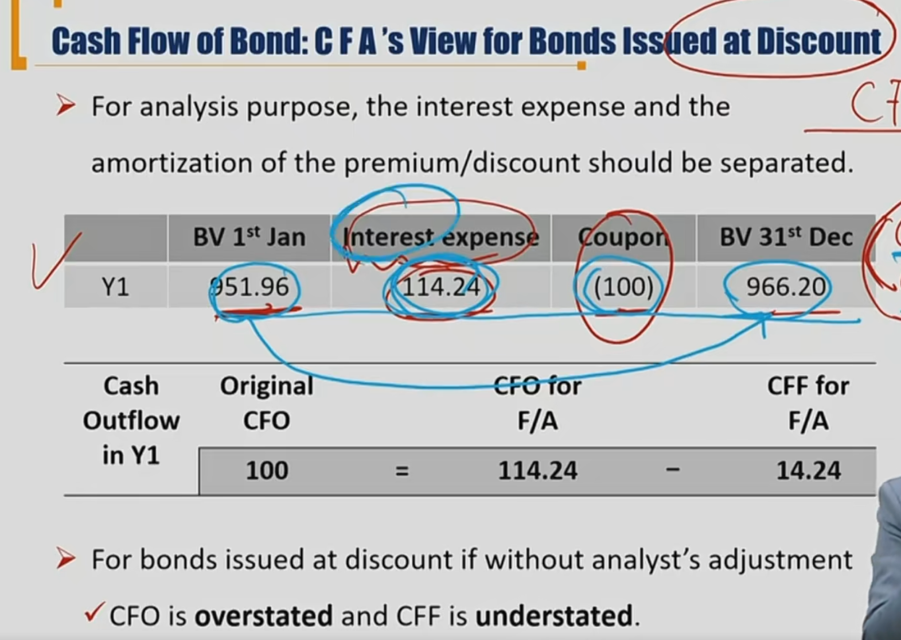

- For bonds issued at discount if without analyst's adjustment
  - CFO is overstated and CFF is understated.
  - 意思是，折价发行中，经过调整的CFO流出更多了，所以如果不调整，CFO会更高，所以被高估。
  - CFF未调整时不存在，调整后，要流入一部分，所以调整前小于调整后，被低估understated.
- For bonds issued at premium if without analyst's adjustment,同理
  - CFO is understated and CFF is overstated.

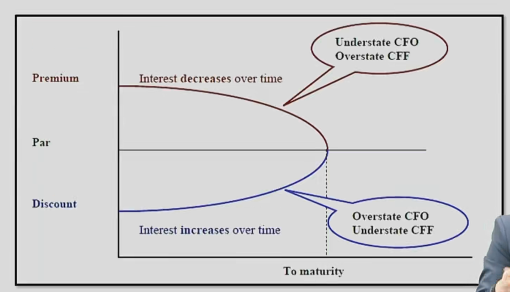

### Issuance Cost发行成本

Issuance Cost refer to printing costs, legal and accounting fees, sales commissions, and other fees incurred during bond issuance.

发行成本资本化的话，体现在B/S，如果费用化，直接进I/S

Under **US GAAP**: 资本化

- Issuance costs are capitalized as an asset(deferred charge) and allocated to I/S as an expense over the bond term.

Under **IFRS**: 

- Initial bond liability on B/S is reduced by amount of the issuance costs, increasing effective interest rate. 通过减少liability以cost，重新计算effective interest rate.提高实际利率。

#### Derecognition of Debt 提前终结债券

- A firm may choose to redeem bonds before maturity 下列情况出现，会提前还债
  - Interest rates reduction，市场利率下跌。借新还旧
  - Firm has generated surplus cash through operation。
  - Funds from the issuance on the equity market is available 股权融资的钱还债
- Under US GAAP, any unamortized issuance costs must be written off and included in the gain or loss calculation. 借款时的成本资本化，在提前还款的损益中write off.
  - G/L on repurchase  = B/S carrying value - cash paid - **unamortized issuance costs** （US GAAP）
  - e.g. A firm reacquires回购 $1 million face value at 105% of par when carrying value of bond liability is \$998,000. 用1050现金回购998，损失52
  - Loss = 1,050,000 - 998,000

## 2、Lease 租约

### 2.1 Definition and classification of leases

A lease is a contractual arrangement where by the lessor出租人, the owner of the asset, allows the lessee承租人 to use the asset for a specific period of time(lease term) 租期 in return for periodic lease payment.

- Two parties involved in leases
  - Lessee: use the asset 使用权
  - Lessor: owner of the asset：所有权
- Two types of lease
  - operating lease 经营租赁OL，普通意义上的租赁。
  - finance lease融资租赁FL，**借钱买资产**，lessee向lessor借钱买lessor的资产。这时候，借的资产记载lesse的B/S**（使用权资产right of use (ROU)**。借的钱是租赁负债（lease liability）

法律意义上的租赁和会计意义上的租赁不一样。学习时注意思考的维度。lease payment LP 租金

- （拓展）售后回租：把手上资产卖了，然后再租回来

- Operating Lease 经营租赁：
  - basically a rental
  - periodic lease payments are reported as **rental expense** in I/S
- Finance lease / Capital lease
  - A finance lease is, in substance, a purchase of an asset with debt. 借钱买资产
  - Lessee will report equal value of **asset and liability** on B/S. 承租人记录资产负债
  - The lessee should **record depreciation expense and interest expense** in I/S. lessee承担利息费用和折旧费用

#### Reason for lease

- For lessee:
  - cheaper financing
    - less or no **down payments**(首付)
    - lower fixed interest rate
  - Less covenants restrictions 租赁合约弹性大
- For lessor:
  - less risk of obsolescence。资产过时的风险较小
  - tax benefits of ownership。资产负债表不一样，计提损益不一样

#### Very Important! 会计处理方法分类

- Lessee对于承租人来说
  - **IFRS**: same method with finance lease. 承租人全部看作是使用融资租赁。需要确认使用权资产ROU和LI(lease liability)
  - **US GAAP**: difference between **finance lease** and **operating lease***(特殊的经营租赁，还是考虑计入B/S). 
  - Exceptions for short-term lease(GAAP, IFRS, 短于1年) and lease where leased asset is low value（低价值租赁）(IFRS): same method with **operating lease**. （老准则2019）
- Lessor对于出租人来说
  - IFRS: difference between **finance lease** and **operating lease**.区分融资租赁和经营租赁
  - GAAP: difference between **finance lease**(**sales-type, direct finance**)（融资租赁分成销售型和直接型融资租赁） and **operating lease**.

#### General principle of classification of OL and FL 融资租赁和经营租赁的分类

Finance lease if any of the following criteria are met: 融资租赁

- Transfers ownership of the asset to the lessee after the lease ends. 租期到了后，送给承租人了。
- Includes a bargain purchase option. 到期了后，承租人用低于市场价格买到资产
- Covers a period of time that is a major part of the asset's useful life. 租了绝大部分的资产寿命
- PV of lease payments that equal or exceed the major part of asset's fair value. 所有租赁费折现，超过绝大部分的公允价值
- Involves an asset that is so specialized that it will have no alternative use to the lessor after the lease ends. 资产被特殊化，租赁结束出租人没法用了。

Otherwise, it will be classified as operating lease。否则就是经营性租赁

### 2.2 Accounting for lessee

lessee:对于承租人来说，根据上面的会计处理方法分类，一共分为三种情况：

1、US GAAP和IFRS的short term，以及IFRS的low value，按照operating lease 的方法确认会计。

2、US GAAP的特殊经营租赁（operating lease）

3、US GAAP和IFRS的融资租赁

下面详细区分：

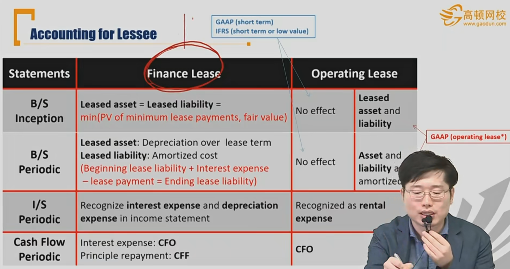

名词解释：Inception租赁期初，periodic租赁期间

1、对于GAAP的short tem, IFRS的short term or low value，按照经营租赁，则期初和期间都没有B/S确认。期间periodic只有rental expense（LP），现金都作为CFO流出

2、对于US GAAP 的特殊operating  lease\*:

- inception B/S确认ROU和Lease Liability（未来现金流租金折现）

- periodicB/S需要对ROU和liability进行摊销：LP- 实际利率\*期初**liability**，不会对利润表产生影响

3、IFRS，GAAP（financial lease）记住，**借钱买资产（借钱：还本付息，资产：贬值depreciation）**

Inception B/S：确认ROU，lease Liability。ROU=liability=$\Sigma PV(LP)$，未来所有租金的折现

Periodic B/S：确认

- ROU的折旧deprication（一般是直线折旧法）
- liability 的amortization=（LP-Interest Expense）= (LP - 期初liability \* 实际利率)。

对于期间的损益表I/S：确认利息费用interest expense（期初的liability$\times$ 实际利率）和贬值depreciation expense

期间的现金流量表：

- Interest expense: CFO， 
- Principle repayment: CFF，（还本：amortization，属于liability减少.）

##### 表格总结

|                                  | GAAP(short term), IFRS(short-term, low-value) | GAAP special operating lease                                 | IFRS and GAAP financial lease                                |
| -------------------------------- | --------------------------------------------- | ------------------------------------------------------------ | ------------------------------------------------------------ |
| T=0 Inception, 确认ROU/liability | No                                            | Yes                                                          | Yes                                                          |
| 每期对ROU摊销amortization        | N.A.                                          | 实际利率法摊销：LP- 实际利率\*期初liability                  | depreciation直线折旧                                         |
| 每期对liability摊销              | N.A.                                          | 实际利率法摊销：LP-实际利率\*期初liability                   | 实际利率法摊销                                               |
| 每期现金支出                     | LP                                            | LP                                                           | LP                                                           |
| 每期确认I/S费用                  | rental expense                                | rental expense                                               | dep. Expense折旧费用+Interest Expense                        |
| 每期B/S变化                      | cash 减少，retained earning 减少              | ROU减少对应liability减少，cash减少对应 retained earning 减少 | cash 减少对应retained earning(interest expense)和liability减少（amortization）；ROU折旧对应retain earning减少（dep. expense） |
| 每期CF/S变化                     | CFO out                                       | CFO out                                                      | CFF out 还本（amortization ）, CFO out（Interest Expense）   |

paid in upfront 期初给租金 vs paid in arrear每期末给租金

#### Example 1 Paid in arrear

- lease for 3 years, annual payment of \$1000 paid in arrear.

- appropriate interest rate on the lease is 10 %
- The machine's fair value is equal to the present value of minimum lease payments
- own the asset after 3 years
- depreciate with straight line method

Answers:

- **B/S calculating:** 资产负债表确认

T table: left side is asset, left up side is liability, left down side is equity = asset - liability

1) for short / low operating lease

|               | Y1 begin | Y1 end     | Y2 end     | Y3 end     | \|   |            | Y1 begin    | Y1 end    | Y2 end    | Y3 end    |
| ------------- | :------- | ---------- | ---------- | ---------- | ---- | ---------- | ----------- | --------- | --------- | --------- |
| $\Delta$ cash | 0        | (1000)(LP) | (1000)(LP) | (1000)(LP) | \|   |            |             |           |           |           |
|               |          |            |            |            | \|   | ---------  | ----------- | --------- | --------- | --------- |
|               |          |            |            |            | \|   | $\Delta$RE | (1000)      | (1000)    | (1000)    | (1000)    |

2. for GAAP special operating lease

|               | Y1 begin                | Y1 end                                                       | Y2 end     | Y3 end     | \|         |                         | Y1 begin    | Y1 end    | Y2 end     | Y3 end    |
| ------------- | ----------------------- | ------------------------------------------------------------ | ---------- | ---------- | ---------- | ----------------------- | ----------- | --------- | ---------- | --------- |
| $\Delta$Cash: | 0                       | (1000)(LP)                                                   | (1000)(LP) | (1000)(LP) | \|         | $\Delta$Lease Liability | 2486.85     | (751.31)  | （826.45） | (909.09)  |
| $\Delta$ROU:  | (sum PV of LP): 2486.85 | （751.31）(amortization=LP-last liability \* interest rate=1000-2486.85 \* 10%= 751.31) | （826.45） | (909.09)   | \| \| | ---------               | ----------- | --------- | ---------  | --------- |
|               |                         |                                                              |            |            | \|         | $\Delta$RE              |             | (1000)    | (1000)     | (1000)    |

3. for IFRS and GAAP financial lease

|               | Y1 begin                | Y1 end                | Y2 end     | Y3 end     | \|   |                         | Y1 begin    | Y1 end                                                   | Y2 end                    | Y3 end                  |
| ------------- | ----------------------- | --------------------- | ---------- | ---------- | ---- | ----------------------- | ----------- | -------------------------------------------------------- | ------------------------- | ----------------------- |
| $\Delta$Cash: | 0                       | (1000)(LP)            | (1000)(LP) | (1000)(LP) | \|   | $\Delta$Lease Liability | 2486.85     | (751.31)(amortization=LP-Interest expense)               | （826.45）                | (909.09)                |
| $\Delta$ROU:  | (sum PV of LP): 2486.85 | (828.95)(deprciation) | (828.95)   | (828.95)   | \|   |                         | ----------- | ---------                                                | ---------                 | ---------               |
|               |                         |                       |            |            | \|   | $\Delta$RE              |             | (1077.64)((828.95) (dep. exp.)+(248.69)interest expense) | (1002.50)=(828.95+173.55) | (919.86)=(828.95+90.91) |

Comparing:

|          | Low/Short OL |           | GAAP OL* |           | IFRS/ GAAP FL |           |
| -------- | ------------ | --------- | -------- | --------- | ------------- | --------- |
|          | ROU          | liability | ROU      | liability | ROU           | liability |
| Y1 begin | 0            | 0         | 2486.85  | 2486.85   | 2486.85       | 2486.85   |
| Y1 end   | 0            | 0         | 1735.54  | 1735.54   | 1657.90       | 1735.54   |
| Y2 end   | 0            | 0         | 909.09   | 909.09    | 828.95        | 909.09    |
| Y3 end   | 0            | 0         | 0        | 0         | 0             | 0         |

We can see in FL, ROU depreciates with different speed comparing with liability.(straight line vs. effect interest rate amortization)

- **I/S recording** 利润表确认

|       | Low/Short OL | GAAP special OL* | IFRS/GAAP FL |              |            |
| ----- | ------------ | ---------------- | ------------ | ------------ | ---------- |
| time  | rental Exp.  | rental Exp.      | Dep. Exp     | Interest Exp | Total Exp. |
| Y1    | 1000         | 1000             | 828.95       | 248.69       | 1077.64    |
| Y2    | 1000         | 1000             | 828.95       | 173.55       | 1002.50    |
| Y3    | 1000         | 1000             | 828.95       | 90.91        | 919.86     |
| total | 3000         | 3000             | 2486.85      | 513.15       | 3000       |

Interest Exp. is declining, review: amortization cost of begining is 2486.85 > 0，resembles a premium issued bond. Interest expense decrease overtime and fewer than LP.

- **CF/S recording 现金流量表**

|       | Low/Short OL | GAAP special OL* | IFRS/GAAP FL              |                       |       |
| ----- | ------------ | ---------------- | ------------------------- | --------------------- | ----- |
| time  | CFO outflow  | CFO outflow      | CFF outflow(amortization) | CFO outflow(interest) | Total |
| Y1    | 1000         | 1000             | 751.31                    | 248.69                | 1000  |
| Y2    | 1000         | 1000             | 826.45                    | 173.55                | 1000  |
| Y3    | 1000         | 1000             | 909.09                    | 90.91                 | 1000  |
| total | 3000         | 3000             |                           |                       | 3000  |

#### Example 2 paid in upfront

same question, but paid in upfront.

*区别*，**预付账款**，放在资产中。利润表中的费用是对过去一年确认的费用，所以期初LP不能放在留存收益。

- **B/S calculating: 资产负债表确认**

1) for short / low operating lease

Y1期初，并没有产生利息，也没有负债的说法，所以提前交的租金形成了资产。

cash和prepaid expense中，每个字体代表同一笔现金流产生的记录。

- **粗体**：代表第一笔预付租金产生，扣减现金，增加预付账款，并在第一年年末预付账款消耗掉，并且在第一年年末确认费用在留存收益
- *斜体*：代表第二笔预付租金产生预付账款，扣减现金，并在第二年年末确认费用
- 正体：代表第三笔

|                              | Y1 begin       | Y1 end             | Y2 end         | Y3 end | \|   |            | Y1 begin    | Y1 end    | Y2 end    | Y3 end    |
| ---------------------------- | :------------- | ------------------ | -------------- | ------ | ---- | ---------- | ----------- | --------- | --------- | --------- |
| $\Delta$ cash                | **(1000)(LP)** | *(1000)(LP)*       | (1000)(LP)     |        | \|   |            |             |           |           |           |
|                              |                |                    |                |        | \|   | ------     | ----------- | --------- | --------- | --------- |
| **$\Delta$ Prepaid Expense** | **1000**       | 0=**-1000**+*1000* | 0=*-1000*+1000 | (1000) | \|   | $\Delta$RE | 0           | **-1000** | *-1000*   | -1000     |

2. for GAAP special operating lease

- 期初和期末现值计算问题

由于存在liability，第一笔预付租金直接扣减在liability中。另外，这里确认ROU和期初liability，对未来租金折现时，要注意是需要用期初现金流折现。也就是：
$$
PV=LP+\frac{LP}{1+r}+\frac{LP}{(1+r)^2}
$$
通过计算器，算的是期末现金流的PV。也就是说，如果计算器中输入：N=3，I/Y=10%, FV=0, PMT=1000，计算出来的是Y0年初的现金流，也就是：
$$
\frac{LP}{1+r}+\frac{LP}{(1+r)^2}+\frac{LP}{(1+r)^3}
$$
所以，我们需要从第0年初乘以利息到第1年初，得到Y1 begin的PV = 2486.85 \* (1+10%) = 2735.54。

- 在预付第一笔租金的时候，在期初就对liability进行扣减，所以ROU和liability在paid in upfront的时候**不相等**。但是，所产生的**摊销金额**还是一样，按照lease liability计算出来（现金流LP - 期初摊余成本（liability） \* 实际利率）。
- **最后，Y3 end的时候，ROU还剩余1000，单独为其扣减，并在RE记录1000费用。**

|               | Y1 begin   | Y1 end     | Y2 end     | Y3 end     | \|   |                         | Y1 begin             | Y1 end                 | Y2 end            | Y3 end     |
| ------------- | ---------- | ---------- | ---------- | ---------- | ---- | ----------------------- | -------------------- | ---------------------- | ----------------- | ---------- |
| $\Delta$Cash: | (1000)(LP) | (1000)(LP) | (1000)(LP) |            | \|   | $\Delta$Lease Liability | 1735.54=2735.54-1000 | (826.45)（剩余909.09） | (909.09)（剩余0） |            |
| $\Delta$ROU:  | 2735.54    | (826.45)   | (909.09)   | **(1000)** | \|   | ---------               | -----------          | ---------              | ---------         | ---------  |
|               |            |            |            |            | \|   | $\Delta$RE              |                      | （1000）               | (1000)            | **(1000)** |

3. for IFRS and GAAP financial lease

原理还是一样：期初现金扣减liability，摊销用liability计算，然后费用区分开interest expense和 depreciation expense就可以了

|               | Y1 begin   | Y1 end     | Y2 end     | Y3 end   | \|   |                         | Y1 begin    | Y1 end                                          | Y2 end                                   | Y3 end               |
| ------------- | ---------- | ---------- | ---------- | -------- | ---- | ----------------------- | ----------- | ----------------------------------------------- | ---------------------------------------- | -------------------- |
| $\Delta$Cash: | (1000)(LP) | (1000)(LP) | (1000)(LP) |          | \|   | $\Delta$Lease Liability | 1735.54     | (826.45)（剩余909.09）                          | (909.09)（剩余0）                        |                      |
| $\Delta$ROU:  | 2735.54    | (911.85)   | (911.85)   | (911.85) | \|   | -----------             | ----------- | ---------                                       | ---------                                | ---------            |
|               |            |            |            |          | \|   | $\Delta$RE              |             | (1085.4)=dep.exp:(911.85)+interest.exp:(173.55) | (1002.76)=dep.exp(911.85)+int.exp(90.91) | only dep.exp(911.85) |

B/S comparing:

|          | Low/Short OL |           | GAAP OL* |           | IFRS/ GAAP FL |           |
| -------- | ------------ | --------- | -------- | --------- | ------------- | --------- |
|          | ROU          | liability | ROU      | liability | ROU           | liability |
| Y1 begin | 0            | 0         | 2735.54  | 1735.54   | 2735.54       | 1735.54   |
| Y2 begin | 0            | 0         | 1909.09  | 909.09    | 1823.69       | 909.09    |
| Y3 begin | 0            | 0         | 1000     | 0         | 911.85        | 0         |
| Y3 end   | 0            | 0         | 0        | 0         | 0             | 0         |

- **I/S recording** 利润表确认

|       | Low/Short OL | GAAP special OL* | IFRS/GAAP FL |              |            |
| ----- | ------------ | ---------------- | ------------ | ------------ | ---------- |
| time  | rental Exp.  | rental Exp.      | Dep. Exp     | Interest Exp | Total Exp. |
| Y1    | 1000         | 1000             | 911.85       | 173.55       | 1085.4     |
| Y2    | 1000         | 1000             | 911.85       | 90.91        | 1002.76    |
| Y3    | 1000         | 1000             | 911.85       | 0            | 911.85     |
| total | 3000         | 3000             | 2735.54      | 264.46       | **3000**   |

Interest Exp. is declining, review: amortization cost of begining is 2486.85 > 0，resembles a premium issued bond. Interest expense decrease overtime and fewer than LP.

- **CF/S recording 现金流量表**

under FL：CFF：还本(amortization)， CFO：（interest cost）

所以在FL下，第一年，CFF outflow 1000

|       | Low/Short OL | GAAP special OL* | IFRS/GAAP FL              |                       |       |
| ----- | ------------ | ---------------- | ------------------------- | --------------------- | ----- |
| time  | CFO outflow  | CFO outflow      | CFF outflow(amortization) | CFO outflow(interest) | Total |
| Y1    | 1000         | 1000             | 1000                      | 0                     | 1000  |
| Y2    | 1000         | 1000             | 826.45                    | 173.55                | 1000  |
| Y3    | 1000         | 1000             | 909.09                    | 90.09                 | 1000  |
| total | 3000         | 3000             |                           |                       | 3000  |

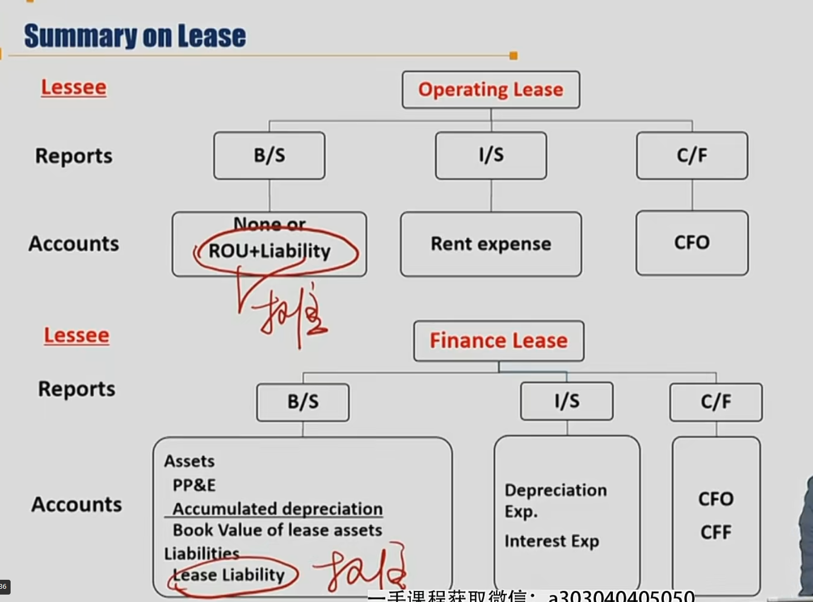

### 2.3 Analysis for Lesse承租人分析

Begin mode的liability往后挪

融资租赁，利息越付越少，而且少得越来越快

付利息cf：GAAP: CFO，IFRS：CFF或者CFO

depreciation 减在EBIT之前

| Statements | Lesse's Items        | Low/Short OL | GAAP OL    | IFRS GAAP FL |
| ---------- | -------------------- | ------------ | ---------- | ------------ |
| B/S        | Assets               | Lowest       | Highest\*  | Higher\*     |
| B/S        | Liability            | Lower        | Higher     | Higher       |
| B/S        | Equities（存量概念） | **Higher**   | **Higher** | Lower        |
| I/S        | EBIT                 | **Lower**    | **Lower**  | Higher       |
| I/S        | NI in early year     | **Higher**   | **Higher** | Lower        |
| I/S        | NI in later years    | **Lower**    | **Lower**  | Higher       |
| I/S        | Total NI             | Same         | Same       | Same         |
| CF/S       | CFO                  | Lower        | Lower      | Higher       |
| CF/S       | CFF                  | Higher       | Higher     | Lower        |
| CF/S       | Total CF             | Same         | Same       | Same         |

\*： same at the beginning of Year 1

### 2.4 Accounting and Analysis for Lessor出租人会计计算

回顾出租人会计准则处理方法：

- IFRS: difference between **finance lease** and **operating lease**.区分融资租赁和经营租赁
- GAAP: difference between **finance lease**(**sales-type, direct finance**)（融资租赁分成**销售型**和直接型融资租赁） and **operating lease**.

#### Classification of Lease: lessor

1. Under US GAAP, **finance lease** will be treated as either **sales-type lease** or **direct financing lease**.

- The lessor's classification uses the same criteria that a lessee uses in determining whether the benefits and risks of owning the leased asset have bee transferred to the lessee. 资产有关的风险和报酬发生转移给承租人后，分类为销售型融资租赁
  - If any of these criteria are met, the lessor will categorize the lease as a sales-type lease, assuming that collection of the future lease payments is probable.
- A **direct financing lease** applies when a lease doesn't meet the criteria to be considered a sale-type lease but yet results in the lessor relying on future lease receipts to recover the asset's cost. 上面的条件不符合时，如果出租人期待收取租赁费把资产收回，那就是直接型融资租赁。
  - A lease is considered a **direct financing lease** under US GAAP if the lease contract provides for **a third-party guaranteed residual value**, which combined with the future lease payments by the lessee will equal or exceed the fair value of the leased asset. 第三方担保残值加上未来LP>=公允价值，那就是直接型融资租赁
- A financing lease is a type of lease transaction that converts the lessor's risk arising from ownership of the underlying asset(that is, asset risk) into credit risk. asset risk: 资产在手上变质的风险（贬值）->转化为信用风险（credit risk)

2. Under US GAAP, if none of the criteria above is met, the lessor will classify a lease as an operating lease

总结：美国GAAP下：

首先、判断a.融资租赁和经营租赁的general principle是否可以支撑划分为融资租赁；

然后，判断b.未来的资金是否可以都收到；

如果上面a和b条件都可以满足，那就是sales-type financing lease，否则，有一个不满足时：

判断c.有没有第三方担保残值加上未来LP>=公允价值，那就是直接型融资租赁，或d.出租人是否期待租赁费把资产收回，

如果c，d满足其一，那就是direct financing lease。

否则，就是operating lease.

3. Under IFRS, no distinction between sales-type lease and direct financing lease.

- However, **finance leases** made by manufacturers or dealers(制造商、交易商) are treated similarly as **sales type lease** in US GAAP.
- IFRS下，finance lease**会计处理方法上**等同于GAAP的sales-type financing lease, OL等同于GAAP的OL

#### Accounting for lessor - Operating Lease

LP的计提和lessee相反就可以。但是资产在lessor账上，所以**多了计提资产的折旧**。利润表里多了资产depreciation expense.

#### Accounting for lessor-Finance lease 

**贷钱卖资产**

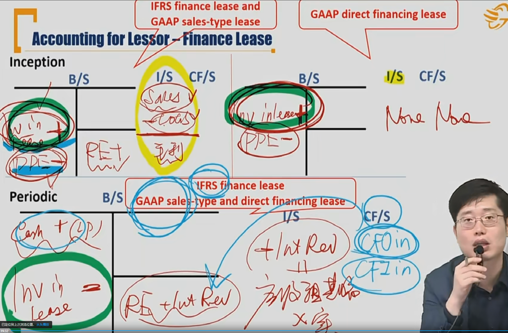

- 对于期初Inception：
  - 在IFRS的finance lease和GAAP的sales-type FL中，顾名思义，sales-type，涉及到资产所有权的转移。所以在期初，PPE减少，并且记一笔Investment in Lease资产。在I/S中，确认销售收入Sales Revenue = $\Delta$Investment in lease，并且结转PPE减值，作为COGS = $\Delta$PPE。由于Investment in lease增加 > PPE减少，报表未配平，所以需要确认一笔利润，在I/S中作为Gross profit，在B/S中确认RE。
  - 在GAAP direct financing中，一般假定Investment in lease 和PPE的变动值相等，不需要再计提RE。（和direct FL的定义有关，未来LP>=公允价值，也就是Investment in lease增加 >= PPE减少，考试一般假定两者相等）
- 对于期间periodic
  - IFRS FL以及GAAP的两种FL都一样
  - 计提cash 增加LP
  - Investment in lease应收的租金减少
  - I/S中确认Interest Revenue=期初应收租金乘以实际利率（**贷钱卖资产**，贷钱，所以要确认利息费用）
  - 同时B/S的RE也确认+Interest Revenue
  - 现金流量表中，收取本金的LP就是CFI inflow，收取利息的Interest Revenue就是CFO inflow（当然在IFRS中也可以作为CFI inflow）

#### Example Lessor

- Lease for 3 years with annual lease payment of \$1000 at the beginning of each year(paid in arrear)
- The appropriate interest rate on the lease is 10\%
- The carrying value of asset is \$2736
- Straight line depreciation mode

lessor accounting process?

Answer:

1. Operating lease accounting process

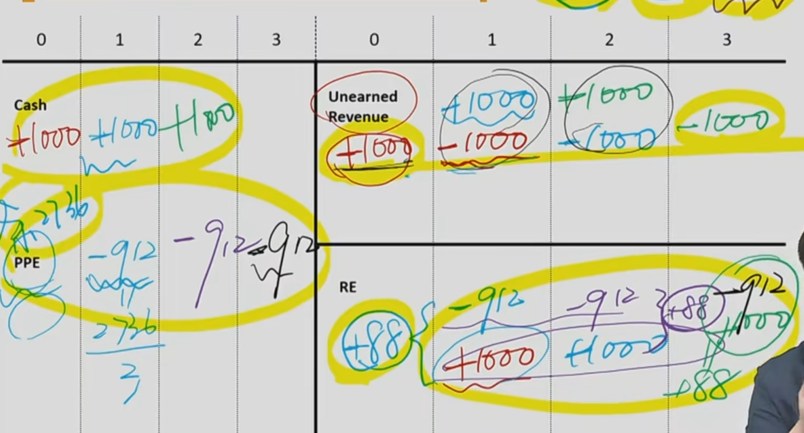

注意的几个点：PPE初始值不会新增，因为PPE本来就在lessor账本上；需要计提折旧；提前收到的租金（paid in arrear）计入unearned revenue。

2. Finance lease(direct-finance) **贷钱卖资产**

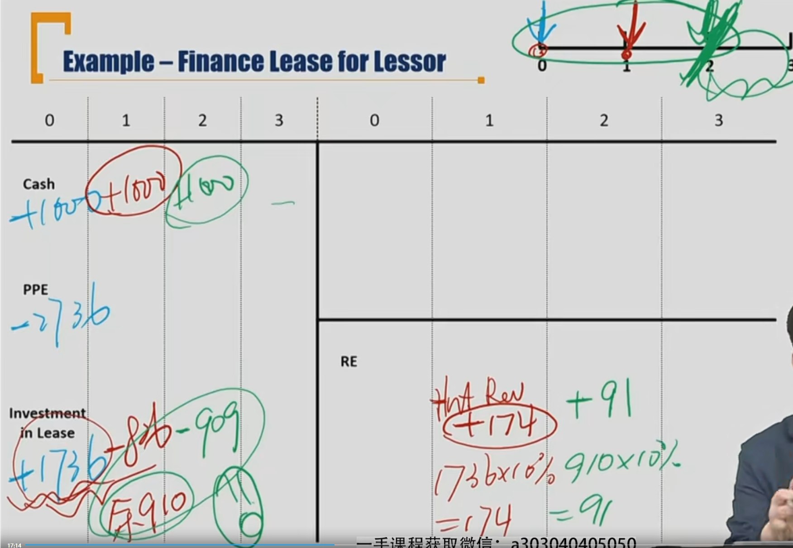

注意：

- 贷钱，要确认利息收入，并且收取的本金要在investment in lease扣减

- **第三年无需做账**

Comparing lessor

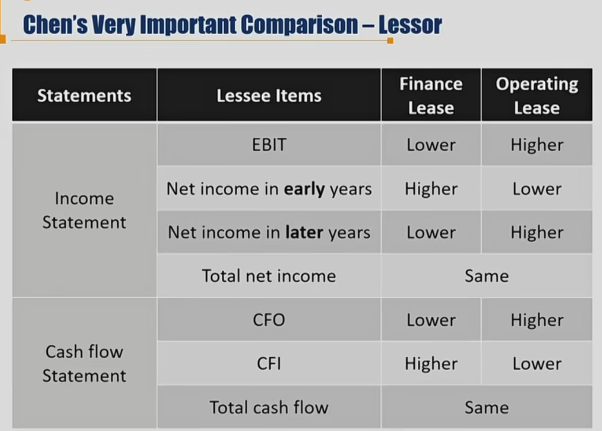

注意：

- CFO和CFI是cash flow in ，对于FL来说，lessor的收入利息确认为CFO，其他本金收入为CFI。而OL全部确认为CFO，所以FL相对于OL来说，CFO低，CFI高。
- FL的NI先高后低。两者的total net income最后都相等。但是
  - 对于OL来说：确认的收入=+Rental revenue(PL)  - depreciation expense
  - 对于FL来说：确认的收入=+Interest Revenue
  - Interest Revenue = 期初应收 \* 实际利率，而期初应收不断减少，所以利息收入不断减少
  - 最后total NI要相等，所以FL的NI，必然**先高后低**。

Question: compared to operating lease, using direct financing lease, which of following is most correct for a lessor?

A. Pretax margin is lower during early period of lease term.

B. Higher cash flow from financing activities.

C. Higher fixed assets turnover ratio.

Answer: C. 

- Pretax Margin = EBT / sales revenue. EBT\*(1-tax rate) = Net Income.从上面分析知道，NI先高后低，所以EBT先高后低。
- 只涉及CFO和CFI
- Sales Revenue / Fixed Asset. 对于FL，资产已经会计处理上卖出，OL资产仍然在自己账上。所以FL的Fixed asset要更低，所以fixed asset turnover ratio要更高。

#### Disclosure of Lease Arrangement要求披露的内容

- Lessees and lessors are required to disclose:
  - General description of leasing arrangements。租赁基本条款的描述
  - **Nature, timing, and payments to be paid or received**
    - **In each of the next 5 years** 
    - **aggregated payments beyond 5 years.**
    - 披露接下来5年每年的预期LP，5年后的所有合并的LP
  - Lease revenue and expense for each period presented in the income statement（I/S）
  - amounts receivable and unearned revenues from leases
  - restrictions imposed by lease arrangements

#### Final Summary

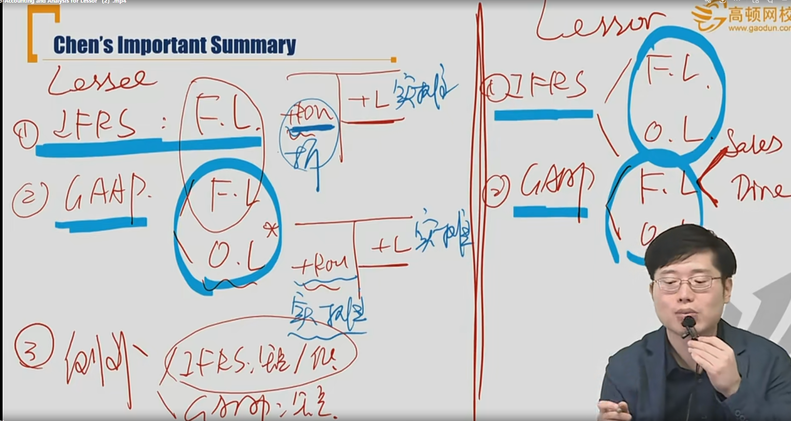

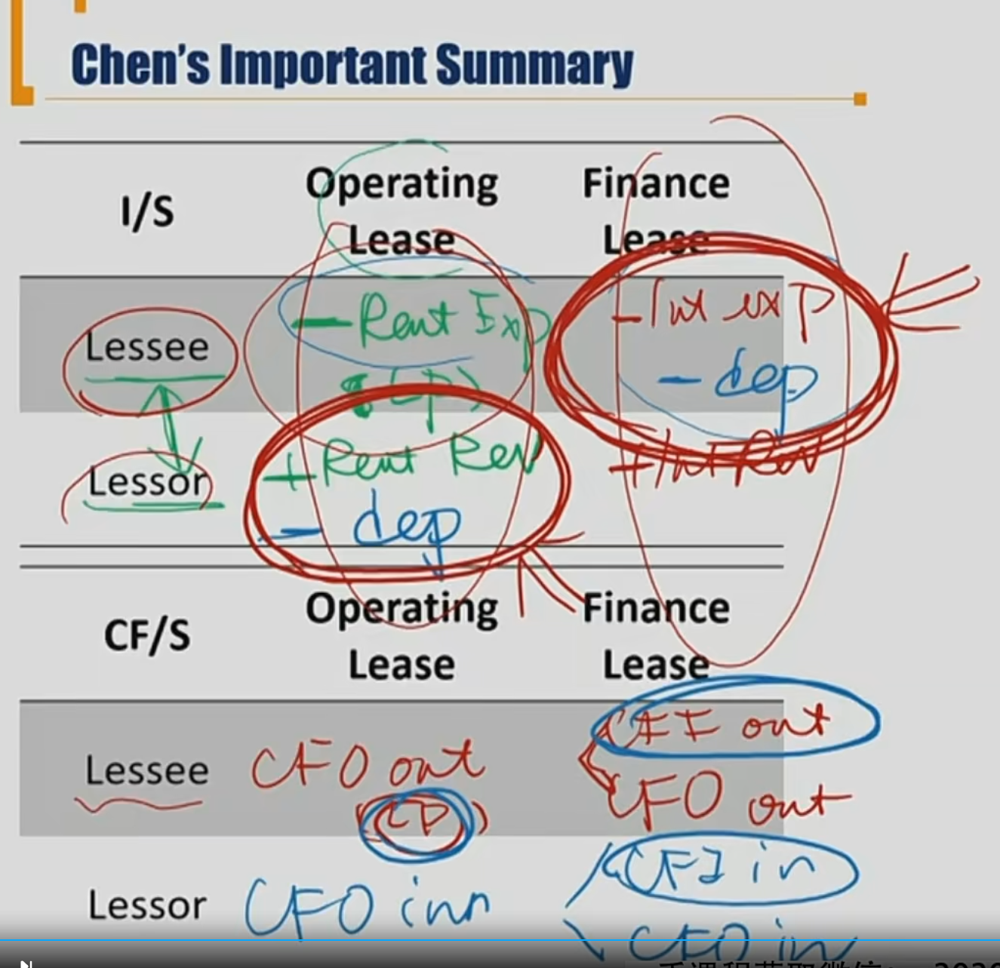

## 3、Pension Plans 考得较少，在二级里面考

#### Introduction

Defined Contribution Plans 固定供款计划，大部分公司都采用这种模式（DC Plan，如员工持股计划）

- Employer
  - Keeps all contributions current. 只会影响当前的现金（current）
  - Only financial liability is making contributions to employee's account.负债影响较小
  - The plan must offer sufficient investment vehicles. 提供足够的投资工具。
- Employee
  - Own the plan and can transport account to other employment situations. 跳槽的时候跟着雇员
  - **Bear** all risk/return consequences of investment. 承担投资损失.
  - Must make all investment decisions given available investment vehicles. 自己决定投资决策。

Defined Benefit Plans 设定收益计划（DB Plan）

- Employer
  - Liability of employer. 确认一笔负债PBO
  - Determined by stated criteria usually related to years of service and salary.
  - Sponsor(employer) is responsible for managing the plan asset.
- Employee
  - Receive periodic payments starting at retirement
  - **Not bear** risk/return consequences of investment

#### Brief DB Account 简单DB Plan会计处理

养老金的资产和负债要**抵消**，轧差。

PBO: projected benefit obligation

- Overfunded: Fair value of plan assets  - PBO > 0 => Net Plan Asset
- Underfunded: Fair value of plan assets - PBO < 0 => Net Plan liability

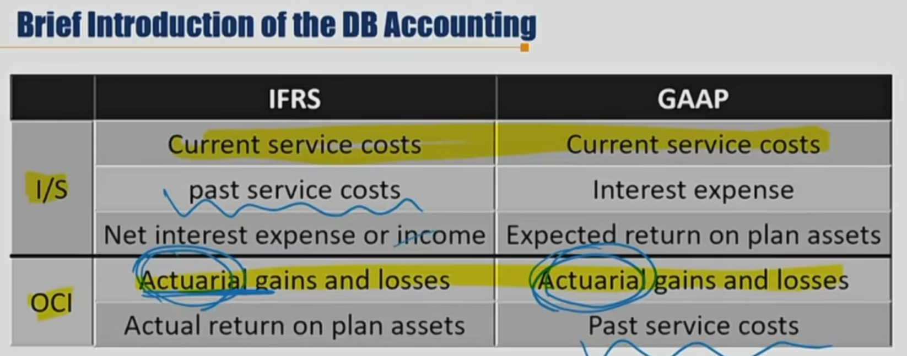

